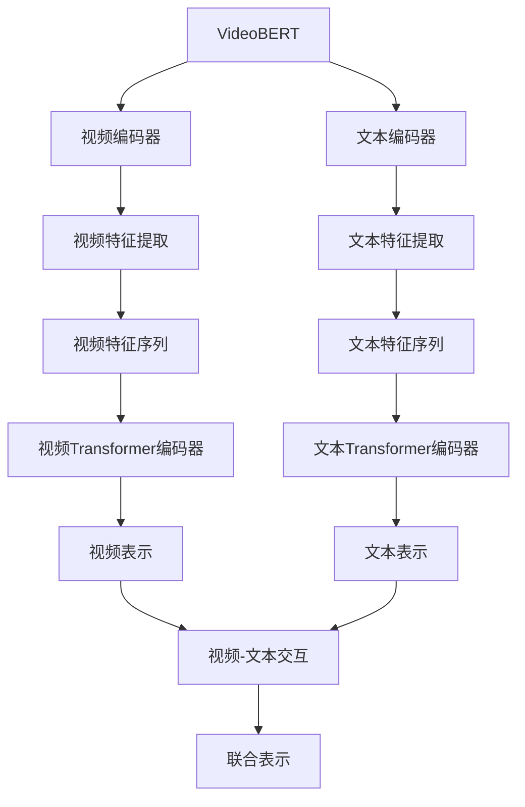

好的,我会尽力遵循您提供的约束条件,以专业的技术语言撰写这篇博客文章。下面是正文部分:

# Transformer大模型实战 VideoBERT模型学习语言及视频特征

## 1. 背景介绍

### 1.1 问题的由来

在当今多媒体信息时代,视频数据的快速增长给数据处理和分析带来了巨大挑战。传统的自然语言处理(NLP)模型只能处理文本数据,而无法理解视频中丰富的视觉信息。因此,融合语言和视觉模态的多模态学习模型应运而生,以更好地理解和表示视频内容。

### 1.2 研究现状  

近年来,Transformer模型在NLP和计算机视觉领域取得了卓越成就,推动了多模态学习的发展。研究人员提出了诸如ViLBERT、VisualBERT、VideoBERT等模型,尝试将Transformer应用于视频理解任务。其中,VideoBERT是一种用于学习视频和文本表示的双流Transformer模型,展现了非凡的性能。

### 1.3 研究意义

VideoBERT模型能够同时捕获视频和文本的语义信息,为视频理解任务提供了强大的表示能力。掌握VideoBERT的原理和实践对于视频分析、视频检索、视频描述生成等应用领域具有重要意义。本文将深入探讨VideoBERT模型的核心概念、算法原理、数学模型以及实际应用,为读者提供全面的理解和实践指导。

### 1.4 本文结构

本文首先介绍VideoBERT模型的背景和研究现状,然后详细阐述其核心概念、算法原理和数学模型,并通过案例分析加深读者的理解。接下来,我们将分享VideoBERT模型的实际应用场景,以及相关的工具和资源推荐。最后,我们总结VideoBERT的发展趋势和面临的挑战,并对未来的研究方向进行展望。

## 2. 核心概念与联系

VideoBERT是一种基于Transformer的双流模型,旨在学习视频和文本的联合表示。它由两个主要部分组成:视频编码器和文本编码器。

视频编码器负责从原始视频数据中提取视觉特征,通常使用预训练的卷积神经网络(CNN)模型,如ResNet或I3D。文本编码器则从文本数据(如视频标题或描述)中提取语义特征,通常使用BERT或RoBERTa等Transformer模型。

提取到的视频和文本特征序列分别被送入对应的Transformer编码器进行建模,产生视频表示和文本表示。然后,这两种表示通过交互层(Cross-modal Interaction)相互作用,生成最终的视频-文本联合表示。

VideoBERT模型可以在大规模视频-文本数据集上进行预训练,并在下游任务上进行微调,展现出卓越的性能。它能够同时捕获视频和文本的语义信息,为视频理解任务提供强大的表示能力。

## 3. 核心算法原理 & 具体操作步骤  

### 3.1 算法原理概述

VideoBERT模型的核心算法原理是基于Transformer的自注意力机制,用于学习视频和文本的联合表示。算法主要包括以下几个关键步骤:

1. **视频特征提取**: 使用预训练的CNN模型(如ResNet或I3D)从原始视频数据中提取视觉特征序列。

2. **文本特征提取**: 使用预训练的Transformer模型(如BERT或RoBERTa)从文本数据(如视频标题或描述)中提取语义特征序列。

3. **视频编码**: 将视频特征序列输入到视频Transformer编码器中,通过自注意力机制捕获视频中的长期依赖关系,生成视频表示。

4. **文本编码**: 将文本特征序列输入到文本Transformer编码器中,通过自注意力机制捕获文本中的语义关系,生成文本表示。

5. **视频-文本交互**: 视频表示和文本表示通过交互层(Cross-modal Interaction)相互作用,捕获视频和文本之间的关联信息,生成最终的视频-文本联合表示。

6. **微调和预测**: 在下游任务上,使用生成的联合表示进行微调和预测,如视频描述生成、视频问答等。

### 3.2 算法步骤详解

1. **视频特征提取**

   VideoBERT使用预训练的CNN模型从原始视频数据中提取视觉特征序列。常用的CNN模型包括ResNet、I3D等。提取的特征序列包含了视频中的运动、场景、物体等丰富信息。

2. **文本特征提取**

   对于文本数据(如视频标题或描述),VideoBERT使用预训练的Transformer模型(如BERT或RoBERTa)提取语义特征序列。这些特征序列能够捕获文本中的语义和上下文信息。

3. **视频编码**

   视频特征序列被输入到视频Transformer编码器中。Transformer编码器通过自注意力机制捕获视频中的长期依赖关系,生成视频表示。自注意力机制允许每个时间步的特征向量关注其他时间步的特征,从而捕获视频中的动态信息。

4. **文本编码**

   文本特征序列被输入到文本Transformer编码器中。与视频编码器类似,文本编码器通过自注意力机制捕获文本中的语义关系,生成文本表示。

5. **视频-文本交互**

   视频表示和文本表示通过交互层(Cross-modal Interaction)相互作用,捕获视频和文本之间的关联信息。交互层可以是简单的向量拼接或更复杂的注意力机制。

   交互层的输出是最终的视频-文本联合表示,它融合了视频和文本的信息,能够更好地表示视频内容。

6. **微调和预测**

   在下游任务上,VideoBERT模型使用生成的联合表示进行微调和预测。例如,在视频描述生成任务中,联合表示被输入到解码器中生成自然语言描述。在视频问答任务中,联合表示被用于回答与视频相关的问题。

### 3.3 算法优缺点

**优点**:

- 通过Transformer的自注意力机制,VideoBERT能够有效地捕获视频和文本中的长期依赖关系,提高了表示能力。
- 双流结构允许视频和文本特征分别编码,然后通过交互层融合,捕获跨模态信息。
- 预训练-微调范式使VideoBERT能够在大规模数据集上学习通用的视频-文本表示,并在下游任务上进行微调,提高了性能和泛化能力。

**缺点**:

- 视频和文本特征的提取依赖于预训练模型,可能会引入偏差。
- 训练VideoBERT模型需要大量的视频-文本数据和计算资源,成本较高。
- 视频和文本的融合方式仍然是一个挑战,简单的向量拼接可能无法充分捕获跨模态信息。

### 3.4 算法应用领域

VideoBERT模型展现出卓越的性能,可应用于多个视频理解相关的任务,包括但不限于:

- **视频描述生成**: 根据视频内容自动生成自然语言描述。
- **视频问答**: 回答与视频内容相关的问题。
- **视频检索**: 根据文本查询检索相关视频。
- **视频分类**: 将视频分类到预定义的类别中。
- **视频理解**: 深入理解视频中的事件、行为、情感等语义信息。
- **视频编辑**: 根据文本指令编辑和修改视频内容。

VideoBERT模型的应用前景广阔,有望推动多模态学习在视频理解领域的发展。

## 4. 数学模型和公式 & 详细讲解 & 举例说明

### 4.1 数学模型构建

VideoBERT模型的核心是基于Transformer的自注意力机制,用于学习视频和文本的联合表示。我们将详细介绍自注意力机制的数学模型。

给定一个输入序列 $X = (x_1, x_2, \dots, x_n)$,其中 $x_i \in \mathbb{R}^{d_x}$ 是 $d_x$ 维向量。自注意力机制的目标是为每个时间步 $t$ 计算一个新的向量表示 $y_t$,它是输入序列中所有向量的加权和,权重由输入序列本身决定。

具体来说,自注意力机制包括以下步骤:

1. **计算查询(Query)、键(Key)和值(Value)向量**:

   $$\begin{aligned}
   Q &= XW^Q \\
   K &= XW^K \\
   V &= XW^V
   \end{aligned}$$

   其中 $W^Q, W^K, W^V \in \mathbb{R}^{d_x \times d_k}$ 是可学习的权重矩阵,用于将输入向量 $X$ 映射到查询空间、键空间和值空间。$d_k$ 是这些空间的维度。

2. **计算注意力分数**:

   $$\text{Attention}(Q, K, V) = \text{softmax}\left(\frac{QK^T}{\sqrt{d_k}}\right)V$$

   注意力分数 $\alpha_{ij}$ 表示查询向量 $q_i$ 对键向量 $k_j$ 的注意力权重,计算方式如下:

   $$\alpha_{ij} = \frac{\exp(q_i^Tk_j / \sqrt{d_k})}{\sum_{l=1}^n \exp(q_i^Tk_l / \sqrt{d_k})}$$

   其中 $\sqrt{d_k}$ 是一个缩放因子,用于防止点积过大导致梯度消失或爆炸。

3. **计算输出向量**:

   $$y_i = \sum_{j=1}^n \alpha_{ij}v_j$$

   输出向量 $y_i$ 是值向量 $V$ 的加权和,权重由注意力分数 $\alpha_{ij}$ 决定。

自注意力机制允许每个时间步的输出向量关注整个输入序列,捕获长期依赖关系。在VideoBERT中,视频编码器和文本编码器都使用了自注意力机制,分别对视频特征序列和文本特征序列进行编码。

### 4.2 公式推导过程

我们将详细推导自注意力机制中注意力分数的计算公式。

首先,我们定义查询向量 $q_i$、键向量 $k_j$ 和值向量 $v_j$ 如下:

$$\begin{aligned}
q_i &= Q[:, i] \\
k_j &= K[:, j] \\
v_j &= V[:, j]
\end{aligned}$$

其中 $Q, K, V$ 分别表示查询矩阵、键矩阵和值矩阵。

我们希望计算注意力分数 $\alpha_{ij}$,它表示查询向量 $q_i$ 对键向量 $k_j$ 的注意力权重。直观上,如果 $q_i$ 和 $k_j$ 越相似,则 $\alpha_{ij}$ 应该越大。

一种常见的相似性度量是点积,因此我们可以定义:

$$\alpha_{ij} \propto q_i^Tk_j$$

但是,点积的值可能会过大或过小,导致梯度消失或爆炸。为了解决这个问题,我们引入一个缩放因子 $\sqrt{d_k}$,其中 $d_k$ 是键向量的维度:

$$\alpha_{ij} \propto \frac{q_i^Tk_j}{\sqrt{d_k}}$$

为了确保注意力分数的和为1,我们对其进行softmax归一化:

$$\alpha_{ij} = \frac{\exp(q_i^Tk_j / \sqrt{d_k})}{\sum_{l=1}^n \exp(q_i^Tk_l / \sqrt{d_k})}$$

这就是注意力分数的计算公式。

### 4.3 案例分析与讲解

让我们通