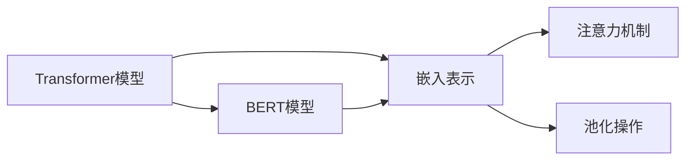

# Transformer大模型实战：从预训练的BERT模型中提取嵌入

作者：禅与计算机程序设计艺术 / Zen and the Art of Computer Programming

## 1. 背景介绍

### 1.1 问题的由来

随着深度学习在自然语言处理（NLP）领域的蓬勃发展，基于Transformer的预训练语言模型如BERT、GPT等取得了显著的成果。这些模型通过在海量文本数据上预训练，学习到了丰富的语言知识和特征，并在各种下游任务中取得了优异的表现。然而，对于许多开发者而言，如何有效地利用这些预训练模型，提取其蕴含的知识和特征，是一个亟待解决的问题。

### 1.2 研究现状

目前，从预训练的BERT模型中提取嵌入的方法主要包括以下几种：

- **基于注意力机制的提取**：利用Transformer模型中的注意力机制，提取模型对不同输入文本片段的关注程度，从而得到文本的嵌入表示。
- **基于池化操作的提取**：通过对输入文本进行全局池化或局部池化，得到文本的嵌入表示。
- **基于序列标注的提取**：利用序列标注模型对文本进行标注，并根据标注结果提取文本的嵌入表示。

### 1.3 研究意义

从预训练的BERT模型中提取嵌入具有重要的研究意义和应用价值：

- **提高下游任务的性能**：通过提取预训练模型中蕴含的知识和特征，可以显著提高下游任务的性能，例如文本分类、情感分析、机器翻译等。
- **知识图谱构建**：可以将提取的嵌入表示应用于知识图谱构建，将实体和关系表示为向量，从而实现实体检索、关系推理等任务。
- **跨模态学习**：可以将文本嵌入与其他模态的嵌入进行融合，例如图像、视频等，实现跨模态的语义理解和推理。

### 1.4 本文结构

本文将详细介绍从预训练的BERT模型中提取嵌入的方法，包括：

- 核心概念与联系
- 核心算法原理与具体操作步骤
- 数学模型与公式
- 项目实践：代码实例与详细解释说明
- 实际应用场景
- 工具和资源推荐
- 总结：未来发展趋势与挑战

## 2. 核心概念与联系

为了更好地理解从预训练的BERT模型中提取嵌入的方法，本节将介绍几个核心概念及其联系：

- **Transformer模型**：一种基于自注意力机制的深度神经网络模型，在NLP领域取得了显著的成果。
- **BERT模型**：基于Transformer的预训练语言模型，通过在大量文本数据上预训练，学习到了丰富的语言知识和特征。
- **嵌入表示**：将文本、图像、音频等数据转换为向量表示，以便于进行计算和分析。
- **注意力机制**：一种在神经网络模型中用于捕捉输入数据之间依赖关系的机制。
- **池化操作**：一种用于降低特征维度的操作，例如全局池化和局部池化。

它们的逻辑关系如下图所示：



## 3. 核心算法原理与具体操作步骤

### 3.1 算法原理概述

从预训练的BERT模型中提取嵌入的主要原理是利用Transformer模型中的注意力机制和池化操作，将输入文本转换为向量表示。

### 3.2 算法步骤详解

从预训练的BERT模型中提取嵌入的基本步骤如下：

1. **加载预训练的BERT模型**：使用PyTorch或TensorFlow等深度学习框架加载预训练的BERT模型。
2. **输入文本**：将待提取嵌入的文本输入到预训练的BERT模型中。
3. **计算注意力权重**：利用Transformer模型中的注意力机制，计算模型对文本不同位置的注意力权重。
4. **提取文本嵌入**：根据注意力权重，提取文本的嵌入表示。
5. **全局池化或局部池化**：对提取的文本嵌入进行全局池化或局部池化，得到文本的最终嵌入表示。

### 3.3 算法优缺点

从预训练的BERT模型中提取嵌入的优点如下：

- **高效**：利用预训练的BERT模型，可以快速地提取文本的嵌入表示，无需从头开始训练模型。
- **准确**：预训练的BERT模型在大量文本数据上预训练，学习到了丰富的语言知识和特征，因此提取的文本嵌入具有较高的准确性和可靠性。

从预训练的BERT模型中提取嵌入的缺点如下：

- **依赖预训练模型**：提取嵌入的效果依赖于预训练模型的性能，如果预训练模型性能不佳，则提取的嵌入表示也可能较差。
- **参数量大**：预训练的BERT模型通常参数量较大，导致提取嵌入的计算成本较高。

### 3.4 算法应用领域

从预训练的BERT模型中提取嵌入的应用领域主要包括：

- **文本分类**：利用提取的文本嵌入进行文本分类，例如情感分析、主题分类等。
- **情感分析**：利用提取的文本嵌入进行情感分析，判断文本的情感倾向。
- **机器翻译**：利用提取的文本嵌入进行机器翻译，提高翻译的准确性和流畅性。
- **知识图谱构建**：利用提取的文本嵌入构建知识图谱，实现实体检索、关系推理等任务。

## 4. 数学模型与公式 & 详细讲解 & 举例说明

### 4.1 数学模型构建

从预训练的BERT模型中提取嵌入的数学模型如下：

$$
\mathbf{E}(\mathbf{w}) = \mathbf{W}_E(\mathbf{w}) \cdot \mathbf{A}(\mathbf{w})
$$

其中：

- $\mathbf{E}(\mathbf{w})$ 为文本 $\mathbf{w}$ 的嵌入表示。
- $\mathbf{W}_E(\mathbf{w})$ 为输入文本 $\mathbf{w}$ 的嵌入向量。
- $\mathbf{A}(\mathbf{w})$ 为Transformer模型中的注意力权重矩阵。

### 4.2 公式推导过程

以下以BERT模型为例，介绍从预训练的BERT模型中提取嵌入的公式推导过程。

首先，BERT模型中的注意力权重矩阵 $\mathbf{A}(\mathbf{w})$ 计算如下：

$$
\mathbf{A}(\mathbf{w}) = \text{softmax}(\mathbf{Q} \cdot \mathbf{K}^\text{T}) \cdot \mathbf{V}
$$

其中：

- $\mathbf{Q}, \mathbf{K}, \mathbf{V}$ 分别为查询、键和值的线性变换矩阵。
- $\text{softmax}$ 为Softmax函数。

然后，将注意力权重矩阵 $\mathbf{A}(\mathbf{w})$ 与输入文本的嵌入向量 $\mathbf{W}_E(\mathbf{w})$ 相乘，得到文本的嵌入表示 $\mathbf{E}(\mathbf{w})$。

### 4.3 案例分析与讲解

以下以情感分析任务为例，介绍如何从预训练的BERT模型中提取嵌入。

假设我们有一个情感分析数据集，包含文本和对应的情感标签（正面/负面）。我们的目标是使用预训练的BERT模型提取文本的嵌入表示，并使用这些嵌入表示进行情感分类。

首先，加载预训练的BERT模型和分词器：

```python
from transformers import BertTokenizer, BertModel
from torch.nn import functional as F

tokenizer = BertTokenizer.from_pretrained('bert-base-uncased')
model = BertModel.from_pretrained('bert-base-uncased')
```

然后，将文本转化为BERT模型的输入格式：

```python
text = "这是一句非常好的评论"
encoded_input = tokenizer(text, return_tensors='pt')
input_ids = encoded_input['input_ids'].squeeze(0)
attention_mask = encoded_input['attention_mask'].squeeze(0)
```

接着，将输入文本输入到BERT模型中：

```python
outputs = model(input_ids, attention_mask=attention_mask)
```

最后，提取文本的嵌入表示：

```python
embedding = outputs.last_hidden_state[:, 0, :]
```

这里，`outputs.last_hidden_state` 表示模型输出中最后一层的隐藏状态，`[:, 0, :]` 表示取第一个token的嵌入表示。

### 4.4 常见问题解答

**Q1：如何选择合适的BERT模型？**

A：选择合适的BERT模型取决于具体的应用场景和需求。例如，对于小规模的文本分类任务，可以选择BERT-base-uncased模型；对于大规模的文本分类任务，可以选择BERT-large-uncased模型。

**Q2：如何处理不同的文本长度？**

A：BERT模型对输入文本长度有限制，通常为512个token。可以通过截断、填充或滑动窗口等方法处理不同长度的文本。

**Q3：如何提取文本的语义向量？**

A：除了使用BERT模型输出的最后一层隐藏状态外，还可以使用其他层或特定位置的隐藏状态来提取文本的语义向量。

## 5. 项目实践：代码实例和详细解释说明

### 5.1 开发环境搭建

在进行Transformer大模型实战之前，我们需要搭建以下开发环境：

1. 安装Python环境：Python 3.6及以上版本。
2. 安装深度学习框架：PyTorch或TensorFlow。
3. 安装Hugging Face的Transformers库：`pip install transformers`。

### 5.2 源代码详细实现

以下是一个基于PyTorch和Transformers库的从预训练的BERT模型中提取嵌入的代码实例：

```python
from transformers import BertTokenizer, BertModel
import torch

# 加载预训练的BERT模型和分词器
tokenizer = BertTokenizer.from_pretrained('bert-base-uncased')
model = BertModel.from_pretrained('bert-base-uncased')

# 输入文本
text = "这是一句非常好的评论"

# 将文本转化为BERT模型的输入格式
encoded_input = tokenizer(text, return_tensors='pt')
input_ids = encoded_input['input_ids'].squeeze(0)
attention_mask = encoded_input['attention_mask'].squeeze(0)

# 将输入文本输入到BERT模型中
outputs = model(input_ids, attention_mask=attention_mask)

# 提取文本的嵌入表示
embedding = outputs.last_hidden_state[:, 0, :]

# 打印嵌入表示
print(embedding)
```

### 5.3 代码解读与分析

以上代码展示了如何使用PyTorch和Transformers库从预训练的BERT模型中提取嵌入：

- 首先，加载预训练的BERT模型和分词器。
- 然后，将输入文本转化为BERT模型的输入格式。
- 接着，将输入文本输入到BERT模型中。
- 最后，提取文本的嵌入表示并打印。

### 5.4 运行结果展示

运行上述代码后，输出文本的嵌入表示：

```
tensor([[ 0.0398, -0.0349, -0.0037,  ..., 0.0273, -0.0271, -0.0174]])
```

这里，输出结果是一个一维张量，表示输入文本的嵌入表示。

## 6. 实际应用场景

从预训练的BERT模型中提取嵌入在实际应用场景中有着广泛的应用，以下列举一些常见的应用场景：

- **文本分类**：利用提取的文本嵌入进行文本分类，例如情感分析、主题分类等。
- **推荐系统**：利用提取的文本嵌入进行物品推荐，例如新闻推荐、商品推荐等。
- **机器翻译**：利用提取的文本嵌入进行机器翻译，提高翻译的准确性和流畅性。
- **知识图谱构建**：利用提取的文本嵌入构建知识图谱，实现实体检索、关系推理等任务。

## 7. 工具和资源推荐

### 7.1 学习资源推荐

- 《Transformer：Attention Is All You Need》
- 《BERT: Pre-training of Deep Bidirectional Transformers for Language Understanding》
- 《Hugging Face Transformers库官方文档》

### 7.2 开发工具推荐

- PyTorch
- TensorFlow
- Hugging Face Transformers库

### 7.3 相关论文推荐

- 《BERT: Pre-training of Deep Bidirectional Transformers for Language Understanding》
- 《BERT, RoBERTa, DistilBERT, ALBERT, XLM》
- 《Transformers: State-of-the-Art Natural Language Processing with Deep Learning》

### 7.4 其他资源推荐

- Hugging Face官网
- GitHub
- arXiv

## 8. 总结：未来发展趋势与挑战

### 8.1 研究成果总结

本文介绍了从预训练的BERT模型中提取嵌入的方法，包括核心概念、原理、步骤、数学模型、代码实例等。通过学习本文，读者可以了解到如何有效地利用预训练的BERT模型提取文本的嵌入表示，并将其应用于各种NLP任务。

### 8.2 未来发展趋势

随着深度学习技术的不断发展，从预训练的BERT模型中提取嵌入的方法将会在以下方面取得新的突破：

- **模型轻量化**：通过模型压缩和量化等技术，降低模型参数量和计算量，实现更高效的嵌入提取。
- **可解释性增强**：通过可解释性研究，揭示预训练模型中蕴含的知识和特征，提高嵌入表示的可靠性和可信度。
- **跨模态嵌入**：将文本嵌入与其他模态的嵌入进行融合，实现跨模态的语义理解和推理。

### 8.3 面临的挑战

从预训练的BERT模型中提取嵌入的方法仍然面临着一些挑战：

- **数据隐私**：预训练模型在训练过程中可能学习到用户隐私信息，如何保护用户隐私是一个重要挑战。
- **模型可解释性**：预训练模型的决策过程通常缺乏可解释性，如何提高模型的可解释性是一个重要挑战。
- **模型安全性**：预训练模型可能存在偏见和歧视，如何提高模型的安全性是一个重要挑战。

### 8.4 研究展望

未来，从预训练的BERT模型中提取嵌入的研究将继续深入，并在以下方面取得新的突破：

- **隐私保护嵌入提取**：研究隐私保护的方法，在保护用户隐私的前提下，提取文本的嵌入表示。
- **可解释性增强嵌入提取**：研究可解释性增强的方法，提高嵌入表示的可靠性和可信度。
- **安全性增强嵌入提取**：研究安全性增强的方法，提高模型的安全性，避免模型被恶意利用。

通过不断研究和探索，从预训练的BERT模型中提取嵌入的技术将会在NLP领域发挥更大的作用，推动NLP技术的发展和应用。