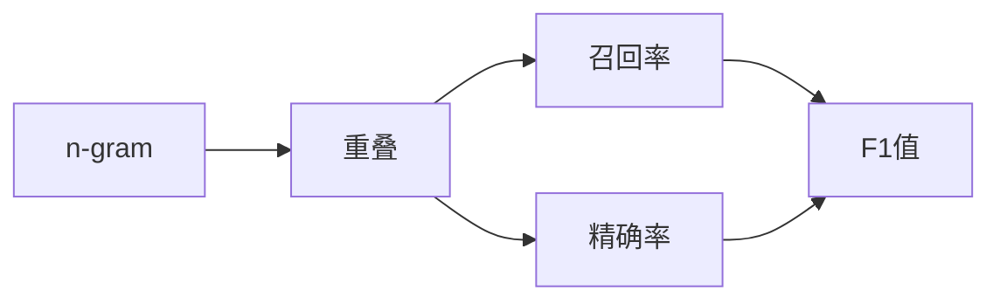

# Transformer大模型实战 理解ROUGE-N 指标

作者：禅与计算机程序设计艺术 / Zen and the Art of Computer Programming

## 1. 背景介绍
### 1.1 问题的由来
随着自然语言处理(NLP)技术的快速发展,特别是Transformer架构的提出和大规模预训练语言模型的广泛应用,如何客观评估生成文本的质量成为一个重要的研究问题。传统的人工评估方法耗时费力,难以适应海量文本生成场景。因此,迫切需要一种自动化的文本质量评估指标。

### 1.2 研究现状 
目前,学术界和工业界广泛采用ROUGE(Recall-Oriented Understudy for Gisting Evaluation)指标来自动评估生成文本的质量,尤其是在文本摘要、机器翻译、对话系统等任务中。ROUGE最早由Lin等人于2004年提出[^Lin2004ROUGE],此后在学术界得到广泛应用和改进。

ROUGE包含多个变体,其中应用最广泛的是ROUGE-N。它通过比较生成文本和参考文本的n-gram重叠情况来评估生成文本的质量。尽管简单直观,但大量实验表明ROUGE-N与人工评估结果具有较高的相关性。

### 1.3 研究意义
深入理解ROUGE-N指标的原理和实现,对于从事NLP研究和应用的学者和工程师具有重要意义:

1. 正确使用ROUGE-N评估生成文本质量,避免错误或误导性的结果。
2. 开发改进的文本质量自动评估指标,弥补ROUGE-N的不足。
3. 优化基于ROUGE-N的NLP模型训练和超参数调优过程。

### 1.4 本文结构
本文将从以下几个方面深入探讨ROUGE-N指标:

- 介绍ROUGE-N的核心概念和数学定义
- 阐述ROUGE-N指标的计算原理和算法实现 
- 通过实例演示ROUGE-N的计算过程
- 总结ROUGE-N的优缺点和改进方向
- 推荐ROUGE-N相关的学习资源和工具

## 2. 核心概念与联系
ROUGE-N的核心概念包括:

- n-gram:将文本切分为长度为n的子串,n取值一般为1、2、3、4,分别对应unigram、bigram、trigram和4-gram。n-gram能够刻画文本的局部结构信息。
- 重叠(overlap):生成文本中的n-gram在参考文本中出现的个数,体现了两个文本在n-gram层面的相似程度。
- 召回率(Recall):生成文本与参考文本重叠的n-gram个数占参考文本n-gram总数的比例,反映了生成文本对参考文本信息的覆盖程度。
- 精确率(Precision):生成文本与参考文本重叠的n-gram个数占生成文本n-gram总数的比例,反映了生成文本中有效信息的占比。
- F1值:召回率和精确率的调和平均,兼顾了覆盖度和准确性。

这些概念环环相扣,共同构成了ROUGE-N指标的理论基础。下图展示了它们之间的逻辑关系:



## 3. 核心算法原理 & 具体操作步骤
### 3.1 算法原理概述
ROUGE-N的基本思想是:对于给定的生成文本和参考文本,先提取它们的n-gram集合,然后计算二者的重叠度,最后通过召回率、精确率、F1值等指标量化重叠程度,以此作为生成文本质量的评估结果。

### 3.2 算法步骤详解
计算ROUGE-N分为以下几个步骤:

1. 文本预处理:对生成文本和参考文本进行分词、去除停用词、小写转换等预处理操作,得到规范化的文本。
2. 提取n-gram:基于预处理后的文本,提取所有的n-gram,一般取n=1,2,3,4。
3. 统计重叠:对于生成文本的每个n-gram,判断它是否在参考文本的n-gram集合中出现,若出现则重叠数加1。
4. 计算评估指标:基于重叠统计结果,计算ROUGE-N的召回率、精确率、F1值。
   - 召回率 $R_n = \frac{重叠n-gram数}{参考文本n-gram总数}$
   - 精确率 $P_n = \frac{重叠n-gram数}{生成文本n-gram总数}$  
   - F1值 $F_n = \frac{2P_nR_n}{P_n+R_n}$

其中,n表示n-gram的长度。通常报告ROUGE-1、ROUGE-2、ROUGE-3、ROUGE-4的结果。

### 3.3 算法优缺点
ROUGE-N算法的主要优点包括:

1. 简单直观,易于实现。只需基于n-gram匹配即可计算,不需要复杂的语言学知识。
2. 计算高效,可以快速评估大规模文本生成结果。
3. 与人工评估结果具有较高的相关性,在学术界和工业界得到广泛认可。

但ROUGE-N也存在一些局限性:

1. 只考虑表面的n-gram重叠,无法刻画语义相似性。
2. 无法鉴别语法错误、逻辑矛盾等问题。
3. 容易受参考文本质量和数量的影响。

### 3.4 算法应用领域
ROUGE-N广泛应用于各类文本生成任务的评估,主要包括:

- 文本摘要:评估自动摘要与人工摘要的相似度。
- 机器翻译:评估机器翻译结果与参考翻译的一致性。 
- 对话系统:评估生成回复与参考回复的匹配程度。
- 问答系统:评估生成答案与标准答案的重合度。

此外,ROUGE-N也被用于NLP模型的训练优化和超参数调优,作为自动评估指标指导模型改进。

## 4. 数学模型和公式 & 详细讲解 & 举例说明
### 4.1 数学模型构建
我们以生成文本 $C$ 和参考文本 $R$ 为例,形式化定义ROUGE-N的数学模型。

首先,引入如下记号:
- $g_n(C)$:生成文本 $C$ 的n-gram集合。
- $g_n(R)$:参考文本 $R$ 的n-gram集合。
- $Count_{overlap}(g_n)$:n-gram $g_n$ 在 $g_n(C)$ 和 $g_n(R)$ 中的重叠数量。
- $Count(g_n(C))$:$g_n(C)$ 的元素数量,即生成文本n-gram总数。
- $Count(g_n(R))$:$g_n(R)$ 的元素数量,即参考文本n-gram总数。

基于以上记号,ROUGE-N的召回率 $R_n$、精确率 $P_n$、F1值 $F_n$ 的数学定义为:

$$
R_n = \frac{\sum_{g_n \in g_n(C)} Count_{overlap}(g_n)}{Count(g_n(R))}
$$

$$
P_n = \frac{\sum_{g_n \in g_n(C)} Count_{overlap}(g_n)}{Count(g_n(C))}
$$

$$
F_n = \frac{2P_nR_n}{P_n+R_n}
$$

### 4.2 公式推导过程
为了加深理解,我们对ROUGE-N的召回率公式进行推导。

召回率 $R_n$ 表示生成文本 $C$ 和参考文本 $R$ 之间重叠的n-gram占 $R$ 总n-gram数量的比例:

$$
\begin{aligned}
R_n &= \frac{C和R重叠的n-gram总数}{R的n-gram总数} \\
&= \frac{\sum_{g_n \in g_n(C)} Count_{overlap}(g_n)}{Count(g_n(R))}
\end{aligned}
$$

其中,$\sum_{g_n \in g_n(C)} Count_{overlap}(g_n)$ 对生成文本 $C$ 的每个n-gram $g_n$ 在参考文本 $R$ 中的重叠数量求和,表示二者重叠的n-gram总数。$Count(g_n(R))$ 表示参考文本 $R$ 的n-gram总数。二者相除即为召回率 $R_n$。

精确率 $P_n$ 和F1值 $F_n$ 的推导过程与之类似,不再赘述。

### 4.3 案例分析与讲解
下面通过一个简单的例子演示ROUGE-N的计算过程。

假设生成文本 $C$ 为:
```
The cat sat on the mat.
```

参考文本 $R$ 为:
```
The cat is on the mat.
```

以ROUGE-1(unigram)为例,计算过程如下:

1. 提取unigram:
   - $g_1(C) = \{The, cat, sat, on, the, mat\}$
   - $g_1(R) = \{The, cat, is, on, the, mat\}$
2. 统计重叠:
   - $Count_{overlap}(The) = 1$
   - $Count_{overlap}(cat) = 1$
   - $Count_{overlap}(on) = 1$
   - $Count_{overlap}(the) = 1$
   - $Count_{overlap}(mat) = 1$
   - 其余unigram重叠数为0
3. 计算ROUGE-1:
   - 召回率 $R_1 = \frac{1+1+1+1+1}{6} = \frac{5}{6} \approx 0.833$
   - 精确率 $P_1 = \frac{1+1+1+1+1}{6} = \frac{5}{6} \approx 0.833$
   - F1值 $F_1 = \frac{2 \times 0.833 \times 0.833}{0.833 + 0.833} = 0.833$

可见,生成文本 $C$ 与参考文本 $R$ 在unigram层面有较高的重合度,ROUGE-1值达到0.833。

以此类推,可以计算ROUGE-2、ROUGE-3、ROUGE-4的结果,全面评估生成文本的质量。

### 4.4 常见问题解答
问题1:ROUGE-N是否适用于中文文本?

答:ROUGE-N同样适用于中文文本,只需将中文文本进行分词预处理,提取n-gram即可。但中文分词的准确性会影响ROUGE-N的结果。

问题2:如何选择合适的n值?

答:n值的选择需要权衡计算复杂度和评估粒度。n越大,刻画局部结构的能力越强,但计算开销也越大。实践中,一般取n=1,2,3,4,分别报告ROUGE-1到ROUGE-4的结果。

问题3:ROUGE-N值越高是否意味着生成文本质量越好?

答:ROUGE-N只是一种自动评估指标,虽然与人工评估结果有较高的相关性,但并非绝对。ROUGE-N值高不一定代表生成文本质量高,还需结合人工评估和应用场景进行综合判断。

## 5. 项目实践：代码实例和详细解释说明
### 5.1 开发环境搭建
本项目使用Python语言,依赖以下库:
- nltk:用于文本预处理和n-gram提取
- numpy:用于数值计算

可通过以下命令安装:
```bash
pip install nltk numpy
```

### 5.2 源代码详细实现
下面给出ROUGE-N指标的Python实现代码:

```python
import nltk
import numpy as np

def rouge_n(generated_summary, reference_summary, n=2):
    """
    计算ROUGE-N指标
    :param generated_summary: 生成的摘要
    :param reference_summary: 参考摘要
    :param n: n-gram长度,默认为2
    :return: ROUGE-N的召回率、精确率和F1值
    """
    # 提取n-gram
    gen_ngrams = _get_ngrams(generated_summary, n)
    ref_ngrams = _get_ngrams(reference_summary, n)
    
    # 统计重叠
    overlap_ngrams = gen_ngrams & ref_ngrams
    overlap_count = sum(gen_ngrams[ngram] for ngram in overlap_ngrams)
    
    # 计算评估指标
    recall = overlap_count / sum(ref_ngrams.values())
    precision = overlap_count / sum(gen_ngrams.values())
    if recall + precision == 0:
        f1 = 0
    else:
        f1 = 2 * recall * precision / (recall + precision)
    
    return recall, precision, f1

def _get_ngrams(text, n):
    """
    提取文本的n-gram
    :param text: 输