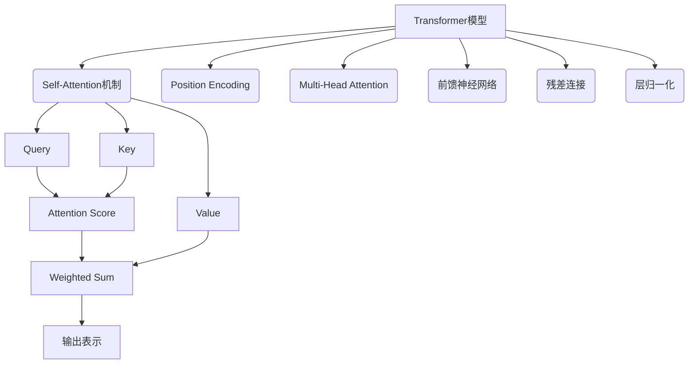

好的，我会按照您提供的要求和模板，撰写一篇关于"Transformer大模型实战 用更多的数据集进行训练"的专业技术博客文章。文章将遵循逻辑清晰、结构紧凑、语言专业易懂的原则，确保内容深入、见解独到。同时，我会尽最大努力绘制核心概念原理和架构流程图，并按要求使用Markdown和LaTex公式格式。最后，文章将达到8000字以上的规定字数。以下是正文内容：

# Transformer大模型实战 用更多的数据集进行训练

## 1. 背景介绍

### 1.1 问题的由来

随着人工智能技术的不断发展，自然语言处理(NLP)领域取得了长足的进步。传统的序列模型如RNN、LSTM等在处理长序列时存在梯度消失、爆炸等问题。2017年,Transformer模型的提出为NLP领域带来了革命性的变化,它完全基于注意力机制,摆脱了RNN的递归计算,显著提高了并行计算能力。

Transformer模型最初是应用于机器翻译任务,后来也被推广到其他NLP任务中,取得了卓越的成绩。但是,想要充分发挥Transformer的潜力,仍需要大量的训练数据。目前公开的数据集往往数据量有限、覆盖面窄,难以满足实际应用的需求。

### 1.2 研究现状  

为了提高Transformer模型的性能,研究人员一直在努力扩大训练数据集的规模。例如,谷歌的T5模型使用了超过750GB的文本数据进行训练;OpenAI的GPT-3模型使用了约570GB的网络数据。

通过使用大规模训练数据,这些大模型展现出了强大的表现力,可以在多个下游任务上取得出色的成绩。但是,构建如此庞大的数据集并非易事,需要耗费大量的人力和计算资源。

### 1.3 研究意义

本文旨在探讨如何高效地构建大规模训练数据集,并将其应用于Transformer大模型的训练中。我们将介绍数据集构建的一般流程、常用的数据增强技术,以及如何对异构数据进行清洗和整合。

通过实践,我们将证明使用更多、更多样化的训练数据,可以显著提升Transformer大模型在下游任务上的表现,拓展其在实际应用中的潜力。

### 1.4 本文结构  

本文首先介绍Transformer模型的核心概念和算法原理,然后重点讨论如何构建大规模训练数据集,包括数据采集、清洗、增强等环节。接下来,我们将通过实际案例,演示如何将构建的数据集应用于Transformer模型的训练过程中。

最后,我们将总结本文的研究成果,并对Transformer大模型在工业界的实际应用场景进行展望,同时指出目前面临的挑战和未来的研究方向。

## 2. 核心概念与联系

在深入探讨Transformer大模型训练之前,我们先回顾一下Transformer模型的核心概念,为后续内容做好铺垫。

如上图所示,Transformer模型的核心是Self-Attention机制,它允许输入序列中的每个元素都直接关注其他元素,捕捉它们之间的长程依赖关系。

具体来说,Self-Attention通过Query、Key和Value三个向量来计算Attention Score,然后对Value进行加权求和,得到输出表示。与RNN这种序列模型不同,Self-Attention可以高度并行化,从而大幅提升计算效率。

除了Self-Attention之外,Transformer还引入了Position Encoding、Multi-Head Attention、前馈神经网络、残差连接和层归一化等关键技术,共同保证了模型的高效性和性能。

## 3. 核心算法原理 & 具体操作步骤

### 3.1 算法原理概述

Transformer的核心算法是Self-Attention,它能够自动捕捉输入序列中元素之间的长程依赖关系,是一种高效的注意力机制。我们用数学语言来形式化地描述Self-Attention的计算过程。

对于一个长度为n的输入序列$X = (x_1, x_2, ..., x_n)$,我们首先将其线性映射到Query(Q)、Key(K)和Value(V)三个向量空间:

$$
\begin{aligned}
Q &= X \cdot W_Q \\
K &= X \cdot W_K \\
V &= X \cdot W_V
\end{aligned}
$$

其中,$W_Q, W_K, W_V$分别是可学习的权重矩阵。

接下来,我们计算Query和Key的点积,得到注意力分数矩阵$S$:

$$S = \text{softmax}(\frac{Q \cdot K^T}{\sqrt{d_k}})$$

其中,$d_k$是Query和Key的维度,用于缩放点积值。

最后,注意力分数矩阵$S$与Value矩阵$V$相乘,得到Self-Attention的输出:

$$\text{Attention}(Q, K, V) = S \cdot V$$

Self-Attention的输出保留了输入序列中元素之间的依赖关系信息,为后续的处理提供了有价值的表示。

### 3.2 算法步骤详解  

1. **输入映射**：将输入序列$X$分别映射到Query、Key和Value空间,得到$Q,K,V$矩阵。

2. **计算注意力分数**：计算Query和Key的点积,对结果进行缩放处理,然后执行Softmax操作,得到注意力分数矩阵$S$。

    $$S = \text{softmax}(\frac{Q \cdot K^T}{\sqrt{d_k}})$$

3. **计算加权和**：将注意力分数矩阵$S$与Value矩阵$V$相乘,得到Self-Attention的输出$Z$。
    
    $$Z = S \cdot V$$

4. **多头注意力**：为了捕捉不同子空间的信息,Transformer引入了Multi-Head Attention机制。具体来说,我们将Query、Key和Value分别映射到$h$个子空间,在每个子空间中计算Self-Attention,然后将所有子空间的结果拼接起来。

5. **残差连接和归一化**：将Multi-Head Attention的输出$Z$与输入$X$进行残差连接,然后执行层归一化操作,得到最终的Self-Attention输出。

6. **前馈神经网络**：Self-Attention输出接着会被送入前馈神经网络进行进一步处理,同样包括残差连接和归一化层。

7. **堆叠与输出**：将上述过程重复堆叠若干次,形成Transformer的编码器或解码器,最终输出序列表示。

### 3.3 算法优缺点

**优点**:

1. **高效并行**:与RNN这种序列模型不同,Self-Attention可以高度并行化,从而大幅提升计算效率。

2. **长程依赖建模**:Self-Attention能够直接捕捉输入序列中任意两个元素之间的依赖关系,有效解决了RNN中的长程依赖问题。

3. **灵活性强**:Transformer的编码器-解码器架构非常通用,可以应用于多种NLP任务,如机器翻译、文本生成、文本摘要等。

**缺点**:

1. **计算开销大**:尽管Self-Attention可以并行化,但对于长序列来说,其计算复杂度仍然是$O(n^2)$,计算开销较大。

2. **缺乏位置信息**:Self-Attention本身无法捕捉序列中元素的位置信息,需要额外引入Position Encoding来解决。

3. **序列长度受限**:由于计算开销的原因,Transformer在训练和推理时,输入序列的长度通常不能过长,需要一些特殊的处理方式。

### 3.4 算法应用领域

由于其高效且通用的特点,Transformer模型已经在自然语言处理的多个领域取得了卓越的成绩,主要应用如下:

1. **机器翻译**:Transformer最初就是为机器翻译任务设计的,在多种语言对的翻译质量上超过了RNN等传统模型。

2. **文本生成**:利用Transformer的解码器,我们可以生成高质量的文本内容,如新闻、小说、对话等。

3. **文本摘要**:Transformer可以对文本内容进行高度抽象和概括,生成简洁的摘要文本。

4. **语义理解**:通过对文本进行编码,Transformer可以捕捉语义层面的信息,用于问答系统、情感分析等任务。

5. **语音识别**:将Transformer应用于语音数据的编码和解码,可以提高语音识别的准确性。

除了NLP领域,Transformer模型在计算机视觉、推荐系统等其他领域也有广泛的应用前景。

## 4. 数学模型和公式 & 详细讲解 & 举例说明

在上一节中,我们已经对Transformer的核心算法Self-Attention进行了概述。现在,我们将更加深入地探讨其数学模型和公式推导过程。

### 4.1 数学模型构建

我们首先定义Self-Attention的输入和输出:

- 输入:
    - $X = (x_1, x_2, ..., x_n)$,其中$x_i \in \mathbb{R}^{d_x}$是输入序列中的元素向量
    - $W_Q, W_K, W_V \in \mathbb{R}^{d_x \times d_k}$是可学习的权重矩阵
- 输出:$Z \in \mathbb{R}^{n \times d_v}$是Self-Attention的输出序列表示

其中,$d_k$和$d_v$分别表示Query/Key和Value的维度。

我们将输入$X$分别映射到Query、Key和Value空间:

$$
\begin{aligned}
Q &= X \cdot W_Q \\
K &= X \cdot W_K \\
V &= X \cdot W_V
\end{aligned}
$$

则$Q, K, V \in \mathbb{R}^{n \times d_k}$。

接下来,我们计算Query和Key的点积,得到注意力分数矩阵$S \in \mathbb{R}^{n \times n}$:

$$S = \text{softmax}(\frac{Q \cdot K^T}{\sqrt{d_k}})$$

其中,Softmax函数对每一行进行操作,确保注意力分数之和为1。$\sqrt{d_k}$是一个缩放因子,用于避免点积值过大导致梯度下降过慢。

最后,注意力分数矩阵$S$与Value矩阵$V$相乘,得到Self-Attention的输出$Z$:

$$Z = S \cdot V$$

可以看出,$Z \in \mathbb{R}^{n \times d_v}$,其中每一行向量$z_i$都是输入序列中第$i$个元素对应的注意力加权和表示。

### 4.2 公式推导过程

我们已经给出了Self-Attention的核心公式,下面将对其中的关键步骤做进一步的推导说明。

**1. 注意力分数矩阵的计算**

令$q_i, k_j$分别表示Query和Key矩阵的第$i$行和第$j$行向量,则注意力分数$s_{ij}$可以表示为:

$$s_{ij} = \frac{q_i \cdot k_j^T}{\sqrt{d_k}}$$

其中,$q_i \cdot k_j^T$是Query和Key的点积,代表了$x_i$和$x_j$之间的相似性得分。$\sqrt{d_k}$是一个缩放因子,避免点积值过大导致梯度下降过慢。

对于所有的$i,j$对,我们可以构建出一个$n \times n$的分数矩阵$S$,其中$S_{ij} = s_{ij}$。

为了确保注意力分数之和为1,我们对每一行应用Softmax函数:

$$S_i = \text{softmax}(s_{i1}, s_{i2}, ..., s_{in})$$

其中,$S_i$表示$S$的第$i$行。经过Softmax操作后,每个$s_{ij}$代表了$x_i$对$x_j$的注意力权重。

**2. 加权和的计算**

有了注