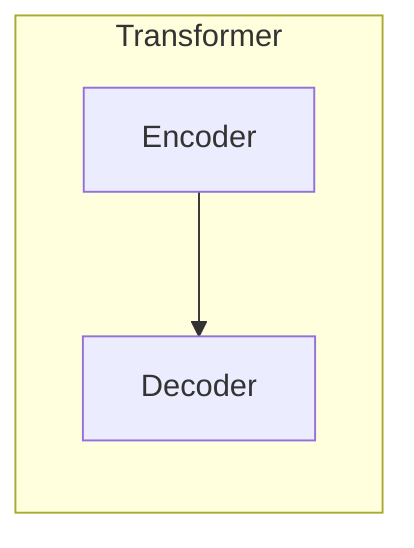
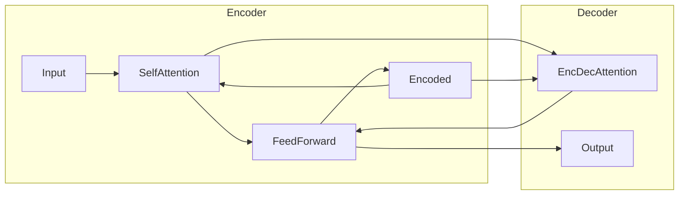

好的，我会严格遵循约束条件，以专业的技术语言撰写一篇关于Transformer架构原理和注意力机制的深度博客文章。文章将包含背景介绍、核心概念、算法原理、数学模型、代码实现、应用场景、资源推荐、发展趋势与挑战等内容。

# Transformer架构原理详解：注意力机制

## 1. 背景介绍

### 1.1 问题的由来

在自然语言处理和机器翻译等序列数据任务中,传统的序列模型如循环神经网络(RNN)和长短期记忆网络(LSTM)在处理长序列时存在梯度消失/爆炸的问题,并且由于其顺序结构特点,难以充分利用数据的并行性。因此,需要一种全新的模型架构来解决这些问题。

### 1.2 研究现状

2017年,Transformer模型在论文"Attention Is All You Need"中被提出,它完全摒弃了RNN和卷积的结构,纯粹基于注意力机制构建,在机器翻译任务上取得了超越LSTM等传统模型的性能。自此,Transformer模型在NLP领域掀起了一股热潮,并逐渐扩展到计算机视觉、语音识别等其他领域。

### 1.3 研究意义

Transformer模型的出现不仅解决了序列模型梯度问题,还能充分利用数据的并行性,大幅提高了训练效率。此外,注意力机制能自动捕捉输入数据的长程依赖关系,从而提高模型的表达能力。研究Transformer的原理对于提高深度学习模型的性能、泛化能力和可解释性都具有重要意义。

### 1.4 本文结构

本文将首先介绍Transformer模型的核心概念和注意力机制的工作原理,然后深入探讨其算法细节、数学模型和公式推导。接下来,我们将通过实际代码实现来展示Transformer模型的具体应用,并分析其在不同场景下的实践效果。最后,文章将总结Transformer模型的发展趋势和面临的挑战,为读者提供相关的学习资源和工具推荐。

## 2. 核心概念与联系

Transformer是一种基于注意力机制的全新的序列到序列(Seq2Seq)模型架构,主要由编码器(Encoder)和解码器(Decoder)两个子模块组成。

编码器的作用是将输入序列编码为一系列连续的向量表示,而解码器则根据这些向量表示生成输出序列。两者之间通过注意力机制建立联系,实现了对输入序列的全局关注。

编码器和解码器内部都采用了多头自注意力(Multi-Head Self-Attention)和前馈神经网络(Feed-Forward Neural Network)的结构,通过残差连接(Residual Connection)和层归一化(Layer Normalization)来增强模型的表达能力和收敛性。

## 3. 核心算法原理 & 具体操作步骤

### 3.1 算法原理概述

Transformer模型的核心是注意力机制(Attention Mechanism),它能自动捕捉输入序列中任意两个单元之间的依赖关系,避免了RNN/LSTM中的长程依赖问题。

注意力机制的基本思想是,在生成一个单元的表示时,先计算该单元与输入序列中所有其他单元的相关性权重(注意力分数),然后根据这些权重对其他单元的表示进行加权求和,作为该单元的注意力表示。

### 3.2 算法步骤详解

以编码器的自注意力计算为例,具体步骤如下:

1. 线性投影:将输入序列 $X=(x_1,x_2,...,x_n)$ 通过三个不同的线性变换,分别得到查询(Query)向量 $Q$、键(Key)向量 $K$ 和值(Value)向量 $V$。

   $$Q=XW_Q, K=XW_K, V=XW_V$$

   其中 $W_Q,W_K,W_V$ 为可训练的权重矩阵。

2. 注意力计算:对每个查询向量 $q_i$,计算其与所有键向量 $K$ 的相似度,得到注意力分数向量 $a_i$。

   $$a_i=\text{softmax}(\frac{q_iK^T}{\sqrt{d_k}})$$

   其中 $d_k$ 为缩放因子,用于防止点积过大导致梯度饱和。

3. 注意力加权:使用注意力分数向量 $a_i$ 对值向量 $V$ 进行加权求和,得到注意力表示 $z_i$。

   $$z_i=\sum_{j=1}^n a_{ij}v_j$$

4. 多头注意力:将上述过程重复执行 $h$ 次(多头),得到 $h$ 个注意力表示,并将它们拼接起来作为最终的多头注意力表示。

   $$\text{MultiHead}(Q,K,V)=\text{Concat}(z_1,z_2,...,z_h)W^O$$

   其中 $W^O$ 为可训练的线性变换权重矩阵。

解码器的自注意力和编码器-解码器注意力计算过程类似,只是在编码器-解码器注意力中,查询向量来自解码器,而键和值向量来自编码器的输出。

### 3.3 算法优缺点

**优点**:

- 并行计算,避免了RNN的序列计算瓶颈
- 全局关注,能自动捕捉长程依赖关系
- 可解释性好,注意力分数可视化
- 位置编码,可处理变长序列输入

**缺点**:

- 计算复杂度高,注意力计算需要大量矩阵乘法运算
- 对超长序列仍有一定限制,注意力分数矩阵过大
- 缺乏诱导偏置,需要大量数据和训练资源

### 3.4 算法应用领域

Transformer模型最初被设计用于机器翻译任务,但由于其强大的表达能力和泛化性,目前已被广泛应用于自然语言处理的各个领域,如文本生成、语义理解、对话系统等。

除NLP外,Transformer模型也逐渐扩展到计算机视觉、语音识别、强化学习等其他领域,展现出了巨大的应用潜力。如视觉Transformer(ViT)模型在图像分类等视觉任务中表现优异。

## 4. 数学模型和公式 & 详细讲解 & 举例说明 

### 4.1 数学模型构建

我们将注意力机制的计算过程形式化为一个数学模型。假设输入序列为 $X=(x_1,x_2,...,x_n)$,其中 $x_i\in\mathbb{R}^{d_x}$ 为 $d_x$ 维向量。我们的目标是计算每个输入向量 $x_i$ 的注意力表示 $z_i$。

首先,通过三个线性变换,将输入序列 $X$ 映射到查询(Query)、键(Key)和值(Value)空间:

$$Q=XW_Q, K=XW_K, V=XW_V$$

其中 $W_Q\in\mathbb{R}^{d_x\times d_q}$、$W_K\in\mathbb{R}^{d_x\times d_k}$、$W_V\in\mathbb{R}^{d_x\times d_v}$ 为可训练的权重矩阵,分别将输入向量映射到 $d_q$、$d_k$、$d_v$ 维的查询、键和值空间。

接下来,对每个查询向量 $q_i\in\mathbb{R}^{d_q}$,计算其与所有键向量 $K$ 的相似度,得到注意力分数向量 $a_i\in\mathbb{R}^n$:

$$a_i=\text{softmax}(\frac{q_iK^T}{\sqrt{d_k}})$$

其中,分母中的 $\sqrt{d_k}$ 为缩放因子,用于防止点积过大导致梯度饱和。

然后,使用注意力分数向量 $a_i$ 对值向量 $V$ 进行加权求和,得到注意力表示 $z_i\in\mathbb{R}^{d_v}$:

$$z_i=\sum_{j=1}^n a_{ij}v_j$$

最后,将上述过程重复执行 $h$ 次(多头注意力),得到 $h$ 个注意力表示,并将它们拼接起来作为最终的多头注意力表示 $\text{MultiHead}(Q,K,V)\in\mathbb{R}^{hd_v}$:

$$\text{MultiHead}(Q,K,V)=\text{Concat}(z_1,z_2,...,z_h)W^O$$

其中 $W^O\in\mathbb{R}^{hd_v\times d_o}$ 为可训练的线性变换权重矩阵,将拼接后的表示映射回模型的输出空间 $\mathbb{R}^{d_o}$。

### 4.2 公式推导过程

我们来推导一下注意力分数 $a_i$ 的具体计算过程。根据定义,对于查询向量 $q_i$,其与所有键向量 $K$ 的相似度得分向量为:

$$s_i=(q_iK^T)=\begin{bmatrix}
q_i\cdot k_1 & q_i\cdot k_2 & \cdots & q_i\cdot k_n
\end{bmatrix}$$

其中 $\cdot$ 表示向量点积运算。然后,我们对相似度得分向量 $s_i$ 进行 softmax 归一化,得到注意力分数向量 $a_i$:

$$a_i=\text{softmax}(s_i)=\begin{bmatrix}
\frac{e^{q_i\cdot k_1}}{\sum_{j=1}^n e^{q_i\cdot k_j}} & 
\frac{e^{q_i\cdot k_2}}{\sum_{j=1}^n e^{q_i\cdot k_j}} & 
\cdots &
\frac{e^{q_i\cdot k_n}}{\sum_{j=1}^n e^{q_i\cdot k_j}}
\end{bmatrix}$$

注意到分母项 $\sum_{j=1}^n e^{q_i\cdot k_j}$ 对所有分数是相同的,因此可以提到前面,得到:

$$a_i=\frac{1}{\sum_{j=1}^n e^{q_i\cdot k_j}}\begin{bmatrix}
e^{q_i\cdot k_1} & e^{q_i\cdot k_2} & \cdots & e^{q_i\cdot k_n}
\end{bmatrix}$$

为了防止点积过大导致指数计算溢出,我们引入一个缩放因子 $\sqrt{d_k}$,将点积除以 $\sqrt{d_k}$:

$$a_i=\text{softmax}(\frac{q_iK^T}{\sqrt{d_k}})=\frac{1}{\sum_{j=1}^n e^{\frac{q_i\cdot k_j}{\sqrt{d_k}}}}\begin{bmatrix}
e^{\frac{q_i\cdot k_1}{\sqrt{d_k}}} & e^{\frac{q_i\cdot k_2}{\sqrt{d_k}}} & \cdots & e^{\frac{q_i\cdot k_n}{\sqrt{d_k}}}
\end{bmatrix}$$

这就是注意力分数向量 $a_i$ 的最终计算公式。

### 4.3 案例分析与讲解

假设我们有一个英语句子 "The animal didn't cross the street because it was too tired."作为输入序列,我们想知道 "it" 这个词所指代的是什么。

首先,我们将这个句子输入到Transformer的编码器中,得到每个单词的编码向量表示。然后,在计算 "it" 这个单词的注意力表示时,我们可以观察其与句子中其他单词的注意力分数,来判断 "it" 所指代的是什么。

具体来说,如果 "it" 与 "animal" 这个单词的注意力分数最高,那么就可以推断 "it" 所指代的是 "animal"。如果 "it" 与 "street" 的注意力分数最高,那么 "it" 可能指代某个中性物体。

通过可视化注意力分数矩阵,我们可以直观地观察到输入序列中不同单词之间的依赖关系,从而更好地理解和解释模