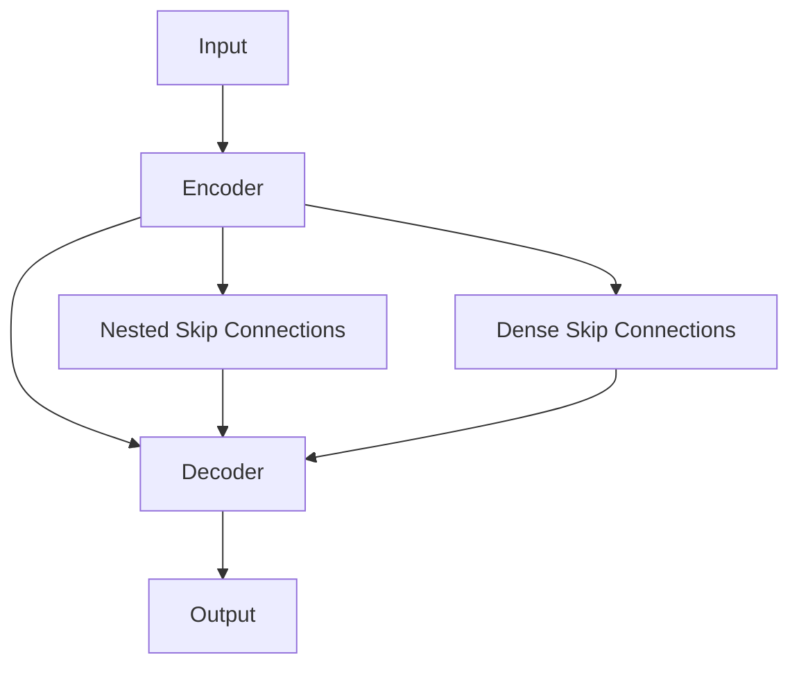

# U-Net++原理与代码实例讲解

关键词：U-Net++, 语义分割, 医学图像分割, 深度学习, 编码器-解码器, 嵌套和密集的跳跃连接

## 1. 背景介绍
### 1.1 问题的由来
语义分割是计算机视觉领域的一个重要任务,尤其在医学图像分析中有着广泛的应用。传统的分割方法往往难以处理医学图像中存在的复杂背景、模糊边界、不规则形状等问题。随着深度学习的发展,基于卷积神经网络的语义分割方法逐渐成为主流。其中,U-Net及其变体以其优异的性能在医学图像分割任务中得到了广泛关注。

### 1.2 研究现状
U-Net是Ronneberger等人在2015年提出的一种用于医学图像分割的全卷积网络。它采用编码器-解码器结构,并引入跳跃连接,使得解码器部分能够充分利用编码器提取的特征信息。U-Net在多个医学图像分割数据集上取得了state-of-the-art的表现。此后,研究者们对U-Net进行了大量改进和扩展,如V-Net、Attention U-Net、U-Net++等。

### 1.3 研究意义
尽管U-Net已经在医学图像分割任务中表现出色,但仍存在一些不足之处。例如,U-Net中编码器和解码器之间的跳跃连接相对简单,未能充分利用不同尺度特征之间的联系。此外,U-Net对不同深度层次的特征融合不够充分。为了进一步提高分割性能,Zhou等人在2018年提出了U-Net++网络。U-Net++通过引入嵌套和密集的跳跃连接,增强了编码器和解码器之间的信息流,同时实现了不同深度层次特征的充分融合。研究U-Net++的原理和实现,对于推动医学图像分割技术的发展具有重要意义。

### 1.4 本文结构
本文将详细介绍U-Net++的原理和代码实现。第2节介绍U-Net++涉及的核心概念。第3节重点阐述U-Net++的网络结构和关键创新点。第4节给出U-Net++的数学模型和公式推导。第5节通过代码实例讲解U-Net++的具体实现。第6节讨论U-Net++的实际应用场景。第7节推荐U-Net++相关的学习资源和开发工具。第8节总结全文并展望U-Net++的未来发展方向。

## 2. 核心概念与联系
U-Net++是在U-Net的基础上发展而来的,因此它与U-Net有许多相似之处,如编码器-解码器结构、跳跃连接等。但U-Net++的核心创新在于引入了嵌套的跳跃连接和密集的跳跃连接。嵌套的跳跃连接增加了编码器和解码器之间的信息流,使得解码器能够访问到编码器所有层次的特征。密集的跳跃连接则实现了同一深度的不同卷积层之间的特征融合。通过嵌套和密集的跳跃连接,U-Net++能够更好地结合局部和全局的上下文信息,从而提高分割精度。

## 3. 核心算法原理 & 具体操作步骤 
### 3.1 算法原理概述
U-Net++的核心是在U-Net的编码器-解码器结构基础上引入嵌套和密集的跳跃连接。具体来说,编码器部分通过重复使用卷积层和下采样操作提取多尺度特征。解码器部分通过上采样操作恢复特征图的空间分辨率。嵌套的跳跃连接将编码器的每一层与解码器的对应层相连,实现了编码器所有深度的特征在解码过程中的融合。密集的跳跃连接则将解码器同一深度的不同上采样层的特征进行拼接,实现了充分的特征复用。最后通过卷积层得到像素级别的分割预测结果。

### 3.2 算法步骤详解
1. 编码器部分:输入图像经过重复的卷积和下采样操作,提取多尺度特征。下采样通常使用最大池化或卷积步长完成。
2. 嵌套跳跃连接:将编码器的每一层输出与解码器的对应层相连,实现编码器各层特征的传递和融合。
3. 解码器部分:对编码器提取的特征进行上采样,恢复空间分辨率。上采样操作通过转置卷积或插值实现。
4. 密集跳跃连接:将解码器同一深度的多个上采样层的特征在通道维度拼接,实现特征的密集连接和复用。 
5. 输出:经过多层解码器得到与输入分辨率相同的特征图,再通过1x1卷积得到像素级别的分割结果。

### 3.3 算法优缺点
优点:
- 通过嵌套和密集跳跃连接,增强了编码器和解码器之间的信息流,有利于提取多尺度上下文特征。
- 充分利用了编码器各个层次的特征,实现了特征的复用和融合,提高了分割精度。
- 参数量和计算量相比U-Net没有明显增加,具有较高的参数效率。

缺点:  
- 网络结构相对复杂,给网络设计和理解带来一定难度。
- 相比U-Net,训练时间有所增加。
- 对于超大尺寸的图像,可能存在显存占用高的问题。

### 3.4 算法应用领域
- 医学图像分割:如肿瘤、器官、组织的分割。
- 卫星遥感图像分割:如土地利用分类、变化检测等。  
- 工业视觉:如瑕疵检测、表面缺陷分割等。
- 自动驾驶:如道路分割、车道线检测等。

## 4. 数学模型和公式 & 详细讲解 & 举例说明
### 4.1 数学模型构建
设输入图像为$\mathbf{X} \in \mathbb{R}^{H \times W \times C}$,其中$H$、$W$、$C$分别表示图像的高度、宽度和通道数。U-Net++的目标是学习一个映射函数$f$,将输入图像映射为像素级别的分割结果$\mathbf{Y} \in \mathbb{R}^{H \times W \times K}$,其中$K$为分割类别数。

U-Net++的编码器部分可以表示为一系列嵌套的特征提取函数:
$$
\begin{aligned}
\mathbf{F}_0 &= \mathbf{X} \\
\mathbf{F}_i &= f_i(\mathbf{F}_{i-1}), i=1,2,\dots,L
\end{aligned}
$$
其中$\mathbf{F}_i$表示第$i$层编码器的输出特征,$L$为编码器的总层数。$f_i$通常由卷积、ReLU激活、下采样等操作组成。

解码器部分可以表示为一系列嵌套的特征恢复函数:
$$
\begin{aligned}
\mathbf{G}_L &= \mathbf{F}_L \\
\mathbf{G}_i &= g_i(\mathbf{G}_{i+1}, \mathbf{F}_i), i=L-1,L-2,\dots,0
\end{aligned}
$$
其中$\mathbf{G}_i$表示第$i$层解码器的输出特征。$g_i$通常由上采样、跳跃连接、卷积、ReLU激活等操作组成。

最终的输出通过解码器的最后一层$\mathbf{G}_0$经过1x1卷积和Softmax激活得到:
$$
\mathbf{Y} = \text{Softmax}(\text{Conv}_{1 \times 1}(\mathbf{G}_0))
$$

U-Net++的损失函数通常选用交叉熵损失:
$$
\mathcal{L} = -\frac{1}{N}\sum_{n=1}^N\sum_{h,w}\sum_{k=1}^K y_{hwk}^{(n)} \log \hat{y}_{hwk}^{(n)}
$$
其中$N$为训练样本数量,$y_{hwk}^{(n)}$为第$n$个样本在位置$(h,w)$处的真实类别标签,$\hat{y}_{hwk}^{(n)}$为模型预测的类别概率。

### 4.2 公式推导过程
以上数学模型的推导过程如下:

1. 编码器部分通过递推公式$\mathbf{F}_i = f_i(\mathbf{F}_{i-1})$逐层提取特征,实现对输入图像的多尺度表示。

2. 解码器部分通过递推公式$\mathbf{G}_i = g_i(\mathbf{G}_{i+1}, \mathbf{F}_i)$逐层恢复空间分辨率,并融合编码器提取的特征。其中$\mathbf{G}_{i+1}$为上一层解码器的输出,$\mathbf{F}_i$为对应编码器层的输出,通过跳跃连接传递给解码器。

3. 解码器的最后一层输出$\mathbf{G}_0$经过1x1卷积和Softmax激活,得到像素级别的分割概率图。1x1卷积用于调整通道数至类别数$K$,Softmax激活用于将特征图归一化为概率分布。

4. 在训练阶段,通过最小化交叉熵损失函数$\mathcal{L}$来优化模型参数。交叉熵损失衡量了模型预测的类别概率分布与真实标签的差异,是分类问题中常用的损失函数。

### 4.3 案例分析与讲解
以医学图像中的肿瘤分割任务为例。假设输入的CT图像尺寸为$512 \times 512$,像素值归一化到$[0,1]$范围内。图像中包含背景、肿瘤两个类别,因此$K=2$。

U-Net++的编码器部分通过5个卷积块提取特征,每个卷积块包含两个3x3卷积层、ReLU激活和2x2最大池化层。经过编码器,特征图尺寸依次减小为$256 \times 256$、$128 \times 128$、$64 \times 64$、$32 \times 32$、$16 \times 16$。

解码器部分通过5个上采样块恢复空间分辨率,每个上采样块包含2x2转置卷积、拼接层和两个3x3卷积层。其中,拼接层将上采样的特征图与编码器对应层的特征图在通道维度拼接。经过解码器,特征图尺寸依次恢复为$32 \times 32$、$64 \times 64$、$128 \times 128$、$256 \times 256$、$512 \times 512$。

最后通过1x1卷积将通道数调整为2,再经过Softmax激活得到每个像素属于背景和肿瘤的概率。将概率大于0.5的像素分为肿瘤,其余像素分为背景,得到最终的分割结果。

在训练过程中,使用交叉熵损失函数和Adam优化器,通过反向传播算法更新模型参数。不断迭代,直到损失函数收敛或达到预设的迭代次数。

### 4.4 常见问题解答
问:U-Net++相比U-Net有哪些改进?
答:U-Net++主要有以下改进:1)引入嵌套的跳跃连接,增强编码器和解码器之间的信息流;2)引入密集的跳跃连接,实现同一深度不同层之间的特征融合;3)解码器部分采用深监督,多尺度分割结果均参与损失计算。

问:U-Net++能否应用于自然图像分割?
答:虽然U-Net++最初是为医学图像分割而设计,但其思想也可以应用于自然图像分割任务。只需要根据任务的特点,调整网络的深度、卷积核大小、训练数据等,U-Net++就可以用于分割自然场景中的物体。

问:U-Net++对输入图像的尺寸有要求吗?
答:理论上U-Net++对输入图像的尺寸没有严格限制,但由于网络结构中存在多次下采样和上采样,输入尺寸最好是下采样倍数的整数倍。此外,图像尺