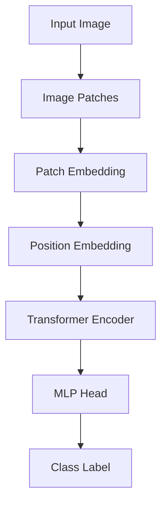

# ViT原理与代码实例讲解

## 1. 背景介绍
### 1.1 问题的由来
近年来，深度学习技术在计算机视觉领域取得了巨大的成功，尤其是卷积神经网络(CNN)在图像分类、目标检测等任务上表现出色。然而，CNN存在一些固有的局限性，如卷积操作只能提取局部特征，难以建模长距离依赖关系等。为了克服这些局限性，研究者开始探索将Transformer这一强大的序列建模工具应用到视觉任务中。

### 1.2 研究现状 
2020年，Google Research发表了题为《An Image is Worth 16x16 Words: Transformers for Image Recognition at Scale》的论文，提出了Vision Transformer(ViT)模型。该模型直接将Transformer应用于图像分类任务，在ImageNet数据集上取得了与当时最先进的CNN模型相媲美的性能。此后，大量研究工作围绕ViT展开，ViT在多个视觉任务上取得了突破性进展。

### 1.3 研究意义
ViT的提出开启了将Transformer应用于视觉任务的新篇章。相比CNN，ViT能够更好地建模图像中的全局信息和长距离依赖关系，具有更强的表示能力。深入研究ViT的原理和实现，有助于我们更好地理解Transformer在视觉领域的应用，推动视觉任务的进一步发展。

### 1.4 本文结构
本文将从以下几个方面对ViT进行详细讲解：
- 第2节介绍ViT的核心概念和模块组成
- 第3节阐述ViT的核心算法原理和具体操作步骤
- 第4节给出ViT涉及的数学模型和公式推导
- 第5节提供ViT的代码实现和详细解释
- 第6节讨论ViT的实际应用场景
- 第7节推荐ViT相关的学习资源和开发工具
- 第8节总结ViT的研究现状和未来发展趋势
- 第9节列举ViT的常见问题与解答

## 2. 核心概念与联系

ViT的核心思想是将图像分割成若干个小块(patch)，然后将这些patch序列输入到Transformer中进行建模。具体来说，ViT主要包含以下几个关键组件：

- Image Patches：将输入图像分割成固定大小的patch，每个patch被压平成一个向量，作为Transformer的输入token。
- Patch Embedding：通过线性映射将patch向量映射到Transformer的输入维度。
- Position Embedding：为每个patch添加位置编码，以引入patch的位置信息。
- Transformer Encoder：由多个Transformer Layer组成，每个Layer包含Multi-Head Self-Attention和MLP两个子层。
- MLP Head：将Transformer的输出通过MLP映射到分类标签的概率分布。

下图给出了ViT的整体架构示意图：

## 3. 核心算法原理 & 具体操作步骤
### 3.1 算法原理概述
ViT的核心算法可以概括为以下几个步骤：
1. 将输入图像分割成固定大小的patch
2. 对每个patch进行线性映射得到patch embedding
3. 为patch embedding添加position embedding 
4. 将patch embedding序列输入Transformer Encoder进行特征提取
5. 将Transformer的输出通过MLP Head映射到分类标签

### 3.2 算法步骤详解

**Step1: Image Patches**

设输入图像的分辨率为(H, W)，patch的大小为(P, P)，则patch的数量为：

$$
N = \frac{HW}{P^2}
$$

将图像按照patch大小进行分割，得到N个patch，每个patch压平成一个P^2*C维的向量，其中C为图像的通道数。

**Step2: Patch Embedding**

对每个patch向量进行线性映射，将其映射到D维的embedding空间：

$$
\mathbf{z}_0 = [\mathbf{x}^1_p\mathbf{E}; \mathbf{x}^2_p\mathbf{E}; ... ; \mathbf{x}^N_p\mathbf{E}]
$$

其中$\mathbf{x}^i_p$为第i个patch向量，$\mathbf{E} \in \mathbb{R}^{(P^2*C) \times D}$为patch embedding矩阵。

**Step3: Position Embedding**

为每个patch embedding添加可学习的position embedding，引入patch的位置信息：

$$
\mathbf{z}_0 \leftarrow \mathbf{z}_0 + \mathbf{E}_{pos}
$$

其中$\mathbf{E}_{pos} \in \mathbb{R}^{(N+1) \times D}$为position embedding矩阵。

**Step4: Transformer Encoder**

将patch embedding序列$\mathbf{z}_0$输入L层的Transformer Encoder进行特征提取：

$$
\mathbf{z}_l' = MSA(LN(\mathbf{z}_{l-1})) + \mathbf{z}_{l-1}, l=1...L
$$
$$
\mathbf{z}_l = MLP(LN(\mathbf{z}_l')) + \mathbf{z}_l', l=1...L
$$

其中$LN$为Layer Normalization，$MSA$为Multi-Head Self-Attention，$MLP$为多层感知机。

**Step5: MLP Head**

将Transformer Encoder的输出$\mathbf{z}^0_L$通过MLP Head映射到分类标签的概率分布：

$$
\mathbf{y} = MLP(\mathbf{z}^0_L)
$$

最后通过Softmax函数得到分类结果：

$$
p(y|\mathbf{x}) = Softmax(\mathbf{y})
$$

### 3.3 算法优缺点

**优点**：
- 能够建模图像中的全局信息和长距离依赖关系
- 具有更强的特征表示能力，性能优于同等规模的CNN
- 计算高度并行，训练速度快

**缺点**：
- 计算复杂度高，推理速度慢
- patch大小和数量的选择需要经验和调参
- 预训练需要大规模数据和算力

### 3.4 算法应用领域
- 图像分类
- 目标检测
- 语义分割
- 行为识别
- 人脸识别
- 医学图像分析
- ...

## 4. 数学模型和公式 & 详细讲解 & 举例说明
### 4.1 数学模型构建
ViT的数学模型可以用以下公式来描述：

给定一张输入图像$\mathbf{x} \in \mathbb{R}^{H \times W \times C}$，将其分割成$N$个大小为$(P, P)$的patch $\mathbf{x}_p^i \in \mathbb{R}^{P^2 \times C}, i=1...N$。

然后对每个patch进行线性映射得到patch embedding：

$$
\mathbf{z}_0 = [\mathbf{x}^1_p\mathbf{E}; \mathbf{x}^2_p\mathbf{E}; ... ; \mathbf{x}^N_p\mathbf{E}] + \mathbf{E}_{pos}
$$

其中$\mathbf{E} \in \mathbb{R}^{(P^2*C) \times D}$为patch embedding矩阵，$\mathbf{E}_{pos} \in \mathbb{R}^{(N+1) \times D}$为position embedding矩阵。

接着将patch embedding序列$\mathbf{z}_0 \in \mathbb{R}^{(N+1) \times D}$输入Transformer Encoder进行特征提取：

$$
\mathbf{z}_l' = MSA(LN(\mathbf{z}_{l-1})) + \mathbf{z}_{l-1}, l=1...L
$$
$$
\mathbf{z}_l = MLP(LN(\mathbf{z}_l')) + \mathbf{z}_l', l=1...L
$$

最后通过MLP Head得到分类结果：

$$
\mathbf{y} = MLP(\mathbf{z}^0_L)
$$
$$
p(y|\mathbf{x}) = Softmax(\mathbf{y})
$$

### 4.2 公式推导过程

**Patch Embedding**

将patch向量$\mathbf{x}_p^i \in \mathbb{R}^{P^2 \times C}$映射到D维的embedding空间：

$$
\mathbf{z}_0^i = \mathbf{x}_p^i\mathbf{E}
$$

其中$\mathbf{E} \in \mathbb{R}^{(P^2*C) \times D}$为可学习的线性映射矩阵。

将所有patch的embedding拼接在一起：

$$
\mathbf{z}_0 = [\mathbf{z}_0^1; \mathbf{z}_0^2; ... ; \mathbf{z}_0^N] \in \mathbb{R}^{N \times D}
$$

再加上可学习的position embedding $\mathbf{E}_{pos} \in \mathbb{R}^{(N+1) \times D}$：

$$
\mathbf{z}_0 \leftarrow \mathbf{z}_0 + \mathbf{E}_{pos}
$$

**Multi-Head Self-Attention**

$$
MSA(Q, K, V) = Concat(head_1, ..., head_h)W^O
$$

其中每个head的计算公式为：

$$
head_i = Attention(QW_i^Q, KW_i^K, VW_i^V)
$$

$$
Attention(Q, K, V) = softmax(\frac{QK^T}{\sqrt{d_k}})V
$$

$W_i^Q \in \mathbb{R}^{D \times d_k}, W_i^K \in \mathbb{R}^{D \times d_k}, W_i^V \in \mathbb{R}^{D \times d_v}$为可学习的投影矩阵，$W^O \in \mathbb{R}^{hd_v \times D}$为输出投影矩阵。

**Layer Normalization**

$$
LN(\mathbf{z}) = \frac{\mathbf{z} - \mu}{\sqrt{\sigma^2 + \epsilon}} * \gamma + \beta
$$

其中$\mu, \sigma^2$分别为$\mathbf{z}$的均值和方差，$\gamma, \beta$为可学习的缩放和偏移参数。

**MLP**

$$
MLP(\mathbf{z}) = GELU({\mathbf{z}}W_1 + b_1)W_2 + b_2
$$

其中$W_1 \in \mathbb{R}^{D \times 4D}, b_1 \in \mathbb{R}^{4D}$，$W_2 \in \mathbb{R}^{4D \times D}, b_2 \in \mathbb{R}^D$为MLP的权重和偏置参数，$GELU$为高斯误差线性单元激活函数。

### 4.3 案例分析与讲解

下面我们以一个具体的例子来说明ViT的计算过程。

假设输入图像的分辨率为(224, 224)，patch大小为(16, 16)，embedding维度为768，Transformer的层数为12，每层的head数为12。

首先将图像分割成14x14=196个patch，每个patch压平成768维的向量。然后对每个patch进行线性映射，得到一个(196, 768)的patch embedding矩阵。再加上(197, 768)的position embedding，得到最终的(197, 768)的输入序列$\mathbf{z}_0$。

接下来$\mathbf{z}_0$经过12层的Transformer Encoder进行特征提取。在每一层中，先通过Layer Normalization对输入进行归一化，然后通过12个head的Multi-Head Self-Attention捕捉序列的内部依赖关系，再经过Layer Normalization和MLP得到该层的输出。

最后，取Transformer最后一层输出序列的第一个token（即class token）通过MLP Head映射到1000个类别的logits，再通过Softmax函数得到最终的分类概率分布。

### 4.4 常见问题解答

**Q: ViT对图像的分辨率有要求吗？**

A: 理论上ViT可以处理任意分辨率的图像，但为了与预训练模型匹配，通常需要将图像resize到预训练时的分辨率，如224x224或384x384。

**Q: ViT可以处理非方形的图像吗？**

A: 可以，只需要在分patch时保证最后一行/列的patch不够时补零即可。

**Q: ViT的patch大小如何选择？**

A: patch大小是ViT的一个重要超参数，会影响模型的性能和计算效率。一般来说，patch越小，模型的特征表示能力越强，但计算量也越大。常见的选择有16x16，32x32等。

**Q: ViT的position embedding是如何编码patch位置信息的？**

A: ViT使用可学习的position embedding矩阵，每一行对应一个patch的位置编码。在训练过程中，position embedding与patch embedding相加，