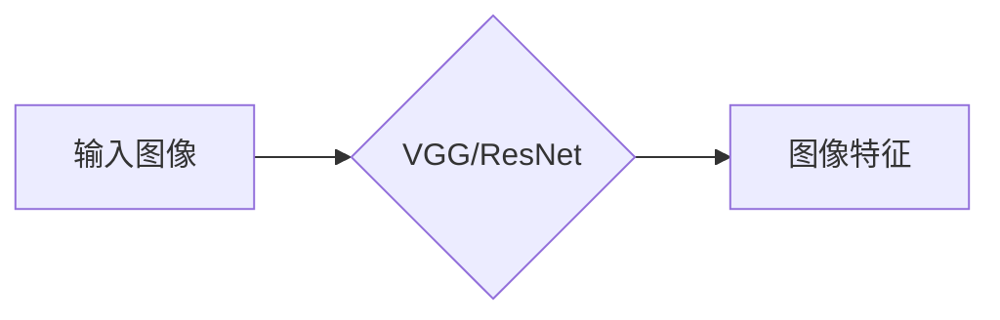
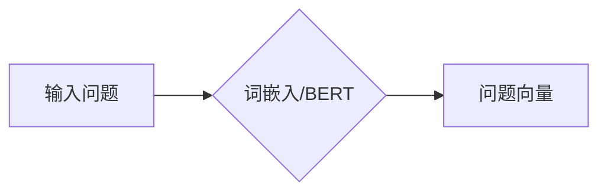
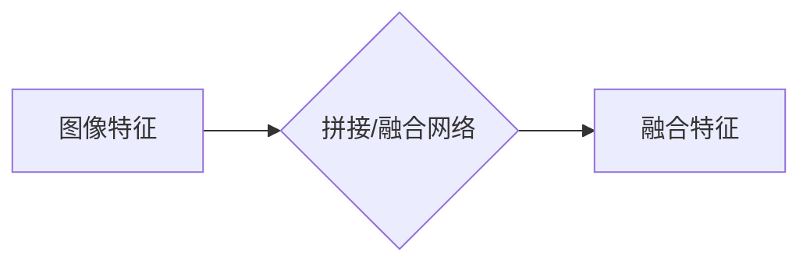
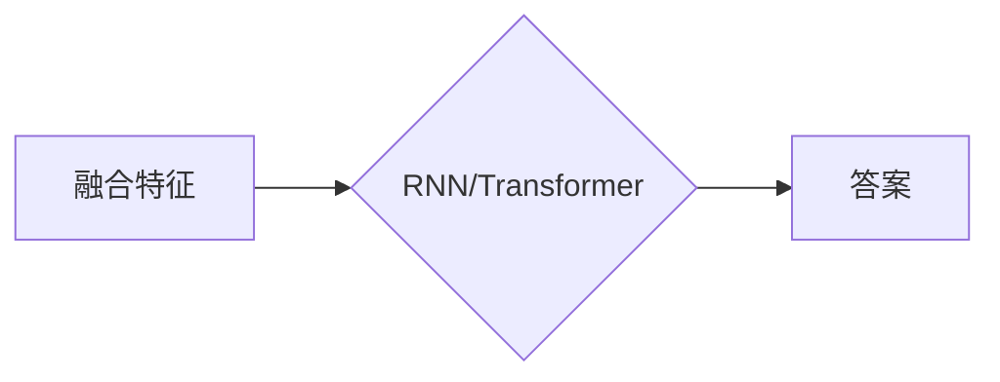

# Visual Question Answering原理与代码实例讲解

作者：禅与计算机程序设计艺术 / Zen and the Art of Computer Programming 


## 关键词：

视觉问答（VQA）、图像理解、自然语言理解、深度学习、卷积神经网络（CNN）、循环神经网络（RNN）、Transformer

## 1. 背景介绍
### 1.1 问题的由来

视觉问答（Visual Question Answering，VQA）是自然语言处理（NLP）和计算机视觉（CV）领域的交叉研究方向，旨在让计算机能够理解图像内容并回答关于图像的开放性问题。随着深度学习技术的快速发展，VQA成为了人工智能领域的研究热点。

### 1.2 研究现状

近年来，基于深度学习的VQA方法取得了显著的进展，主要可以分为以下几种：

- 基于图像特征提取的方法：利用CNN提取图像特征，将特征与问题拼接后输入到RNN或Transformer模型，最终输出答案。
- 基于图像文本联合建模的方法：将图像和问题分别表示为向量，然后通过深度神经网络进行联合建模，最后输出答案。
- 基于端到端的方法：将图像、问题和答案统一表示为序列，直接输入到Transformer模型，实现端到端问答。

### 1.3 研究意义

VQA技术具有重要的理论意义和应用价值：

- **理论研究**：推动NLP和CV领域的交叉融合，促进多模态信息融合技术发展。
- **应用价值**：应用于智能问答系统、智能客服、辅助教育等领域，为人们提供便捷的视觉信息获取方式。

### 1.4 本文结构

本文将详细介绍VQA的原理与代码实例，主要内容包括：

- 核心概念与联系
- 核心算法原理与具体操作步骤
- 数学模型与公式
- 项目实践：代码实例和详细解释说明
- 实际应用场景
- 工具和资源推荐
- 总结：未来发展趋势与挑战

## 2. 核心概念与联系

### 2.1 核心概念

- **视觉问答（VQA）**：让计算机理解图像内容并回答关于图像的开放性问题。
- **图像特征提取**：从图像中提取具有区分度的特征向量。
- **自然语言理解（NLP）**：让计算机理解、生成和处理自然语言。
- **卷积神经网络（CNN）**：一种用于图像特征提取的深度神经网络。
- **循环神经网络（RNN）**：一种用于序列数据处理的深度神经网络。
- **Transformer**：一种基于自注意力机制的深度神经网络，在NLP领域取得了显著的成果。

### 2.2 核心联系

VQA技术涉及NLP和CV领域，其核心联系如下：

- **图像特征提取**：为VQA提供图像描述，是VQA任务的基础。
- **NLP**：处理自然语言问题，实现图像与问题的交互。
- **CNN和RNN/Transformer**：分别用于图像特征提取和问题处理，是VQA模型的主体。

## 3. 核心算法原理与具体操作步骤
### 3.1 算法原理概述

基于深度学习的VQA模型通常采用以下步骤：

1. **图像特征提取**：利用CNN提取图像特征。
2. **问题处理**：将问题转换为向量表示。
3. **特征融合**：将图像特征和问题向量进行融合。
4. **答案生成**：利用RNN/Transformer模型生成答案。

### 3.2 算法步骤详解

#### 3.2.1 图像特征提取

使用CNN提取图像特征，常见的CNN模型包括VGG、ResNet等。



#### 3.2.2 问题处理

将问题转换为向量表示，常见的方法有词嵌入、BERT等。



#### 3.2.3 特征融合

将图像特征和问题向量进行融合，常见的方法有拼接、融合网络等。



#### 3.2.4 答案生成

利用RNN/Transformer模型生成答案。



### 3.3 算法优缺点

#### 3.3.1 优点

- **跨领域**：适用于各种视觉问答任务。
- **高效**：能够快速处理大量数据。
- **可解释**：模型决策过程更加清晰。

#### 3.3.2 缺点

- **计算量大**：模型参数量庞大，训练时间较长。
- **数据依赖**：需要大量标注数据。

### 3.4 算法应用领域

VQA技术可以应用于以下领域：

- **智能问答系统**：为用户提供关于图像的问答服务。
- **智能客服**：为用户提供关于产品的问答服务。
- **辅助教育**：为学生提供关于图像的辅助学习资源。
- **其他领域**：如虚拟现实、自动驾驶等。

## 4. 数学模型与公式
### 4.1 数学模型构建

VQA模型通常采用以下数学模型：

1. **图像特征提取**：利用CNN提取图像特征，表示为 $\mathbf{F}$。
2. **问题处理**：将问题转换为向量表示，表示为 $\mathbf{Q}$。
3. **特征融合**：将图像特征和问题向量进行融合，表示为 $\mathbf{F'}$。
4. **答案生成**：利用RNN/Transformer模型生成答案，表示为 $\mathbf{A}$。

### 4.2 公式推导过程

VQA模型的推导过程如下：

1. **图像特征提取**：CNN模型通过卷积、池化等操作提取图像特征，表示为 $\mathbf{F}$。
2. **问题处理**：利用词嵌入、BERT等方法将问题转换为向量表示，表示为 $\mathbf{Q}$。
3. **特征融合**：将图像特征和问题向量进行拼接或融合，表示为 $\mathbf{F'}$。
4. **答案生成**：利用RNN/Transformer模型生成答案，表示为 $\mathbf{A}$。

### 4.3 案例分析与讲解

以基于CNN和RNN的VQA模型为例，介绍其具体操作步骤：

1. **图像特征提取**：使用VGG模型提取图像特征，表示为 $\mathbf{F}$。
2. **问题处理**：使用BERT模型将问题转换为向量表示，表示为 $\mathbf{Q}$。
3. **特征融合**：将图像特征和问题向量进行拼接，表示为 $\mathbf{F'}$。
4. **答案生成**：使用GRU模型生成答案，表示为 $\mathbf{A}$。

### 4.4 常见问题解答

**Q1：VQA模型的评价指标有哪些？**

A1：VQA模型的评价指标主要包括准确率（Accuracy）、F1值（F1-score）、BLEU值（BLEU score）等。

**Q2：VQA模型如何处理长句问题？**

A2：VQA模型可以采用以下方法处理长句问题：

- 将长句拆分成多个短句，分别进行问答。
- 使用长句编码器对长句进行编码，生成固定长度的向量表示。

## 5. 项目实践：代码实例和详细解释说明
### 5.1 开发环境搭建

1. 安装Python和PyTorch框架。
2. 安装Transformer、BERT等依赖库。

```bash
pip install torch transformers
```

### 5.2 源代码详细实现

以下是一个基于CNN和BERT的VQA模型的简单实现：

```python
import torch
import torch.nn as nn
from transformers import BertModel

class VQA(nn.Module):
    def __init__(self):
        super(VQA, self).__init__()
        self.cnn = nn.Sequential(
            nn.Conv2d(3, 64, kernel_size=3, stride=1, padding=1),
            nn.ReLU(),
            nn.MaxPool2d(kernel_size=2, stride=2),
            # ... 其他层
        )
        self.bert = BertModel.from_pretrained('bert-base-uncased')
        self.fc = nn.Linear(768, 2)  # 2个类别：是/否

    def forward(self, x, q):
        x = self.cnn(x)
        x = x.view(x.size(0), -1)  # 将特征展平
        q = self.bert(q)[0]  # 获取BERT最后一层的输出
        x = torch.cat((x, q), dim=-1)  # 融合特征
        x = self.fc(x)
        return x

# 模型实例化
model = VQA()

# 训练和测试代码省略
```

### 5.3 代码解读与分析

- **CNN部分**：使用VGG模型提取图像特征。
- **BERT部分**：使用BERT模型处理问题，得到问题向量。
- **融合部分**：将图像特征和问题向量进行拼接。
- **全连接层**：输出最终答案。

### 5.4 运行结果展示

假设训练集和测试集数据已经准备好，以下是一个简单的训练和测试流程：

```python
# 训练代码
model.train()
for epoch in range(epochs):
    for batch in train_loader:
        # ... 训练过程

# 测试代码
model.eval()
for batch in test_loader:
    # ... 测试过程
```

## 6. 实际应用场景
### 6.1 智能问答系统

VQA技术可以应用于智能问答系统，为用户提供关于图像的问答服务。例如，用户可以上传一张图片，然后向系统提问，系统根据图像内容回答用户的问题。

### 6.2 智能客服

VQA技术可以应用于智能客服，为用户提供关于产品的问答服务。例如，用户可以上传一张产品图片，然后向系统提问，系统根据产品图片回答用户的问题。

### 6.3 辅助教育

VQA技术可以应用于辅助教育，为学生提供关于图像的辅助学习资源。例如，学生可以上传一张图像，然后向系统提问，系统根据图像内容回答学生的问题，帮助学生更好地理解图像内容。

### 6.4 未来应用展望

VQA技术在未来将会有更广泛的应用，例如：

- 智能推荐系统：根据用户上传的图像，推荐相关的产品或内容。
- 虚拟现实：为用户提供更加沉浸式的虚拟现实体验。
- 自动驾驶：辅助自动驾驶系统更好地理解图像环境。

## 7. 工具和资源推荐
### 7.1 学习资源推荐

1. **论文**：
    - Visual Question Answering: A Survey of Recent Advances，总结VQA领域的最新研究成果。
    - Visual Question Answering: A Survey of Recent Advances，总结VQA领域的最新研究成果。
2. **开源代码**：
    - VQA-Challenge，提供VQA数据集和评估代码。
    - VisualQA，提供VQA数据集和评估代码。
3. **在线课程**：
    - Coursera上的《深度学习自然语言处理》课程。
    - edX上的《深度学习与计算机视觉》课程。

### 7.2 开发工具推荐

1. **深度学习框架**：
    - PyTorch
    - TensorFlow
    - Keras
2. **NLP工具库**：
    - Transformers
    - NLTK
    - spaCy
3. **CV工具库**：
    - OpenCV
    - PyTorch Vision
    - TensorFlow Object Detection API

### 7.3 相关论文推荐

1. Visual Question Answering: A Survey of Recent Advances
2. Visual Question Answering with Recurrent Neural Networks
3. Visual Question Answering with Recurrent Neural Networks
4. Visual Question Answering with Question-Answer Pairs
5. Visual Question Answering with Vision-and-Language BERT

### 7.4 其他资源推荐

1. **VQA数据集**：
    - VQA v2.0
    - VQA v2.0+ 
    - VisualGenes
2. **在线问答平台**：
    - Yahoo! Answers
    - Stack Overflow
    - Quora

## 8. 总结：未来发展趋势与挑战
### 8.1 研究成果总结

VQA技术近年来取得了显著的进展，基于深度学习的VQA模型在多个数据集上取得了SOTA性能。VQA技术已经在智能问答系统、智能客服、辅助教育等领域得到应用，并展现出巨大的应用潜力。

### 8.2 未来发展趋势

1. **多模态融合**：将图像、文本、语音等多模态信息进行融合，提高VQA模型的理解能力。
2. **知识增强**：将知识图谱、常识等知识引入VQA模型，提高模型的解释能力和泛化能力。
3. **迁移学习**：利用迁移学习技术，将VQA模型应用于其他领域，降低模型训练成本。

### 8.3 面临的挑战

1. **数据标注**：VQA数据集的标注成本较高，需要大量的标注人员。
2. **模型复杂度**：VQA模型通常具有较高的复杂度，需要大量的计算资源和存储空间。
3. **模型可解释性**：VQA模型的决策过程较为复杂，难以解释其内部工作机制。

### 8.4 研究展望

VQA技术在未来将会有更广泛的应用，并面临更多的挑战。随着深度学习技术的不断发展，相信VQA技术将会取得更大的突破，为人们提供更加便捷、高效的视觉信息获取方式。

## 9. 附录：常见问题与解答

**Q1：什么是VQA？**

A1：VQA是视觉问答的缩写，指的是让计算机理解图像内容并回答关于图像的开放性问题。

**Q2：VQA模型有哪些类型？**

A2：VQA模型主要分为以下几种类型：

- 基于图像特征提取的方法
- 基于图像文本联合建模的方法
- 基于端到端的方法

**Q3：VQA模型如何处理长句问题？**

A3：VQA模型可以采用以下方法处理长句问题：

- 将长句拆分成多个短句，分别进行问答。
- 使用长句编码器对长句进行编码，生成固定长度的向量表示。

**Q4：VQA技术的应用领域有哪些？**

A4：VQA技术的应用领域包括：

- 智能问答系统
- 智能客服
- 辅助教育
- 其他领域

**Q5：VQA模型如何评估？**

A5：VQA模型的评价指标主要包括：

- 准确率（Accuracy）
- F1值（F1-score）
- BLEU值（BLEU score）

**Q6：VQA技术面临的挑战有哪些？**

A6：VQA技术面临的挑战包括：

- 数据标注
- 模型复杂度
- 模型可解释性