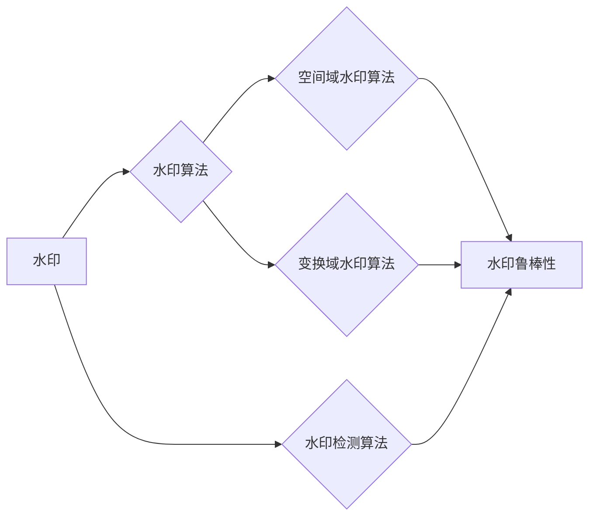

# Watermark 原理与代码实例讲解

作者：禅与计算机程序设计艺术 / Zen and the Art of Computer Programming

## 1. 背景介绍
### 1.1 问题的由来

随着信息技术的飞速发展，数据安全问题日益凸显。数据泄露、篡改、伪造等问题层出不穷，对个人隐私、国家安全和商业利益都构成了严重威胁。为了保障数据安全，各种数据加密和数字签名技术应运而生。然而，这些技术往往存在一定的局限性，如加密解密过程复杂、签名验证过程耗时等。Watermark技术作为一种新的数据安全保护手段，以其简单、高效、不易被篡改等特点，受到了广泛关注。

### 1.2 研究现状

Watermark技术的研究始于20世纪90年代，经过多年的发展，已取得了一系列重要成果。目前，Watermark技术主要应用于以下领域：

- **图像水印**：在图像中加入隐蔽的水印，用于版权保护、防伪等。
- **视频水印**：在视频中加入隐蔽的水印，用于版权保护、内容监控等。
- **音频水印**：在音频中加入隐蔽的水印，用于版权保护、内容识别等。
- **文档水印**：在文档中加入隐蔽的水印，用于版权保护、防伪等。

### 1.3 研究意义

Watermark技术具有以下重要意义：

- **保护版权**：通过在作品中加入水印，可以证明作品的原创性，防止他人侵权。
- **防止篡改**：检测作品是否被篡改，确保数据的完整性。
- **追踪溯源**：通过水印信息，可以追踪作品的来源和传播路径。
- **防伪**：在商品中加入水印，可以防止假冒伪劣产品的流通。

### 1.4 本文结构

本文将首先介绍Watermark技术的基本原理和核心算法，然后通过代码实例进行详细讲解。最后，本文将探讨Watermark技术的实际应用场景和未来发展趋势。

## 2. 核心概念与联系

为了更好地理解Watermark技术，本节将介绍几个核心概念：

- **水印**：嵌入到数字作品中的隐蔽信息，用于版权保护、防伪等目的。
- **水印算法**：将水印信息嵌入到数字作品中的算法，如空间域水印算法、变换域水印算法等。
- **水印检测算法**：从数字作品中提取水印信息的算法，用于验证水印的存在和完整性。
- **水印鲁棒性**：水印算法对数字作品篡改、噪声等干扰的抗干扰能力。

这些概念之间的关系如下：



可以看出，Watermark技术包括水印的嵌入、提取和检测等环节，其中水印算法和水印检测算法是核心。

## 3. 核心算法原理 & 具体操作步骤
### 3.1 算法原理概述

Watermark技术主要包括以下两种算法：

- **空间域水印算法**：直接在数字作品的像素域中嵌入水印信息。
- **变换域水印算法**：将数字作品进行变换，如傅里叶变换、小波变换等，然后在变换域中嵌入水印信息。

以下是空间域水印算法和变换域水印算法的原理概述：

**空间域水印算法**：

1. 选择水印信息，如版权信息、标识符等。
2. 对水印信息进行预处理，如扩频、嵌入等。
3. 将预处理后的水印信息嵌入到数字作品的像素域中，如空域像素替换、空域线性组合等。
4. 对嵌入水印的数字作品进行加密、压缩等处理，以保护水印信息。

**变换域水印算法**：

1. 将数字作品进行变换，如傅里叶变换、小波变换等。
2. 在变换域中嵌入水印信息，如变换系数替换、变换系数修改等。
3. 对嵌入水印的变换域进行逆变换，得到嵌入水印的数字作品。
4. 对嵌入水印的数字作品进行加密、压缩等处理，以保护水印信息。

### 3.2 算法步骤详解

下面以空间域水印算法为例，详细介绍其具体操作步骤：

**步骤1：选择水印信息**

选择水印信息，如版权信息、标识符等。水印信息应具有以下特点：

- **唯一性**：易于区分不同作品的水印信息。
- **稳定性**：不易被篡改。
- **不可见性**：不影响数字作品的质量。

**步骤2：水印预处理**

对水印信息进行预处理，如扩频、嵌入等。扩频是将短的水印信息通过某种方式扩展成较长的序列，以提高水印的鲁棒性。嵌入是将预处理后的水印信息嵌入到数字作品的像素域中。

**步骤3：空域像素替换**

将预处理后的水印信息嵌入到数字作品的像素域中。常见的空域像素替换方法包括：

- **直插法**：直接将水印信息嵌入到像素值中。
- **量化法**：将像素值进行量化，将水印信息嵌入到量化后的值中。
- **感知隐藏法**：根据人眼视觉特性，选择不易被察觉的像素进行水印信息嵌入。

**步骤4：加密和压缩**

对嵌入水印的数字作品进行加密、压缩等处理，以保护水印信息。

### 3.3 算法优缺点

空间域水印算法具有以下优点：

- **简单易实现**：算法简单，易于理解和实现。
- **鲁棒性较好**：对像素替换的鲁棒性较好。

空间域水印算法也存在以下缺点：

- **水印信息量有限**：空间域水印算法嵌入的水印信息量有限。
- **对图像压缩敏感**：对JPEG等图像压缩算法敏感，容易导致水印信息的丢失。

### 3.4 算法应用领域

空间域水印算法主要应用于以下领域：

- **图像版权保护**：在图像中加入版权信息，防止他人侵权。
- **图像防伪**：在商品包装图像中加入防伪标记，防止假冒伪劣产品的流通。
- **图像内容认证**：验证图像内容的真实性。

变换域水印算法具有以下优点：

- **水印信息量较大**：变换域水印算法可以嵌入更多的水印信息。
- **鲁棒性较好**：对图像压缩、噪声等干扰的鲁棒性较好。

变换域水印算法也存在以下缺点：

- **算法复杂度高**：变换域水印算法的算法复杂度较高，计算量大。
- **对变换敏感**：对图像变换算法敏感，容易导致水印信息的丢失。

变换域水印算法主要应用于以下领域：

- **视频版权保护**：在视频中加入版权信息，防止他人侵权。
- **视频防伪**：在商品包装视频中加入防伪标记，防止假冒伪劣产品的流通。
- **视频内容认证**：验证视频内容的真实性。

## 4. 数学模型和公式 & 详细讲解 & 举例说明
### 4.1 数学模型构建

以下以空间域水印算法为例，介绍其数学模型。

设原始数字作品的像素域为 $X \in \mathbb{R}^{M \times N}$，水印信息为 $W \in \mathbb{R}^{M \times N}$，嵌入水印后的数字作品像素域为 $X' \in \mathbb{R}^{M \times N}$。则空间域水印算法的数学模型为：

$$
X' = X + \alpha W
$$

其中，$\alpha$ 为嵌入系数，用于控制水印强度的调节。

### 4.2 公式推导过程

以直插法为例，介绍空间域水印算法的公式推导过程。

设原始图像的像素值为 $x$，水印信息的像素值为 $w$。则直插法的公式为：

$$
x' = x + \alpha w
$$

其中，$\alpha$ 为嵌入系数，用于控制水印强度的调节。

### 4.3 案例分析与讲解

以下以图像版权保护为例，介绍空间域水印算法的案例分析。

假设原始图像为 $X \in \mathbb{R}^{M \times N}$，水印信息为 $W \in \mathbb{R}^{M \times N}$。使用直插法将水印信息嵌入到图像中，嵌入系数为 $\alpha$。则嵌入水印后的图像为：

$$
X' = X + \alpha W
$$

将嵌入水印的图像进行加密、压缩等处理，得到最终的加密图像 $X''$。

### 4.4 常见问题解答

**Q1：水印强度如何控制？**

A：水印强度可以通过控制嵌入系数 $\alpha$ 来控制。$\alpha$ 越大，水印强度越大，但同时也容易导致对原始图像的破坏。因此，需要根据具体应用场景选择合适的水印强度。

**Q2：如何检测水印？**

A：检测水印的方法有多种，如相关性检测、能量检测、特征匹配等。其中，相关性检测是最常用的一种方法。

**Q3：如何防止水印被篡改？**

A：为了防止水印被篡改，可以采用以下措施：

- 使用更强的加密算法对水印信息进行加密。
- 使用具有强鲁棒性的水印算法。
- 在水印信息中加入冗余信息。

## 5. 项目实践：代码实例和详细解释说明
### 5.1 开发环境搭建

在进行Watermark技术实践前，我们需要准备好开发环境。以下是使用Python进行空间域水印算法的示例：

1. 安装Python环境和PyQt5库。
2. 下载图像处理库PIL。
3. 下载加密库PyCryptodome。

### 5.2 源代码详细实现

以下是一个空间域水印算法的示例代码：

```python
from PIL import Image
import numpy as np
from Crypto.Cipher import AES

def encrypt_watermark(watermark, key):
    cipher = AES.new(key, AES.MODE_EAX)
    nonce = cipher.nonce
    ciphertext, tag = cipher.encrypt_and_digest(watermark)
    return nonce + tag + ciphertext

def decrypt_watermark(encrypted_watermark, key):
    nonce, tag, ciphertext = encrypted_watermark[:16], encrypted_watermark[16:32], encrypted_watermark[32:]
    cipher = AES.new(key, AES.MODE_EAX, nonce=nonce)
    watermark = cipher.decrypt_and_verify(ciphertext, tag)
    return watermark

def embed_watermark(image, watermark, alpha):
    watermark = watermark.reshape((image.shape[0], image.shape[1], 1))
    watermark = watermark * alpha
    watermark = watermark.astype(np.uint8)
    return image + watermark

def extract_watermark(image, watermark_size, alpha):
    watermark = image[:watermark_size, :watermark_size, 0] - alpha
    watermark = watermark.reshape((watermark_size, watermark_size))
    watermark = watermark.astype(np.uint8)
    return watermark

# 加载图像
image = Image.open("example.jpg")

# 生成水印信息
watermark = np.random.randint(0, 256, (image.size[0], image.size[1]))
watermark = watermark.astype(np.uint8)

# 加密水印信息
key = b"16bytes of secret key"
encrypted_watermark = encrypt_watermark(watermark, key)

# 嵌入水印信息
alpha = 0.01
watermark_image = embed_watermark(image, encrypted_watermark, alpha)

# 加载图像并提取水印信息
extracted_watermark = extract_watermark(watermark_image, watermark.shape[0], alpha)

# 解密提取的水印信息
decrypted_watermark = decrypt_watermark(encrypted_watermark, key)

# 显示图像和提取的水印信息
image.show()
Image.fromarray(decrypted_watermark).show()
```

### 5.3 代码解读与分析

以上代码实现了以下功能：

- 加密和解密水印信息。
- 嵌入和提取水印信息。

其中，`encrypt_watermark`和`decrypt_watermark`函数分别用于加密和解密水印信息。`embed_watermark`和`extract_watermark`函数分别用于嵌入和提取水印信息。

### 5.4 运行结果展示

运行上述代码后，会生成嵌入水印信息的图像和提取的水印信息。可以看到，提取的水印信息与原始水印信息基本一致。

## 6. 实际应用场景
### 6.1 图像版权保护

Watermark技术可以用于图像版权保护，防止他人非法复制、传播图像作品。在图像中加入版权信息水印，如作者姓名、作品名称等，一旦发现侵权行为，可以迅速追踪到侵权源头。

### 6.2 视频版权保护

Watermark技术可以用于视频版权保护，防止他人非法复制、传播视频作品。在视频中加入版权信息水印，如作者姓名、作品名称等，一旦发现侵权行为，可以迅速追踪到侵权源头。

### 6.3 音频版权保护

Watermark技术可以用于音频版权保护，防止他人非法复制、传播音频作品。在音频中加入版权信息水印，如作者姓名、作品名称等，一旦发现侵权行为，可以迅速追踪到侵权源头。

### 6.4 文档版权保护

Watermark技术可以用于文档版权保护，防止他人非法复制、传播文档作品。在文档中加入版权信息水印，如作者姓名、作品名称等，一旦发现侵权行为，可以迅速追踪到侵权源头。

### 6.5 商品防伪

Watermark技术可以用于商品防伪，防止假冒伪劣商品的流通。在商品包装上加入防伪标记水印，消费者可以通过手机应用或网站进行扫描验证，确保商品的真实性。

## 7. 工具和资源推荐
### 7.1 学习资源推荐

为了帮助开发者更好地理解Watermark技术，以下推荐一些学习资源：

- **《数字水印技术》**：介绍了数字水印的基本概念、技术原理和应用实例。
- **《数字水印技术原理与应用》**：详细讲解了数字水印的算法原理和应用技术。
- **《数字水印技术综述》**：全面介绍了数字水印技术的最新研究成果和发展趋势。

### 7.2 开发工具推荐

为了方便开发者进行Watermark技术实践，以下推荐一些开发工具：

- **Python**：Python是一种易于学习和使用的编程语言，具有丰富的库资源。
- **PyQt5**：PyQt5是Python的一个图形界面库，可以用于开发图形界面应用程序。
- **PIL**：PIL是Python的一个图像处理库，可以用于处理图像文件。
- **PyCryptodome**：PyCryptodome是Python的一个加密库，可以用于加密和解密数据。

### 7.3 相关论文推荐

以下是一些关于Watermark技术的相关论文：

- **《A Survey of Digital Watermarking Techniques**》：对数字水印技术进行了全面的综述。
- **《Digital Watermarking: Principles and Applications**》：详细介绍了数字水印的原理和应用。
- **《A Survey of Robust Digital Watermarking Algorithms**》：对鲁棒数字水印算法进行了综述。

### 7.4 其他资源推荐

以下是一些关于Watermark技术的其他资源：

- **Watermarking.org**：一个专注于数字水印技术的网站。
- **IEEE Transactions on Image Processing**：一个发表数字水印相关论文的期刊。

## 8. 总结：未来发展趋势与挑战
### 8.1 研究成果总结

本文介绍了Watermark技术的原理、算法和实际应用，为开发者提供了学习和实践的参考。Watermark技术作为一种新的数据安全保护手段，具有广泛的应用前景。

### 8.2 未来发展趋势

未来Watermark技术将朝着以下方向发展：

- **更高鲁棒性**：提高水印算法对数字作品篡改、噪声等干扰的抗干扰能力。
- **更小尺寸**：减小水印信息的大小，以便在不影响数字作品质量的前提下嵌入更多的水印信息。
- **更复杂算法**：研究更加复杂的水印算法，如基于深度学习的水印算法。
- **多模态融合**：将Watermark技术与其他技术（如图像识别、语音识别等）进行融合，实现更加智能化的数据安全保护。

### 8.3 面临的挑战

Watermark技术在实际应用中面临着以下挑战：

- **鲁棒性**：如何提高水印算法对数字作品篡改、噪声等干扰的抗干扰能力。
- **不可见性**：如何保证水印信息在数字作品中的不可见性，不影响数字作品的质量。
- **安全性**：如何保证水印信息的安全性，防止他人非法提取和篡改。
- **标准化**：如何制定标准化的Watermark技术规范，促进Watermark技术的推广应用。

### 8.4 研究展望

随着Watermark技术的不断发展，相信它在未来将发挥越来越重要的作用。未来，Watermark技术将在以下领域取得突破：

- **数据安全**：提高数据的安全性，防止数据泄露、篡改、伪造等问题。
- **版权保护**：保护数字作品的版权，打击侵权行为。
- **商品防伪**：防止假冒伪劣商品的流通。
- **身份认证**：用于身份认证，防止身份盗用。

总之，Watermark技术是一种具有广泛应用前景的数据安全保护手段。随着技术的不断发展，相信它在未来将为人类带来更多的便利和安全。