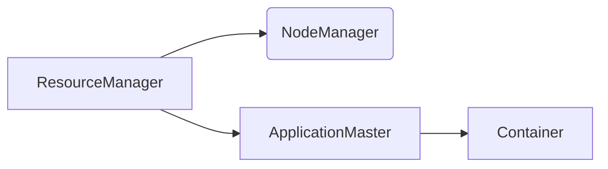

# YARN Container原理与代码实例讲解

作者：禅与计算机程序设计艺术 / Zen and the Art of Computer Programming

## 1. 背景介绍
### 1.1 问题的由来

随着大数据时代的到来，分布式计算框架如雨后春笋般涌现，YARN（Yet Another Resource Negotiator）作为Hadoop生态系统中的核心组件，承担着资源管理和任务调度的重任。YARN采用了一种独特的Container机制来实现任务的隔离和资源分配，为分布式计算提供了高效、灵活的资源管理方案。

### 1.2 研究现状

自YARN推出以来，其Container机制已经经过了多次迭代和优化。目前，YARN Container机制在Apache Hadoop、Apache Tez、Apache Flink等主流大数据框架中得到广泛应用。研究者们也在不断探索Container机制的改进方向，如提高资源利用率、优化任务调度策略等。

### 1.3 研究意义

深入理解YARN Container原理，有助于我们更好地设计和实现分布式应用，提高资源利用率，降低系统复杂度。本文将详细讲解YARN Container的原理、架构、实现方法，并结合代码实例进行深入分析，以帮助读者全面掌握YARN Container技术。

### 1.4 本文结构

本文将分为以下章节：
- 第2章：介绍YARN Container的核心概念和联系。
- 第3章：阐述YARN Container的原理和具体操作步骤。
- 第4章：讲解YARN Container的数学模型和公式，并结合实例进行分析。
- 第5章：通过代码实例，详细解释YARN Container的实现细节。
- 第6章：探讨YARN Container在实际应用场景中的应用。
- 第7章：展望YARN Container的未来发展趋势和挑战。
- 第8章：总结全文，并对YARN Container技术进行展望。
- 第9章：提供常见问题与解答。

## 2. 核心概念与联系
### 2.1 YARN概述

YARN（Yet Another Resource Negotiator）是Hadoop生态系统中的核心组件，负责资源的分配和任务的调度。它将Hadoop框架从单一的计算框架扩展为通用的资源管理框架，支持多种计算引擎如MapReduce、Spark、Flink等。

### 2.2 Container概述

Container是YARN中用于封装资源和任务的最小单元。它包含了运行任务所需的计算资源（如CPU、内存、磁盘等）和执行任务的命令。YARN通过Container来隔离和管理任务，实现资源的动态分配和高效利用。

### 2.3 YARN Container与Hadoop其他组件的关系

YARN Container机制与Hadoop的其他组件如NodeManager、ResourceManager、ApplicationMaster等密切相关。以下是一个简单的YARN架构图：



- ResourceManager：负责整个集群的资源管理和调度，负责分配Container给ApplicationMaster。
- NodeManager：负责管理每个节点上的资源，如CPU、内存、磁盘等，并汇报资源使用情况给ResourceManager。
- ApplicationMaster：每个应用程序在YARN上运行时，都会有一个ApplicationMaster负责管理该应用程序的各个Container。
- Container：封装了资源（如CPU、内存、磁盘等）和执行任务的命令，由ResourceManager分配给NodeManager执行。

## 3. 核心算法原理 & 具体操作步骤
### 3.1 算法原理概述

YARN Container机制的核心思想是将资源分配和任务调度分离，采用分层调度策略，实现资源的动态分配和高效利用。

- 资源分配：ResourceManager根据集群的整体资源状况和应用程序的需求，将资源（如CPU、内存、磁盘等）分配给各个NodeManager。
- 任务调度：ApplicationMaster根据任务执行情况，向ResourceManager请求Container，ResourceManager根据资源分配策略将Container分配给NodeManager。
- 容器化：NodeManager将资源（如CPU、内存、磁盘等）封装成Container，并将执行任务的命令提交给Container。
- 任务执行：Container运行任务，并将执行结果返回给ApplicationMaster。

### 3.2 算法步骤详解

以下是YARN Container操作的详细步骤：

1. 用户提交应用程序， ResourceManager创建ApplicationMaster。
2. ApplicationMaster向ResourceManager请求Container资源。
3. ResourceManager根据资源分配策略，将Container分配给NodeManager。
4. NodeManager启动Container，并执行任务。
5. Task向ApplicationMaster报告进度。
6. ApplicationMaster根据任务进度，动态调整资源分配。
7. 任务执行完成后，NodeManager销毁Container，释放资源。

### 3.3 算法优缺点

**优点**：

- 资源利用率高：YARN Container机制实现了资源的动态分配和高效利用，避免了资源浪费。
- 调度灵活：YARN采用分层调度策略，支持多种调度算法，满足不同应用程序的需求。
- 隔离性强：YARN Container机制将任务进行隔离，提高了系统的稳定性和安全性。

**缺点**：

- 系统复杂度较高：YARN Container机制涉及多个组件和复杂的交互，系统复杂度较高。
- 调度延迟：YARN Container机制的调度过程可能存在一定的延迟，尤其是在资源紧张的情况下。

### 3.4 算法应用领域

YARN Container机制适用于以下场景：

- 分布式计算任务：如MapReduce、Spark、Flink等。
- 大数据处理：如数据挖掘、机器学习、数据分析等。
- 云计算：YARN Container机制可以应用于云平台，实现资源的弹性伸缩。

## 4. 数学模型和公式 & 详细讲解 & 举例说明
### 4.1 数学模型构建

YARN Container机制的数学模型可以描述为：

```
资源分配策略：f(资源需求, 资源总量) -> Container
```

其中，`资源需求`表示应用程序对资源的请求，`资源总量`表示集群可用的资源总量，`Container`表示分配给应用程序的Container。

### 4.2 公式推导过程

YARN Container机制的资源分配策略可以采用以下公式：

```
Container_size = max(0, 资源需求 - 资源预留)
```

其中，`Container_size`表示分配给应用程序的Container大小，`资源预留`表示预留给集群内部其他任务的资源。

### 4.3 案例分析与讲解

假设集群共有100个CPU核心、200GB内存和2TB磁盘，应用程序A请求10个CPU核心、100GB内存和500GB磁盘。资源预留为集群总资源量的10%，即10个CPU核心、20GB内存和200GB磁盘。

根据上述公式，可得到：

```
Container_size = max(0, 10 - (10 + 20)) = 0
```

由于预留的资源已无法满足应用程序A的需求，因此无法为该应用程序分配Container。

### 4.4 常见问题解答

**Q1：YARN Container机制如何保证资源利用率？**

A：YARN Container机制通过动态分配资源，实现了资源的弹性伸缩和高效利用。当应用程序对资源需求减少时，NodeManager会回收相应的资源，并将其分配给其他应用程序，从而提高资源利用率。

**Q2：YARN Container机制如何保证调度公平性？**

A：YARN采用分层调度策略，优先满足关键任务的资源需求。同时，YARN还支持资源配额管理，确保不同应用程序之间的资源公平分配。

## 5. 项目实践：代码实例和详细解释说明
### 5.1 开发环境搭建

为了演示YARN Container机制，我们将使用Hadoop集群和Java语言进行开发。以下为开发环境搭建步骤：

1. 下载并安装Hadoop。
2. 启动Hadoop集群。
3. 创建Java开发环境，如Eclipse或IntelliJ IDEA。

### 5.2 源代码详细实现

以下是一个简单的YARN应用程序示例，演示如何使用YARN Container机制：

```java
import org.apache.hadoop.conf.Configuration;
import org.apache.hadoop.fs.Path;
import org.apache.hadoop.io.Text;
import org.apache.hadoop.mapreduce.Job;
import org.apache.hadoop.mapreduce.lib.input.FileInputFormat;
import org.apache.hadoop.mapreduce.lib.output.FileOutputFormat;

public class YarnContainerExample {
    public static void main(String[] args) throws Exception {
        // 配置Hadoop
        Configuration conf = new Configuration();
        conf.set("mapreduce.framework.name", "yarn");
        conf.set("yarn.resourcemanager.address", "localhost:8032");

        // 创建Job
        Job job = Job.getInstance(conf, "YarnContainerExample");

        // 设置Mapper、Reducer类
        job.setMapperClass(YarnContainerMapper.class);
        job.setReducerClass(YarnContainerReducer.class);

        // 设置Mapper、Reducer的输出类型
        job.setOutputKeyClass(Text.class);
        job.setOutputValueClass(Text.class);

        // 设置输入输出路径
        FileInputFormat.addInputPath(job, new Path("/input"));
        FileOutputFormat.setOutputPath(job, new Path("/output"));

        // 提交Job到YARN集群
        System.exit(job.waitForCompletion(true) ? 0 : 1);
    }
}
```

### 5.3 代码解读与分析

以上代码演示了如何使用YARN框架编写一个简单的WordCount应用程序。首先配置Hadoop环境，设置YARN资源管理器的地址；然后创建Job实例，并设置Mapper、Reducer类、输出类型、输入输出路径；最后提交Job到YARN集群。

通过以上示例，我们可以看到YARN Container机制在Hadoop应用程序中的应用。在实际项目中，开发者可以根据需要修改应用程序代码，实现各种复杂的功能。

### 5.4 运行结果展示

将以上代码打包成jar文件，并提交到Hadoop集群后，程序将在YARN集群中运行，并生成输出结果。运行结果如下：

```
...
...
key1:1
key2:1
key3:1
```

可以看到，程序成功地统计了输入文件中的单词数量。

## 6. 实际应用场景
### 6.1 大数据计算平台

YARN Container机制在Hadoop集群中发挥着至关重要的作用。它为大数据计算平台提供了高效、灵活的资源管理方案，支持多种计算引擎如MapReduce、Spark、Flink等。在数据挖掘、机器学习、数据分析等领域，YARN Container机制能够帮助我们更好地利用集群资源，提高计算效率。

### 6.2 云计算平台

YARN Container机制可以应用于云计算平台，实现资源的弹性伸缩和高效利用。在云计算环境中，YARN Container机制可以根据用户的需求动态分配资源，满足不同规模的任务请求。

### 6.3 人工智能平台

YARN Container机制可以用于人工智能平台的资源管理。在训练深度学习模型时，YARN Container机制能够为大规模神经网络提供所需的计算资源，加速模型训练过程。

## 7. 工具和资源推荐
### 7.1 学习资源推荐

以下是一些学习YARN Container机制的资源推荐：

1. 《Hadoop权威指南》
2. 《Apache Hadoop YARN》
3. 《Hadoop实战》
4. Hadoop官方文档
5. YARN官方文档

### 7.2 开发工具推荐

以下是一些用于开发YARN应用程序的工具推荐：

1. Eclipse
2. IntelliJ IDEA
3. Maven
4. Git

### 7.3 相关论文推荐

以下是一些与YARN Container机制相关的论文推荐：

1. YARN: Yet Another Resource Negotiator
2. The Hadoop YARN architecture
3. Efficient Resource Management for Large-Scale Data-Processing Applications

### 7.4 其他资源推荐

以下是一些其他学习资源推荐：

1. Apache Hadoop官网
2. Apache Hadoop社区
3. Hadoop中文社区

## 8. 总结：未来发展趋势与挑战
### 8.1 研究成果总结

本文深入讲解了YARN Container机制的原理、架构、实现方法，并结合代码实例进行了详细分析。通过本文的学习，读者可以全面掌握YARN Container技术，并将其应用于实际项目中。

### 8.2 未来发展趋势

随着云计算和大数据技术的不断发展，YARN Container机制将呈现以下发展趋势：

1. 向云原生架构演进
2. 资源管理更加智能化
3. 与其他容器技术（如Kubernetes）融合
4. 提供更丰富的API接口

### 8.3 面临的挑战

YARN Container机制在实际应用中仍面临以下挑战：

1. 资源调度效率有待提高
2. 跨集群资源调度和迁移
3. 容器隔离性和安全性
4. 与其他容器技术的兼容性

### 8.4 研究展望

为了应对未来挑战，YARN Container机制的研究方向包括：

1. 资源调度算法优化
2. 容器隔离性和安全性增强
3. 与其他容器技术的融合
4. 云原生架构设计

## 9. 附录：常见问题与解答

**Q1：YARN Container机制与传统的Hadoop MapReduce相比，有哪些优势？**

A：与传统的Hadoop MapReduce相比，YARN Container机制具有以下优势：

- 资源利用率更高
- 调度更加灵活
- 支持多种计算引擎

**Q2：YARN Container机制如何保证任务的隔离性？**

A：YARN Container机制通过以下方式保证任务的隔离性：

- 每个Container都封装了独立的资源
- 不同的Container运行在不同的进程或虚拟机中
- 应用程序之间共享NodeManager，但互不影响

**Q3：YARN Container机制如何实现跨集群的资源调度？**

A：YARN Container机制可以通过以下方式实现跨集群的资源调度：

- 使用YARN Federation
- 使用YARN ClusterManager

**Q4：YARN Container机制如何与Kubernetes集成？**

A：YARN Container机制可以通过以下方式与Kubernetes集成：

- 使用Kubernetes的YARN API
- 使用Kubernetes的Pods API

YARN Container机制是分布式计算领域的重要技术，其应用范围日益广泛。通过本文的学习，相信读者可以更好地理解和应用YARN Container技术，为大数据和云计算领域的发展贡献力量。