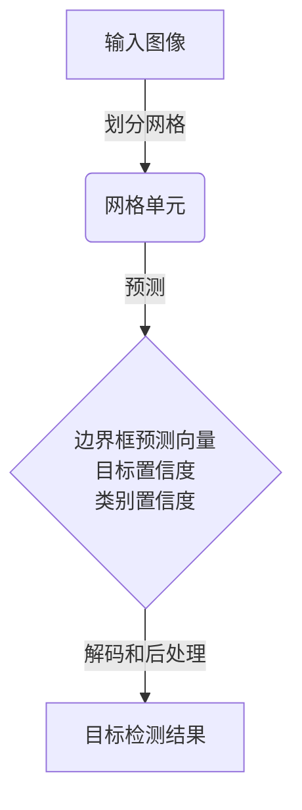

# YOLOv5实例九：安全监控任务

## 1. 背景介绍

### 1.1 问题的由来

在当今社会中,安全监控系统已经成为保障公共安全和维护社会秩序的重要手段。传统的视频监控系统主要依赖人工观察和分析,这种方式不仅效率低下,而且容易出现疏漏。随着计算机视觉和深度学习技术的快速发展,基于人工智能的智能视频分析系统逐渐成为安全监控领域的新趋势。

### 1.2 研究现状

目前,基于深度学习的目标检测算法在安全监控领域得到了广泛应用。其中,YOLO(You Only Look Once)系列算法因其高效、准确的特点而备受关注。YOLOv5作为YOLO系列的最新版本,不仅在精度和速度方面有了显著提升,而且具有更好的通用性和可扩展性。

### 1.3 研究意义

安全监控任务对目标检测算法提出了更高的要求,不仅需要准确检测各种目标,还需要实时处理视频流并快速响应。YOLOv5在这一领域具有广阔的应用前景,能够有效提高监控系统的智能化水平,提升公共安全和社会治安管理能力。

### 1.4 本文结构

本文将全面介绍YOLOv5在安全监控任务中的应用。首先阐述YOLOv5的核心概念和算法原理,然后详细讲解数学模型和公式推导过程,并通过实际案例进行说明。接下来,将介绍基于YOLOv5的安全监控系统的开发实践,包括环境搭建、代码实现和运行结果展示。最后,探讨YOLOv5在安全监控领域的实际应用场景,并对未来的发展趋势和挑战进行展望。

## 2. 核心概念与联系

YOLOv5是一种基于深度学习的单阶段目标检测算法,它将目标检测任务视为一个回归问题,直接从输入图像预测目标的边界框和类别。与传统的两阶段目标检测算法相比,YOLOv5具有更高的计算效率和更好的实时性能。

YOLOv5的核心思想是将输入图像划分为多个网格单元(grid cell),每个单元负责预测该区域内的目标。具体来说,每个单元会输出以下几个向量:

1. **边界框预测向量(bounding box prediction vector)**: 包含目标边界框的坐标和宽高信息。
2. **目标置信度(object confidence)**: 表示该单元内是否存在目标的置信度分数。
3. **类别置信度(class confidence)**: 表示该目标属于各个类别的置信度分数。

通过对这些向量的解码和后处理,YOLOv5可以获得最终的目标检测结果。

YOLOv5的核心网络架构采用CSPDarknet53作为主干网络,并引入了一系列优化策略,如焦点结构(Focus)、路径聚合网络(PANet)和空间金字塔池化(SPP)等,从而提高了模型的精度和鲁棒性。



## 3. 核心算法原理 & 具体操作步骤

### 3.1 算法原理概述

YOLOv5算法的核心原理可以概括为以下几个关键步骤:

1. **图像预处理**: 将输入图像缩放到网络输入尺寸,并进行归一化处理。
2. **特征提取**: 通过主干网络(如CSPDarknet53)提取图像的特征图。
3. **预测头(Prediction Head)**: 在不同尺度的特征图上应用预测头,生成网格单元的预测向量。
4. **解码和非极大值抑制(NMS)**: 将预测向量解码为边界框和类别置信度,并通过NMS去除重叠的冗余检测框。
5. **后处理**: 根据置信度阈值和类别阈值过滤检测结果,得到最终的目标检测输出。

### 3.2 算法步骤详解

1. **图像预处理**

   - 将输入图像缩放到指定尺寸(如640x640),以满足网络输入要求。
   - 对图像像素值进行归一化处理,通常将像素值缩放到[0, 1]范围。

2. **特征提取**

   - 将预处理后的图像输入到主干网络(如CSPDarknet53)中。
   - 主干网络由一系列卷积层和残差块组成,用于提取图像的特征表示。
   - 在不同深度的网络层,输出多尺度的特征图,用于后续的目标检测。

3. **预测头(Prediction Head)**

   - 在每个尺度的特征图上应用预测头,生成相应尺度的预测向量。
   - 预测向量包括边界框预测、目标置信度和类别置信度。
   - 预测头通常由几个卷积层和一个最终的预测层组成。

4. **解码和非极大值抑制(NMS)**

   - 将预测向量解码为边界框坐标和类别置信度。
   - 对解码后的边界框应用非极大值抑制(NMS)算法,去除重叠的冗余检测框。
   - NMS根据置信度分数保留最高分的检测框,抑制与之重叠的其他检测框。

5. **后处理**

   - 根据预设的置信度阈值和类别阈值,过滤检测结果。
   - 只保留置信度和类别置信度高于阈值的检测框。
   - 得到最终的目标检测输出,包括边界框坐标、类别标签和置信度分数。

### 3.3 算法优缺点

**优点**:

- 单阶段检测,计算效率高,适合实时应用场景。
- 端到端训练,简单高效,易于优化和部署。
- 通过引入各种优化策略,如焦点结构、PANet和SPP等,提高了模型精度和鲁棒性。

**缺点**:

- 对小目标的检测精度相对较低。
- 在密集场景下,存在一定的检测漏失和误检问题。
- 需要大量的训练数据和计算资源来获得良好的性能。

### 3.4 算法应用领域

YOLOv5算法由于其高效、准确的特点,在以下领域具有广泛的应用前景:

- 安全监控: 用于监控公共场所、交通道路等,实时检测各种安全风险目标。
- 智能交通: 用于车辆检测、行人检测、交通标志识别等智能交通系统。
- 机器人视觉: 用于机器人的目标识别和导航,提高机器人的自主能力。
- 无人机/无人车: 用于无人机/无人车的障碍物检测和避障,确保安全运行。
- 工业视觉: 用于产品缺陷检测、物体分拣等工业自动化应用。

## 4. 数学模型和公式 & 详细讲解 & 举例说明

### 4.1 数学模型构建

YOLOv5算法的核心数学模型是基于回归的目标检测框架。假设输入图像被划分为$S \times S$个网格单元,每个单元预测$B$个边界框,并为每个边界框预测一个目标置信度和$C$个类别置信度(其中$C$是目标类别数)。

因此,对于每个网格单元,预测向量的维度为:

$$
\vec{y} = (B \times (5 + C))
$$

其中,5表示每个边界框需要预测的参数数量,包括4个坐标值($t_x, t_y, t_w, t_h$)和1个目标置信度($p_o$)。

边界框的坐标值是相对于网格单元的偏移量,通过以下公式计算:

$$
\begin{aligned}
b_x &= \sigma(t_x) + c_x \\
b_y &= \sigma(t_y) + c_y \\
b_w &= p_w e^{t_w} \\
b_h &= p_h e^{t_h}
\end{aligned}
$$

其中,$\sigma$是sigmoid函数,$(c_x, c_y)$是网格单元的左上角坐标,$(p_w, p_h)$是先验框(anchor box)的宽高。

目标置信度$p_o$表示该边界框内是否包含目标的置信度分数,计算公式如下:

$$
p_o = p_o^{truth} \times IoU_{pred}^{truth}
$$

其中,$p_o^{truth}$是该边界框包含目标的真实置信度(通常设为1),$IoU_{pred}^{truth}$是预测边界框与真实边界框的交并比(IoU)。

类别置信度$p_c$表示该边界框内目标属于特定类别$c$的置信度分数,计算公式如下:

$$
p_c = p_o \times p_c^{truth}
$$

其中,$p_c^{truth}$是该边界框内目标属于类别$c$的真实置信度(通常设为1或0)。

在训练过程中,YOLOv5算法的损失函数包括三个部分:边界框回归损失、目标置信度损失和类别置信度损失。通过最小化这些损失函数,可以优化网络参数,提高目标检测的精度。

### 4.2 公式推导过程

下面将详细推导YOLOv5算法中边界框回归损失的计算公式。

假设真实边界框的坐标为$(x, y, w, h)$,预测边界框的坐标为$(\hat{x}, \hat{y}, \hat{w}, \hat{h})$,网格单元的左上角坐标为$(c_x, c_y)$,先验框的宽高为$(p_w, p_h)$。

首先,我们需要将真实边界框和预测边界框的坐标值映射到相对于网格单元和先验框的偏移量:

$$
\begin{aligned}
t_x &= (x - c_x) / p_w \\
t_y &= (y - c_y) / p_h \\
t_w &= \log(w / p_w) \\
t_h &= \log(h / p_h)
\end{aligned}
$$

$$
\begin{aligned}
\hat{t}_x &= \sigma(\hat{x}) \\
\hat{t}_y &= \sigma(\hat{y}) \\
\hat{t}_w &= \hat{w} \\
\hat{t}_h &= \hat{h}
\end{aligned}
$$

其中,$\sigma$是sigmoid函数,用于将$\hat{x}$和$\hat{y}$的值约束在[0, 1]范围内。

然后,我们可以计算真实值和预测值之间的均方差:

$$
\begin{aligned}
\text{loss}_x &= (\hat{t}_x - t_x)^2 \\
\text{loss}_y &= (\hat{t}_y - t_y)^2 \\
\text{loss}_w &= (\hat{t}_w - t_w)^2 \\
\text{loss}_h &= (\hat{t}_h - t_h)^2
\end{aligned}
$$

最后,将这四个损失项加权求和,得到边界框回归损失:

$$
\text{loss}_{bbox} = \lambda_\text{coord} \sum_{i=0}^{B} \mathbb{1}_i^{obj} \left[ \text{loss}_x + \text{loss}_y + \text{loss}_w + \text{loss}_h \right]
$$

其中,$\lambda_\text{coord}$是边界框回归损失的权重系数,$\mathbb{1}_i^{obj}$是一个指示函数,用于确定第$i$个边界框是否包含目标($\mathbb{1}_i^{obj}=1$表示包含目标,否则为0),从而只对包含目标的边界框计算回归损失。

通过最小化这个损失函数,可以使预测边界框的坐标值逐渐接近真实边界框的坐标值,提高目标检测的精度。

### 4.3 案例分析与讲解

为了更好地理解YOLOv5算法的工作原理,我们将通过一个具体案例进行分析和讲解。

假设输入图像的大小为640x640像素,被划分为8x8的网格单元。每个网格单元预测3个边界框,目标类别数为20。因此,每个网格单元的预测向量维度为:

$$
\vec{y} = (3 \times (5 + 20)) = 75
$$

现在,我们关注其中一个网格单元(如图所示),该单元内包含一个行人目标。

```mermai