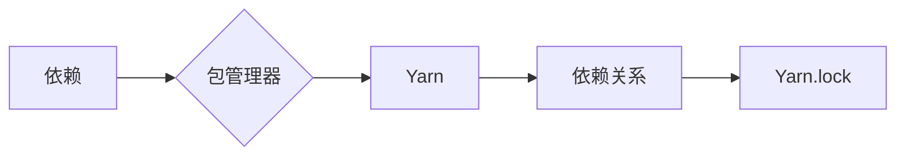

# Yarn的工作流程与依赖关系

作者：禅与计算机程序设计艺术 / Zen and the Art of Computer Programming

## 1. 背景介绍

### 1.1 问题的由来

随着现代软件项目的复杂性不断增加，依赖管理成为了软件开发中的一个关键环节。合理地管理项目依赖关系，可以保证项目的可维护性、可扩展性，提高开发效率。在众多依赖管理工具中，Yarn以其简洁、高效、安全等特点，成为了目前最受欢迎的依赖管理工具之一。

### 1.2 研究现状

Yarn是由Facebook开发的一款高性能的依赖管理工具，旨在解决npm在依赖安装过程中存在的一些问题，如安装速度慢、不稳定性、版本冲突等。自2016年发布以来，Yarn迅速获得了社区认可，成为了众多前端、后端项目的首选依赖管理工具。

### 1.3 研究意义

Yarn的工作流程和依赖关系对于项目开发具有重要意义：

- **提高依赖管理效率**：Yarn使用增量安装和缓存机制，大大提高了依赖安装速度，减少了网络开销。
- **确保依赖一致性**：Yarn保证了不同环境之间的依赖版本一致性，避免了环境差异导致的bug。
- **简化依赖关系管理**：Yarn提供清晰的依赖关系可视化，方便开发者理解项目依赖结构。
- **增强安全性**：Yarn支持安全审计，防止恶意代码的传播。

### 1.4 本文结构

本文将围绕Yarn的工作流程和依赖关系展开，内容安排如下：

- 第2部分，介绍Yarn的核心概念和相关术语。
- 第3部分，详细阐述Yarn的工作流程，包括初始化、安装、更新、打包等环节。
- 第4部分，深入分析Yarn的依赖关系管理机制，包括依赖锁定、版本控制、冲突解决等。
- 第5部分，给出Yarn的代码实现示例，并对关键代码进行解读。
- 第6部分，探讨Yarn在实际项目中的应用场景及案例。
- 第7部分，推荐Yarn相关的学习资源、开发工具和参考文献。
- 第8部分，总结全文，展望Yarn技术的未来发展趋势与挑战。

## 2. 核心概念与联系

为了更好地理解Yarn的工作流程和依赖关系，本节将介绍几个核心概念和相关术语：

- **依赖**：指项目中使用的其他模块或库，通常以npm包的形式存在。
- **依赖关系**：指项目中模块或库之间的依赖关系，包括直接依赖和间接依赖。
- **包管理器**：指用于管理和安装依赖的工具，如npm、yarn、pip等。
- **Yarn.lock**：Yarn生成的锁定文件，记录了项目依赖的精确版本信息，确保不同环境之间的依赖一致性。
- **工作区（Workspaces）**：Yarn的一个特性，允许在一个项目中管理多个包，简化了模块化和组件化开发。
- **缓存**：Yarn使用缓存机制存储下载的依赖包，提高安装速度。

这些概念之间的关系可以用以下Mermaid流程图表示：



Yarn通过包管理器管理项目依赖，依赖关系最终体现在Yarn.lock文件中。

## 3. 核心算法原理 & 具体操作步骤

### 3.1 算法原理概述

Yarn的工作流程主要包括以下步骤：

1. **初始化**：创建一个新的Yarn.lock文件，记录项目依赖的精确版本信息。
2. **安装**：根据Yarn.lock文件中的依赖信息，下载和安装项目依赖。
3. **更新**：根据package.json文件中的依赖版本信息，更新Yarn.lock文件中的依赖版本。
4. **打包**：将项目依赖打包到dist目录，方便构建和部署。

### 3.2 算法步骤详解

#### 3.2.1 初始化

当使用Yarn初始化一个新的项目时，会执行以下步骤：

1. 在项目根目录下创建一个.yarnrc.yml配置文件，配置Yarn的缓存目录、工作区等参数。
2. 创建一个yarn.lock文件，记录项目依赖的精确版本信息。

```bash
yarn init
```

#### 3.2.2 安装

根据package.json文件中的依赖信息，Yarn会执行以下步骤：

1. 解析package.json文件，获取项目依赖信息。
2. 根据依赖信息生成依赖树，确定需要安装的依赖包。
3. 下载依赖包，并存储到缓存目录。
4. 将下载的依赖包安装到项目目录中。

```bash
yarn install
```

#### 3.2.3 更新

当更新package.json文件中的依赖版本时，Yarn会执行以下步骤：

1. 解析package.json文件，获取项目依赖信息。
2. 根据依赖信息生成依赖树，确定需要更新的依赖包。
3. 更新Yarn.lock文件中的依赖版本信息。
4. 下载更新后的依赖包，并安装到项目目录中。

```bash
yarn upgrade [package-name]
```

#### 3.2.4 打包

将项目依赖打包到dist目录，方便构建和部署。

```bash
yarn build
```

### 3.3 算法优缺点

Yarn的工作流程具有以下优点：

- **高效**：Yarn使用增量安装和缓存机制，大大提高了依赖安装速度。
- **一致性**：Yarn保证了不同环境之间的依赖版本一致性。
- **安全性**：Yarn支持安全审计，防止恶意代码的传播。
- **简洁**：Yarn的命令行界面简洁易用。

然而，Yarn也存在一些缺点：

- **兼容性**：Yarn与npm存在一些兼容性问题，部分npm插件不支持Yarn。
- **生态系统**：Yarn的生态系统相对于npm较小，部分依赖包可能找不到Yarn版本。

### 3.4 算法应用领域

Yarn适用于各种类型的软件开发项目，特别是以下场景：

- **前端项目**：如React、Vue、Angular等框架的项目。
- **后端项目**：如Node.js、Python、Java等语言的项目。
- **微服务项目**：用于管理微服务项目中的依赖关系。

## 4. 数学模型和公式 & 详细讲解 & 举例说明

### 4.1 数学模型构建

Yarn的工作流程可以通过以下数学模型进行描述：

```
初始化：create_yarn_lock(file_path)
安装：install_dependencies(package_json, yarn_lock)
更新：update_dependencies(package_json, yarn_lock)
打包：package_dependencies(yarn_lock)
```

### 4.2 公式推导过程

以上公式描述了Yarn的工作流程，不需要进行具体的公式推导。

### 4.3 案例分析与讲解

以下是一个简单的Yarn安装示例：

```json
// package.json
{
  "name": "example",
  "version": "1.0.0",
  "dependencies": {
    "express": "^4.17.1"
  }
}

// yarn.lock
# 生成后的锁定文件内容
# ...
express@4.17.1  ->  version "4.17.1"
# ...
```

在这个示例中，我们创建了一个名为example的新项目，并添加了express依赖。执行`yarn install`命令后，Yarn会在.yarnrc.yml配置文件中记录缓存目录、工作区等信息，并在yarn.lock文件中记录express的精确版本信息。接下来，我们可以通过`yarn install`命令快速安装express依赖。

### 4.4 常见问题解答

**Q1：为什么需要Yarn.lock文件？**

A：Yarn.lock文件记录了项目依赖的精确版本信息，确保不同环境之间的依赖一致性。在没有Yarn.lock文件的情况下，不同环境可能会安装不同的依赖版本，导致项目运行时出现bug。

**Q2：如何解决Yarn与npm的兼容性问题？**

A：Yarn与npm存在一些兼容性问题，可以通过以下方法解决：

1. 使用npm脚本来安装Yarn依赖，如`npm run yarn`。
2. 使用nvm切换到Node.js的旧版本，该版本兼容npm的早期版本。
3. 使用nvm进行Node.js版本和npm版本的管理，避免版本冲突。

## 5. 项目实践：代码实例和详细解释说明

### 5.1 开发环境搭建

为了实践Yarn的工作流程，我们需要搭建以下开发环境：

1. 安装Node.js和npm。
2. 安装Yarn。

### 5.2 源代码详细实现

以下是一个简单的Yarn项目示例：

```bash
# 创建项目目录
mkdir example
cd example

# 初始化Yarn
yarn init

# 创建package.json文件
echo '{"name": "example", "version": "1.0.0", "dependencies": {"express": "^4.17.1"}}' > package.json

# 安装express依赖
yarn install

# 查看yarn.lock文件
cat yarn.lock
```

### 5.3 代码解读与分析

以上代码展示了如何使用Yarn初始化项目、创建package.json文件、安装express依赖，并查看yarn.lock文件。

- `yarn init`命令会创建一个.yarnrc.yml配置文件和一个yarn.lock文件。
- `echo ... > package.json`命令创建了一个package.json文件，定义了项目的名称、版本和依赖。
- `yarn install`命令会根据package.json文件中的依赖信息，下载和安装express依赖，并更新yarn.lock文件。
- `cat yarn.lock`命令会显示yarn.lock文件的内容，其中包含了express的精确版本信息。

### 5.4 运行结果展示

执行以上命令后，你会在example目录下看到一个名为yarn.lock的文件，内容如下：

```
# ...
express@4.17.1  ->  version "4.17.1"
# ...
```

这表明express依赖已经成功安装，并记录了精确的版本信息。

## 6. 实际应用场景

### 6.1 前端项目

Yarn是前端项目中最常用的依赖管理工具之一。以下是一些常见的前端项目应用场景：

- 使用React、Vue、Angular等框架开发Web应用。
- 使用Webpack、Rollup等打包工具构建项目。
- 使用Babel等转译工具将ES6+代码转换为ES5代码。

### 6.2 后端项目

Yarn也适用于后端项目，以下是一些常见的后端项目应用场景：

- 使用Node.js、Python、Java等语言开发后端服务。
- 使用Express、Koa等框架构建RESTful API。
- 使用Redis、MongoDB等数据库存储数据。

### 6.3 微服务项目

Yarn可以用于管理微服务项目中的依赖关系，以下是一些常见的微服务项目应用场景：

- 使用Spring Cloud、Dubbo等框架构建微服务架构。
- 使用Docker容器化部署微服务。
- 使用Kubernetes等容器编排工具管理微服务集群。

## 7. 工具和资源推荐

### 7.1 学习资源推荐

以下是一些学习Yarn的资源：

- Yarn官方文档：[https://yarnpkg.com/zh/docs/getting-started](https://yarnpkg.com/zh/docs/getting-started)
- Yarn官方博客：[https://yarnpkg.com/zh/blog](https://yarnpkg.com/zh/blog)
- Yarn GitHub仓库：[https://github.com/yarnpkg/yarn](https://github.com/yarnpkg/yarn)

### 7.2 开发工具推荐

以下是一些与Yarn相关的开发工具：

- Visual Studio Code：一款功能强大的代码编辑器，支持Yarn插件。
- Webpack：一款流行的JavaScript模块打包工具，支持Yarn插件。
- Babel：一款JavaScript代码转译工具，支持Yarn插件。

### 7.3 相关论文推荐

以下是一些与Yarn相关的论文：

- Yarn: Fast and Reliable Dependency Management：介绍了Yarn的设计理念和实现原理。

### 7.4 其他资源推荐

以下是一些其他与Yarn相关的资源：

- npm官网：[https://www.npmjs.com/](https://www.npmjs.com/)
- NPM仓库：[https://www.npmjs.com/package/yarn](https://www.npmjs.com/package/yarn)

## 8. 总结：未来发展趋势与挑战

### 8.1 研究成果总结

本文对Yarn的工作流程和依赖关系进行了详细讲解，分析了其优缺点和适用场景。通过本文的学习，读者可以掌握Yarn的基本使用方法，并将其应用到实际项目中。

### 8.2 未来发展趋势

随着Yarn技术的不断发展，未来可能呈现以下发展趋势：

- 与其他技术深度融合，如容器化、微服务、DevOps等。
- 优化算法，提高安装速度和性能。
- 扩大生态系统，支持更多类型的依赖包。
- 提高安全性，防止恶意代码的传播。

### 8.3 面临的挑战

Yarn在发展过程中也面临着一些挑战：

- 与其他依赖管理工具的兼容性问题。
- 生态系统的扩张速度。
- 安全性问题。

### 8.4 研究展望

为了应对这些挑战，未来的研究可以从以下几个方面展开：

- 探索Yarn与其他技术的融合方案。
- 优化Yarn的安装速度和性能。
- 扩大Yarn的生态系统。
- 提高Yarn的安全性。

相信在社区和企业的共同努力下，Yarn技术将会不断进化，为软件开发带来更多便利。

## 9. 附录：常见问题与解答

**Q1：Yarn与npm有什么区别？**

A：Yarn与npm在功能上基本相同，但Yarn在安装速度、安全性、依赖一致性等方面具有优势。以下是一些主要区别：

- 安装速度：Yarn使用增量安装和缓存机制，安装速度更快。
- 安全性：Yarn支持安全审计，防止恶意代码的传播。
- 依赖一致性：Yarn保证了不同环境之间的依赖版本一致性。
- 兼容性：Yarn与npm存在一些兼容性问题。

**Q2：如何将npm项目迁移到Yarn？**

A：将npm项目迁移到Yarn需要以下步骤：

1. 将package.json中的dependencies和devDependencies字段中的包名修改为yarn的工作区路径。
2. 将package.json中的依赖包的版本信息修改为与npm相同的版本。
3. 创建一个yarn.lock文件，记录项目依赖的精确版本信息。

**Q3：如何解决Yarn与npm的兼容性问题？**

A：Yarn与npm存在一些兼容性问题，可以通过以下方法解决：

1. 使用npm脚本来安装Yarn依赖，如`npm run yarn`。
2. 使用nvm切换到Node.js的旧版本，该版本兼容npm的早期版本。
3. 使用nvm进行Node.js版本和npm版本的管理，避免版本冲突。

**Q4：如何查看Yarn.lock文件中的依赖关系？**

A：可以使用以下命令查看Yarn.lock文件中的依赖关系：

```bash
yarn why [package-name]
```

该命令会显示package-name的依赖关系，包括直接依赖和间接依赖。

通过本文的学习，相信读者已经对Yarn的工作流程和依赖关系有了全面了解。Yarn作为一款高性能的依赖管理工具，在软件开发中具有重要的应用价值。希望本文能够帮助读者更好地掌握Yarn技术，并将其应用到实际项目中。