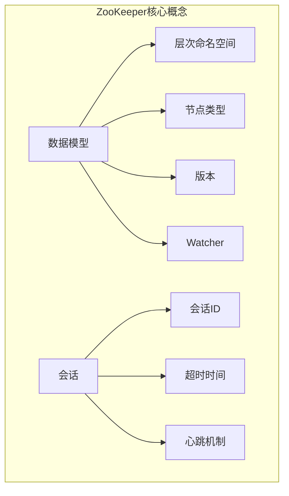
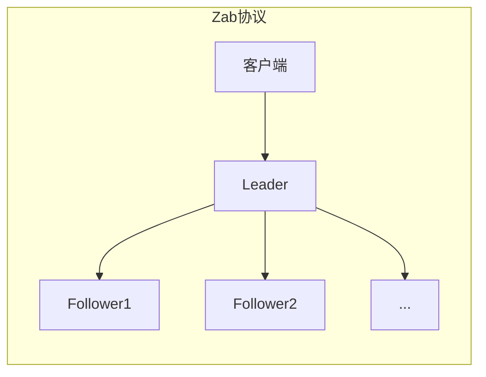

# Zookeeper原理与代码实例讲解

## 1. 背景介绍

### 1.1 问题的由来

在分布式系统中，协调和管理大量的节点是一个巨大的挑战。随着系统规模的扩大,单点故障、网络分区等问题将导致系统的可用性和一致性受到严重影响。为了解决这些问题,需要一种可靠的分布式协调服务来确保整个集群的数据一致性、提供集中式的命名服务,以及集群管理等功能。

### 1.2 研究现状

目前,已经有多种分布式协调服务可供选择,如Apache ZooKeeper、etcd、Consul等。其中,ZooKeeper因其简单、高效且可靠的特点,成为了事实上的标准。ZooKeeper最初由Yahoo!研究院开发,后捐献给Apache软件基金会,现已广泛应用于Hadoop、HBase、Kafka等分布式系统中。

### 1.3 研究意义

深入理解ZooKeeper的原理和实现机制,对于构建健壮、高可用的分布式系统至关重要。通过本文,读者将全面了解ZooKeeper的设计思想、核心算法、数据模型、应用场景等,并通过实际代码示例加深对ZooKeeper的理解和运用能力。

### 1.4 本文结构  

本文首先介绍ZooKeeper的核心概念和基本原理,包括数据模型、会话管理、版本控制等。接下来详细阐述ZooKeeper的核心算法——Zab原子广播协议,并通过数学模型和公式进行深入分析。然后通过代码实例演示ZooKeeper的实际应用,包括开发环境搭建、客户端API使用等。最后,探讨ZooKeeper在实际场景中的应用,如命名服务、配置管理、分布式锁等,并对未来发展趋势和面临的挑战进行展望。

## 2. 核心概念与联系



ZooKeeper的核心概念包括:

1. **数据模型**: ZooKeeper采用层次化的命名空间,类似于文件系统的目录结构,每个节点都可以存储数据和子节点。节点分为持久节点、临时节点和顺序节点三种类型。

2. **版本**: 每个节点都有一个版本号,用于实现数据一致性和并发控制。

3. **Watcher**: 客户端可以在指定节点注册Watcher,一旦节点发生变化,ZooKeeper会通知客户端。

4. **会话**: 客户端与ZooKeeper服务端之间的连接被称为会话,每个会话都有一个唯一的会话ID和超时时间,客户端需要定期发送心跳来保持会话有效。

这些核心概念相互关联,共同构成了ZooKeeper的基本框架,为分布式协调提供了可靠的基础。

## 3. 核心算法原理 & 具体操作步骤  

### 3.1 算法原理概述

ZooKeeper的核心算法是Zab(ZooKeeper Atomic Broadcast)原子广播协议,它是一种基于主从模式的复制状态机协议。Zab协议保证了在任何时刻,只有一个主节点(Leader)对外提供写服务,其他节点(Follower)只提供读服务。所有的写操作都由主节点协调,并复制到其他节点,从而保证了数据的一致性。



### 3.2 算法步骤详解

Zab协议的主要步骤如下:

1. **领导者选举**:集群启动时,所有节点通过投票选举产生一个领导者(Leader)。

2. **数据复制**:客户端将写请求发送给Leader,Leader将请求转发给所有Follower并等待响应。当超过半数Follower响应后,Leader会向所有Follower发送commit消息,完成数据复制。

3. **崩溃恢复**:如果Leader崩溃,剩余节点会重新进行领导者选举。当新的Leader上位后,它会确保新写入的数据被复制到所有Follower,从而保证数据一致性。

4. **数据读取**:客户端可以从任意节点读取数据,但是只有从Leader或已同步的Follower读取的数据才是最新的。

### 3.3 算法优缺点

**优点**:

- 数据一致性强:通过Leader协调写操作,保证了数据的强一致性。
- 高可用性:Leader崩溃后,可以自动选举新的Leader,保证服务的连续性。
- 简单高效:算法设计简单,易于理解和实现。

**缺点**:

- 写性能瓶颈:所有写操作都需要经过Leader节点,在高并发场景下会成为性能瓶颈。
- 单点故障:虽然可以选举新的Leader,但在Leader节点发生故障时,会出现短暂的不可用状态。

### 3.4 算法应用领域

Zab协议广泛应用于需要强一致性和高可用性的分布式场景,如:

- 分布式锁服务:利用ZooKeeper实现分布式锁,确保只有一个客户端能够获取锁。
- 配置管理:将配置信息存储在ZooKeeper中,集群中的所有节点都能获取到最新配置。
- 命名服务:利用ZooKeeper的层次命名空间,实现分布式命名服务。
- 集群管理:监控和管理分布式集群中的节点状态。

## 4. 数学模型和公式 & 详细讲解 & 举例说明

### 4.1 数学模型构建

为了更好地理解和分析Zab协议,我们可以构建一个数学模型。假设集群中有N个节点,其中包括一个Leader和N-1个Follower。定义以下变量:

- $L$: Leader节点
- $F_i$: 第i个Follower节点,其中$i \in \{1, 2, ..., N-1\}$
- $q$: 写请求
- $z_i$: 节点i的状态
- $z_i^t$: 节点i在时间t的状态

我们可以将Zab协议建模为一个状态转移函数:

$$z_i^{t+1} = \delta(z_i^t, q, m)$$

其中$\delta$是状态转移函数,$m$是Leader发送的消息(proposal或commit)。

### 4.2 公式推导过程

接下来,我们推导出Leader和Follower的状态转移函数。

**Leader状态转移函数**:

$$z_L^{t+1} = \begin{cases}
    z_L^t, & \text{if } |\{i | z_i^t = z_L^t\}| \leq \lfloor\frac{N}{2}\rfloor\\
    z_L^t + q, & \text{if } |\{i | z_i^t = z_L^t\}| > \lfloor\frac{N}{2}\rfloor \text{ and } \nexists j \text{ s.t. } z_j^t = z_L^t + q
\end{cases}$$

Leader只有在超过半数节点与它保持一致时,才能应用写请求。

**Follower状态转移函数**:

$$z_i^{t+1} = \begin{cases}
    z_i^t, & \text{if } m = \text{null}\\
    z_L^t, & \text{if } m = \text{proposal}(z_L^t)\\
    z_L^t + q, & \text{if } m = \text{commit}(z_L^t + q)
\end{cases}$$

Follower根据Leader发送的proposal或commit消息更新自身状态。

### 4.3 案例分析与讲解

假设一个ZooKeeper集群有5个节点,其中一个Leader和4个Follower。当客户端发送一个写请求$q$时,会发生以下状态转移:

1. Leader收到写请求$q$,将其与当前状态$z_L^t$合并,得到新状态$z_L^{t+1} = z_L^t + q$。
2. Leader向所有Follower发送proposal($z_L^{t+1}$)消息。
3. 当超过半数(即3个)Follower响应后,Leader向所有Follower发送commit($z_L^{t+1}$)消息。
4. 所有Follower收到commit消息后,将状态更新为$z_i^{t+1} = z_L^{t+1}$。

通过这个案例,我们可以清楚地看到Zab协议是如何保证数据一致性的:只有当超过半数节点达成一致后,Leader才能应用写请求,并将新状态复制到所有Follower。

### 4.4 常见问题解答

**Q: 为什么需要超过半数节点响应才能提交写请求?**

A: 这是为了防止"脑裂"(split-brain)问题。如果只需要少数节点响应,就有可能出现两个不同的"多数派",导致数据不一致。要求超过半数节点响应,可以确保只有一个多数派,从而保证数据一致性。

**Q: 如果Leader崩溃了,会发生什么?**

A: 如果Leader崩溃,剩余的Follower节点会重新进行领导者选举。新选举出的Leader会确保新写入的数据被复制到所有Follower,从而保证数据一致性。

**Q: ZooKeeper是如何处理网络分区的?**

A: ZooKeeper依赖于可靠的底层通信机制(如TCP)来传递消息。在网络分区的情况下,如果分区中没有构成多数派的节点,那么整个系统将无法进行写操作,从而避免了数据不一致的问题。

## 5. 项目实践:代码实例和详细解释说明

### 5.1 开发环境搭建

在开始使用ZooKeeper之前,我们需要先搭建开发环境。以下是搭建步骤:

1. 下载ZooKeeper的最新稳定版本,可从官网(https://zookeeper.apache.org/)获取。
2. 解压下载的压缩包,进入解压后的目录。
3. 修改`conf/zoo.cfg`配置文件,设置数据目录和日志目录等参数。
4. 启动ZooKeeper服务器:

```bash
bin/zkServer.sh start
```

5. 验证ZooKeeper是否正常运行:

```bash
bin/zkServer.sh status
```

如果一切正常,你应该能看到类似"Mode: standalone"的输出。

### 5.2 源代码详细实现

ZooKeeper提供了多种语言的客户端API,包括Java、C、Python等。以下是使用Java客户端API的示例代码:

```java
import org.apache.zookeeper.WatchedEvent;
import org.apache.zookeeper.Watcher;
import org.apache.zookeeper.ZooKeeper;

public class ZookeeperExample implements Watcher {
    private static final String ZNODE_PATH = "/myapp";
    private static final String ZNODE_DATA = "Hello, ZooKeeper!";

    public static void main(String[] args) throws Exception {
        ZookeeperExample example = new ZookeeperExample();
        example.run();
    }

    public void run() throws Exception {
        ZooKeeper zk = new ZooKeeper("localhost:2181", 3000, this);
        System.out.println("Connected to ZooKeeper");

        // 创建节点
        zk.create(ZNODE_PATH, ZNODE_DATA.getBytes(), ZooDefs.Ids.OPEN_ACL_UNSAFE, CreateMode.PERSISTENT);
        System.out.println("Node created: " + ZNODE_PATH);

        // 获取节点数据
        byte[] data = zk.getData(ZNODE_PATH, false, null);
        System.out.println("Node data: " + new String(data));

        // 监视节点变化
        zk.exists(ZNODE_PATH, true);

        // 等待监视事件
        Thread.sleep(Integer.MAX_VALUE);
    }

    @Override
    public void process(WatchedEvent event) {
        System.out.println("Received event: " + event);
    }
}
```

这段代码演示了如何创建ZooKeeper节点、获取节点数据以及监视节点变化。具体步骤如下:

1. 创建`ZooKeeper`实例,连接到ZooKeeper服务器。
2. 调用`create`方法,在ZooKeeper中创建一个持久节点`/myapp`,并写入初始数据。
3. 调用`getData`方法,获取节点`/myapp`的数据。
4. 调用`exists`方法,注册一个Watcher,监视节点`/myapp`的变化。
5. 进入无限循环,等待监视事件发生。
6. 当节点发生变化时