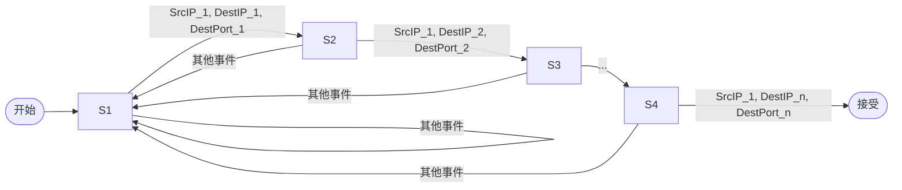

好的,我会按照您的要求,以"【AI大数据计算原理与代码实例讲解】CEP"为主题,撰写一篇专业的技术博客文章。我会努力确保文章内容逻辑清晰、结构紧凑、语言专业易懂,并严格遵循您提出的各项约束条件。以下是正文部分:

# 【AI大数据计算原理与代码实例讲解】CEP

## 1. 背景介绍

### 1.1 问题的由来

在当今大数据时代,来自各个渠道的海量数据不断产生和积累。如何高效处理这些连续不断到来的数据流,从中实时发现有价值的信息,成为了一个亟待解决的关键问题。传统的数据库系统主要面向持久化存储和批量处理,很难满足对数据流的实时分析需求。因此,复杂事件处理(Complex Event Processing, CEP)技术应运而生。

### 1.2 研究现状  

CEP最早起源于90年代中期,用于处理金融交易和网络监控等领域的事件流数据。近年来,随着物联网、移动互联网等新兴技术的发展,CEP受到越来越多关注。目前,已有多种开源和商业CEP系统,如Apache Storm、Flink、Esper等,并被广泛应用于物联网、电信、金融等行业。

### 1.3 研究意义

CEP技术能够对大规模、高速、异构的事件流数据进行实时处理和分析,及时发现其中蕴含的复杂模式,从而支持实时决策和预测。它在物联网、金融监控、网络安全、智能交通等领域具有重要应用价值。研究CEP的原理和实现方法,有助于提高数据处理效率,挖掘数据价值,支持实时智能决策。

### 1.4 本文结构

本文首先介绍CEP的核心概念和基本原理,然后详细阐述其关键算法,包括算法原理、数学模型、实现步骤等。接下来通过代码实例,结合详细的解释说明,帮助读者更好地理解和掌握CEP。最后探讨CEP在实际应用中的场景,并对未来发展趋势和挑战进行展望。

## 2. 核心概念与联系

复杂事件处理(CEP)的核心思想是从大规模的简单事件流中识别出更复杂的事件模式。其中:

- 事件(Event)是一个附带时间戳的不可分割的数据记录,描述发生的状态变化或动作。
- 事件流(Event Stream)是按时间顺序排列的事件序列。
- 事件模式(Event Pattern)是一组满足特定条件的相关事件的组合。

CEP系统通过持续监控事件流,并基于预定义的规则对事件进行过滤、转换、关联等操作,从而发现隐藏的事件模式,并对其进行处理。

CEP的核心概念包括:

1. **事件抽象**:定义事件的格式和语义。
2. **事件流处理**:对流式数据进行滤波、投射、聚合等操作。
3. **模式匹配**:基于规则对事件流进行复杂模式的检测和匹配。
4. **规则管理**:创建、部署和管理事件处理规则。
5. **上下文管理**:维护事件处理过程中的状态和上下文信息。
6. **输出处理**:对检测到的复杂事件执行相应的操作。

CEP技术与其他相关领域存在密切联系:

- **数据流处理**:CEP可视为数据流处理的一种特殊应用。
- **复杂模式匹配**:CEP借鉴了有限状态自动机等复杂模式匹配技术。
- **规则引擎**:CEP通常依赖规则引擎定义和执行事件处理规则。
- **机器学习**:CEP可结合机器学习算法进行模式发现和预测。

## 3. 核心算法原理与具体操作步骤

### 3.1 算法原理概述

CEP系统的核心算法通常基于有限状态自动机(Finite State Machine,FSM)和复杂事件处理网络(Complex Event Processing Network,CEPN)模型。

FSM用于描述和检测事件模式。每个状态代表事件模式的部分匹配结果,状态转移则对应于事件的发生。一旦达到接受状态,即匹配到完整的事件模式。

CEPN则是由多个操作符组成的有向无环图,用于表示复杂的事件处理逻辑。事件流经过一系列过滤、投射、聚合、模式匹配等操作符的处理,最终得到所需的复杂事件。

### 3.2 算法步骤详解

CEP算法的主要步骤包括:

1. **事件流接收**:从数据源获取事件流,对原始数据进行解析和格式化处理。
2. **事件流处理**:对事件流执行过滤、投射、聚合等操作,生成中间结果流。
3. **模式匹配**:在中间结果流上应用预定义的规则,检测复杂事件模式。
4. **状态维护**:跟踪模式匹配过程中的状态,记录部分匹配结果。
5. **复杂事件输出**:一旦检测到符合条件的复杂事件模式,即触发相应的动作或通知。

更详细的算法流程如下:

### 3.3 算法优缺点

CEP算法的优点包括:

- 实时处理:能够对持续到来的事件流进行实时分析和响应。
- 模式发现:可发现隐藏在大规模事件流中的复杂模式和规律。
- 灵活性强:通过定义规则可以快速适应新的业务需求。
- 高效性:利用有限状态机等模型,算法执行效率较高。

但也存在一些缺点和挑战:

- 规则定义复杂:编写高质量的事件处理规则需要专业知识。
- 状态管理开销:维护模式匹配状态会带来一定的内存和计算开销。
- 处理延迟:在事件流密集时,可能出现一定的处理延迟。
- 可扩展性:大规模事件流的处理对系统的可扩展性提出了挑战。

### 3.4 算法应用领域

CEP算法在诸多领域都有广泛应用:

- **金融服务**:监控交易活动、检测欺诈行为。
- **网络监控**:检测网络攻击、识别异常流量模式。
- **物联网**:实时处理传感器数据,发现特定事件模式。
- **业务活动监控**:跟踪业务流程、发现违规操作。
- **智能交通**:分析车辆和行人数据,优化交通管理。
- **预测性维护**:监测设备状态,预测故障发生。

## 4. 数学模型和公式详细讲解与举例说明

### 4.1 数学模型构建

为了形式化描述CEP过程,我们可以构建如下数学模型:

事件流定义为有序事件序列:

$$E = \langle e_1, e_2, \ldots, e_n \rangle$$

其中,每个事件 $e_i$ 都是一个元组,包含时间戳 $t_i$ 和其他属性值。

事件模式可以用正则表达式 $R$ 来表示,其中原子事件用小写字母表示,复杂事件用大写字母表示。例如:

$$R = a;b;C$$

表示模式 $C$ 由事件 $a$ 和 $b$ 按顺序出现匹配得到。

常见的模式运算符包括:

- 序列 $(;)$: 事件按顺序发生
- 并行 $(\|)$: 事件无序发生
- 迭代 $(*)$: 事件重复出现 0 次或多次
- 否定 $(!)$: 事件不发生

### 4.2 公式推导过程

为了检测事件流 $E$ 中是否存在模式 $R$,我们可以构建非确定有限状态自动机(NFA)。设 $Q$ 为NFA的状态集合, $q_0$ 为起始状态, $F$ 为接受状态集合,则NFA可以表示为:

$$M = (Q, \Sigma, \delta, q_0, F)$$

其中:

- $\Sigma$ 是事件字母表
- $\delta: Q \times \Sigma^* \rightarrow 2^Q$ 是状态转移函数

NFA的状态转移过程可以用下面的推导规则描述:

$$
\frac{q' \in \delta(q, a)}{(q, a) \vdash (q', \epsilon)}
\qquad
\frac{(q, \alpha) \vdash (q', \beta)}{(q, a\alpha) \vdash (q', a\beta)}
$$

其中 $\epsilon$ 表示空字符串。一旦转移到接受状态 $q_f \in F$,则匹配到事件模式 $R$。

### 4.3 案例分析与讲解

考虑这样一个案例:监控网络流量,检测是否存在端口扫描攻击的模式。我们定义端口扫描攻击模式为:在短时间内,同一源IP地址连续尝试访问多个不同目标IP地址和端口。

可以用如下正则表达式表示:

$$
R = (SrcIP_1; DestIP_1; DestPort_1); 
     (SrcIP_1; DestIP_2; DestPort_2); 
     \ldots;
     (SrcIP_1; DestIP_n; DestPort_n)
$$

其中 $SrcIP_1$ 表示源IP地址, $DestIP_i$ 和 $DestPort_i$ 分别表示第 $i$ 个尝试的目标IP和端口。

我们可以构建对应的NFA来检测这个模式,其状态转移图如下:

当NFA达到接受状态时,即检测到端口扫描攻击模式。我们可以对这个复杂事件采取相应的防御措施,如记录日志、阻止访问等。

### 4.4 常见问题解答

1. **如何高效处理大规模事件流?**

   解决方案包括:使用增量处理算法、并行化计算、负载均衡等技术,提高系统的吞吐量和可扩展性。

2. **如何降低模式匹配的时间和空间开销?**

   可以采用状态分区、压缩编码等优化技术,减小状态空间;也可以使用近似匹配算法,在一定精度损失下提高效率。

3. **如何处理事件流中的乱序和丢失情况?**

   引入时间窗口和容错机制,设置合理的等待时间和重传策略,提高系统的健壮性。

4. **如何动态调整和更新事件处理规则?**

   可以在运行时动态加载新规则,并对旧规则进行热升级,实现无缝切换,避免系统中断。

## 5. 项目实践