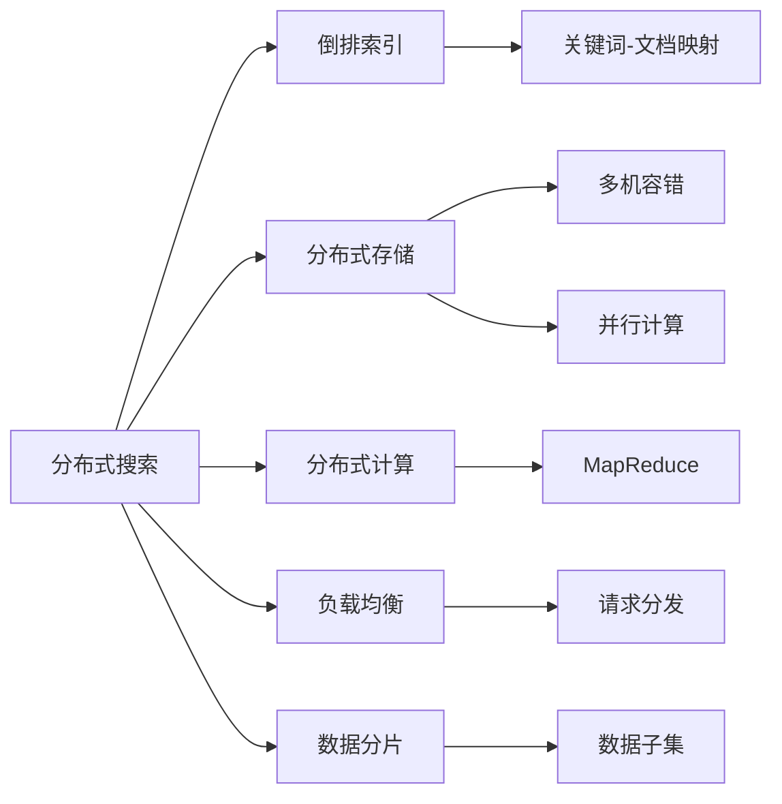

# 【AI大数据计算原理与代码实例讲解】分布式搜索

关键词：分布式搜索、倒排索引、MapReduce、Lucene、Elasticsearch

## 1. 背景介绍
### 1.1 问题的由来
随着互联网的快速发展,海量数据的存储和检索成为了一个巨大的挑战。传统的集中式搜索方案已经无法满足日益增长的数据规模和实时性需求。因此,分布式搜索技术应运而生,成为了解决大数据搜索问题的关键。
### 1.2 研究现状
目前,分布式搜索已经在全文检索、电商搜索、推荐系统等领域得到了广泛应用。业界主流的分布式搜索方案包括Lucene、Elasticsearch、Solr等,它们基于倒排索引原理,利用分布式计算框架如MapReduce实现了高效的索引构建和查询。学术界也在不断探索新的分布式搜索模型和算法,以进一步提升搜索性能。
### 1.3 研究意义
分布式搜索是大数据时代不可或缺的关键技术之一。深入研究分布式搜索的原理和实现,对于构建高可用、高性能的搜索引擎,挖掘数据价值,具有重要的理论和实践意义。同时,分布式搜索也为其他领域,如机器学习、知识图谱等,提供了宝贵的思路和借鉴。
### 1.4 本文结构
本文将全面探讨分布式搜索的核心概念、算法原理、数学模型、代码实现等方面。第2章介绍分布式搜索的核心概念;第3章讲解分布式搜索的算法原理;第4章建立分布式搜索的数学模型;第5章给出Lucene和Elasticsearch的代码实例;第6章分析分布式搜索的应用场景;第7章推荐相关工具和资源;第8章总结全文并展望未来。

## 2. 核心概念与联系
分布式搜索的核心概念包括:

- 倒排索引(Inverted Index):一种索引方法,通过关键词到文档的映射加速搜索。
- 分布式存储:将海量数据分散存储在多台机器,实现容错和并行计算。
- 分布式计算:将计算任务分配到多个节点协同完成,如MapReduce。
- 负载均衡:将搜索请求合理分发到多个节点,避免过载。
- 数据分片(Sharding):将数据集拆分成多个子集,提高吞吐量。

这些概念相辅相成,构成了分布式搜索的基石。下图展示了它们之间的关系:



## 3. 核心算法原理 & 具体操作步骤
### 3.1 算法原理概述
分布式搜索的核心算法是倒排索引。它将文档集合转化为关键词到文档的映射,大大加速了查询速度。同时,分布式搜索利用MapReduce等分布式计算框架,在多台机器上并行完成索引构建和查询,突破了单机性能瓶颈。
### 3.2 算法步骤详解
分布式搜索的主要步骤如下:

1. 数据分片:将大规模文档集合划分为多个子集,分布到不同节点。
2. 索引构建:对每个数据分片并行构建倒排索引。
   - 文档分析:提取文档关键词,记录词频等统计信息。
   - 索引生成:创建关键词到文档的映射关系。
3. 查询执行:对用户查询并行检索相关文档。
   - 查询解析:对查询语句进行语法和语义分析。
   - 索引检索:在各个节点的倒排索引中并行检索。
   - 结果合并:汇总各节点的检索结果,排序返回给用户。
4. 索引更新:定期同步文档变更,增量更新倒排索引。

### 3.3 算法优缺点
倒排索引的优点是查询速度快,支持复杂的布尔逻辑。但其缺点是索引文件庞大,构建和更新成本高。

分布式计算的优点是可扩展性强,能充分利用集群资源。但其缺点是系统复杂度高,对数据一致性要求高。

### 3.4 算法应用领域
分布式搜索广泛应用于各类大数据场景,如网页搜索、电商搜索、论文检索、日志分析等。一些典型的开源和商业搜索引擎包括:

- Lucene/Solr:Apache的开源搜索引擎库和服务器。 
- Elasticsearch:基于Lucene的分布式搜索和分析引擎。
- Sphinx:高性能的全文检索引擎。
- Algolia:云搜索即服务平台。

## 4. 数学模型和公式 & 详细讲解 & 举例说明
### 4.1 数学模型构建
我们可以用向量空间模型(Vector Space Model)来形式化表示文档和查询。设有 $n$ 个文档 $\mathcal{D}=\{d_1,d_2,...,d_n\}$ 和 $m$ 个关键词 $\mathcal{T}=\{t_1,t_2,...,t_m\}$,每个文档 $d_i$ 可以表示为关键词的权重向量:

$$d_i=\{w_{i1},w_{i2},...,w_{im}\}$$

其中 $w_{ij}$ 表示关键词 $t_j$ 在文档 $d_i$ 中的权重,通常由TF-IDF等算法计算。

查询 $q$ 也可以表示为关键词的权重向量:

$$q=\{q_1,q_2,...,q_m\}$$

其中 $q_j$ 表示关键词 $t_j$ 在查询中的权重。

文档 $d_i$ 与查询 $q$ 的相关度可以通过两个向量的内积计算:

$$\text{sim}(d_i,q)=\sum_{j=1}^m w_{ij} \cdot q_j$$

### 4.2 公式推导过程
TF-IDF是一种常用的文档关键词权重计算方法。它综合考虑了关键词在文档中的频率(Term Frequency)和在整个文档集中的区分度(Inverse Document Frequency)。

设关键词 $t_j$ 在文档 $d_i$ 中出现的次数为 $f_{ij}$,文档 $d_i$ 的总词数为 $\sum_k f_{ik}$,包含关键词 $t_j$ 的文档数为 $n_j$,文档集合大小为 $|\mathcal{D}|=n$,则TF-IDF权重公式为:

$$w_{ij}=\text{TF-IDF}(t_j,d_i)=\frac{f_{ij}}{\sum_k f_{ik}} \cdot \log\frac{n}{n_j}$$

直观地说,TF项衡量了关键词在文档中的重要性,IDF项衡量了关键词在文档集中的稀缺性。二者相乘,可以比较合理地评估关键词对文档的贡献。

### 4.3 案例分析与讲解
我们以一个简单的例子来说明TF-IDF的计算过程。假设有两个文档:

- $d_1$: "The cat sat on the mat"
- $d_2$: "The dog lay on the rug"

对于关键词"the",它在 $d_1$ 中出现2次,在 $d_2$ 中出现2次。总文档数为2,包含"the"的文档数也为2。因此:

$$\text{TF-IDF}(\text{the},d_1)=\frac{2}{6} \cdot \log\frac{2}{2}=0$$

$$\text{TF-IDF}(\text{the},d_2)=\frac{2}{6} \cdot \log\frac{2}{2}=0$$

可见,"the"这个高频词的TF-IDF权重为0,对文档的区分作用很小。

再看关键词"cat",它在 $d_1$ 中出现1次,在 $d_2$ 中出现0次。包含"cat"的文档数为1。因此:

$$\text{TF-IDF}(\text{cat},d_1)=\frac{1}{6} \cdot \log\frac{2}{1}=0.056$$

$$\text{TF-IDF}(\text{cat},d_2)=\frac{0}{6} \cdot \log\frac{2}{1}=0$$

可见,"cat"这个低频词的TF-IDF权重较高,对 $d_1$ 的贡献大于 $d_2$。

### 4.4 常见问题解答
问:为什么除以文档总词数 $\sum_k f_{ik}$ 而不是最大词频 $\max_k f_{ik}$?

答:除以总词数是为了归一化,使不同长度的文档具有可比性。除以最大词频虽然也能归一化,但会过度放大稀有词的权重。两种归一化方式各有利弊,需要根据实际情况选择。

问:为什么用 $\log\frac{n}{n_j}$ 而不是 $\frac{n}{n_j}$?

答:使用对数形式是为了平滑IDF的变化梯度。当一个关键词极其稀有时,直接用 $\frac{n}{n_j}$ 会导致权重过高,对数形式能一定程度缓解这个问题。此外,对数形式在数学推导和计算优化方面也更加方便。

## 5. 项目实践：代码实例和详细解释说明
### 5.1 开发环境搭建
我们以Java语言为例,利用成熟的开源搜索引擎库Lucene和Elasticsearch,演示如何进行分布式搜索的开发。

首先,需要在项目中引入相关依赖,如使用Maven进行构建:

```xml
<dependencies>
    <dependency>
        <groupId>org.apache.lucene</groupId>
        <artifactId>lucene-core</artifactId>
        <version>8.8.2</version>
    </dependency>
    <dependency>
        <groupId>org.elasticsearch.client</groupId>
        <artifactId>elasticsearch-rest-high-level-client</artifactId>
        <version>7.13.2</version>
    </dependency>
</dependencies>
```

### 5.2 源代码详细实现
下面的代码展示了如何使用Lucene进行本地文件索引和搜索:

```java
public class LuceneDemo {
    public static void main(String[] args) throws Exception {
        // 索引阶段
        Path indexPath = Files.createTempDirectory("tempIndex");
        Directory directory = FSDirectory.open(indexPath);
        Analyzer analyzer = new StandardAnalyzer();
        IndexWriterConfig config = new IndexWriterConfig(analyzer);
        IndexWriter indexWriter = new IndexWriter(directory, config);

        Document doc1 = new Document();
        doc1.add(new TextField("content", "The cat sat on the mat", Field.Store.YES));
        indexWriter.addDocument(doc1);

        Document doc2 = new Document();
        doc2.add(new TextField("content", "The dog lay on the rug", Field.Store.YES));
        indexWriter.addDocument(doc2);

        indexWriter.close();

        // 搜索阶段  
        DirectoryReader reader = DirectoryReader.open(directory);
        IndexSearcher searcher = new IndexSearcher(reader);

        QueryParser parser = new QueryParser("content", analyzer);
        Query query = parser.parse("cat");

        TopDocs results = searcher.search(query, 10);
        for (ScoreDoc scoreDoc : results.scoreDocs) {
            Document doc = searcher.doc(scoreDoc.doc);
            System.out.println(doc.get("content"));
        }

        reader.close();
        directory.close();
    }
}
```

接下来,我们演示如何使用Elasticsearch进行分布式索引和搜索:

```java
public class ElasticsearchDemo {
    public static void main(String[] args) throws Exception {
        RestHighLevelClient client = new RestHighLevelClient(
                RestClient.builder(new HttpHost("localhost", 9200, "http")));

        // 索引阶段
        IndexRequest request1 = new IndexRequest("myindex");
        request1.source("content", "The cat sat on the mat");
        IndexResponse response1 = client.index(request1, RequestOptions.DEFAULT);

        IndexRequest request2 = new IndexRequest("myindex");  
        request2.source("content", "The dog lay on the rug");
        IndexResponse response2 = client.index(request2, RequestOptions.DEFAULT);

        // 搜索阶段
        SearchRequest searchRequest = new SearchRequest("myindex"); 
        SearchSourceBuilder sourceBuilder = new SearchSourceBuilder();
        sourceBuilder.query(QueryBuilders.matchQuery("content", "cat")); 
        searchRequest.source(sourceBuilder);

        SearchResponse searchResponse = client.search(searchRequest, RequestOptions.DEFAULT);
        for (SearchHit hit