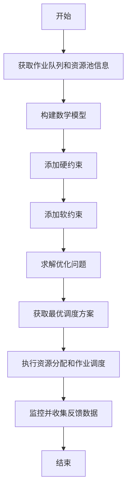

好的,我会严格遵循您提供的约束条件,使用专业的技术语言写一篇有深度的技术博客文章。以下是正文部分:

# 【AI大数据计算原理与代码实例讲解】资源管理

## 1. 背景介绍

### 1.1 问题的由来

在当今大数据和人工智能时代,有效管理计算资源对于提高系统性能和降低运营成本至关重要。随着数据量的不断增长和算法复杂度的提高,传统的资源管理方法已经不能满足现代分布式系统的需求。因此,需要开发新的资源管理策略和技术来应对这一挑战。

### 1.2 研究现状  

目前,学术界和工业界都在积极探索更高效、更智能的资源管理方法。一些公司如Google、Facebook和阿里巴巴已经在其大规模集群中采用了基于机器学习的资源管理系统。同时,围绕资源管理的新理论和算法也不断涌现,如深度强化学习、在线规划和组合优化等。

### 1.3 研究意义

高效的资源管理不仅可以最大限度地利用现有的计算能力,还可以减少资源浪费,从而降低能源消耗和碳排放。此外,智能资源管理有助于提高系统的可靠性、可扩展性和自动化水平,简化运维工作。因此,研究先进的资源管理技术对于构建高性能、环保、智能的计算基础设施至关重要。

### 1.4 本文结构

本文将首先介绍资源管理的核心概念,然后深入探讨其中的关键算法原理、数学模型和实现细节。此外,还将介绍资源管理在实际应用中的案例,并对未来的发展趋势和挑战进行展望。

## 2. 核心概念与联系

资源管理是一个跨学科的领域,涉及计算机科学、运筹学、控制理论等多个领域的知识。以下是资源管理的一些核心概念:

1. **资源**:通常指计算资源,如CPU、内存、存储、网络带宽等。
2. **作业(Job)**:需要使用资源来执行的计算任务。
3. **调度(Scheduling)**:决定何时、如何将作业分配到可用资源上运行。
4. **资源池(Resource Pool)**:集群中所有可用的资源集合。
5. **资源分配(Resource Allocation)**:将资源池中的资源合理分配给作业。
6. **负载均衡(Load Balancing)**:跨节点均匀分配作业负载。
7. **资源利用率(Resource Utilization)**:实际使用的资源占可用资源的比例。
8. **服务质量(QoS)**:满足作业对响应时间、吞吐量等指标的要求。

这些概念相互关联、环环相扣。合理的资源分配和作业调度是实现高资源利用率和良好服务质量的关键。同时,需要考虑负载均衡、容错、能耗等多个维度的约束。

## 3. 核心算法原理与具体操作步骤

### 3.1 算法原理概述

资源管理算法的目标是在满足作业的服务质量要求的前提下,最大化资源利用率。这是一个典型的组合优化问题,通常需要在多个冲突目标之间寻求平衡。常见的算法包括:

1. **启发式算法**:基于一些经验规则快速生成可行解,如最大资源公平调度。
2. **贪婪算法**:按某种规则逐步构造解,如先来先服务调度。 
3. **近似算法**:能在多项式时间内给出接近最优解的算法。
4. **精确算法**:能在有限时间内找到最优解的算法,如整数规划。
5. **机器学习算法**:基于历史数据训练模型,用于作业调度和资源分配决策。

### 3.2 算法步骤详解

以下以一种常见的基于约束编程(CP)的资源管理算法为例,详细介绍其工作步骤:

1. **获取作业队列和资源池信息**:从作业管理系统和资源监控系统获取当前的作业队列、资源使用情况等信息。
2. **构建数学模型**:根据作业特征(如资源需求、优先级、到达时间等)和资源约束(如CPU核数、内存大小等),构建描述问题的数学模型。
3. **添加硬约束**:添加必须满足的约束条件,如每个作业只能被分配到一个节点、节点资源不能被超分配等。
4. **添加软约束**:添加优化目标相关的约束,如最小化作业等待时间、最大化资源利用率等。
5. **求解优化问题**:使用约束求解器(如Gurobi、CPLEX)求解构建的优化模型,获得最优或近似最优解。
6. **获取最优调度方案**:从求解器输出中提取最优的资源分配和作业调度方案。
7. **执行资源分配和作业调度**:将获得的调度方案下发到资源管理系统执行。
8. **监控并收集反馈数据**:监控调度执行情况,收集实际的资源使用和作业运行数据,为下一轮调度提供反馈。

该算法通过数学建模和优化技术,能够生成高质量的调度方案。同时,通过持续监控和反馈,可以不断优化模型,提高调度质量。

### 3.3 算法优缺点

上述基于CP的资源管理算法具有以下优缺点:

**优点**:

- 能够精确建模各种复杂约束
- 可获得理论最优或接近最优解 
- 支持多目标优化
- 可解释性好,便于分析和优化

**缺点**:  

- 问题规模大时求解时间长
- 需要人工构建数学模型 
- 无法处理动态环境下的实时调度
- 对历史数据的利用不足

### 3.4 算法应用领域

基于CP的资源管理算法广泛应用于以下领域:

- 云计算集群调度
- 网格计算资源管理  
- 大数据系统如Spark、Hadoop的资源分配
- 数据中心机架层资源优化
- 人工智能系统中算力资源调度

## 4. 数学模型和公式详细讲解与举例说明

### 4.1 数学模型构建

我们使用整数规划(IP)模型来描述资源管理问题。该模型由目标函数和约束条件组成。

**符号说明**:

- $J$: 作业集合
- $M$: 机器节点集合  
- $r_j$: 作业$j$需求的CPU核数
- $m_j$: 作业$j$需求的内存大小
- $d_j$: 作业$j$的截止时间
- $C_m$: 机器节点$m$的CPU核数  
- $M_m$: 机器节点$m$的内存容量
- $x_{j,m}$: 决策变量,如果作业$j$被分配到节点$m$则为1,否则为0

**目标函数**:

最小化所有作业的总加权延迟时间

$$\min \sum_{j \in J} w_j \cdot T_j$$

其中$w_j$为作业$j$的权重系数, $T_j$为作业$j$的延迟时间。

**约束条件**:

1. 每个作业只能被分配到一个节点:

$$\sum_{m \in M} x_{j,m} = 1 \qquad \forall j \in J$$

2. 每个节点的CPU资源不能被超分配:

$$\sum_{j \in J} r_j \cdot x_{j,m} \leq C_m \qquad \forall m \in M$$

3. 每个节点的内存资源不能被超分配:  

$$\sum_{j \in J} m_j \cdot x_{j,m} \leq M_m \qquad \forall m \in M$$

4. 作业的完成时间不能晚于截止时间:

$$\sum_{m \in M} C_j^m \cdot x_{j,m} \leq d_j \qquad \forall j \in J$$

其中$C_j^m$为作业$j$在节点$m$上的完成时间。

以上是一个基本的IP模型,在实际应用中可根据需求添加其他约束,如亲和性/反亲和性约束、数据局部性约束等。

### 4.2 公式推导过程

我们以推导作业延迟时间$T_j$为例,说明公式的推导过程。

假设作业$j$被分配到节点$m$上运行,其延迟时间为实际完成时间与期望完成时间(通常设为到达时间$a_j$)之差:

$$T_j = C_j^m - a_j$$

作业$j$在节点$m$上的完成时间$C_j^m$等于其开始运行时间加上运行时间:

$$C_j^m = s_j^m + p_j^m$$

其中$s_j^m$为作业$j$在节点$m$上的开始时间,通常是所有运行队列中较早作业的完成时间。$p_j^m$为作业$j$在节点$m$上的运行时间,可估算为$p_j^m = r_j / C_m$。

将上式代入延迟时间公式,得到:

$$T_j = s_j^m + \frac{r_j}{C_m} - a_j$$

通过这一步步推导,我们得到了作业延迟时间的计算公式,并揭示了其与作业运行时间、节点容量和作业到达时间的关系。这为优化调度算法提供了理论基础。

### 4.3 案例分析与讲解  

现有一个小规模的计算集群,包含3个节点,每个节点的CPU核数和内存容量如下:

- 节点1: 4核CPU, 16GB内存
- 节点2: 8核CPU, 32GB内存  
- 节点3: 2核CPU, 8GB内存

现有4个作业需要调度,作业的资源需求和截止时间如下:

- 作业1: 需求2核CPU和4GB内存,截止时间30分钟
- 作业2: 需求3核CPU和6GB内存,截止时间20分钟
- 作业3: 需求2核CPU和8GB内存,截止时间40分钟
- 作业4: 需求1核CPU和2GB内存,截止时间10分钟  

我们构建如下整数规划模型:

**目标函数**:
$$\min T_1 + T_2 + T_3 + T_4$$

**约束条件**:

1. 每个作业只分配到一个节点:

$$\begin{aligned}
&x_{1,1} + x_{1,2} + x_{1,3} = 1\\  
&x_{2,1} + x_{2,2} + x_{2,3} = 1\\
&x_{3,1} + x_{3,2} + x_{3,3} = 1\\
&x_{4,1} + x_{4,2} + x_{4,3} = 1
\end{aligned}$$

2. CPU资源约束:

$$\begin{aligned}
&2x_{1,1} + 3x_{2,1} + 2x_{3,1} + x_{4,1} \leq 4\\
&2x_{1,2} + 3x_{2,2} + 2x_{3,2} + x_{4,2} \leq 8\\  
&2x_{1,3} + 3x_{2,3} + 2x_{3,3} + x_{4,3} \leq 2
\end{aligned}$$

3. 内存资源约束:

$$\begin{aligned}
&4x_{1,1} + 6x_{2,1} + 8x_{3,1} + 2x_{4,1} \leq 16\\
&4x_{1,2} + 6x_{2,2} + 8x_{3,2} + 2x_{4,2} \leq 32\\
&4x_{1,3} + 6x_{2,3} + 8x_{3,3} + 2x_{4,3} \leq 8
\end{aligned}$$

4. 截止时间约束:

$$\begin{aligned}
&T_1 \leq 30\\
&T_2 \leq 20\\  
&T_3 \leq 40\\
&T_4 \leq 10
\end{aligned}$$

求解该模型,可以得到最优调度方案:

- 作业1分配到节点2
- 作业2分配到节点1 
- 作业3分配到节点2
- 作业4分