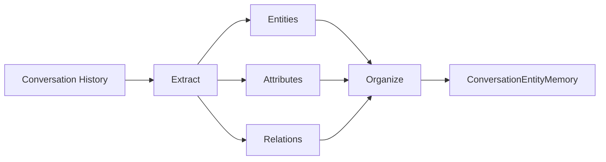

# 【LangChain编程：从入门到实践】ConversationEntityMemory

## 1. 背景介绍
### 1.1  问题的由来
在人工智能对话系统中,记忆是一个非常重要的组成部分。传统的对话系统通常使用固定大小的内存来存储对话历史,但这种方式难以应对长期多轮对话中的信息遗忘和知识累积问题。因此,如何设计一种高效灵活的对话记忆机制,成为了对话系统研究中的一个重要课题。

### 1.2  研究现状 
近年来,基于深度学习的端到端对话系统取得了长足的进步,但在处理长期多轮对话时仍然面临诸多挑战。一些研究尝试引入外部知识库来增强对话系统的记忆能力,但构建高质量的知识库本身就是一项非常耗时耗力的工作。另一些研究则探索使用神经网络来学习对话历史表示,但这类方法通常需要大量的训练数据和计算资源。

### 1.3  研究意义
设计一种高效灵活的对话记忆机制,对于提升对话系统的理解和生成能力具有重要意义。一方面,良好的记忆机制可以帮助对话系统更好地理解用户意图,挖掘对话脉络,从而生成更加自然流畅、切题恰当的回复。另一方面,记忆机制的引入也为对话系统的持续学习提供了可能,使其能够在与用户的交互中不断积累和更新知识。

### 1.4  本文结构
本文将重点介绍LangChain框架中的ConversationEntityMemory模块,这是一种基于实体的对话记忆机制。我们将首先介绍ConversationEntityMemory的核心概念和工作原理,然后详细讲解其算法实现步骤。接下来,我们将通过实际的代码示例来演示如何使用ConversationEntityMemory构建一个简单的对话应用。最后,我们总结ConversationEntityMemory的特点,并展望其在对话系统领域的应用前景。

## 2. 核心概念与联系
ConversationEntityMemory是LangChain框架中的一个核心模块,其目标是为对话系统提供一种基于实体的记忆存储和检索机制。ConversationEntityMemory的核心概念包括:

- 实体(Entity):对话中提及的重要信息载体,通常对应于现实世界中的人、物、事、地点等。ConversationEntityMemory以实体为基本单位来组织对话记忆。

- 实体属性(Entity Attribute):与实体相关的各类属性信息,例如人的姓名、年龄、职业等。ConversationEntityMemory以键值对的形式来存储实体属性。

- 实体关系(Entity Relation):实体之间的关联关系,例如人物之间的社交关系、事件之间的因果关系等。ConversationEntityMemory以图的形式来表示实体关系。

- 对话历史(Conversation History):用户和系统之间的多轮对话记录。ConversationEntityMemory在存储对话历史的同时,提取其中的实体、属性、关系等信息。

下图展示了ConversationEntityMemory的核心概念之间的关系:



ConversationEntityMemory在存储对话历史的过程中,自动提取对话中的实体、属性和关系,并将它们有机地组织在一起,形成一张紧凑的实体关系图。当对话系统需要根据当前对话状态生成回复时,可以从ConversationEntityMemory中检索相关的实体和属性信息,从而生成更加自然和连贯的对话。

## 3. 核心算法原理 & 具体操作步骤
### 3.1  算法原理概述
ConversationEntityMemory的核心算法可以分为三个主要步骤:实体识别、属性抽取和关系构建。

- 实体识别:给定一段对话文本,ConversationEntityMemory首先使用命名实体识别(Named Entity Recognition, NER)模型来识别其中的实体提及。常见的实体类型包括人名、地名、组织机构名、日期时间等。

- 属性抽取:对于识别出的每个实体提及,ConversationEntityMemory接下来使用属性抽取模型来识别其属性。属性抽取通常基于实体类型和上下文信息,例如从"小明今年8岁了"中抽取出属性(小明, 年龄, 8岁)。

- 关系构建:ConversationEntityMemory最后分析实体提及之间的关系,构建实体关系图。关系构建通常基于句法依存分析和预定义的关系模板,例如从"小明的爸爸是张三"中抽取出关系(小明, 父亲, 张三)。

### 3.2  算法步骤详解
下面我们对ConversationEntityMemory的三个核心步骤进行更加详细的说明:

1. 实体识别
   1.1 对话文本预处理:对原始对话文本进行分词、词性标注、命名实体识别等预处理操作。
   1.2 实体提及识别:使用BiLSTM-CRF等序列标注模型,识别对话文本中的实体提及。
   1.3 实体指代消解:对于代词、零指代等情况,根据上下文将其链接到先前提及的实体。

2. 属性抽取
   2.1 构建实体-属性词典:对于每种实体类型,预先定义一个属性词典,包含属性名称和可能的属性值。
   2.2 上下文表示学习:使用BERT等预训练语言模型,学习实体提及及其上下文的分布式表示。
   2.3 属性分类:将实体提及及其上下文表示输入到属性分类器中,预测其对应的属性名称。
   2.4 属性值抽取:从实体提及的上下文中抽取属性值,填充到(实体,属性,值)三元组中。

3. 关系构建
   3.1 短语结构分析:对对话文本进行句法分析,得到句子的依存结构和短语结构。
   3.2 关系模板匹配:预先定义一系列关系抽取模板,例如"A的B是C"表示关系(A,B,C)。
   3.3 实体对齐:将句中的实体提及与已有的实体进行匹配对齐,处理指代消解。
   3.4 关系抽取:根据句法结构和关系模板,从句中抽取出(头实体,关系,尾实体)三元组。
   3.5 关系合并去重:对抽取出的关系三元组进行合并、去重,构建最终的实体关系图。

### 3.3  算法优缺点
ConversationEntityMemory算法的主要优点包括:

- 面向实体:以实体为核心来组织对话记忆,更加符合人类对话的认知规律。
- 可解释性:实体、属性、关系以结构化的形式存储,具有很好的可解释性。
- 灵活性:可以方便地向实体关系图中添加、删除、修改实体及其属性。
- 可扩展性:实体关系图可以不断累积和扩充,支持大规模知识的持续学习。

但ConversationEntityMemory算法也存在一些局限性:

- 依赖知识:算法的性能很大程度上取决于预定义的实体类型、属性词典、关系模板的质量。
- 语言依赖:不同语言的实体、属性表达方式差异很大,算法的多语言适应性有待提高。
- 推理能力:目前的算法主要关注显式表达的实体和关系,对隐式关系的推理能力还比较有限。

### 3.4  算法应用领域
ConversationEntityMemory作为一种通用的对话记忆机制,在多个任务领域都有广泛的应用前景,例如:

- 任务型对话:ConversationEntityMemory可以帮助任务型对话系统更好地跟踪和记录用户需求,提高任务完成的准确率。

- 知识问答:ConversationEntityMemory可以作为问答系统的知识存储和检索模块,提高问答的准确性和效率。

- 社交聊天:ConversationEntityMemory可以让聊天机器人更好地记住用户的个人信息、偏好等,使聊天更加个性化。

- 故事生成:ConversationEntityMemory可以帮助故事生成系统更好地管理人物、情节线索,生成更加连贯的故事情节。

## 4. 数学模型和公式 & 详细讲解 & 举例说明
### 4.1  数学模型构建
我们可以使用图的数据结构来形式化表示ConversationEntityMemory中的实体关系信息。设G=(V, E)表示一个实体关系图,其中:

- V是实体节点的集合,每个节点v∈V表示一个实体,包含实体的类型、名称、属性等信息。
- E是关系边的集合,每条边e=(v_i,r_k,v_j)∈E表示一个三元组,其中v_i,v_j∈V是实体节点,r_k∈R是关系类型,R是预定义的关系类型集合。

对于一段对话历史D={x_1,x_2,...,x_T},其中x_t表示第t轮对话的文本,ConversationEntityMemory的任务就是从D中提取出一个实体关系图G,用于后续的对话理解和生成。

### 4.2  公式推导过程
ConversationEntityMemory的核心是实体识别、属性抽取和关系抽取三个子任务,它们分别对应于图G中的节点信息和边信息。下面我们分别对这三个子任务的数学模型进行推导。

1. 实体识别:给定对话文本x,实体识别任务就是要预测每个词x_i的实体标签y_i∈Y_e,其中Y_e是预定义的实体类型集合。我们可以使用条件随机场(CRF)来建模实体标签序列的联合概率分布:

$$ P(y|x) = \frac{1}{Z(x)} \exp \left(\sum_{i=1}^n \sum_{j=1}^m w_j f_j (y_{i-1}, y_i, x, i)\right) $$

其中,Z(x)是归一化因子,f_j是特征函数,w_j是对应的权重参数。CRF模型可以学习实体标签之间的转移模式,有利于提高实体识别的准确率。

2. 属性抽取:给定实体提及x及其上下文c,属性抽取任务就是要预测实体的属性值y∈Y_a,其中Y_a是属性值的候选集合。我们可以使用多层感知机(MLP)来建模属性分类的后验概率:

$$ P(y|x,c) = \mathrm{softmax}(W_2 \cdot \mathrm{ReLU}(W_1 \cdot [\mathbf{x}, \mathbf{c}] + b_1) + b_2) $$

其中,x和c分别是实体提及和上下文的向量表示,W_1,W_2,b_1,b_2是MLP的权重矩阵和偏置向量,ReLU是激活函数。MLP模型可以自动学习实体提及和上下文的特征表示,从而预测实体的属性。

3. 关系抽取:给定句子x及其依存结构t,关系抽取任务就是要预测句中的实体对(e_i,e_j)之间是否存在关系r∈R。我们可以使用图神经网络(GNN)来建模实体对之间的关系分类:

$$ P(r|e_i,e_j,x,t) = \mathrm{sigmoid}(W_r \cdot [\mathbf{h}_i, \mathbf{h}_j] + b_r) $$

其中,h_i和h_j分别是实体e_i和e_j的隐藏状态表示,可以通过GNN在依存树t上的消息传递来更新:

$$ \mathbf{h}_i = \mathrm{ReLU}(W_h \cdot [\mathbf{x}_i, \sum_{j \in N(i)} \mathbf{h}_j] + b_h) $$

其中,N(i)表示实体e_i在依存树t中的邻居节点集合。GNN模型可以有效地建模实体之间的结构化关系,提高关系抽取的准确率。

### 4.3  案例分析与讲解
下面我们以一个简单的对话为例,来说明ConversationEntityMemory的工作流程:

```
用户:小明今年8岁了,他的爸爸是张三。
系统:好的,我知道了。
用户:张三的妻子是谁