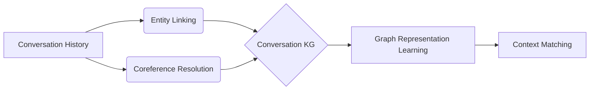

# 【LangChain编程：从入门到实践】ConversationKGMemory

作者：禅与计算机程序设计艺术 / Zen and the Art of Computer Programming

## 1. 背景介绍
### 1.1 问题的由来
在自然语言处理和对话系统领域,如何让机器能够像人一样进行多轮对话,并且能够根据上下文理解和记忆之前的对话内容,一直是一个具有挑战性的问题。传统的对话系统通常采用有限状态机或者基于规则的方法,难以处理开放域的对话和复杂的上下文关系。近年来,随着大规模预训练语言模型如 BERT、GPT 等的出现和发展,基于语言模型的开放域对话系统成为了研究的热点。

### 1.2 研究现状
目前,业界已经涌现出一批优秀的开源对话系统开发框架,如 DeepPavlov、Rasa、ParlAI 等,极大地降低了构建对话系统的门槛。其中,LangChain 作为一个快速发展的 Python 语言生态系统,为开发基于 LLM 的应用提供了丰富的工具集。LangChain 中的 Memory 模块为多轮对话中的上下文信息管理提供了解决方案。然而,现有的 Memory 实现大多基于线性存储,很难建模对话中的知识图谱关系。

### 1.3 研究意义 
本文围绕 LangChain 中的 ConversationKGMemory 展开,旨在探索如何利用知识图谱增强 LLM 在多轮对话中的上下文理解和记忆能力。ConversationKGMemory 通过引入知识图谱作为外部记忆,可以更好地对话中的实体、属性、关系等进行表示和推理。这不仅有助于提升对话系统的连贯性和一致性,还为知识驱动的对话生成提供了新的思路。

### 1.4 本文结构
本文将从以下几个方面展开论述:
- 第2部分介绍 ConversationKGMemory 的核心概念与内在联系 
- 第3部分重点阐述 ConversationKGMemory 的核心算法原理和具体操作步骤
- 第4部分从数学角度对算法背后的模型和公式进行详细推导和举例说明
- 第5部分给出了基于 ConversationKGMemory 的项目实践,包括代码实例和详细解释
- 第6部分讨论 ConversationKGMemory 在实际场景中的应用案例和未来应用前景
- 第7部分推荐了学习 ConversationKGMemory 相关的工具、资源和论文
- 第8部分对全文进行总结,并对 ConversationKGMemory 的未来发展趋势和挑战进行展望
- 第9部分的附录中列举了一些常见问题与解答

## 2. 核心概念与联系
ConversationKGMemory 的核心概念包括:

- Knowledge Graph(知识图谱):用图数据结构表示实体及其关系的知识库,其中节点表示实体,边表示实体间的语义关系。知识图谱可以提供结构化、语义化的知识表示。

- Conversation History(对话历史):指代对话过程中产生的一系列文本数据,包括用户的输入和系统的回复。对话历史蕴含着丰富的上下文信息。

- Entity Linking(实体链接):将对话历史中的文本 mention 链接到知识图谱中的实体节点的过程。实体链接是构建对话知识图谱的关键步骤。

- Coreference Resolution(共指消解):识别对话中指代同一实体的不同表述(如代词、同义词等)的任务。共指消解有助于追踪对话焦点的演化。  

- Graph Representation Learning(图表示学习):将图结构数据映射到连续低维向量空间,同时最大程度保留图的结构和属性信息的方法。通过图表示学习,可以方便地计算节点和子图的语义相似度。

ConversationKGMemory 利用知识图谱对话历史进行表示,通过实体链接和共指消解构建出随对话不断演化的知识图谱,并使用图表示学习等方法计算当前对话焦点与知识图谱各部分的相关性,从而实现更精准的上下文记忆与匹配。

## 3. 核心算法原理 & 具体操作步骤
### 3.1 算法原理概述
ConversationKGMemory 的核心算法可以分为以下几个步骤:
1. 对话历史的文本表示:将对话历史中的每个句子转换为向量表示,常见的方法有 TF-IDF、Word2Vec、BERT 等。
2. 实体识别与链接:使用命名实体识别(NER)模型检测对话中的实体提及,并与知识图谱中的实体节点进行链接。
3. 共指消解:通过规则或机器学习方法判断代词和其他指称表达的指代对象,将它们链接到同一实体节点上。
4. 知识图谱的动态建构:基于实体链接和共指消解的结果,动态地更新知识图谱,添加新的实体节点和关系边。
5. 图表示学习:使用 TransE、GraphSAGE 等图表示学习算法,将知识图谱的结构信息编码到实体和关系的低维向量表示中。
6. 上下文相关性计算:计算当前对话焦点与知识图谱中各个节点和子图的语义相似度,选取最相关的部分作为匹配的上下文。

### 3.2 算法步骤详解
下面我们对每个步骤进行更详细的说明:
1. 对话历史的文本表示:
   - 将对话历史按照句子或话轮进行切分,得到一系列文本片段 $\{s_1, s_2, ..., s_n\}$。
   - 对每个片段 $s_i$,使用预训练的语言模型(如 BERT)进行编码,得到其语义向量表示 $\mathbf{v}_i$。
   - 将所有片段的向量表示拼接成一个矩阵 $\mathbf{H} = [\mathbf{v}_1, \mathbf{v}_2, ..., \mathbf{v}_n]$。

2. 实体识别与链接:
   - 对每个片段 $s_i$ 进行命名实体识别,得到一系列实体提及 $\{m_1, m_2, ..., m_k\}$。
   - 对每个提及 $m_j$,计算其与知识图谱中所有实体节点的相似度,选取相似度最高的节点作为链接对象:
     $$e_j = \arg\max_{e \in \mathcal{E}} \mathrm{sim}(m_j, e)$$
     其中 $\mathcal{E}$ 表示知识图谱的实体节点集合,$\mathrm{sim}$ 表示相似度计算函数,可以使用字符串匹配、语义嵌入等方法。

3. 共指消解:
   - 对每个代词和指称表达 $c_i$,根据其上下文和语法特征,判断其指代的实体 $e_i$。常见的方法包括启发式规则和机器学习分类器。
   - 将 $c_i$ 链接到之前对应的实体节点 $e_i$ 上。

4. 知识图谱的动态建构:  
   - 将新识别出的实体节点和关系边添加到原有的知识图谱 $\mathcal{G}$ 中:
     $$\mathcal{G} \leftarrow \mathcal{G} \cup \{e_j\} \cup \{r(e_j, e_k)\}$$
     其中 $r(e_j, e_k)$ 表示实体 $e_j$ 和 $e_k$ 之间新发现的关系边。
   - 使用一些先验规则或者知识图谱补全算法,推断出一些隐含的关系边。

5. 图表示学习:
   - 将知识图谱 $\mathcal{G}$ 视为一个无向图,节点集合为 $\mathcal{V}$,边集合为 $\mathcal{E}$。
   - 使用随机游走的方式生成节点序列 $\{v_1, v_2, ..., v_m\}$,每个节点 $v_i$ 与其前后窗口内的节点构成正样本对,与随机采样的节点构成负样本对。
   - 使用 SkipGram 等模型学习节点的低维嵌入表示 $\mathbf{z}_i$,优化目标为最大化正样本对的相似度,最小化负样本对的相似度:
     $$\mathcal{L} = \sum_{i=1}^m \sum_{j=i-w}^{i+w} \log \sigma(\mathbf{z}_i^\top \mathbf{z}_j) + \sum_{i=1}^m \sum_{k=1}^K \log \sigma(-\mathbf{z}_i^\top \mathbf{z}_{k})$$
     其中 $w$ 为上下文窗口大小,$K$ 为负采样数,$\sigma$ 为 sigmoid 函数。

6. 上下文相关性计算:
   - 将当前对话焦点 $q$ 表示为向量 $\mathbf{q}$,与知识图谱中每个节点的嵌入向量 $\mathbf{z}_i$ 计算余弦相似度:
     $$s_i = \cos(\mathbf{q}, \mathbf{z}_i) = \frac{\mathbf{q}^\top \mathbf{z}_i}{\|\mathbf{q}\| \|\mathbf{z}_i\|}$$
   - 选取相似度最高的 $k$ 个节点作为最相关的上下文记忆:
     $$\mathcal{C} = \mathrm{topk}_{i=1}^n(s_i, k)$$

### 3.3 算法优缺点
ConversationKGMemory 算法的主要优点包括:
- 引入知识图谱,提供了结构化、语义化的外部记忆,增强了上下文表示的丰富性。
- 动态构建对话知识图谱,可以实时追踪对话话题的演化,捕捉新的实体和关系。
- 基于图表示学习的上下文匹配,克服了传统基于字面匹配的局限性。

但该算法也存在一些局限和不足:
- 对话历史的文本表示和实体链接的效果依赖于底层的语言模型和知识库的质量。
- 共指消解在一些复杂的多人对话场景中仍然面临挑战。
- 知识图谱的动态建构需要权衡新加入知识的置信度和噪声。
- 在线学习知识图谱嵌入的计算开销较大。

### 3.4 算法应用领域
ConversationKGMemory 算法可以应用于以下几个领域:
- 任务型对话系统:通过知识图谱记忆用户意图和槽位信息,实现多轮任务跟踪和填充。
- 知识驱动的开放域对话:利用外部知识图谱生成信息丰富、连贯一致的回复。  
- 个性化推荐系统:根据用户对话构建个性化知识图谱,提供更精准的推荐内容。
- 智能问答系统:基于知识图谱检索与问题最相关的答案段落。

## 4. 数学模型和公式 & 详细讲解 & 举例说明
### 4.1 数学模型构建
ConversationKGMemory 的数学模型可以用一个五元组 $(\mathcal{G}, \mathbf{H}, \mathbf{E}, \mathbf{Z}, \mathbf{S})$ 来表示:
- $\mathcal{G} = (\mathcal{V}, \mathcal{E})$ 表示对话知识图谱,其中 $\mathcal{V}$ 为实体节点集合,$\mathcal{E}$ 为关系边集合。
- $\mathbf{H} \in \mathbb{R}^{n \times d}$ 表示对话历史的文本表示矩阵,其中 $n$ 为句子数,$d$ 为语义向量维度。
- $\mathbf{E} \in \mathbb{R}^{|\mathcal{V}| \times d}$ 表示实体节点的语义嵌入矩阵。
- $\mathbf{Z} \in \mathbb{R}^{|\mathcal{V}| \times k}$ 表示实体节点的图嵌入矩阵,其中 $k$ 为嵌入维度。
- $\mathbf{S} \in \mathbb{R}^{|\mathcal{V}|}$ 表示当前对话焦点与