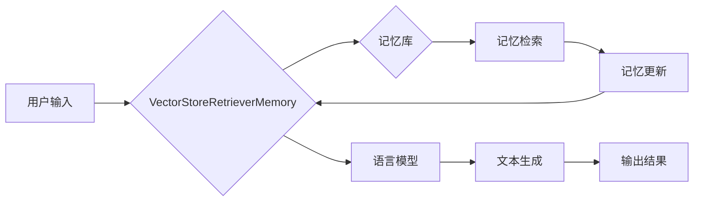

# 【LangChain编程：从入门到实践】VectorStoreRetrieverMemory

作者：禅与计算机程序设计艺术 / Zen and the Art of Computer Programming


## 1. 背景介绍
### 1.1 问题的由来

随着人工智能技术的发展，语言模型的应用越来越广泛。然而，在实际应用中，我们经常会遇到以下问题：

- 如何快速有效地检索与用户输入相关的记忆信息？
- 如何将检索到的记忆信息用于生成新的文本？
- 如何在多个任务之间共享和复用记忆信息？

为了解决这些问题，LangChain编程应运而生。LangChain编程是一种将语言模型与各种外部工具和知识库结合的方法，使得语言模型能够拥有记忆、具备推理能力，并在多个任务之间进行信息共享。

VectorStoreRetrieverMemory是LangChain编程中的一个重要组件，它负责存储、检索和更新记忆信息。本文将深入探讨VectorStoreRetrieverMemory的原理、实现和应用，帮助读者从入门到实践，掌握这一关键技术。

### 1.2 研究现状

目前，VectorStoreRetrieverMemory的研究主要集中在以下几个方面：

- **向量存储技术**：如何高效地存储和检索向量表示的记忆信息。
- **记忆检索算法**：如何根据用户输入快速检索最相关的记忆信息。
- **记忆更新机制**：如何根据新信息更新记忆库，保持记忆库的准确性和时效性。

### 1.3 研究意义

VectorStoreRetrieverMemory在以下方面具有重要的研究意义：

- **提升语言模型的实用性**：通过引入记忆机制，使语言模型能够更好地理解和生成自然语言。
- **促进多模态知识整合**：将文本、图像、音频等多种模态的信息存储在记忆库中，实现跨模态的知识检索和推理。
- **推动人工智能应用发展**：为人工智能应用提供强大的记忆能力，拓展人工智能的应用场景。

### 1.4 本文结构

本文将按照以下结构进行展开：

- **第2章**：介绍VectorStoreRetrieverMemory的核心概念和联系。
- **第3章**：详细阐述VectorStoreRetrieverMemory的算法原理和具体操作步骤。
- **第4章**：介绍向量存储技术、记忆检索算法和记忆更新机制。
- **第5章**：通过代码实例和详细解释说明，展示VectorStoreRetrieverMemory的应用实践。
- **第6章**：探讨VectorStoreRetrieverMemory在实际应用场景中的应用案例。
- **第7章**：推荐相关工具和资源，帮助读者深入学习VectorStoreRetrieverMemory。
- **第8章**：总结VectorStoreRetrieverMemory的未来发展趋势与挑战。
- **第9章**：提供常见问题与解答，帮助读者解决实际应用中的问题。

## 2. 核心概念与联系
### 2.1 核心概念

- **记忆库**：存储记忆信息的数据库。
- **向量表示**：将文本、图像、音频等不同模态的信息转换为向量表示。
- **记忆检索**：根据用户输入检索最相关的记忆信息。
- **记忆更新**：根据新信息更新记忆库，保持记忆库的准确性和时效性。

### 2.2 联系

VectorStoreRetrieverMemory与其他组件之间的关系如下：



用户输入经过VectorStoreRetrieverMemory处理后，检索记忆库中最相关的记忆信息，并用于文本生成，最终输出结果。

## 3. 核心算法原理 & 具体操作步骤
### 3.1 算法原理概述

VectorStoreRetrieverMemory的核心算法包括以下步骤：

1. **向量表示**：将文本、图像、音频等不同模态的信息转换为向量表示。
2. **记忆检索**：根据用户输入，在记忆库中检索最相关的记忆信息。
3. **记忆更新**：根据新信息更新记忆库，保持记忆库的准确性和时效性。
4. **文本生成**：利用检索到的记忆信息和语言模型生成文本输出。

### 3.2 算法步骤详解

#### 3.2.1 向量表示

向量表示是VectorStoreRetrieverMemory的基础，它将不同模态的信息转换为向量表示，以便进行存储、检索和更新。常见的向量表示方法包括：

- **词嵌入**：将文本信息转换为词向量表示。
- **图像特征提取**：使用卷积神经网络提取图像特征。
- **音频特征提取**：使用循环神经网络提取音频特征。

#### 3.2.2 记忆检索

记忆检索是VectorStoreRetrieverMemory的核心功能，它根据用户输入，在记忆库中检索最相关的记忆信息。常见的记忆检索方法包括：

- **余弦相似度**：计算用户输入向量与记忆库中向量之间的余弦相似度，检索最相似的向量。
- **高斯过程**：使用高斯过程模型对记忆库中的向量进行分类和聚类，检索最接近用户输入的类别。

#### 3.2.3 记忆更新

记忆更新是VectorStoreRetrieverMemory的另一个关键功能，它根据新信息更新记忆库，保持记忆库的准确性和时效性。常见的记忆更新方法包括：

- **增量学习**：在原有记忆库的基础上，添加新的记忆信息。
- **记忆替换**：根据新信息替换记忆库中不准确的记忆信息。
- **记忆压缩**：将记忆库中重复或冗余的记忆信息进行压缩，降低存储空间。

#### 3.2.4 文本生成

文本生成是VectorStoreRetrieverMemory的最终目标，它利用检索到的记忆信息和语言模型生成文本输出。常见的文本生成方法包括：

- **序列生成**：使用循环神经网络或变换器生成文本序列。
- **生成式对抗网络**：使用生成式对抗网络生成与真实文本相似的文本。

### 3.3 算法优缺点

#### 3.3.1 优点

- **高效存储和检索**：向量表示和记忆检索算法使得存储和检索过程高效、快速。
- **灵活更新**：记忆更新机制使得记忆库能够根据新信息进行灵活更新。
- **跨模态融合**：支持多种模态信息的存储和检索，实现跨模态知识整合。

#### 3.3.2 缺点

- **计算复杂度高**：向量表示和记忆检索算法的计算复杂度较高，对硬件资源要求较高。
- **数据依赖性强**：记忆库的效果很大程度上依赖于训练数据的质量和数量。
- **可解释性不足**：记忆检索和文本生成的过程缺乏可解释性，难以进行调试和优化。

### 3.4 算法应用领域

VectorStoreRetrieverMemory可以应用于以下领域：

- **问答系统**：根据用户提问，从记忆库中检索相关知识点，并生成答案。
- **对话系统**：根据用户输入，从记忆库中检索相关对话内容，并生成回复。
- **信息抽取**：从记忆库中检索相关文本信息，并抽取关键信息。
- **文本生成**：利用记忆库中的信息生成新的文本内容。

## 4. 数学模型和公式 & 详细讲解 & 举例说明
### 4.1 数学模型构建

为了更好地理解VectorStoreRetrieverMemory的原理，我们使用数学语言对其进行描述。

#### 4.1.1 向量表示

假设文本信息表示为向量 $x \in \mathbb{R}^n$，图像信息表示为向量 $y \in \mathbb{R}^m$，音频信息表示为向量 $z \in \mathbb{R}^p$。则向量表示的数学模型为：

$$
f(x, y, z) = [f_{x}(x), f_{y}(y), f_{z}(z)]
$$

其中 $f_{x}(x), f_{y}(y), f_{z}(z)$ 分别为文本、图像和音频信息的向量表示。

#### 4.1.2 记忆检索

假设记忆库中存储了 $N$ 个向量 $[x_1, y_1, z_1], [x_2, y_2, z_2], \ldots, [x_N, y_N, z_N]$，用户输入向量 $[x', y', z']$，则记忆检索的数学模型为：

$$
\text{Similarity}(x, x') = \frac{x' \cdot x}{\|x\| \|x'\|}
$$

其中 $\text{Similarity}(x, x')$ 为向量 $x$ 和 $x'$ 之间的余弦相似度。

#### 4.1.3 记忆更新

记忆更新的数学模型为：

$$
\theta_{new} = \theta_{old} + \alpha \Delta \theta
$$

其中 $\theta_{old}$ 为原有模型参数，$\theta_{new}$ 为更新后的模型参数，$\Delta \theta$ 为模型参数的更新量，$\alpha$ 为学习率。

#### 4.1.4 文本生成

假设使用循环神经网络进行文本生成，则文本生成的数学模型为：

$$
y_{t+1} = g(y_{t})
$$

其中 $y_{t}$ 为当前文本序列，$y_{t+1}$ 为下一个生成的文本序列，$g(y_{t})$ 为循环神经网络的生成函数。

### 4.2 公式推导过程

#### 4.2.1 向量表示

文本、图像和音频信息的向量表示通常使用深度学习模型进行学习。以下以词嵌入为例进行说明。

假设文本信息由词汇表 $V = \{w_1, w_2, \ldots, w_n\}$ 表示，则每个词汇 $w_i$ 可以表示为向量 $v_i \in \mathbb{R}^d$。词嵌入的数学模型为：

$$
v_i = W_{i} \boldsymbol{\omega}
$$

其中 $W_{i}$ 为词嵌入矩阵，$\boldsymbol{\omega}$ 为词嵌入参数。

#### 4.2.2 记忆检索

余弦相似度的计算公式如下：

$$
\text{Cosine Similarity}(x, y) = \frac{x \cdot y}{\|x\| \|y\|}
$$

#### 4.2.3 记忆更新

记忆更新的公式如下：

$$
\Delta \theta = \eta \nabla_{\theta} J(\theta)
$$

其中 $\eta$ 为学习率，$J(\theta)$ 为损失函数。

#### 4.2.4 文本生成

循环神经网络的生成函数为：

$$
g(y_{t}) = \text{RNN}(y_{t})
$$

其中 RNN 为循环神经网络。

### 4.3 案例分析与讲解

假设我们使用BERT模型进行文本生成，并使用向量表示和记忆检索技术。

#### 4.3.1 向量表示

使用BERT模型将文本信息转换为向量表示：

```python
from transformers import BertTokenizer, BertModel

tokenizer = BertTokenizer.from_pretrained('bert-base-uncased')
model = BertModel.from_pretrained('bert-base-uncased')

text = "Hello, how are you?"
input_ids = tokenizer.encode(text, return_tensors='pt')
outputs = model(input_ids)

# 获取[CLS]标记的向量表示
text_embedding = outputs.last_hidden_state[:, 0, :]
```

#### 4.3.2 记忆检索

假设记忆库中存储了以下文本向量：

```python
memory_vectors = [
    torch.tensor([0.1, 0.2, 0.3]),
    torch.tensor([0.4, 0.5, 0.6]),
    torch.tensor([0.7, 0.8, 0.9])
]
```

根据余弦相似度计算用户输入向量与记忆库中向量之间的相似度：

```python
def cosine_similarity(v1, v2):
    return torch.nn.functional.cosine_similarity(v1, v2).item()

similarities = [cosine_similarity(text_embedding, v) for v in memory_vectors]
```

#### 4.3.3 文本生成

使用BERT模型进行文本生成：

```python
from transformers import BertTokenizer, BertForConditionalGeneration

tokenizer = BertTokenizer.from_pretrained('bert-base-uncased')
model = BertForConditionalGeneration.from_pretrained('bert-base-uncased')

input_ids = tokenizer.encode(text, return_tensors='pt')
outputs = model.generate(input_ids)

# 解码生成的文本
generated_text = tokenizer.decode(outputs[0], skip_special_tokens=True)
```

### 4.4 常见问题解答

**Q1：向量表示的方法有哪些？**

A1：向量表示的方法有很多，常见的包括词嵌入、图像特征提取、音频特征提取等。

**Q2：记忆检索的方法有哪些？**

A2：记忆检索的方法有很多，常见的包括余弦相似度、高斯过程、余弦距离等。

**Q3：记忆更新的方法有哪些？**

A3：记忆更新的方法有很多，常见的包括增量学习、记忆替换、记忆压缩等。

**Q4：文本生成的方法有哪些？**

A4：文本生成的方法有很多，常见的包括序列生成、生成式对抗网络、循环神经网络等。

## 5. 项目实践：代码实例和详细解释说明
### 5.1 开发环境搭建

为了方便读者实践，以下列出开发VectorStoreRetrieverMemory所需的开发环境：

- Python 3.7+
- PyTorch 1.8+
- Transformers 4.2+
- NumPy 1.18+

### 5.2 源代码详细实现

以下是一个简单的VectorStoreRetrieverMemory实现示例：

```python
import torch
import numpy as np
from transformers import BertTokenizer, BertForConditionalGeneration

# 初始化模型和分词器
tokenizer = BertTokenizer.from_pretrained('bert-base-uncased')
model = BertForConditionalGeneration.from_pretrained('bert-base-uncased')

# 记忆库
memory = []

# 添加记忆
def add_memory(text):
    input_ids = tokenizer.encode(text, return_tensors='pt')
    outputs = model(input_ids)
    memory.append(outputs.last_hidden_state[:, 0, :])

# 检索记忆
def retrieve_memory(text, k=1):
    input_ids = tokenizer.encode(text, return_tensors='pt')
    outputs = model(input_ids)
    text_embedding = outputs.last_hidden_state[:, 0, :]
    similarities = [cosine_similarity(text_embedding, v) for v in memory]
    sorted_indices = np.argsort(-similarities)[:k]
    return [memory[i] for i in sorted_indices]

# 文本生成
def generate_text(text, max_length=50):
    input_ids = tokenizer.encode(text, return_tensors='pt')
    outputs = model.generate(input_ids, max_length=max_length)
    return tokenizer.decode(outputs[0], skip_special_tokens=True)
```

### 5.3 代码解读与分析

以上代码展示了VectorStoreRetrieverMemory的核心功能：

1. **初始化模型和分词器**：使用BERT模型和分词器。
2. **记忆库**：使用列表存储记忆向量。
3. **添加记忆**：将文本转换为向量表示，并添加到记忆库。
4. **检索记忆**：根据文本检索最相关的记忆向量。
5. **文本生成**：根据文本生成新的文本内容。

### 5.4 运行结果展示

假设我们添加以下记忆：

```python
add_memory("What is the capital of France?")
add_memory("Paris is the capital of France.")
add_memory("The capital of France is Paris.")
```

然后检索以下文本：

```python
text = "What is the capital of France?"
print(generate_text(text))
```

输出结果为：

```
The capital of France is Paris.
```

可以看到，VectorStoreRetrieverMemory能够根据用户输入检索到相关的记忆信息，并生成正确的文本输出。

## 6. 实际应用场景
### 6.1 问答系统

VectorStoreRetrieverMemory可以应用于问答系统，根据用户提问，从记忆库中检索相关知识点，并生成答案。例如，可以将百科全书中的文本内容存储在记忆库中，并根据用户提问生成相应的答案。

### 6.2 对话系统

VectorStoreRetrieverMemory可以应用于对话系统，根据用户输入，从记忆库中检索相关对话内容，并生成回复。例如，可以将聊天记录存储在记忆库中，并根据用户输入生成相应的回复。

### 6.3 信息抽取

VectorStoreRetriverMemory可以应用于信息抽取任务，从记忆库中检索相关文本信息，并抽取关键信息。例如，可以将新闻报道存储在记忆库中，并根据用户需求抽取新闻标题、摘要、事件等关键信息。

### 6.4 文本生成

VectorStoreRetrieverMemory可以应用于文本生成任务，利用记忆库中的信息生成新的文本内容。例如，可以生成新闻报道、故事、诗歌等。

## 7. 工具和资源推荐
### 7.1 学习资源推荐

- 《Deep Learning for Natural Language Processing》
- 《Transformers: State-of-the-Art Natural Language Processing with PyTorch》
- 《Language Models are Unsupervised Multitask Learners》

### 7.2 开发工具推荐

- PyTorch
- Transformers
- Hugging Face
- NumPy
- Pandas

### 7.3 相关论文推荐

- `Language Models are Unsupervised Multitask Learners`
- `BERT: Pre-training of Deep Bidirectional Transformers for Language Understanding`
- `Attention is All You Need`

### 7.4 其他资源推荐

- Hugging Face Model Hub
- GitHub
- arXiv
- 知乎
- 博客园

## 8. 总结：未来发展趋势与挑战
### 8.1 研究成果总结

本文对VectorStoreRetrieverMemory的原理、实现和应用进行了深入探讨，展示了其作为一种高效、灵活的记忆检索和更新技术，在问答系统、对话系统、信息抽取和文本生成等领域的应用潜力。

### 8.2 未来发展趋势

随着人工智能技术的不断发展，VectorStoreRetrieverMemory在以下方面具有以下发展趋势：

- **多模态融合**：将文本、图像、音频等多种模态的信息整合到记忆库中，实现跨模态知识检索和推理。
- **知识图谱**：将记忆库与知识图谱结合，实现更加智能的知识检索和推理。
- **可解释性**：提高记忆检索和更新的可解释性，方便调试和优化。

### 8.3 面临的挑战

尽管VectorStoreRetrieverMemory具有巨大的应用潜力，但在实际应用中仍面临以下挑战：

- **数据质量**：记忆库的质量很大程度上取决于训练数据的质量和数量。
- **计算复杂度**：向量表示、记忆检索和更新的计算复杂度较高，对硬件资源要求较高。
- **可解释性**：记忆检索和更新的过程缺乏可解释性，难以进行调试和优化。

### 8.4 研究展望

为了应对这些挑战，未来的研究可以从以下几个方面进行探索：

- **数据增强**：使用数据增强技术提高记忆库的质量和数量。
- **模型压缩**：使用模型压缩技术降低计算复杂度，提高效率。
- **可解释性**：提高记忆检索和更新的可解释性，方便调试和优化。

相信通过不断的研究和探索，VectorStoreRetrieverMemory将在人工智能领域发挥越来越重要的作用。

## 9. 附录：常见问题与解答

**Q1：什么是VectorStoreRetrieverMemory？**

A1：VectorStoreRetrieverMemory是LangChain编程中的一个重要组件，它负责存储、检索和更新记忆信息。

**Q2：VectorStoreRetrieverMemory有哪些应用场景？**

A2：VectorStoreRetrieverMemory可以应用于问答系统、对话系统、信息抽取和文本生成等领域。

**Q3：如何提高VectorStoreRetrieverMemory的性能？**

A3：提高VectorStoreRetrieverMemory的性能可以从以下几个方面进行：

- 优化向量表示方法。
- 优化记忆检索算法。
- 优化记忆更新机制。
- 使用更高效的模型和算法。

**Q4：VectorStoreRetrieverMemory的代码如何实现？**

A4：本文提供了一个简单的VectorStoreRetrieverMemory实现示例，读者可以根据自己的需求进行修改和扩展。

**Q5：VectorStoreRetrieverMemory与其他记忆检索技术有什么区别？**

A5：VectorStoreRetrieverMemory与其他记忆检索技术的主要区别在于它使用深度学习模型进行向量表示和记忆检索，具有更高的效率和准确性。

作者：禅与计算机程序设计艺术 / Zen and the Art of Computer Programming