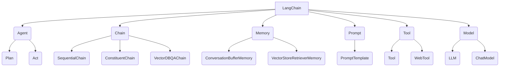

# 【LangChain编程：从入门到实践】专用Chain

## 1. 背景介绍

### 1.1 问题的由来

在当今数据驱动的时代,人工智能(AI)和大数据分析已经成为各行业的核心竞争力。随着数据量的快速增长和复杂性的提高,传统的数据处理方式已经无法满足现代应用的需求。因此,需要一种更加灵活、可扩展和高效的方式来处理和利用这些海量的结构化和非结构化数据。

LangChain是一个新兴的Python库,旨在简化人工智能(AI)应用程序的开发过程,特别是针对自然语言处理(NLP)和大型语言模型(LLM)的应用。它提供了一种模块化和可组合的方式来构建AI应用程序,使开发人员能够更轻松地集成和管理不同的AI模型、数据源和工具。

### 1.2 研究现状

目前,虽然已经有许多AI框架和库可供使用,但它们往往专注于特定的任务或领域,缺乏通用性和灵活性。开发人员需要手动集成和管理不同的组件,这可能会导致代码复杂性增加、开发效率降低和维护成本提高。

LangChain旨在解决这些问题,它提供了一种统一的接口来处理各种AI任务,包括问答系统、文本摘要、文本生成等。它支持多种AI模型和数据源,如GPT-3、BERT、ElasticSearch等,并提供了一系列预构建的链(Chain)来简化常见任务的开发过程。

### 1.3 研究意义

LangChain的出现为AI应用程序的开发带来了新的机遇和挑战。它提供了一种新的编程范式,使开发人员能够更加专注于业务逻辑,而不必过多关注底层的技术细节。同时,它也带来了一些新的挑战,如如何有效地管理和优化AI模型的性能、如何确保数据隐私和安全等。

本文旨在深入探讨LangChain的核心概念、算法原理和实际应用,为读者提供一个全面的理解和实践指南。通过本文,读者将能够掌握LangChain的基本用法,了解其内部工作原理,并学习如何利用它来构建自己的AI应用程序。

### 1.4 本文结构

本文将分为以下几个部分:

1. 背景介绍
2. 核心概念与联系
3. 核心算法原理与具体操作步骤
4. 数学模型和公式详细讲解与举例说明
5. 项目实践:代码实例和详细解释说明
6. 实际应用场景
7. 工具和资源推荐
8. 总结:未来发展趋势与挑战
9. 附录:常见问题与解答

## 2. 核心概念与联系

LangChain是一个强大的Python库,它将多个AI组件集成到一个统一的框架中。它的核心概念包括:

1. **Agent**: 代理是LangChain中最高级别的抽象,它可以根据给定的目标和工具自主地规划和执行行动。代理通常由一个LLM(大型语言模型)驱动,并使用一个规划器(Planner)来决定下一步的行动。

2. **Chain**: 链是LangChain中的核心概念,它将多个组件(如LLM、工具、内存等)连接在一起,形成一个可复用的流程。LangChain提供了多种预构建的链,如`SequentialChain`、`ConstituentChain`和`VectorDBQAChain`等。

3. **Memory**: 内存用于存储和管理代理或链的状态和上下文信息。LangChain支持多种内存类型,如`ConversationBufferMemory`和`VectorStoreRetrieverMemory`等。

4. **Prompt**: 提示是与LLM交互的关键,它定义了输入和输出的格式。LangChain提供了`PromptTemplate`类来方便地构建和管理提示。

5. **Tool**: 工具是LangChain中的一种抽象,它封装了外部资源或功能,如Web API、数据库查询或本地函数等。代理可以调用这些工具来完成特定的任务。

6. **Model**: 模型是LangChain中的另一个重要概念,它指的是底层的AI模型,如GPT-3、BERT或其他自然语言处理模型。LangChain支持多种模型类型,包括`LLM`(大型语言模型)和`ChatModel`(对话模型)等。

这些核心概念相互关联,共同构建了LangChain的整体架构。开发人员可以根据需求灵活地组合和配置这些组件,从而构建出各种复杂的AI应用程序。

## 3. 核心算法原理与具体操作步骤

### 3.1 算法原理概述

LangChain的核心算法原理是基于**代理-环境交互**的范式。这种范式源自强化学习领域,其基本思想是:代理通过与环境交互,不断观察环境状态、执行行动并获得反馈,从而学习如何完成特定任务。

在LangChain中,代理是一个智能化的决策中心,它由一个LLM(大型语言模型)驱动。代理可以访问各种工具(如Web API、数据库查询等)和内存组件,以获取所需的信息和上下文。代理的目标是根据给定的指令,规划和执行一系列行动,从而完成预期的任务。

LangChain提供了多种预构建的链(Chain),它们封装了常见的AI任务流程,如问答系统、文本摘要、文本生成等。这些链由多个组件组成,如LLM、工具、内存等,它们按照特定的顺序或逻辑连接在一起。

当用户调用一个链时,它会根据预定义的流程执行相应的操作。例如,在问答系统中,链可能首先使用一个检索器从知识库中查找相关信息,然后将这些信息传递给LLM生成答案,最后将答案返回给用户。

### 3.2 算法步骤详解

LangChain的核心算法可以概括为以下几个步骤:

1. **初始化**: 在这个步骤中,用户需要配置和初始化所需的组件,如LLM、工具、内存等。这些组件将被组合成一个代理或链。

2. **观察**: 代理或链会观察当前的环境状态,包括用户的输入、上下文信息、可用的工具和内存等。

3. **规划**: 基于观察到的状态,代理需要规划出一系列行动来完成预期的任务。这通常由一个规划器(Planner)来实现,它可以是一个基于规则的系统,也可以是一个学习型的模型。

4. **执行**: 代理执行规划好的行动,这可能涉及调用工具、查询内存、与LLM交互等操作。

5. **反馈**: 代理根据执行行动的结果,获得环境的反馈。这些反馈可能是新的观察结果、奖励信号或任务完成的指示等。

6. **更新**: 基于获得的反馈,代理可以更新其内部状态和上下文信息,为下一次迭代做准备。

7. **迭代**: 如果任务尚未完成,代理将重复执行步骤2到步骤6,直到任务完成或达到预定的终止条件。

这个过程可以被视为一个马尔可夫决策过程(MDP),其中代理通过与环境交互来学习最优策略。在LangChain中,这个过程是由代理或链的内部逻辑来驱动和控制的。

### 3.3 算法优缺点

LangChain的核心算法具有以下优点:

1. **模块化和可组合性**: LangChain将不同的AI组件(如LLM、工具、内存等)解耦,使它们可以被灵活地组合和配置。这提高了代码的可重用性和可维护性。

2. **高度抽象和封装**: LangChain提供了高级别的抽象,如代理和链,这使得开发人员可以更加专注于业务逻辑,而不必过多关注底层的技术细节。

3. **支持多种模型和数据源**: LangChain支持多种AI模型(如GPT-3、BERT等)和数据源(如ElasticSearch、Weaviate等),这为构建复杂的AI应用程序提供了良好的基础。

4. **可扩展性**: LangChain的架构设计使得它可以轻松地扩展和集成新的组件,如新的LLM、工具或内存类型等。

然而,LangChain的算法也存在一些缺点和挑战:

1. **性能和资源消耗**: 由于涉及多个组件的交互和通信,LangChain的性能可能会受到一定影响,特别是在处理大规模数据或高并发场景时。此外,使用大型语言模型也可能导致较高的计算资源消耗。

2. **可解释性和可控性**: LangChain中的决策过程可能存在一定的黑盒操作,特别是当使用大型语言模型时。这可能会影响系统的可解释性和可控性。

3. **安全和隐私风险**: 由于LangChain可以访问各种外部资源和数据源,因此需要格外注意潜在的安全和隐私风险,如数据泄露、恶意攻击等。

4. **成本和资源管理**: 使用LangChain可能会产生额外的成本,如云服务费用、API调用费用等。同时,也需要合理管理和分配计算资源,以确保系统的稳定性和可用性。

### 3.4 算法应用领域

LangChain的核心算法可以应用于多个领域,包括但不限于:

1. **问答系统**: 利用LangChain构建智能问答系统,从知识库中检索相关信息并生成自然语言回答。

2. **文本摘要**: 使用LangChain对长文本进行自动摘要,提取关键信息和要点。

3. **文本生成**: 利用LangChain生成各种类型的文本内容,如新闻报道、故事、诗歌等。

4. **任务自动化**: 将LangChain与各种工具和API集成,实现任务自动化,如数据处理、报告生成等。

5. **智能助手**: 构建基于对话的智能助手,为用户提供个性化的服务和支持。

6. **知识管理**: 利用LangChain对知识库进行管理和维护,如知识提取、知识图谱构建等。

7. **决策支持系统**: 将LangChain集成到决策支持系统中,提供智能化的决策建议和分析。

8. **教育和学习**: 在教育和学习领域,LangChain可以用于构建智能教学助手、自适应学习系统等。

总的来说,LangChain为构建各种AI应用程序提供了一个统一的框架和工具集,它的应用前景广阔,有望在多个领域发挥重要作用。

## 4. 数学模型和公式详细讲解与举例说明

### 4.1 数学模型构建

在LangChain中,许多核心组件都基于数学模型和算法。例如,LLM(大型语言模型)通常采用transformer架构,其中自注意力机制和transformer编码器-解码器结构扮演着关键角色。

自注意力机制是transformer架构的核心,它允许模型捕捉输入序列中不同位置之间的依赖关系。给定一个输入序列 $X = (x_1, x_2, \dots, x_n)$,自注意力机制计算每个位置 $i$ 的注意力权重 $\alpha_{ij}$,表示位置 $i$ 对位置 $j$ 的注意力程度。然后,根据这些注意力权重对输入序列进行加权求和,得到每个位置的注意力表示 $z_i$:

$$z_i = \sum_{j=1}^n \alpha_{ij} (Wx_j)$$

其中 $W$ 是一个可学习的权重矩阵,用于将输入序列映射到注意力空间。

注意力权重 $\alpha_{ij