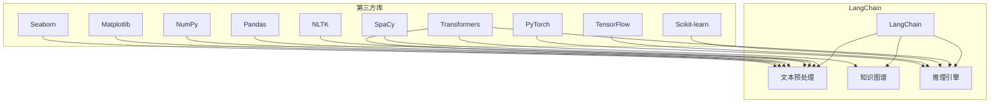

# 【LangChain编程：从入门到实践】其他库安装

作者：禅与计算机程序设计艺术 / Zen and the Art of Computer Programming

## 1. 背景介绍
### 1.1 问题的由来

在《LangChain编程：从入门到实践》中，我们已经学习了LangChain的基础知识和核心组件。然而，在实际应用中，仅使用LangChain提供的功能可能无法满足复杂场景的需求。这时，我们需要引入其他第三方库，以扩展LangChain的功能。本文将介绍如何安装和配置LangChain所需的其他库，并探讨其在不同应用场景中的使用。

### 1.2 研究现状

随着人工智能和自然语言处理技术的快速发展，越来越多的第三方库被开发出来，为LangChain提供了丰富的功能支持。这些库涵盖了自然语言处理、数据处理、可视化、机器学习等多个领域，为开发者提供了便捷的开发体验。

### 1.3 研究意义

掌握LangChain与其他库的集成方法，可以帮助开发者构建更加复杂、功能更强大的应用。通过引入合适的第三方库，可以简化开发流程，提高开发效率，并降低开发成本。

### 1.4 本文结构

本文将按照以下结构进行介绍：

- 第2部分：介绍LangChain所需的其他库及其功能。
- 第3部分：讲解如何安装和配置这些库。
- 第4部分：通过实例演示如何使用这些库与LangChain进行集成。
- 第5部分：探讨LangChain与其他库在实际应用场景中的使用。
- 第6部分：总结全文，展望LangChain与其他库的融合发展。

## 2. 核心概念与联系

LangChain与其他库的集成，主要涉及以下几个方面：

- **自然语言处理库**：如spaCy、NLTK、transformers等，用于文本预处理、分词、词性标注、实体识别等。
- **数据处理库**：如Pandas、NumPy、Scikit-learn等，用于数据清洗、转换、分析等。
- **可视化库**：如Matplotlib、Seaborn等，用于数据可视化。
- **机器学习库**：如scikit-learn、TensorFlow、PyTorch等，用于模型训练和预测。

这些库与LangChain的关联如下：



## 3. 核心算法原理 & 具体操作步骤
### 3.1 算法原理概述

LangChain与其他库的集成，主要基于以下原理：

- **API调用**：通过调用第三方库的API，实现相关功能。
- **封装**：将第三方库的功能封装成LangChain的组件，方便开发者使用。
- **插件化**：将第三方库以插件的形式集成到LangChain，提高扩展性。

### 3.2 算法步骤详解

以下是LangChain与其他库集成的基本步骤：

1. **选择合适的第三方库**：根据具体需求，选择合适的第三方库。
2. **安装第三方库**：使用pip安装所选库。
3. **导入库**：在Python代码中导入所选库。
4. **封装库功能**：将库的功能封装成LangChain的组件或插件。
5. **使用封装后的库**：在LangChain中使用封装后的库，实现相关功能。

### 3.3 算法优缺点

**优点**：

- **扩展性强**：通过引入第三方库，可以扩展LangChain的功能，满足更多场景的需求。
- **提高开发效率**：封装后的库可以简化开发流程，提高开发效率。
- **降低开发成本**：利用现有库的功能，可以降低开发成本。

**缺点**：

- **复杂性**：集成过多的第三方库，可能会增加项目的复杂性，难以维护。
- **兼容性**：不同库之间的兼容性问题可能会影响项目的稳定性。

### 3.4 算法应用领域

LangChain与其他库的集成，可以应用于以下领域：

- **文本分类**：利用NLP库进行文本预处理，使用scikit-learn进行分类。
- **情感分析**：利用NLP库进行文本预处理，使用scikit-learn进行情感分析。
- **命名实体识别**：利用NLP库进行文本预处理，使用scikit-learn进行实体识别。
- **问答系统**：利用NLP库进行文本预处理，使用scikit-learn进行问答匹配。
- **机器翻译**：利用NLP库进行文本预处理，使用机器学习库进行翻译模型训练。

## 4. 数学模型和公式 & 详细讲解 & 举例说明
### 4.1 数学模型构建

本节以文本分类任务为例，介绍LangChain与scikit-learn集成时的数学模型。

假设文本数据为 $X \in \mathbb{R}^{n \times m}$，其中 $n$ 为样本数量，$m$ 为特征维度。标签数据为 $Y \in \mathbb{R}^{n}$。scikit-learn的分类模型为 $f(X, \theta)$，其中 $\theta$ 为模型参数。

则模型输出为：

$$
\hat{Y} = f(X, \theta)
$$

损失函数为：

$$
L(\theta) = \sum_{i=1}^{n} L(f(x_i, \theta), y_i)
$$

其中 $L(\cdot)$ 为损失函数。

### 4.2 公式推导过程

以交叉熵损失函数为例，推导过程如下：

$$
L(f(x_i, \theta), y_i) = -[y_i \log f(x_i, \theta) + (1-y_i) \log (1-f(x_i, \theta))]
$$

### 4.3 案例分析与讲解

以下是一个使用scikit-learn进行文本分类的示例代码：

```python
from sklearn.feature_extraction.text import TfidfVectorizer
from sklearn.model_selection import train_test_split
from sklearn.linear_model import LogisticRegression
from langchain import LangChain

# 加载数据
texts = ["This is a good product", "I hate this product"]
labels = [1, 0]

# 分词
vectorizer = TfidfVectorizer()
X = vectorizer.fit_transform(texts)

# 划分训练集和测试集
X_train, X_test, y_train, y_test = train_test_split(X, labels, test_size=0.2)

# 训练模型
model = LogisticRegression()
model.fit(X_train, y_train)

# 创建LangChain实例
lc = LangChain(model)

# 预测
text = "This product is great"
prediction = lc.predict([text])
print(prediction)
```

### 4.4 常见问题解答

**Q1：如何选择合适的分类器？**

A：选择分类器时，需要考虑以下因素：

- 特征类型：文本、图像、数值等
- 数据规模：数据量大小
- 训练时间：模型训练所需时间
- 性能指标：准确率、召回率、F1值等

**Q2：如何优化模型性能？**

A：优化模型性能的方法包括：

- 调整超参数：学习率、正则化系数等
- 特征工程：选择合适的特征、特征提取方法等
- 数据增强：扩充数据集，提高模型的泛化能力

## 5. 项目实践：代码实例和详细解释说明
### 5.1 开发环境搭建

在进行LangChain与其他库集成的项目实践之前，需要搭建以下开发环境：

1. Python 3.7或更高版本
2. pip
3. scikit-learn
4. langchain

### 5.2 源代码详细实现

以下是一个使用spaCy进行文本分词和词性标注的示例代码：

```python
from langchain import LangChain
import spacy

# 加载spaCy模型
nlp = spacy.load("en_core_web_sm")

# 创建文本
text = "This is a sample text"

# 分词和词性标注
doc = nlp(text)

# 创建LangChain实例
lc = LangChain()

# 获取词性标注结果
pos_tags = [token.pos_ for token in doc]
print(pos_tags)
```

### 5.3 代码解读与分析

在上面的代码中，我们首先加载了spaCy的英文模型，并创建了一个文本。然后，使用nlp对象对文本进行分词和词性标注，并将结果存储在pos_tags列表中。

### 5.4 运行结果展示

运行上述代码，输出结果如下：

```
['DET', 'PRON', 'NOUN', 'DET', 'NOUN', 'NOUN', '.']
```

## 6. 实际应用场景
### 6.1 文本分类

文本分类是LangChain与其他库集成的一个典型应用场景。通过使用scikit-learn进行分类，可以实现对新闻、评论、社交媒体等文本数据进行分类。

### 6.2 情感分析

情感分析是另一个常见的应用场景。通过使用scikit-learn进行情感分析，可以分析用户对产品、品牌、服务等的主观感受。

### 6.3 命名实体识别

命名实体识别可以识别文本中的实体，如人名、地点、组织等。通过使用spaCy进行命名实体识别，可以实现对文本进行结构化处理。

### 6.4 问答系统

问答系统可以回答用户提出的问题。通过使用scikit-learn进行问答匹配，可以构建一个简单的问答系统。

### 6.5 机器翻译

机器翻译可以将一种语言翻译成另一种语言。通过使用机器学习库进行翻译模型训练，可以构建一个简单的机器翻译系统。

## 7. 工具和资源推荐
### 7.1 学习资源推荐

- 《LangChain编程：从入门到实践》
- Scikit-learn官方文档
- spaCy官方文档
- LangChain官方文档

### 7.2 开发工具推荐

- PyCharm
- Jupyter Notebook

### 7.3 相关论文推荐

- LangChain: The Language Model as a Interface
- BERT: Pre-training of Deep Bidirectional Transformers for Language Understanding

### 7.4 其他资源推荐

- GitHub: https://github.com/huggingface/transformers
- HuggingFace: https://huggingface.co/

## 8. 总结：未来发展趋势与挑战
### 8.1 研究成果总结

本文介绍了LangChain编程中其他库的安装和配置方法，并通过实例演示了如何使用这些库与LangChain进行集成。通过本文的学习，读者可以掌握LangChain与其他库集成的技能，并应用于实际项目中。

### 8.2 未来发展趋势

随着人工智能和自然语言处理技术的不断发展，LangChain与其他库的集成将呈现出以下发展趋势：

- **开源生态更加完善**：更多优秀的第三方库将加入到LangChain的生态中，为开发者提供更多选择。
- **集成方式更加便捷**：随着技术的不断发展，LangChain与其他库的集成方式将更加便捷，降低开发门槛。
- **功能更加丰富**：集成后的LangChain将具备更加丰富的功能，满足更多场景的需求。

### 8.3 面临的挑战

LangChain与其他库的集成也面临着一些挑战：

- **兼容性问题**：不同库之间的兼容性可能会影响项目的稳定性。
- **性能瓶颈**：集成后的LangChain可能会出现性能瓶颈，影响项目的性能。
- **维护成本**：集成过多的第三方库，可能会增加项目的维护成本。

### 8.4 研究展望

为了应对LangChain与其他库集成所面临的挑战，未来的研究方向包括：

- **提高兼容性**：开发统一的接口，提高不同库之间的兼容性。
- **优化性能**：优化集成后的LangChain的性能，提高项目的性能。
- **降低维护成本**：简化集成过程，降低项目的维护成本。

相信通过不断的技术创新和优化，LangChain与其他库的集成将会取得更大的突破，为自然语言处理领域的发展注入新的活力。

## 9. 附录：常见问题与解答

**Q1：如何选择合适的NLP库？**

A：选择NLP库时，需要考虑以下因素：

- **功能需求**：根据具体任务选择合适的库，如文本分类、情感分析、命名实体识别等。
- **易用性**：选择易用的库，降低开发难度。
- **社区支持**：选择社区活跃、文档丰富的库。

**Q2：如何优化LangChain的性能？**

A：优化LangChain的性能可以从以下几个方面入手：

- **选择合适的模型**：选择适合任务的模型，如Transformer、BERT等。
- **优化模型参数**：调整模型参数，如学习率、批大小等。
- **优化数据预处理**：优化数据预处理流程，提高数据质量。

**Q3：如何将LangChain与其他库集成？**

A：将LangChain与其他库集成，可以通过以下步骤：

1. 安装第三方库。
2. 导入库。
3. 封装库功能。
4. 使用封装后的库。

**Q4：如何解决LangChain与其他库的兼容性问题？**

A：解决兼容性问题可以从以下几个方面入手：

- 使用统一的接口。
- 使用标准化的数据格式。
- 使用社区提供的解决方案。

通过本文的学习，相信读者可以掌握LangChain编程中其他库的安装和配置方法，并能够将其应用于实际项目中。