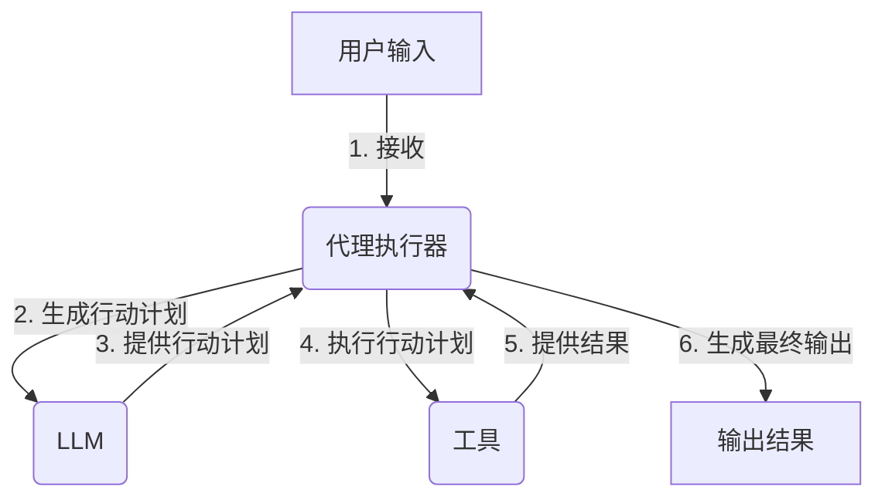
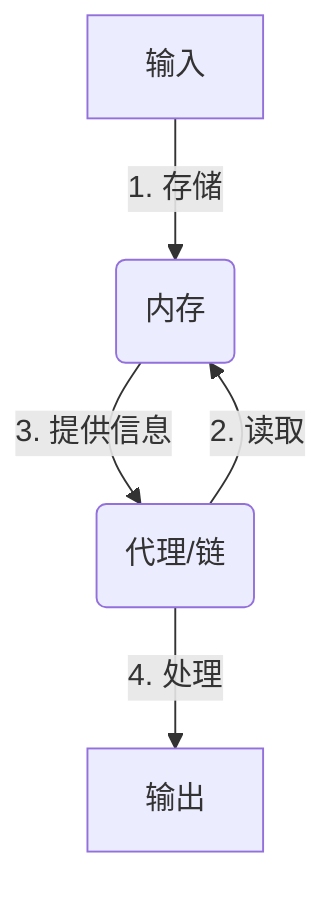
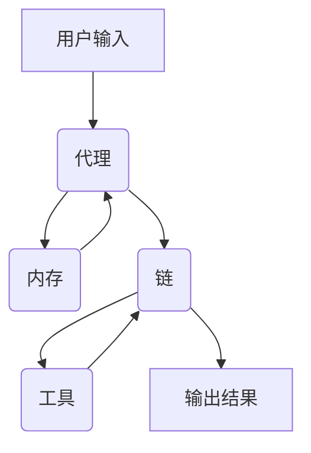

以下是标题为《【LangChain编程：从入门到实践】参与社区活动》的技术博客文章正文内容：

# 【LangChain编程：从入门到实践】参与社区活动

## 1. 背景介绍

### 1.1 问题的由来

在当今快节奏的数字时代，人工智能(AI)和自然语言处理(NLP)技术已经渗透到我们生活的方方面面。随着大量数据的快速积累,如何高效地处理和利用这些数据成为了一个巨大的挑战。传统的编程方式往往需要大量的人工编码,不仅效率低下,而且难以适应不断变化的需求。

因此,出现了一种新的编程范式——LangChain编程。LangChain是一个强大的Python库,旨在构建可扩展的AI应用程序。它将大型语言模型(LLM)与其他组件(如数据加载器、文本拆分器和代理等)相结合,为开发人员提供了一种更高层次的编程抽象。通过LangChain,开发人员可以快速构建复杂的AI应用程序,而无需深入了解底层模型的细节。

### 1.2 研究现状

LangChain是一个相对较新的开源项目,由Anthropic公司于2022年3月发起。尽管它的发展时间较短,但已经吸引了大量开发者和研究人员的关注。目前,LangChain已经在GitHub上获得了8000多颗星,并且有超过100个贡献者参与了项目的开发和维护。

LangChain的核心思想是将大型语言模型(如GPT-3、PaLM等)与其他组件(如数据加载器、文本拆分器、代理等)相结合,构建可扩展的AI应用程序。它提供了一种模块化的方式来组合这些组件,使开发人员能够专注于应用程序的逻辑,而不必过多关注底层模型的实现细节。

### 1.3 研究意义

LangChain编程的出现为AI应用程序的开发带来了全新的机遇。它提供了一种更高层次的编程抽象,使开发人员能够更加高效地构建复杂的AI应用程序。同时,LangChain还具有以下重要意义:

1. **提高开发效率**:LangChain抽象出了许多常见的AI任务,如数据加载、文本拆分、模型调用等,使开发人员能够专注于应用程序的逻辑,而不必过多关注底层实现细节。

2. **降低入门门槛**:通过LangChain,开发人员无需深入了解复杂的机器学习模型,就可以构建强大的AI应用程序。这降低了AI应用程序开发的门槛,使更多人能够参与到AI领域中来。

3. **促进AI应用程序的可扩展性**:LangChain提供了一种模块化的方式来组合不同的组件,使得AI应用程序具有良好的可扩展性。开发人员可以根据需求轻松地添加或替换不同的组件。

4. **推动AI应用程序的标准化**:LangChain为AI应用程序的开发提供了一种统一的框架,有助于推动AI应用程序开发的标准化,促进不同项目之间的协作和代码复用。

### 1.4 本文结构

本文将全面介绍LangChain编程,从入门到实践。文章主要分为以下几个部分:

1. **核心概念与联系**:介绍LangChain的核心概念,如代理、链、内存等,以及它们之间的关系。

2. **核心算法原理与具体操作步骤**:深入探讨LangChain中使用的核心算法原理,如序列到序列(Seq2Seq)模型、注意力机制等,并详细解释算法的具体操作步骤。

3. **数学模型和公式详细讲解与举例说明**:介绍LangChain中使用的数学模型和公式,如transformer模型、注意力分数等,并通过具体案例进行详细讲解和举例说明。

4. **项目实践:代码实例和详细解释说明**:提供一个实际的LangChain项目实践,包括开发环境搭建、源代码实现、代码解读与分析,以及运行结果展示。

5. **实际应用场景**:探讨LangChain在不同领域的实际应用场景,如问答系统、文本摘要、内容生成等,并展望其未来的应用前景。

6. **工具和资源推荐**:推荐一些有用的LangChain学习资源、开发工具、相关论文和其他资源,为读者提供更多的学习和实践机会。

7. **总结:未来发展趋势与挑战**:总结LangChain的研究成果,展望其未来的发展趋势,并分析其面临的挑战和机遇。

8. **附录:常见问题与解答**:列出一些LangChain编程中常见的问题,并给出解答和建议。

通过全面介绍LangChain编程,本文旨在为读者提供一个深入的理解,并激发他们对这一新兴编程范式的兴趣和探索欲望。让我们一起踏上LangChain编程的奇妙旅程,发现其无限的潜力和可能性。

## 2. 核心概念与联系

LangChain编程是一种新兴的编程范式,旨在简化AI应用程序的开发过程。它将大型语言模型(LLM)与其他组件(如数据加载器、文本拆分器和代理等)相结合,为开发人员提供了一种更高层次的编程抽象。在LangChain中,有几个核心概念需要了解:

### 2.1 代理(Agents)

代理是LangChain中最核心的概念之一。它是一个可执行的实体,负责完成特定的任务。代理可以是一个简单的函数,也可以是一个复杂的系统,由多个组件组成。

代理通常由三个主要部分组成:

1. **工具(Tools)**:代理可以使用的一组工具,如搜索引擎、数据库、API等。
2. **LLM(大型语言模型)**:代理使用的语言模型,如GPT-3、PaLM等。
3. **代理执行器(Agent Executor)**:控制代理如何与工具和LLM交互的逻辑。

代理的工作流程如下:

代理执行器根据用户输入,利用LLM生成一个行动计划。然后,它执行这个行动计划,调用相应的工具来完成任务。最后,代理执行器根据工具的输出,生成最终的结果。

### 2.2 链(Chains)

链是LangChain中另一个重要的概念。它是一系列可组合的组件,用于处理特定的任务。链可以包含多个代理、LLM、工具等组件,并按照特定的顺序执行。

链的工作流程如下:

每个组件都会处理输入,并将结果传递给下一个组件。最终,链会产生一个最终的输出。

链的优点在于它们是可组合的,这意味着您可以将多个链组合成一个更大的链,从而构建更复杂的应用程序。

### 2.3 内存(Memory)

内存是LangChain中用于存储和检索信息的组件。它可以被代理或链使用,以保持对话的上下文或记录中间结果。

内存有多种类型,如简单的列表内存、基于向量的内存等。每种内存类型都有不同的特点和用途。

内存的工作流程如下:

代理或链首先将输入存储在内存中。然后,它们可以从内存中读取相关信息,用于处理任务。最终,代理或链会产生一个输出。

内存在保持对话上下文、记录中间结果等方面发挥着重要作用,有助于构建更智能、更上下文相关的AI应用程序。

### 2.4 核心组件之间的关系

LangChain的核心组件(代理、链和内存)之间存在着紧密的关系,它们相互协作,共同构建出强大的AI应用程序。

代理是LangChain中最核心的组件,它可以使用工具和LLM来完成特定的任务。链则是由多个组件(包括代理)组成的序列,用于处理更复杂的任务。内存则为代理和链提供了存储和检索信息的能力,有助于保持对话上下文和记录中间结果。

这些组件之间的关系如下图所示:

用户输入首先被代理接收,代理可以利用内存来存储和检索相关信息。代理还可以作为链的一部分,与其他组件协作完成更复杂的任务。在执行过程中,代理可以调用工具来获取所需的数据或服务。最终,链会产生一个输出结果。

通过组合和协作,LangChain的核心组件为构建智能AI应用程序提供了强大的能力。开发人员可以根据具体需求,灵活地组合和配置这些组件,从而实现各种复杂的功能。

## 3. 核心算法原理与具体操作步骤

在LangChain中,核心算法原理主要包括序列到序列(Seq2Seq)模型、注意力机制等。这些算法原理为LangChain提供了强大的自然语言处理能力,使其能够理解和生成人类可读的文本。

### 3.1 算法原理概述

#### 3.1.1 序列到序列(Seq2Seq)模型

序列到序列(Seq2Seq)模型是一种广泛应用于自然语言处理任务的模型架构,如机器翻译、文本摘要、对话系统等。它由两个主要部分组成:编码器(Encoder)和解码器(Decoder)。

编码器的作用是将输入序列(如一段文本)编码为一系列向量表示,捕获输入序列的语义信息。解码器则根据编码器的输出,生成目标输出序列(如翻译后的文本或摘要)。

在LangChain中,Seq2Seq模型被广泛应用于各种任务,如问答系统、文本生成等。它能够理解自然语言输入,并生成相应的自然语言输出。

#### 3.1.2 注意力机制(Attention Mechanism)

注意力机制是一种重要的神经网络技术,它允许模型在处理序列数据时,动态地关注输入序列的不同部分,从而提高模型的性能和效率。

在传统的序列模型中,编码器需要将整个输入序列编码为一个固定长度的向量表示,这可能会导致信息丢失。注意力机制则允许模型在每个时间步关注输入序列的不同部分,从而更好地捕获长距离依赖关系。

在LangChain中,注意力机制被广泛应用于各种任务,如文本生成、机器翻译等。它有助于模型更好地理解和生成自然语言,提高了模型的性能和准确性。

### 3.2 算法步骤详解

#### 3.2.1 Seq2Seq模型的工作流程

Seq2Seq模型的工作流程可以分为以下几个步骤:

1. **输入编码**:编码器将输入序列(如一段文本)转换为一系列向量表示,捕获输入序列的语义信息。

2. **上下文向量生成**:编码器将最后一个隐藏状态作为上下文向量,表示整个输入序列的语义信息。

3. **输出生成**:解码器根据上下文向量和先前生成的输出,预测下一个输出token。这个过程一直持续,直到生成完整的输出序列。

4. **注意力计算**:在生成每个输出token时,解码器会计算注意力权重