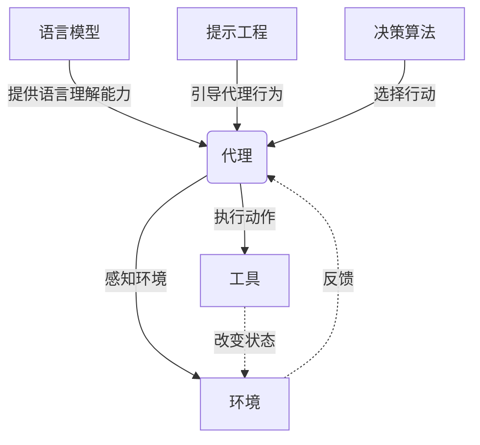

# 【LangChain编程：从入门到实践】智能代理设计

## 1. 背景介绍
### 1.1 问题的由来
随着人工智能技术的飞速发展,特别是大语言模型的出现,让我们看到了通过自然语言与计算机系统进行交互的无限可能。然而,目前大多数的语言模型仍然局限于单纯的问答模式,缺乏执行复杂任务的能力。如何让语言模型具备更强的推理和执行能力,成为构建真正智能系统的关键。

### 1.2 研究现状 
近年来,学术界和工业界都在积极探索如何赋予语言模型更强大的能力。一个备受关注的方向是智能代理(Intelligent Agent)的设计。智能代理是一种能够根据环境做出决策和执行行动的自主系统。将语言模型与智能代理结合,有望打造出更加智能化的对话系统。

目前已经出现了一些将语言模型应用于智能代理设计的尝试,比如 Anthropic 公司的 Constitutional AI,通过精心设计的"宪法"来约束语言模型的行为。另一个代表性的工作是 AutoGPT,它利用 GPT 模型的few-shot 能力,实现了一个能够自主完成任务的智能代理系统。

### 1.3 研究意义
智能代理的研究对于推动人工智能在实际场景中的应用具有重要意义。一方面,它为我们提供了一种构建更加智能化系统的新思路。传统的 AI 系统往往是特定领域的专家系统,缺乏通用智能。而智能代理的设计理念更接近于通用人工智能。另一方面,智能代理也为人机交互带来了新的可能性。未来我们有望看到更多拥有认知和执行能力的 AI 助手,它们能够理解用户需求,主动完成任务。

### 1.4 本文结构
本文将重点介绍如何使用 LangChain 框架来构建智能代理系统。全文分为以下几个部分:

- 第2部分介绍了智能代理设计涉及的一些核心概念,以及它们之间的联系。 
- 第3部分详细讲解了智能代理的核心算法原理和具体实现步骤。
- 第4部分给出了智能代理系统设计中常用的数学模型,并结合具体案例进行分析。
- 第5部分通过一个完整的代码实例,演示了如何使用 LangChain 来实现一个智能代理系统。
- 第6部分讨论了智能代理技术的实际应用场景和未来发展前景。
- 第7部分推荐了一些学习智能代理设计的工具和资源。
- 第8部分对全文进行了总结,并对智能代理技术的未来发展趋势和面临的挑战进行了展望。

## 2. 核心概念与联系
要理解智能代理的工作原理,我们首先需要了解几个核心概念:

- **语言模型(Language Model)**: 语言模型是一种对自然语言进行建模的机器学习模型。给定一个输入文本序列,语言模型能够预测下一个最可能出现的单词。目前使用最广泛的语言模型是基于 Transformer 架构的预训练模型,如 GPT、BERT 等。语言模型是智能代理的核心组件之一,它赋予了代理以理解和生成自然语言的能力。

- **提示工程(Prompt Engineering)**: 提示工程是一种通过设计输入文本(即提示)来引导语言模型生成期望输出的技术。通过精心设计的提示,我们可以让语言模型执行各种任务,如问答、摘要、写作等。在智能代理中,提示工程被用来设计代理的目标和行为约束。

- **代理(Agent)**: 代理是一个能够感知环境状态,根据一定的策略做出决策,并采取行动来实现目标的自主系统。智能代理系统的核心就是设计一个合适的代理模型,使其能够根据当前的环境状态和用户需求,自主地完成任务。

- **工具(Tool)**: 工具是代理用来与外部世界交互,执行具体动作的组件。例如搜索引擎、计算器、数据库等都可以是代理的工具。代理通过调用这些工具来获取信息和改变环境状态。

- **决策(Decision Making)**: 决策是代理根据当前环境状态,选择下一步行动的过程。决策过程通常基于一定的策略或算法,如基于规则的决策、强化学习等。

下图展示了以上几个核心概念在智能代理系统中的关系:

从图中可以看出,语言模型为代理提供了语言理解和生成的能力,而提示工程则用于引导代理的行为。代理通过感知环境状态和调用工具来执行任务,并根据一定的决策算法来选择行动。环境状态的变化又会反馈给代理,形成一个闭环。

## 3. 核心算法原理 & 具体操作步骤
### 3.1 算法原理概述
智能代理的核心是一个基于语言模型的决策算法。该算法的主要思想是:将任务拆分为一系列子目标,然后通过语言模型的推理能力,逐步生成实现子目标的行动序列。这个过程可以用下面的公式来表示:

$$
\begin{aligned}
Action_t &= \arg\max_{a} P(a|S_t, G_t, C) \\
S_{t+1} &= T(S_t, Action_t)
\end{aligned}
$$

其中,$S_t$表示在时间步$t$时的环境状态,$G_t$表示当前的子目标,$C$表示全局的任务约束。$Action_t$表示在时间步$t$选择的行动,$T$是环境的状态转移函数。算法的目标是在满足全局约束$C$的前提下,寻找一个行动序列$\{Action_t\}$,使得最终能够达到目标状态。

### 3.2 算法步骤详解
智能代理的决策算法可以分为以下几个步骤:

1. **任务分解**: 将复杂的任务分解为一系列子目标。这一步通常需要人工参与,定义清晰的子目标和约束条件。

2. **环境感知**: 代理通过语言模型编码当前的环境状态$S_t$,将其转化为embedding向量。状态表示需要尽可能完整地刻画任务相关的信息。

3. **目标选择**: 从当前的子目标集合$\{G_t\}$中选择一个作为当前决策的目标。通常采用启发式的方法,如选择最相关或最紧急的子目标。

4. **行动生成**: 根据当前状态$S_t$、目标$G_t$和约束$C$,用语言模型生成一个行动$Action_t$。生成过程通常采用 beam search 等搜索算法,找到概率最大的行动序列。

5. **行动执行**: 调用相应的工具执行生成的行动$Action_t$,并更新环境状态为$S_{t+1}$。

6. **终止判断**: 判断是否已经达到最终目标状态,如果是则终止决策过程;否则返回步骤2,继续下一轮决策。

算法的关键在于如何通过语言模型生成高质量的行动序列。一般需要在语言模型的基础上,加入额外的引导和约束,如任务相关的提示、先验知识等,来提高生成的质量。

### 3.3 算法优缺点
该算法的主要优点包括:

- 通用性强,可以应用于各种类型的任务,不需要针对特定领域进行大量的特征工程。
- 可解释性好,每一步决策都对应了明确的目标和行动,便于人类理解和监督。
- 可扩展性好,可以通过增加工具和知识来不断扩大代理的能力边界。

但是该算法也存在一些局限性:

- 依赖人工定义任务的子目标和约束,对于复杂的开放领域任务,这一过程可能比较困难。
- 语言模型的推理能力有限,可能难以处理一些需要深度逻辑推理的任务。
- 搜索空间巨大,对计算资源要求较高,难以实时地做出最优决策。

### 3.4 算法应用领域
尽管存在局限性,该算法仍然在智能对话、任务规划、代码生成等领域展现出了广阔的应用前景。一些代表性的应用包括:

- AI 助手:如 ChatGPT,可以通过对话了解用户需求,并自主完成一些日常任务。
- 智能编程:如 GitHub Copilot,可以根据注释和上下文自动生成代码片段。
- 自动化科学发现:通过智能代理自动探索实验空间,优化实验参数,加速科学研究进程。

未来,随着语言模型和提示工程技术的进一步发展,智能代理有望在更广泛的领域发挥重要作用。

## 4. 数学模型和公式 & 详细讲解 & 举例说明
### 4.1 数学模型构建
智能代理的决策过程可以用马尔可夫决策过程(Markov Decision Process, MDP)来建模。一个MDP由以下几个要素组成:

- 状态空间 $\mathcal{S}$:所有可能的环境状态的集合。
- 行动空间 $\mathcal{A}$:代理可以采取的所有行动的集合。
- 状态转移函数 $\mathcal{P}$:定义了在状态 $s$ 下采取行动 $a$ 后,环境转移到状态 $s'$ 的概率。形式化地,$ \mathcal{P}(s'|s,a) = P(S_{t+1}=s'| S_t=s, A_t=a) $。
- 奖励函数 $\mathcal{R}$:定义了在状态 $s$ 下采取行动 $a$ 后,代理能够获得的即时奖励。形式化地,$ \mathcal{R}(s,a) = \mathbb{E}[R_{t+1}|S_t=s, A_t=a] $。 
- 折扣因子 $\gamma$:一个介于0和1之间的数,表示未来奖励相对于当前奖励的重要程度。

MDP的目标是寻找一个最优策略 $\pi^*$,使得在该策略下,代理能够获得最大的期望累积奖励。形式化地,我们定义状态 $s$ 的值函数为:

$$V^{\pi}(s) = \mathbb{E}[\sum_{t=0}^{\infty} \gamma^t R_{t+1}|S_0=s]$$

最优策略 $\pi^*$ 满足:

$$\pi^*(s) = \arg\max_{a} Q^*(s,a)$$

其中,$ Q^*(s,a) $ 表示在状态 $s$ 下采取行动 $a$ 后的最优值函数,定义为:

$$Q^*(s,a) = \mathcal{R}(s,a) + \gamma \sum_{s'} \mathcal{P}(s'|s,a) V^*(s')$$

### 4.2 公式推导过程
要求解 MDP,一种常用的方法是值迭代(Value Iteration)算法。该算法基于贝尔曼最优方程(Bellman Optimality Equation):

$$V^*(s) = \max_a \mathcal{R}(s,a) + \gamma \sum_{s'} \mathcal{P}(s'|s,a) V^*(s')$$

值迭代算法通过迭代更新状态值函数,直到收敛到最优值函数 $V^*$。每次迭代按照以下公式更新:

$$V_{k+1}(s) = \max_a \mathcal{R}(s,a) + \gamma \sum_{s'} \mathcal{P}(s'|s,a) V_k(s')$$

其中,$V_k(s)$ 表示第 $k$ 次迭代时状态 $s$ 的值函数。

当值函数收敛时,我们就得到了最优策略:

$$\pi^*(s) = \arg\max_a \mathcal{R}(s,a) + \gamma \sum_{s'} \mathcal{P}(s'|s,a) V^*(s')$$

### 4.3 案例分析与讲解
下面我们用