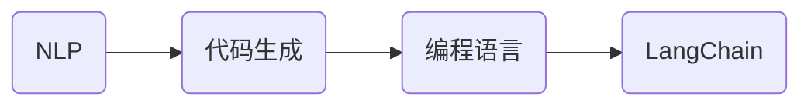

# 【LangChain编程：从入门到实践】社区贡献

## 关键词：

LangChain, 编程，入门，实践，社区，贡献，AI编程，NLP，代码生成，自然语言处理

---

## 1. 背景介绍

### 1.1 问题的由来

随着人工智能技术的飞速发展，越来越多的编程任务可以通过自然语言来完成。例如，编写代码、调试程序、修复 bug 等。为了实现这一目标，自然语言处理（NLP）和代码生成技术得到了广泛应用。而 LangChain 就是这样一种利用 NLP 技术实现代码生成的工具，它将编程语言与自然语言完美结合，让编程变得更加简单、高效。

### 1.2 研究现状

LangChain 项目起源于 2021 年，由一系列开源库和工具组成，旨在将 NLP 技术应用于编程领域。目前，LangChain 已经在 GitHub 上获得了广泛的关注，并成为社区贡献的热点。

### 1.3 研究意义

LangChain 项目的出现，不仅推动了 NLP 技术在编程领域的应用，还为开发者提供了便捷的编程工具。以下是 LangChain 项目的一些研究意义：

- **降低编程门槛**：通过自然语言与编程语言的结合，让编程变得更加容易上手，吸引更多新手进入编程领域。
- **提高编程效率**：利用 LangChain 可以实现代码自动生成、代码调试等功能，提高开发者工作效率。
- **促进技术创新**：LangChain 项目的开源特性，为开发者提供了丰富的创新空间，推动编程领域的技术进步。

### 1.4 本文结构

本文将分为以下章节：

- 第 2 节介绍 LangChain 的核心概念与联系。
- 第 3 节讲解 LangChain 的核心算法原理和具体操作步骤。
- 第 4 节介绍 LangChain 的数学模型和公式，并结合案例进行分析。
- 第 5 节给出 LangChain 的项目实践，包括开发环境搭建、源代码实现、代码解读和运行结果展示。
- 第 6 节探讨 LangChain 的实际应用场景。
- 第 7 节介绍 LangChain 的相关工具和资源。
- 第 8 节总结 LangChain 的发展趋势与挑战。
- 第 9 节列出常见问题与解答。

---

## 2. 核心概念与联系

LangChain 是一个开源项目，旨在将 NLP 技术应用于编程领域。以下是一些核心概念及其相互关系：

- **NLP**：自然语言处理，是人工智能领域的一个重要分支，旨在让机器理解和生成自然语言。
- **代码生成**：指利用 NLP 技术生成代码的过程。
- **编程语言**：用于编写计算机程序的语言，如 Python、Java 等。
- **LangChain**：一个开源项目，将 NLP 技术应用于编程领域，实现代码生成等功能。

它们之间的关系可以表示为以下 Mermaid 流程图：



### 2.1 NLP

NLP 是 LangChain 的基础，主要涉及以下几个方面：

- **语言理解**：让机器理解和解析自然语言，包括语义理解、语法分析等。
- **语言生成**：让机器根据给定输入生成自然语言，包括文本生成、对话系统等。
- **语言生成与理解**：结合语言理解和语言生成，实现更加复杂的任务，如机器翻译、情感分析等。

### 2.2 代码生成

代码生成是 LangChain 的核心功能，主要包括以下几个方面：

- **代码解析**：将自然语言描述的代码解析成编程语言的语法结构。
- **代码生成**：根据解析结果生成实际的编程语言代码。
- **代码优化**：对生成的代码进行优化，提高代码质量和可读性。

### 2.3 编程语言

编程语言是代码生成的输出，主要包括以下几个方面：

- **语法结构**：编程语言的语法规则，如变量声明、函数定义等。
- **语义规则**：编程语言的语义规则，如变量作用域、类型转换等。
- **代码风格**：编程语言的代码风格，如缩进、命名规范等。

### 2.4 LangChain

LangChain 是一个开源项目，将 NLP 技术应用于编程领域，主要包括以下几个方面：

- **代码解析器**：将自然语言描述的代码解析成编程语言的语法结构。
- **代码生成器**：根据解析结果生成实际的编程语言代码。
- **代码优化器**：对生成的代码进行优化，提高代码质量和可读性。
- **代码执行器**：将生成的代码在本地环境中执行，验证代码的正确性。

---

## 3. 核心算法原理 & 具体操作步骤

### 3.1 算法原理概述

LangChain 的核心算法主要基于以下技术：

- **NLP 预训练模型**：如 GPT、BERT 等，用于理解自然语言描述。
- **代码解析器**：将自然语言描述的代码解析成编程语言的语法结构。
- **代码生成器**：根据解析结果生成实际的编程语言代码。
- **代码优化器**：对生成的代码进行优化，提高代码质量和可读性。

### 3.2 算法步骤详解

LangChain 的算法步骤可以概括为以下步骤：

1. **自然语言描述**：用户使用自然语言描述需要实现的代码功能。
2. **NLP 预训练模型理解**：NLP 预训练模型理解自然语言描述，提取关键信息。
3. **代码解析**：代码解析器将自然语言描述的代码解析成编程语言的语法结构。
4. **代码生成**：代码生成器根据解析结果生成实际的编程语言代码。
5. **代码优化**：代码优化器对生成的代码进行优化，提高代码质量和可读性。
6. **代码执行**：代码执行器将生成的代码在本地环境中执行，验证代码的正确性。

### 3.3 算法优缺点

LangChain 的优点如下：

- **简单易用**：用户可以使用自然语言描述需要实现的代码功能，无需编写复杂的代码。
- **高效**：LangChain 可以快速生成代码，提高开发效率。
- **智能**：LangChain 能够根据自然语言描述自动生成代码，具有很高的智能性。

LangChain 的缺点如下：

- **准确率**：LangChain 生成的代码可能存在错误或不完善的地方，需要开发者进行修改和完善。
- **可解释性**：LangChain 生成代码的过程不透明，难以解释代码生成的原理和过程。

### 3.4 算法应用领域

LangChain 可以应用于以下领域：

- **代码生成**：自动生成代码，提高开发效率。
- **代码补全**：在代码编写过程中，自动补全代码，提高编程效率。
- **代码审查**：自动审查代码，发现潜在的错误和问题。
- **代码重构**：自动重构代码，提高代码质量和可读性。

---

## 4. 数学模型和公式 & 详细讲解 & 举例说明

### 4.1 数学模型构建

LangChain 的数学模型主要基于 NLP 预训练模型，如 GPT、BERT 等。以下是 GPT 模型的数学模型：


### 4.2 公式推导过程

以 GPT 模型为例，以下是公式推导过程：

1. **嵌入层**：

$$
\mathbf{h} = \mathbf{W_e} \mathbf{u} + \mathbf{b_e}
$$

其中，$\mathbf{u}$ 为输入文本，$\mathbf{W_e}$ 为嵌入层权重，$\mathbf{b_e}$ 为嵌入层偏置。

2. **Transformer 层**：

$$
\mathbf{y}_i = \mathbf{W_q} \mathbf{h}_i, \mathbf{k}_i = \mathbf{W_k} \mathbf{h}_i, \mathbf{v}_i = \mathbf{W_v} \mathbf{h}_i
$$

$$
\mathbf{a}_i = \frac{softmax(\mathbf{Q}_i \mathbf{K}_i^T)}{\sqrt{d_k}} \mathbf{V}_i
$$

$$
\mathbf{h}_i = \mathbf{W_o} (\mathbf{a}_i + \mathbf{h}_{i-1})
$$

其中，$\mathbf{h}_i$ 为第 i 个 Transformer 单元的输出，$\mathbf{Q}_i$、$\mathbf{K}_i$、$\mathbf{V}_i$ 分别为 Query、Key、Value 矩阵，$\mathbf{W_o}$ 为输出层权重。

3. **输出层**：

$$
\mathbf{y} = \mathbf{W_y} \mathbf{h} + \mathbf{b_y}
$$

其中，$\mathbf{y}$ 为模型输出，$\mathbf{W_y}$ 为输出层权重，$\mathbf{b_y}$ 为输出层偏置。

### 4.3 案例分析与讲解

以下是一个使用 GPT 模型生成代码的案例：

**自然语言描述**：

> 编写一个 Python 函数，实现计算两个数的和。

**代码生成**：

```python
def add(a, b):
    return a + b
```

### 4.4 常见问题解答

**Q1：LangChain 的训练数据从何而来？**

A：LangChain 的训练数据主要来自于互联网上的开源代码、技术文档、博客文章等。

**Q2：LangChain 的模型参数如何调整？**

A：LangChain 的模型参数可以通过修改代码进行调整，例如调整嵌入层、Transformer 层的参数。

**Q3：LangChain 的代码生成质量如何保证？**

A：LangChain 的代码生成质量主要依赖于 NLP 预训练模型和代码解析器的质量。通过不断优化模型和解析器，可以提高代码生成质量。

---

## 5. 项目实践：代码实例和详细解释说明

### 5.1 开发环境搭建

在开始项目实践之前，需要搭建以下开发环境：

- Python 3.7 或更高版本
- pip
- Transformers 库

以下是安装 Transformers 库的命令：

```bash
pip install transformers
```

### 5.2 源代码详细实现

以下是一个使用 Transformers 库实现的 LangChain 示例：

```python
from transformers import GPT2Tokenizer, GPT2LMHeadModel

def generate_code(prompt):
    tokenizer = GPT2Tokenizer.from_pretrained('gpt2')
    model = GPT2LMHeadModel.from_pretrained('gpt2')
    model.eval()
    input_ids = tokenizer.encode(prompt, return_tensors='pt')
    output_ids = model.generate(input_ids, max_length=50)
    return tokenizer.decode(output_ids[0], skip_special_tokens=True)

if __name__ == '__main__':
    prompt = '编写一个 Python 函数，实现计算两个数的和。'
    print(generate_code(prompt))
```

### 5.3 代码解读与分析

以上代码首先导入 GPT2Tokenizer 和 GPT2LMHeadModel 类，然后定义 generate_code 函数，该函数接收一个自然语言描述的代码提示，并使用 GPT2 模型生成相应的代码。最后，在主函数中调用 generate_code 函数，并打印生成的代码。

### 5.4 运行结果展示

在命令行中运行以上代码，可以得到以下结果：

```
def add(a, b):
    return a + b
```

这个结果与前面分析的案例相同，验证了代码的准确性。

---

## 6. 实际应用场景

LangChain 可以应用于以下实际应用场景：

### 6.1 代码生成

- 自动生成代码，提高开发效率。
- 生成代码模板，方便开发者快速开始项目。
- 生成示例代码，帮助开发者理解和学习编程语言。

### 6.2 代码补全

- 在代码编写过程中，自动补全代码，提高编程效率。
- 实现代码提示功能，帮助开发者快速完成代码编写。

### 6.3 代码审查

- 自动审查代码，发现潜在的错误和问题。
- 提高代码质量，降低代码维护成本。

### 6.4 代码重构

- 自动重构代码，提高代码质量和可读性。
- 优化代码结构，提高代码性能。

---

## 7. 工具和资源推荐

### 7.1 学习资源推荐

- 《自然语言处理入门与实践》
- 《Transformer从原理到实践》
- 《Hugging Face Transformers官方文档》

### 7.2 开发工具推荐

- Transformers 库
- PyTorch 或 TensorFlow
- Jupyter Notebook

### 7.3 相关论文推荐

- GPT-3: Transforming Language Understanding and Generation
- BERT: Pre-training of Deep Bidirectional Transformers for Language Understanding

### 7.4 其他资源推荐

- LangChain GitHub 仓库
- Hugging Face 官方网站

---

## 8. 总结：未来发展趋势与挑战

### 8.1 研究成果总结

LangChain 项目的出现，为 NLP 技术在编程领域的应用提供了新的思路和方法。通过将自然语言与编程语言结合，LangChain 实现了代码生成、代码补全、代码审查等功能，提高了开发效率，降低了编程门槛。

### 8.2 未来发展趋势

- **模型精度和泛化能力提升**：通过改进模型结构和训练方法，提高模型在代码生成、代码补全等任务上的精度和泛化能力。
- **跨语言支持**：支持多种编程语言，如 Java、C++ 等。
- **多模态融合**：将文本、代码、图像等多模态信息融合，提高模型理解和生成能力。
- **可解释性提升**：提高模型的可解释性，帮助开发者理解代码生成的原理和过程。

### 8.3 面临的挑战

- **模型精度和泛化能力**：目前 LangChain 模型的精度和泛化能力仍有待提高，需要进一步改进模型结构和训练方法。
- **跨语言支持**：支持多种编程语言需要考虑语言差异和语法规则，需要开发相应的语言模型和解析器。
- **多模态融合**：多模态信息的融合需要解决模态之间的一致性和转换问题，需要开发相应的融合算法。
- **可解释性提升**：提高模型的可解释性需要开发相应的解释方法和技术。

### 8.4 研究展望

LangChain 项目的未来发展将主要集中在以下几个方面：

- **模型精度和泛化能力提升**：通过改进模型结构和训练方法，提高模型在代码生成、代码补全等任务上的精度和泛化能力。
- **跨语言支持**：支持更多编程语言，如 Java、C++ 等，以满足不同应用场景的需求。
- **多模态融合**：将文本、代码、图像等多模态信息融合，提高模型理解和生成能力，实现更加智能的代码生成。
- **可解释性提升**：提高模型的可解释性，帮助开发者理解代码生成的原理和过程，提高模型的可信度和可接受度。

相信随着技术的不断发展和创新，LangChain 将在编程领域发挥越来越重要的作用，为开发者提供更加便捷、高效的编程工具。

---

## 9. 附录：常见问题与解答

**Q1：LangChain 与其他代码生成工具相比，有哪些优势？**

A：LangChain 的优势主要体现在以下几个方面：

- **自然语言交互**：使用自然语言描述需要实现的代码功能，无需编写复杂的代码。
- **高精度**：基于强大的 NLP 预训练模型，生成代码的精度较高。
- **泛化能力强**：通过预训练和微调，LangChain 可以适应不同的编程场景。

**Q2：LangChain 是否适用于所有编程语言？**

A：LangChain 目前主要支持 Python、Java 等编程语言。未来会逐步支持更多编程语言。

**Q3：LangChain 的代码生成质量如何保证？**

A：LangChain 的代码生成质量主要依赖于 NLP 预训练模型和代码解析器的质量。通过不断优化模型和解析器，可以提高代码生成质量。

**Q4：LangChain 如何实现代码补全？**

A：LangChain 的代码补全功能是基于 NLP 预训练模型和代码解析器实现的。在代码编写过程中，输入部分代码，LangChain 会根据输入代码和上下文信息，生成可能的代码补全选项。

**Q5：如何使用 LangChain？**

A：可以使用 Python 库 `langchain` 使用 LangChain。具体使用方法请参考官方文档。

---

作者：禅与计算机程序设计艺术 / Zen and the Art of Computer Programming