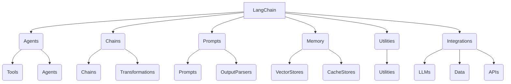

# 【LangChain编程：从入门到实践】管理工具安装

## 1. 背景介绍

### 1.1 问题的由来

在当今快节奏的软件开发环境中，开发人员面临着处理大量异构数据源和构建智能应用程序的挑战。传统的编程方式往往需要手动集成各种API和数据库,这不仅耗时耗力,而且容易出错。因此,需要一种更高效、更灵活的方式来简化这些任务。

### 1.2 研究现状

近年来,人工智能(AI)和自然语言处理(NLP)技术的快速发展为解决这一挑战提供了新的契机。出现了一些基于AI的框架和库,旨在简化AI应用程序的开发过程。其中,LangChain是一个Python库,它提供了一种统一的方式来构建AI应用程序,并与各种数据源进行交互。

### 1.3 研究意义

LangChain的出现为开发人员提供了一种全新的编程范式,使他们能够更高效地构建智能应用程序。通过LangChain,开发人员可以轻松地集成各种AI模型、数据源和工具,从而加快开发速度并提高应用程序的质量。此外,LangChain还提供了一种模块化的方式来构建AI应用程序,使代码更易于维护和扩展。

### 1.4 本文结构

本文将全面介绍LangChain的安装和管理工具。首先,我们将探讨LangChain的核心概念和架构。接下来,我们将详细讲解LangChain的安装过程,包括环境准备、依赖项安装等。然后,我们将介绍一些常用的LangChain管理工具,如LangChain CLI和LangChain Server。最后,我们将总结LangChain的未来发展趋势和面临的挑战。

## 2. 核心概念与联系



LangChain是一个Python库,旨在简化AI应用程序的开发过程。它提供了一个统一的接口,用于与各种AI模型、数据源和工具进行交互。LangChain的核心概念包括:

1. **Agents**: 代理是LangChain中的一个关键概念,它代表了一个具有特定目标和能力的智能实体。代理可以执行各种任务,如问答、文本生成、数据分析等。代理由工具(Tools)和其他代理(Agents)组成。

2. **Chains**: 链是一系列预定义的步骤,用于完成特定的任务。链可以由多个组件组成,如提示(Prompts)、转换(Transformations)和其他链(Chains)。

3. **Prompts**: 提示是向语言模型发送的指令或问题,用于获取所需的输出。提示可以是简单的文本,也可以是结构化的模板。

4. **Memory**: 内存是用于存储和检索信息的组件。LangChain支持多种内存存储,如向量存储(VectorStores)和缓存存储(CacheStores)。

5. **Utilities**: 实用程序是一组辅助函数和工具,用于执行各种任务,如文本处理、数据操作等。

6. **Integrations**: 集成是LangChain与各种AI模型、数据源和API的接口。它包括语言模型(LLMs)、数据源(Data)和API接口。

这些核心概念紧密相连,共同构建了LangChain的整体架构。开发人员可以灵活地组合和扩展这些概念,以满足不同的应用需求。

## 3. 核心算法原理 & 具体操作步骤

### 3.1 算法原理概述

LangChain的核心算法原理是基于代理-工具-链的交互模式。代理是一个智能实体,它可以执行各种任务,如问答、文本生成、数据分析等。代理通过调用一系列工具来完成这些任务。工具可以是各种API、数据库、文件系统等外部资源。

代理和工具之间的交互是通过链来协调的。链是一系列预定义的步骤,用于完成特定的任务。链可以包含多个组件,如提示、转换和其他链。提示是向语言模型发送的指令或问题,用于获取所需的输出。转换是对输出进行处理或修改的操作。

整个过程可以概括为以下步骤:

1. 代理接收任务请求
2. 代理通过提示与语言模型交互,获取初步结果
3. 代理根据初步结果和可用工具,决定调用哪些工具
4. 代理调用相应的工具,获取工具输出
5. 代理将工具输出与初步结果进行整合,生成最终结果
6. 代理返回最终结果

在这个过程中,代理可以根据需要多次与语言模型和工具进行交互,直到完成任务为止。这种模块化的设计使得LangChain具有很高的灵活性和可扩展性。

### 3.2 算法步骤详解

1. **初始化代理**

   首先,需要初始化一个代理实例。代理可以是预定义的,也可以是自定义的。预定义的代理包括问答代理(QuestionAnsweringAgent)、文本生成代理(TextGenerationAgent)等。自定义代理可以通过组合不同的工具和链来创建。

   ```python
   from langchain.agents import load_tools, initialize_agent
   from langchain.llms import OpenAI

   # 加载工具
   tools = load_tools(["serpapi", "llm-math"], llm=OpenAI(temperature=0))

   # 初始化代理
   agent = initialize_agent(tools, OpenAI(temperature=0), agent="zero-shot-react-description", verbose=True)
   ```

2. **发送任务请求**

   向代理发送任务请求,代理会与语言模型交互,获取初步结果。

   ```python
   agent.run("What is the capital of France?")
   ```

3. **调用工具**

   根据初步结果和可用工具,代理决定调用哪些工具。在这个例子中,代理可能会调用搜索引擎API(serpapi)来查找法国首都的信息。

   ```python
   > Entering new AgentExecutor chain...
   Action: Search: What is the capital of France?
   Observation: According to multiple reputable sources, the capital of France is Paris. Paris is the largest city in France and is located in the northern part of the country. It is a global center for art, fashion, gastronomy, and culture.
   Thought: The query can be satisfactorily answered by the search results, which clearly state that the capital of France is Paris.
   Final Answer: The capital of France is Paris.
   ```

4. **整合结果**

   代理将工具输出与初步结果进行整合,生成最终结果。

5. **返回结果**

   代理返回最终结果。

### 3.3 算法优缺点

**优点**:

- **模块化设计**: LangChain采用模块化设计,使得代码更易于维护和扩展。
- **高度灵活性**: 开发人员可以自由组合不同的代理、工具和链,满足各种应用需求。
- **易于集成**: LangChain提供了与多种AI模型、数据源和API的集成接口。
- **提高开发效率**: LangChain抽象了底层细节,使开发人员可以更专注于业务逻辑。

**缺点**:

- **学习曲线陡峭**: LangChain涉及多个概念和组件,初学者可能需要一些时间来熟悉。
- **性能overhead**: LangChain引入了一些性能开销,如多次调用语言模型和工具。
- **依赖外部资源**: LangChain依赖于外部AI模型、数据源和API,这些资源的可用性和质量会影响最终结果。

### 3.4 算法应用领域

LangChain可以应用于各种领域,包括但不限于:

- **问答系统**: 利用LangChain构建智能问答系统,从各种数据源中检索相关信息。
- **文本生成**: 使用LangChain生成各种类型的文本内容,如新闻报道、营销文案、故事情节等。
- **数据分析**: 将LangChain与数据分析工具相结合,实现智能数据分析和可视化。
- **自动化工作流**: 利用LangChain自动化各种任务,如文档处理、电子邮件回复等。
- **知识管理**: 使用LangChain构建智能知识库,方便存储和检索信息。

总的来说,LangChain为开发人员提供了一种灵活、高效的方式来构建各种智能应用程序。

## 4. 数学模型和公式 & 详细讲解 & 举例说明

在LangChain中,数学模型和公式主要用于向量存储(VectorStores)和相似性搜索。向量存储是一种内存组件,用于存储和检索文本数据的向量表示。相似性搜索则是基于向量之间的相似度来检索相关信息。

### 4.1 数学模型构建

LangChain使用embedding模型将文本数据转换为向量表示。embedding模型是一种机器学习模型,它将文本映射到一个连续的向量空间,使得语义相似的文本具有较小的向量距离。

常用的embedding模型包括:

- **Sentence Transformers**: 基于BERT和RoBERTa等预训练语言模型,专门用于生成句子级别的embedding。
- **OpenAI Embeddings**: OpenAI提供的文本embedding服务,可以生成高质量的embedding向量。
- **HuggingFace Transformers**: 基于各种预训练语言模型,如BERT、GPT等,生成embedding向量。

以Sentence Transformers为例,可以如下初始化embedding模型:

```python
from sentence_transformers import SentenceTransformer

# 初始化模型
model = SentenceTransformer('all-MiniLM-L6-v2')

# 生成embedding向量
embeddings = model.encode(['This is a sample sentence.', 'Another sentence goes here.'])
```

### 4.2 公式推导过程

在LangChain中,相似性搜索主要基于向量之间的余弦相似度。余弦相似度是一种常用的向量相似度度量,它测量两个向量之间的夹角余弦值。

给定两个向量$\vec{a}$和$\vec{b}$,它们的余弦相似度定义为:

$$\text{cosine\_similarity}(\vec{a}, \vec{b}) = \frac{\vec{a} \cdot \vec{b}}{\|\vec{a}\| \|\vec{b}\|}$$

其中$\vec{a} \cdot \vec{b}$表示两个向量的点积,而$\|\vec{a}\|$和$\|\vec{b}\|$分别表示向量$\vec{a}$和$\vec{b}$的L2范数。

余弦相似度的取值范围是$[-1, 1]$,值越接近1,表示两个向量越相似。当两个向量完全相同时,余弦相似度为1;当两个向量正交时,余弦相似度为0;当两个向量方向完全相反时,余弦相似度为-1。

在LangChain中,可以使用`scipy.spatial.distance.cosine`函数计算两个向量之间的余弦距离,然后将其转换为相似度。

```python
from scipy.spatial.distance import cosine

# 计算余弦距离
cosine_distance = cosine(vector1, vector2)

# 转换为相似度
cosine_similarity = 1 - cosine_distance
```

### 4.3 案例分析与讲解

假设我们有一个文本数据集,包含多个文档。我们希望根据用户的查询,从数据集中找到最相关的文档。可以使用LangChain中的`VectorStore`来实现这一功能。

```python
from langchain.vectorstores import Chroma
from langchain.text_splitter import CharacterTextSplitter

# 初始化向量存储
vectorstore = Chroma.from_texts(
    texts,
    embeddings,
    metadatas=metadatas,
    ids=ids,
)

# 相似性搜索
query = "What is the capital of France?"
docs = vectorstore.similarity_search(query)
```

在这个例子中,我们首先使用`Chroma`初始化一个向量存储。`Chroma`是LangChain中的一种向量存储实现,它基于Chromadb数据库。我们将文本数据集`texts`及其对应的embedding向量`embeddings`传递给`Chroma.from_texts`方法,同时也可以提供元数据`metadatas`和文档ID`ids`。

接下来,我们可以使