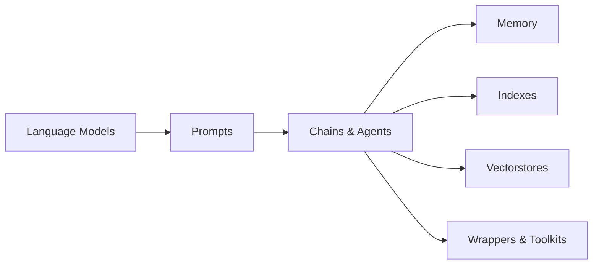

# 【LangChain编程：从入门到实践】管理工具安装

## 1. 背景介绍
### 1.1 问题的由来
随着人工智能技术的飞速发展，特别是大语言模型的出现，自然语言处理领域取得了突破性进展。然而，如何高效地将大语言模型应用到实际项目中，仍然是一个亟待解决的问题。LangChain应运而生，它是一个用于开发由语言模型驱动的应用程序的框架，旨在简化和加速AI应用的开发过程。

### 1.2 研究现状
目前，市面上已经有多个基于LangChain的开源项目和商业应用，涵盖了智能问答、文本生成、知识图谱构建等多个领域。不过，对于初学者来说，如何快速上手LangChain编程，搭建一个完整的开发环境，仍然是一个不小的挑战。因此，系统地介绍LangChain的管理工具安装过程，对于推动其在业界的普及应用具有重要意义。

### 1.3 研究意义
通过对LangChain管理工具安装过程的深入剖析，可以帮助开发者快速搭建起一套完整的开发环境，从而降低学习门槛，提高开发效率。同时，这也有助于推动LangChain技术在各行各业的应用落地，为人工智能赋能传统行业注入新的活力。

### 1.4 本文结构
本文将从以下几个方面展开论述：首先介绍LangChain的核心概念及其与其他技术的联系；然后重点讲解LangChain管理工具的安装步骤，包括环境依赖、安装命令等；接着通过一个完整的代码实例，演示如何利用LangChain快速搭建一个智能问答系统；最后总结LangChain技术的发展趋势和面临的挑战。

## 2. 核心概念与联系
LangChain是一个基于语言模型的应用开发框架，其核心理念是将大语言模型与外部知识源相结合，赋予语言模型更强大的信息处理和应用能力。与传统的自然语言处理管道不同，LangChain采用了prompt编程的思想，通过设计优质的prompt模板，引导语言模型进行特定领域的文本生成和知识推理。

同时，LangChain还与向量数据库、知识图谱等技术深度集成，使得开发者可以方便地管理和检索海量的非结构化数据。此外，LangChain还提供了丰富的工具链和插件机制，可以与各种第三方服务（如搜索引擎、数据分析平台等）进行对接，大大拓展了其应用场景。

下图展示了LangChain的核心架构和关键组件之间的联系：



## 3. 核心算法原理 & 具体操作步骤
### 3.1 算法原理概述
LangChain的核心算法主要包括两个部分：一是基于Transformer的大语言模型，负责自然语言理解和生成；二是基于向量检索的语义索引算法，用于快速匹配海量文本数据中与查询最相关的片段。

### 3.2 算法步骤详解
1. **环境准备**：安装Python 3.8+版本，配置虚拟环境，安装LangChain及其依赖包。
2. **模型加载**：根据具体任务需求，选择合适的预训练语言模型（如GPT-3、BERT等），并使用LangChain提供的接口进行模型加载和调用。
3. **索引构建**：对于大规模语料数据，需要先将其向量化，然后利用向量索引算法（如Faiss、Annoy等）构建语义索引，加速后续的相似度检索。
4. **Prompt设计**：根据具体应用场景，设计合适的Prompt模板，引导语言模型进行特定领域的文本生成。一个优质的Prompt要具备明确的指令、必要的上下文信息、恰当的格式约束等特点。
5. **管道搭建**：利用LangChain提供的Chain和Agent机制，将语言模型、Prompt、索引等组件组合成一个完整的处理管道。LangChain支持顺序链、映射链、条件链等多种执行逻辑。
6. **应用部署**：将搭建好的LangChain管道封装成API接口，与前端UI界面进行对接，实现端到端的智能应用系统。

### 3.3 算法优缺点
LangChain的优点在于其简洁灵活的接口设计，以及对主流语言模型和向量数据库的良好支持，大大降低了开发者的使用门槛。但其缺点是对于大规模数据的处理效率有待进一步优化，而且Prompt设计有一定的技巧性，需要开发者根据实际需求不断迭代优化。

### 3.4 算法应用领域
LangChain可以广泛应用于智能问答、文本摘要、知识图谱构建、数据分析等领域。事实上，绝大多数需要语言模型参与的任务，都可以使用LangChain来简化开发流程，提高开发效率。

## 4. 数学模型和公式 & 详细讲解 & 举例说明
### 4.1 数学模型构建
LangChain中的语言模型主要基于Transformer架构，其核心是自注意力机制和前馈神经网络。给定一个输入序列$X=(x_1,\cdots,x_n)$，Transformer首先将其转换为一组向量表示$H^{(0)}=(h_1^{(0)},\cdots,h_n^{(0)})$：

$$
H^{(0)} = \text{Embedding}(X)
$$

然后，通过多轮的自注意力和前馈网络的迭代计算，得到最终的隐层表示$H^{(N)}$：

$$
\begin{aligned}
H^{(l)} &= \text{SelfAttention}(H^{(l-1)}) \\
H^{(l)} &= \text{FeedForward}(H^{(l)})
\end{aligned}
$$

其中，自注意力机制可以捕捉序列中不同位置之间的长距离依赖关系，前馈网络则用于对特征进行非线性变换。最后，将$H^{(N)}$输入到线性层和Softmax层，即可得到生成每个词的概率分布。

### 4.2 公式推导过程
自注意力机制的计算公式为：

$$
\text{Attention}(Q,K,V) = \text{softmax}(\frac{QK^T}{\sqrt{d_k}})V
$$

其中，$Q$、$K$、$V$分别表示查询向量、键向量和值向量，$d_k$为向量维度。这个公式可以理解为：首先计算查询向量和所有键向量的相似度得分，然后对得分进行归一化，最后用归一化后的得分对值向量进行加权求和，得到注意力向量。

前馈网络的计算公式为：

$$
\text{FeedForward}(x)=\max(0, xW_1 + b_1)W_2 + b_2
$$

其中，$W_1$、$W_2$、$b_1$、$b_2$为可学习的参数矩阵和偏置项，$\max(0,\cdot)$为ReLU激活函数。这个公式可以看作是两个线性变换之间加入了一个非线性激活函数，用于提高模型的表达能力。

### 4.3 案例分析与讲解
下面我们以一个简单的句子"I love LangChain"为例，演示LangChain中语言模型的计算过程。

首先，将句子转换为向量表示：

$$
X = [\text{I},\text{love},\text{LangChain}] \Rightarrow H^{(0)} = [h_{\text{I}}^{(0)}, h_{\text{love}}^{(0)}, h_{\text{LangChain}}^{(0)}]
$$

然后，通过自注意力机制计算句子中每个词与其他词之间的相关性：

$$
\begin{aligned}
Q &= H^{(0)}W_Q \\
K &= H^{(0)}W_K \\
V &= H^{(0)}W_V \\
H^{(1)} &= \text{Attention}(Q,K,V)
\end{aligned}
$$

接着，将自注意力的输出送入前馈网络，进行非线性变换：

$$
H^{(1)} = \text{FeedForward}(H^{(1)})
$$

最后，将$H^{(1)}$输入到线性层和Softmax层，得到下一个词的概率分布：

$$
P(\text{next word}) = \text{Softmax}(H^{(1)}W_{out} + b_{out})
$$

通过这个案例，我们可以清晰地看到LangChain中语言模型的计算流程，以及每一步的数学公式和含义。

### 4.4 常见问题解答
**Q**: Transformer中的位置编码有什么作用？  
**A**: 位置编码用于引入词语在句子中的位置信息。由于Transformer不包含循环和卷积结构，无法捕捉词语的顺序信息，因此需要通过位置编码的方式显式地将位置信息注入到词向量中。常见的位置编码方式有正弦编码和学习型编码。

**Q**: Transformer为什么使用多头注意力机制？  
**A**: 多头注意力机制允许模型在不同的子空间中计算注意力权重，从而捕捉输入序列中更加多样化的语义关系。直观地说，多头注意力就像是让模型从不同的角度去理解和表示输入序列，有助于提高模型的泛化能力。

**Q**: LangChain支持哪些主流的语言模型和向量数据库？  
**A**: LangChain目前支持GPT-3、BERT、RoBERTa等主流的语言模型，以及Faiss、Annoy、Elasticsearch等常用的向量数据库。此外，LangChain还在不断扩展对更多模型和数据库的支持，开发者可以关注其官方文档获取最新进展。

## 5. 项目实践：代码实例和详细解释说明 
### 5.1 开发环境搭建
首先，我们需要安装Python 3.8+版本，然后创建一个虚拟环境并激活：

```bash
python3 -m venv langchain-env
source langchain-env/bin/activate
```

接着，安装LangChain及其依赖包：

```bash
pip install langchain openai faiss-cpu
```

这里我们安装了LangChain核心库、OpenAI的API客户端以及Faiss向量数据库。

### 5.2 源代码详细实现
下面我们以一个简单的智能问答系统为例，演示如何使用LangChain快速搭建一个端到端的应用。

```python
from langchain.llms import OpenAI
from langchain.prompts import PromptTemplate
from langchain.chains import LLMChain
from langchain.document_loaders import TextLoader
from langchain.indexes import VectorstoreIndexCreator
from langchain.vectorstores import FAISS

# 加载语言模型
llm = OpenAI(temperature=0.9)

# 定义Prompt模板
template = """基于以下已知信息，简洁和专业的来回答用户的问题。
如果无法从中得到答案，请说 "根据已知信息无法回答该问题"。

已知内容:
{context}

问题:
{question}
"""
prompt = PromptTemplate(template=template, input_variables=["context", "question"])

# 加载文档
loader = TextLoader("./data/knowledge.txt")
index = VectorstoreIndexCreator(vectorstore_cls=FAISS).from_loaders([loader])

# 定义问答Chain
chain = LLMChain(llm=llm, prompt=prompt)

# 接收用户输入
while True:
    question = input("请输入问题：")
    if question.strip() == "exit":
        break
    
    # 从索引中检索相关文档
    docs = index.vectorstore.similarity_search(question, k=2)
    context = "\n".join([doc.page_content for doc in docs])
    
    # 生成答案
    answer = chain.run(question=question, context=context)
    print(answer)
```

### 5.3 代码解读与分析
1. 首先加载OpenAI的语言模型，并设置temperature参数控制生成结果的随机性。
2. 定义一个Prompt模板，其中包含两个输入变量：context表示已知信息，question表示用户问题。
3. 加载知识库文档，并使用FAISS构建向量索引，方便后续的相似度检索。
4. 定义一个问答Chain，指定使用的语言模型和Prompt模板。
5. 进入主循环，接收用户输入的问