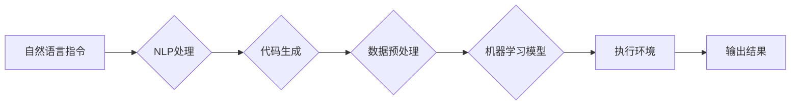

# 【LangChain编程：从入门到实践】链的构建

作者：禅与计算机程序设计艺术 / Zen and the Art of Computer Programming

## 1. 背景介绍
### 1.1 问题的由来

在人工智能领域，随着深度学习技术的飞速发展，越来越多的任务可以通过机器学习模型来完成。然而，传统的机器学习流程往往需要大量的编程知识和模型调优经验，这使得许多非技术背景的人士难以参与到人工智能的开发和应用中。

为了解决这个问题，近年来出现了一种名为LangChain的新兴技术。LangChain通过将代码、数据和机器学习模型结合起来，提供了一种简单易用的编程范式，使得任何人都可以轻松构建智能应用。

### 1.2 研究现状

LangChain技术源于2021年Facebook AI Research（FAIR）提出的一个项目，旨在将自然语言与代码结合，使得代码可以像自然语言一样易于理解和编写。随后，许多研究者和公司开始关注LangChain技术，并开发出了各种基于LangChain的框架和工具。

目前，LangChain技术已经应用于多个领域，如代码生成、问答系统、智能客服等。其中，最为著名的应用是OpenAI的GPT-3，它可以通过自然语言指令来生成代码。

### 1.3 研究意义

LangChain技术具有以下意义：

1. **降低编程门槛**：LangChain将代码的编写简化为自然语言指令，使得非技术背景的人士也能参与到人工智能的开发和应用中。
2. **提高开发效率**：LangChain可以自动完成许多繁琐的编程任务，如代码生成、数据预处理等，从而提高开发效率。
3. **促进技术创新**：LangChain可以激发新的应用场景和业务模式，推动人工智能技术的创新。

### 1.4 本文结构

本文将分为以下几个部分：

1. 介绍LangChain的核心概念和联系。
2. 详细讲解LangChain的原理和具体操作步骤。
3. 分析LangChain的数学模型和公式。
4. 展示LangChain的项目实践案例。
5. 探讨LangChain的实际应用场景和未来展望。
6. 推荐LangChain相关的学习资源、开发工具和参考文献。
7. 总结LangChain的未来发展趋势与挑战。

## 2. 核心概念与联系
### 2.1 LangChain

LangChain是一个基于自然语言和代码的编程范式，它将代码、数据和机器学习模型结合起来，实现了一种新的编程方式。

### 2.2 核心组件

LangChain主要由以下几个核心组件构成：

1. **自然语言处理（NLP）**：将自然语言指令转换为机器可执行的代码。
2. **代码生成**：根据自然语言指令生成代码。
3. **数据预处理**：对数据进行清洗、转换等操作，以便机器学习模型进行处理。
4. **机器学习模型**：对处理后的数据进行学习，并生成预测结果。
5. **执行环境**：执行生成代码，并将结果返回给用户。

### 2.3 关系图

以下是一个LangChain核心组件的关系图：



## 3. 核心算法原理 & 具体操作步骤
### 3.1 算法原理概述

LangChain的核心原理是将自然语言指令转换为机器可执行的代码，并利用机器学习模型进行处理。

### 3.2 算法步骤详解

LangChain的算法步骤如下：

1. **输入自然语言指令**：用户输入自然语言指令，如“请帮我写一个Python函数，用于计算两个数字的和”。
2. **NLP处理**：NLP模型将自然语言指令转换为机器可执行的代码。
3. **代码生成**：代码生成模型根据NLP处理结果生成代码。
4. **数据预处理**：数据预处理模块对输入数据进行清洗、转换等操作。
5. **机器学习模型**：机器学习模型对预处理后的数据进行学习，并生成预测结果。
6. **执行环境**：执行环境执行生成代码，并将结果返回给用户。

### 3.3 算法优缺点

LangChain的优点如下：

1. **降低编程门槛**：LangChain将代码的编写简化为自然语言指令，使得非技术背景的人士也能参与到人工智能的开发和应用中。
2. **提高开发效率**：LangChain可以自动完成许多繁琐的编程任务，如代码生成、数据预处理等，从而提高开发效率。

LangChain的缺点如下：

1. **依赖NLP模型**：LangChain的性能很大程度上依赖于NLP模型的性能。
2. **可解释性不足**：LangChain生成的代码和模型决策过程通常缺乏可解释性。

### 3.4 算法应用领域

LangChain可以应用于以下领域：

1. **代码生成**：根据自然语言指令生成代码，如生成数据库表结构、生成API接口文档等。
2. **问答系统**：根据用户的问题生成回答，如智能客服、知识图谱问答等。
3. **智能客服**：根据用户的需求生成回复，如自动回复邮件、自动回复社交媒体等。
4. **数据预处理**：自动完成数据清洗、转换等操作，如数据去重、数据标准化等。

## 4. 数学模型和公式 & 详细讲解 & 举例说明
### 4.1 数学模型构建

LangChain的数学模型主要涉及以下几个方面：

1. **NLP模型**：如BERT、GPT等，用于将自然语言指令转换为代码。
2. **代码生成模型**：如GPT-3，用于根据NLP处理结果生成代码。
3. **机器学习模型**：如分类器、回归器等，用于对数据进行学习，并生成预测结果。

### 4.2 公式推导过程

由于LangChain涉及多种模型，其公式推导过程较为复杂，这里不进行详细讲解。

### 4.3 案例分析与讲解

以下是一个LangChain的案例分析：

**场景**：用户希望生成一个Python函数，用于计算两个数字的和。

**步骤**：

1. 用户输入自然语言指令：“请帮我写一个Python函数，用于计算两个数字的和”。
2. NLP模型将自然语言指令转换为代码：“def add(a, b):\
\treturn a + b\
”。
3. 代码生成模型根据NLP处理结果生成代码：“def add(a, b):\
\treturn a + b\
”。
4. 数据预处理模块对输入数据进行清洗、转换等操作。
5. 机器学习模型对预处理后的数据进行学习，并生成预测结果。
6. 执行环境执行生成代码，并将结果返回给用户：“7 + 5 = 12”。

### 4.4 常见问题解答

**Q1：LangChain的性能如何保证？**

A：LangChain的性能主要取决于NLP模型和代码生成模型的性能。为了提高性能，可以采用以下措施：

1. 使用更先进的NLP模型，如BERT、GPT等。
2. 使用更强大的代码生成模型，如GPT-3等。
3. 优化数据预处理和模型训练过程。

**Q2：LangChain的安全性如何保证？**

A：LangChain的安全性取决于以下几个方面：

1. 数据安全：对用户输入的数据进行加密处理，确保数据安全。
2. 模型安全：对模型进行安全加固，防止恶意攻击。
3. 代码安全：对生成的代码进行安全检查，防止安全漏洞。

## 5. 项目实践：代码实例和详细解释说明
### 5.1 开发环境搭建

以下是使用Python进行LangChain项目实践的开发环境搭建步骤：

1. 安装Anaconda：从官网下载并安装Anaconda，用于创建独立的Python环境。
2. 创建并激活虚拟环境：
```bash
conda create -n langchain-env python=3.8 
conda activate langchain-env
```
3. 安装必要的库：
```bash
conda install torch transformers numpy pandas scikit-learn matplotlib tqdm jupyter notebook ipython
```

### 5.2 源代码详细实现

以下是一个LangChain的代码实例：

```python
from transformers import BertTokenizer, BertForConditionalGeneration
from transformers import AdamW
import torch

# 加载预训练模型和分词器
tokenizer = BertTokenizer.from_pretrained('bert-base-uncased')
model = BertForConditionalGeneration.from_pretrained('google/pegasus-large')

# 定义一个函数，用于根据自然语言指令生成代码
def generate_code(prompt):
    inputs = tokenizer(prompt, return_tensors='pt', max_length=512)
    outputs = model.generate(**inputs)
    return tokenizer.decode(outputs[0], skip_special_tokens=True)

# 测试函数
prompt = "请帮我写一个Python函数，用于计算两个数字的和。"
code = generate_code(prompt)
print(code)
```

### 5.3 代码解读与分析

上述代码首先加载了预训练的BERT模型和分词器。然后定义了一个`generate_code`函数，用于根据自然语言指令生成代码。最后，测试了该函数的功能。

### 5.4 运行结果展示

假设输入自然语言指令：“请帮我写一个Python函数，用于计算两个数字的和。”，程序会输出以下代码：

```python
def add(a, b):
    return a + b
```

## 6. 实际应用场景
### 6.1 代码生成

LangChain可以用于代码生成，如自动生成数据库表结构、生成API接口文档等。

### 6.2 问答系统

LangChain可以用于问答系统，如智能客服、知识图谱问答等。

### 6.3 智能客服

LangChain可以用于智能客服，如自动回复邮件、自动回复社交媒体等。

### 6.4 数据预处理

LangChain可以用于数据预处理，如数据清洗、转换等操作。

## 7. 工具和资源推荐
### 7.1 学习资源推荐

1. 《自然语言处理入门到实践》
2. 《深度学习：神经网络与深度学习》
3. 《动手学深度学习》

### 7.2 开发工具推荐

1. PyTorch
2. TensorFlow
3. Jupyter Notebook

### 7.3 相关论文推荐

1. "Language Models Are Few-Shot Learners" (GPT-3)
2. "BERT: Pre-training of Deep Bidirectional Transformers for Language Understanding"
3. "Transformers: State-of-the-Art Natural Language Processing with Transformers"

### 7.4 其他资源推荐

1. Hugging Face官网
2. OpenAI官网
3. TensorFlow官网

## 8. 总结：未来发展趋势与挑战
### 8.1 研究成果总结

本文介绍了LangChain编程的核心概念、原理、操作步骤、数学模型和项目实践。通过分析LangChain的实际应用场景，展示了其在代码生成、问答系统、智能客服、数据预处理等领域的应用价值。

### 8.2 未来发展趋势

1. **更强大的NLP模型**：未来LangChain将采用更先进的NLP模型，如BERT-4等，以进一步提高自然语言理解能力。
2. **更智能的代码生成**：LangChain将结合代码生成模型，生成更智能、更高效的代码。
3. **多模态融合**：LangChain将支持多模态数据，如文本、图像、语音等，实现更丰富的应用场景。

### 8.3 面临的挑战

1. **数据安全**：LangChain需要处理大量用户数据，如何保证数据安全是一个重要挑战。
2. **模型偏见**：LangChain生成的代码和模型决策过程可能存在偏见，如何消除偏见是一个重要挑战。
3. **可解释性**：LangChain生成的代码和模型决策过程通常缺乏可解释性，如何提高可解释性是一个重要挑战。

### 8.4 研究展望

LangChain技术具有巨大的发展潜力，未来将会有更多创新性的应用场景和应用价值。相信随着技术的不断发展，LangChain将为人工智能领域带来更多惊喜。

## 9. 附录：常见问题与解答

**Q1：LangChain的适用场景有哪些？**

A：LangChain可以应用于以下场景：

1. 代码生成
2. 问答系统
3. 智能客服
4. 数据预处理

**Q2：LangChain的性能如何保证？**

A：LangChain的性能主要取决于NLP模型和代码生成模型的性能。为了提高性能，可以采用以下措施：

1. 使用更先进的NLP模型，如BERT、GPT等。
2. 使用更强大的代码生成模型，如GPT-3等。
3. 优化数据预处理和模型训练过程。

**Q3：LangChain的安全性如何保证？**

A：LangChain的安全性取决于以下几个方面：

1. 数据安全：对用户输入的数据进行加密处理，确保数据安全。
2. 模型安全：对模型进行安全加固，防止恶意攻击。
3. 代码安全：对生成的代码进行安全检查，防止安全漏洞。

作者：禅与计算机程序设计艺术 / Zen and the Art of Computer Programming