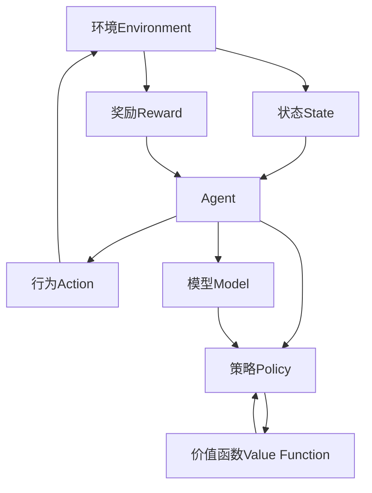

# 【大模型应用开发 动手做AI Agent】何谓Agent，为何Agent

## 1. 背景介绍

### 1.1 问题的由来

在人工智能领域的发展历程中,Agent(智能体)一直是一个核心概念和研究热点。随着深度学习和大型语言模型的兴起,Agent的应用场景和研究方向也发生了巨大变化。传统的Agent系统主要关注于规则引擎、决策树等基于符号系统的方法,而现代Agent则更多地融合了机器学习、深度学习等数据驱动的方法,展现出更强大的能力。

### 1.2 研究现状

目前,Agent被广泛应用于游戏AI、机器人控制、对话系统、智能助理等多个领域。随着计算能力和数据量的不断增长,Agent的能力也在不断提升。例如,DeepMind的AlphaGo系统在围棋领域取得了超人的成绩;OpenAI的GPT语言模型在自然语言处理任务上表现出色;波士顿动力公司的Atlas机器人展现了出色的运动控制能力。

### 1.3 研究意义

Agent作为连接人工智能算法与现实世界的桥梁,对于推动人工智能技术的实际应用具有重要意义。通过研究Agent,我们可以更好地理解智能系统如何感知环境、做出决策并执行行为,从而设计出更加智能、高效和安全的系统。此外,Agent的研究也有助于我们探索通用人工智能(AGI)的理论和方法。

### 1.4 本文结构

本文将从Agent的基本概念出发,阐述其核心原理和算法,并介绍相关的数学模型和公式。随后,我们将通过实际项目实践,展示如何开发和应用Agent系统。最后,我们将探讨Agent在现实场景中的应用,以及未来的发展趋势和挑战。

## 2. 核心概念与联系

在深入讨论Agent的细节之前,我们需要先了解一些核心概念及其相互关系。

**环境(Environment)**:Agent所处的外部世界,包括物理环境和虚拟环境。环境可以是静态的,也可以是动态变化的。

**状态(State)**:描述环境的当前情况的一组观测值或变量。

**奖励(Reward)**:Agent执行某个行为后,环境给予的正面或负面反馈,用于指导Agent的决策。

**策略(Policy)**:Agent根据当前状态选择行为的规则或函数映射。

**价值函数(Value Function)**:估计在给定状态下执行某个策略所能获得的长期累积奖励。

**模型(Model)**:描述环境状态转移规律的函数或概率分布,用于预测Agent的行为将导致什么样的后果。

**Agent**:能够感知环境、做出决策并执行行为的智能系统。Agent的目标是通过与环境交互,最大化长期累积奖励。

这些概念之间的关系如下所示:

## 3. 核心算法原理 & 具体操作步骤

### 3.1 算法原理概述

Agent系统的核心算法主要包括强化学习(Reinforcement Learning)和规划(Planning)两大类。

**强化学习**是一种基于试错的学习方式,Agent通过不断与环境交互,根据获得的奖励信号调整策略,逐步优化长期累积奖励。常见的强化学习算法包括Q-Learning、Sarsa、Policy Gradient等。

**规划**则是基于已知的环境模型,通过搜索或优化等方法,直接求解最优策略或行为序列。常见的规划算法包括价值迭代(Value Iteration)、策略迭代(Policy Iteration)、蒙特卡罗树搜索(Monte Carlo Tree Search)等。

在实际应用中,强化学习和规划通常会结合使用,互为补充。例如,可以先使用强化学习从环境交互中学习一个初始策略,然后基于学习到的模型进行规划求解,再将规划结果用于指导强化学习的探索,循环迭代直至收敛。

### 3.2 算法步骤详解

以Q-Learning算法为例,其核心步骤如下:

1. **初始化**:初始化Q值函数$Q(s,a)$,表示在状态$s$执行行为$a$后的长期累积奖励估计值。
2. **观测状态**:Agent观测当前环境状态$s_t$。
3. **选择行为**:根据$\epsilon-$贪婪策略,以$\epsilon$的概率随机选择一个行为$a_t$,或以$1-\epsilon$的概率选择当前Q值最大的行为。
4. **执行行为**:Agent执行选择的行为$a_t$,环境转移到新状态$s_{t+1}$,并返回立即奖励$r_{t+1}$。
5. **更新Q值**:根据下式更新$Q(s_t,a_t)$的估计值:

$$Q(s_t,a_t) \leftarrow Q(s_t,a_t) + \alpha\left[r_{t+1} + \gamma\max_aQ(s_{t+1},a) - Q(s_t,a_t)\right]$$

其中$\alpha$是学习率,$\gamma$是折现因子。
6. **迭代**:重复步骤2-5,直至收敛或达到预设条件。

### 3.3 算法优缺点

**优点**:

- 通用性强,可应用于各种环境和任务。
- 无需事先了解环境的转移规律,可以通过试错学习获取经验。
- 具有在线学习和持续适应的能力。

**缺点**:

- 收敛速度较慢,需要大量的环境交互数据。
- 存在样本效率低下和维数灾难的问题。
- 对于复杂环境,探索和利用之间的权衡较为困难。

### 3.4 算法应用领域

强化学习算法可应用于多个领域,包括但不限于:

- 游戏AI:训练智能体玩各种电子游戏,如围棋、国际象棋、Atari游戏等。
- 机器人控制:训练机器人在各种环境中运动和完成任务。
- 自动驾驶:训练智能体驾驶汽车在复杂的道路环境中行驶。
- 对话系统:训练智能对话代理与人自然交互。
- 资源管理:优化数据中心、电网等资源的调度和分配。
- 金融交易:自动化交易策略的优化。

## 4. 数学模型和公式 & 详细讲解 & 举例说明

### 4.1 数学模型构建

为了形式化描述Agent与环境的交互过程,我们通常使用**马尔可夫决策过程(Markov Decision Process,MDP)**作为数学模型。

一个MDP可以用一个五元组$(S,A,P,R,\gamma)$来表示:

- $S$是环境的**状态集合**
- $A$是Agent可执行的**行为集合**  
- $P(s'|s,a)$是**状态转移概率**,表示在状态$s$执行行为$a$后,转移到状态$s'$的概率
- $R(s,a)$是**奖励函数**,表示在状态$s$执行行为$a$后获得的即时奖励
- $\gamma\in[0,1)$是**折现因子**,用于权衡即时奖励和长期累积奖励的权重

在MDP框架下,Agent的目标是找到一个**策略**$\pi:S\rightarrow A$,使得在该策略下的**长期累积折现奖励**$G_t$的期望值最大化:

$$\max_\pi \mathbb{E}\left[\sum_{k=0}^\infty\gamma^kR_{t+k+1}|s_t=s,\pi\right]=\max_\pi \mathbb{E}_\pi\left[G_t|s_t=s\right]$$

其中$G_t=\sum_{k=0}^\infty\gamma^kR_{t+k+1}$表示从时刻$t$开始执行策略$\pi$所获得的折现累积奖励。

为了评估一个策略$\pi$的好坏,我们定义**状态值函数(State-Value Function)** $V^\pi(s)$和**行为值函数(Action-Value Function)** $Q^\pi(s,a)$:

$$V^\pi(s)=\mathbb{E}_\pi\left[G_t|s_t=s\right]$$
$$Q^\pi(s,a)=\mathbb{E}_\pi\left[G_t|s_t=s,a_t=a\right]$$

$V^\pi(s)$表示在状态$s$下执行策略$\pi$所能获得的长期累积奖励的期望值,$Q^\pi(s,a)$则表示在状态$s$下先执行行为$a$,之后再执行策略$\pi$所能获得的长期累积奖励的期望值。

### 4.2 公式推导过程

接下来,我们推导出$V^\pi(s)$和$Q^\pi(s,a)$的递推公式,这对于设计算法和理解算法原理非常重要。

根据$V^\pi(s)$的定义,我们有:

$$\begin{aligned}
V^\pi(s)&=\mathbb{E}_\pi\left[G_t|s_t=s\right]\\
&=\mathbb{E}_\pi\left[\sum_{k=0}^\infty\gamma^kR_{t+k+1}|s_t=s\right]\\
&=\mathbb{E}_\pi\left[R_{t+1}+\gamma\sum_{k=0}^\infty\gamma^kR_{t+k+2}|s_t=s\right]\\
&=\mathbb{E}_\pi\left[R_{t+1}+\gamma G_{t+1}|s_t=s\right]\\
&=\sum_a\pi(a|s)\sum_{s'}\mathcal{P}_{ss'}^a\left[R_s^a+\gamma V^\pi(s')\right]
\end{aligned}$$

其中$\pi(a|s)$是在状态$s$下执行行为$a$的概率,$\mathcal{P}_{ss'}^a=P(s'|s,a)$是状态转移概率。

类似地,对于$Q^\pi(s,a)$,我们有:

$$\begin{aligned}
Q^\pi(s,a)&=\mathbb{E}_\pi\left[G_t|s_t=s,a_t=a\right]\\
&=\mathbb{E}_\pi\left[R_{t+1}+\gamma G_{t+1}|s_t=s,a_t=a\right]\\
&=\sum_{s'}\mathcal{P}_{ss'}^a\left[R_s^a+\gamma\sum_{a'}\pi(a'|s')Q^\pi(s',a')\right]
\end{aligned}$$

这两个公式被称为**贝尔曼方程(Bellman Equations)**,是强化学习算法的基础。基于这些公式,我们可以设计出不同的算法来求解最优策略和对应的值函数。

### 4.3 案例分析与讲解

为了更好地理解MDP和贝尔曼方程,让我们来看一个经典的"格子世界(GridWorld)"示例。

在这个示例中,Agent位于一个$4\times 4$的网格世界中,初始位置为(0,0)。Agent的目标是到达终止状态(3,3),在此过程中获得的奖励越高越好。每一步,Agent可以选择上下左右四个方向中的一个行为,并有10%的概率会朝其他方向移动(即存在随机扰动)。到达终止状态会获得+1的奖励,而落入(3,2)或(3,1)这两个陷阱状态会获得-1的惩罚。其他状态的奖励均为0。

我们用一个$4\times 4$的矩阵来表示这个网格世界的状态值函数$V(s)$:

$$V(s)=\begin{bmatrix}
0.43 & 0.30 & 0.17 & 0.04\\
0.56 & 0.43 & 0.30 & 0.17\\
0.69 & 0.56 & 0.43 & 0.30\\
0.82 & 0.69 & 0.56 & 1.00
\end{bmatrix}$$

可以看出,距离终止状态越近,状态值越高,这是因为Agent能获得的长期累积奖励越大。

同时,我们也可以计算出在每个状态下执行不同行为的行为值函数$Q(s,a)$。以状态(0,0)为例,四个行为的$Q$值分别为:

$$\begin{aligned}
Q((0,0),\uparrow)&=0.30\\
Q((0,0),\downarrow)&=0.56\\
Q((0,0),\leftar