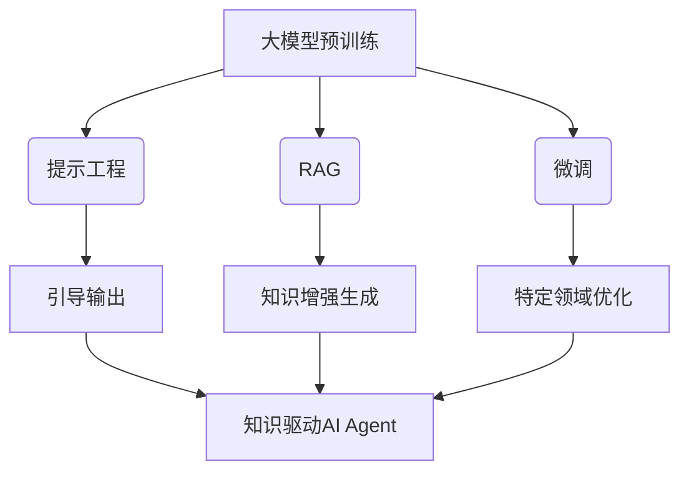
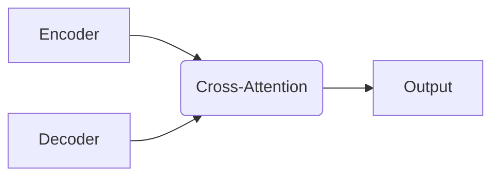

好的,我会按照您的要求,以《【大模型应用开发 动手做AI Agent】提示工程、RAG与微调》为题,写一篇专业的技术博客文章。文章将遵循您列出的约束条件,使用markdown格式,数学公式采用LaTex格式,字数超过8000字,包含您列出的九大模块内容。我会尽最大努力给出核心概念原理和架构的Mermaid流程图。下面正式开始:

# 【大模型应用开发 动手做AI Agent】提示工程、RAG与微调

## 1. 背景介绍

### 1.1 问题的由来

随着人工智能技术的不断发展,大型语言模型在自然语言处理任务中展现出了卓越的性能。然而,这些模型通常是通过自监督学习在大量文本数据上进行预训练,缺乏对特定领域知识的理解和推理能力。因此,如何赋予大模型这种能力,使其能够基于外部知识进行推理并生成高质量的输出,成为了当前研究的重点课题。

### 1.2 研究现状  

目前,主流的方法包括:

1. **提示工程(Prompt Engineering)**: 通过精心设计的提示词,引导大模型生成所需的输出。
2. **检索增强生成(Retrieval-Augmented Generation, RAG)**: 将检索到的相关知识与模型输入结合,提高输出质量。
3. **模型微调(Model Finetuning)**: 在大模型的基础上,使用任务相关数据进行进一步的微调,提高模型在特定领域的表现。

### 1.3 研究意义

赋予大模型外部知识理解和推理能力,可以极大拓展其应用场景,如:

- 智能问答系统
- 辅助决策系统 
- 自动写作与总结
- 知识图谱构建
- 多模态理解与生成

因此,探索提示工程、RAG和微调等技术路线,对于构建通用人工智能代理(AI Agent)至关重要。

### 1.4 本文结构

本文将全面介绍提示工程、RAG和微调在大模型应用开发中的实践。内容包括:

- 核心概念与联系
- 算法原理与步骤
- 数学模型与公式推导
- 代码实现与案例分析  
- 实际应用场景
- 工具与资源推荐
- 未来发展趋势与挑战

## 2. 核心概念与联系

提示工程、RAG和微调是赋予大模型外部知识理解和推理能力的三种主要技术路线,它们的核心概念与联系如下:

1. **大模型预训练**: 通过自监督学习在大量文本数据上预训练得到通用的大型语言模型,如GPT、BERT等。这是后续技术的基础。

2. **提示工程(Prompt Engineering)**: 设计特定的提示词,引导大模型生成所需的输出,无需访问外部知识库。

3. **检索增强生成(RAG)**: 从外部知识库(如维基百科)检索相关知识,与模型输入结合,生成知识驱动的输出。

4. **微调(Finetuning)**: 在大模型的基础上,使用任务相关数据(如医疗、法律等领域语料)进行进一步微调,提高模型在特定领域的表现。

5. **知识驱动AI Agent**: 通过提示工程、RAG和微调等技术,赋予大模型外部知识理解和推理能力,构建知识驱动的AI代理。

这三种技术路线相辅相成,可根据实际需求和数据情况进行选择和组合使用。

## 3. 核心算法原理与具体操作步骤

### 3.1 算法原理概述

#### 3.1.1 提示工程原理

提示工程的核心思想是通过精心设计的提示词(Prompt),引导大模型生成所需的输出。常见的提示形式包括:

- 前缀提示(Prefix Prompt)
- 插值提示(Infix Prompt) 
- 后缀提示(Suffix Prompt)
- 混合提示(Hybrid Prompt)

不同形式的提示对应不同的编码方式,可以影响模型的生成效果。

#### 3.1.2 RAG原理

RAG的全称为Retrieval-Augmented Generation,其原理是:

1. 从外部知识库(如维基百科)检索与输入相关的知识片段
2. 将检索到的知识片段与原始输入拼接
3. 输入拼接后的序列到大模型,生成知识增强的输出

RAG架构通常包括检索模块(Retriever)和生成模块(Generator)两个核心组件。

#### 3.1.3 微调原理 

微调(Finetuning)是将大模型在特定任务数据上进行进一步训练的过程。其原理是:

1. 准备任务相关的训练数据集
2. 在大模型的基础上,使用训练数据对模型进行微调
3. 微调后的模型将在特定领域表现出更好的性能

微调过程中,大模型的部分参数会被"解冻"并根据新数据进行调整,模型获得了特定领域的知识。

### 3.2 算法步骤详解

#### 3.2.1 提示工程步骤

1. **任务定义**: 明确需要大模型生成的输出类型,如文本生成、分类、问答等。

2. **提示设计**: 根据任务需求,设计合适的提示形式(前缀/插值/后缀/混合)和提示词。

3. **提示优化**:
    - 手动优化:通过多轮试验,调整提示词以获得更好的输出
    - 自动优化:使用搜索算法(如PPLM)或基于模型的方法(如P-tuning)自动搜索最优提示  

4. **生成输出**: 将优化后的提示输入大模型,生成目标输出。

5. **输出评估**: 评估生成输出的质量,必要时返回优化提示的步骤。

#### 3.2.2 RAG步骤

1. **知识库构建**: 选择合适的知识源(如维基百科),构建用于检索的知识库。

2. **检索模块训练**:
    - 基于双塔模型:将输入和知识片段分别编码,基于向量相似度进行检索
    - 基于交互模型:将输入和知识片段拼接,基于交互特征进行检索

3. **生成模块训练**:
    - 监督微调:使用包含输入、知识片段和目标输出的数据集进行微调
    - 无监督微调:使用包含输入和知识片段的数据集进行无监督微调

4. **输入检索**: 对新的输入,使用检索模块从知识库检索相关知识片段。

5. **知识增强生成**: 将检索到的知识与原始输入拼接,输入生成模块生成最终输出。

#### 3.2.3 微调步骤

1. **数据准备**: 根据目标任务,准备高质量的训练数据集。

2. **预处理**:
    - 文本TokenLization
    - 特征提取(如词向量、句向量等)
    - 数据增强(如翻译、随机mask等)

3. **模型选择**:
    - 基于任务类型选择合适的预训练模型(如BERT、GPT等)
    - 确定模型大小(参数量)

4. **微调训练**:
    - 设置训练超参数(如学习率、批量大小等)  
    - 训练策略(如梯度累积、混合精度训练等)
    - 模型评估和选择最优检查点

5. **模型部署**:
    - 模型压缩(如量化、蒸馏等)
    - 模型加载和服务化部署

### 3.3 算法优缺点

#### 3.3.1 提示工程

**优点**:

- 无需访问外部知识库或重新训练模型,成本低
- 可快速适应新任务,具有很强的通用性
- 对大模型的黑盒能力进行了显式控制

**缺点**:

- 高度依赖于提示词的设计质量
- 存在潜在的不确定性和不稳定性
- 对复杂任务可能难以取得理想效果

#### 3.3.2 RAG

**优点**:

- 能够利用外部知识,生成知识驱动的高质量输出
- 检索和生成模块可分别训练和优化
- 适用于各种知识增强的自然语言处理任务

**缺点**:

- 需要构建和维护知识库,成本较高
- 检索模块的性能直接影响最终输出质量  
- 检索和生成模块之间可能存在语义不一致

#### 3.3.3 微调

**优点**:

- 可以针对特定领域数据进行优化,提高模型性能
- 相比从头训练,微调所需的计算资源较少
- 可以灵活地将不同领域的数据进行组合微调

**缺点**:

- 需要大量高质量的领域数据集
- 微调过程计算开销仍然较大  
- 存在灾难性遗忘(catastrophic forgetting)的风险

### 3.4 算法应用领域

- **提示工程**:
  - 通用文本生成(如对话、创作、摘要等)
  - 文本分类与情感分析
  - 问答与知识挖掘
  
- **RAG**:
  - 开放域问答系统
  - 多跳阅读理解
  - 事实查询与核实
  - 知识图谱构建

- **微调**:
  - 专业领域文本生成(如医疗、法律、新闻等)
  - 专业领域分类与提取(如电子健康记录分类等)
  - 低资源领域任务(如少数语种NLP等)

## 4. 数学模型和公式详细讲解与举例说明

### 4.1 数学模型构建

在提示工程、RAG和微调中,通常需要构建序列到序列(Seq2Seq)模型。以Transformer模型为例,其架构如下:

编码器(Encoder)将输入序列编码为隐藏表示,解码器(Decoder)则根据隐藏表示生成输出序列。二者通过Cross-Attention层交互。

对于RAG,其数学模型可表示为:

$$P(y|x,c) = \sum_{z}P(y|x,c,z)P(z|x,c)$$

其中:

- $x$为原始输入 
- $c$为检索到的知识片段
- $z$为潜在变量,表示输入与知识的语义组合
- $P(z|x,c)$由检索模块计算得到
- $P(y|x,c,z)$由生成模块计算得到

在微调过程中,通常需要最小化模型在训练数据上的损失函数:

$$\mathcal{L}(\theta) = -\frac{1}{N}\sum_{i=1}^{N}\log P(y_i|x_i;\theta)$$

其中$\theta$为模型参数, $(x_i, y_i)$为训练样本对。

### 4.2 公式推导过程

以Transformer的Multi-Head Attention为例,推导其数学表达式:

1) 将查询(Query)、键(Key)和值(Value)线性投影到特定维度:

$$\begin{aligned}
Q &= XW_Q \\
K &= XW_K\\
V &= XW_V
\end{aligned}$$

2) 计算Query和Key的点积,得到注意力分数矩阵:

$$\text{Attention}(Q, K, V) = \text{softmax}(\frac{QK^T}{\sqrt{d_k}})V$$

3) 对多头注意力的结果进行拼接:

$$\text{MultiHead}(Q, K, V) = \text{Concat}(head_1, ..., head_h)W_O$$

其中$head_i = \text{Attention}(QW_i^Q, KW_i^K, VW_i^V)$

通过这种多头自注意力机制,模型可以同时关注输入序列的不同表示子空间,提高建模能力。

### 4.3 案例分析与讲解

以开放域问答任务为例,分析RAG模型的工作过程:

1. **输入**:
   
   查询(Query): 谁是第一位登上月球的人?

2. **检索模块**:
   
   - 基于双塔模型,将查询和知识库中的段落分别编