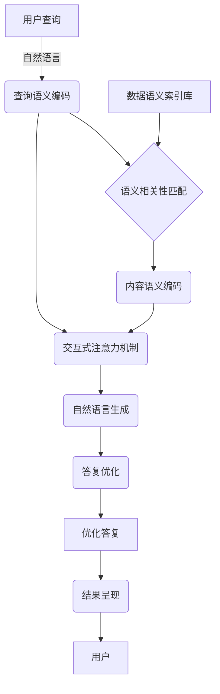

以下是标题为《【大模型应用开发 动手做AI Agent】构建查询引擎和工具》的技术博客文章正文内容：

# 【大模型应用开发 动手做AI Agent】构建查询引擎和工具

## 1. 背景介绍

### 1.1 问题的由来

在当今的数字时代,信息量呈指数级增长,海量的非结构化数据如何高效获取和利用成为了一个巨大的挑战。传统的搜索引擎虽然可以快速检索相关信息,但无法深入理解和分析信息的语义内涵。而最新的大模型技术为解决这一难题带来了新的契机。

大模型(Large Language Model,LLM)是一种基于自然语言处理(NLP)技术训练的巨大神经网络模型,能够对海量自然语言数据进行有效建模和语义理解。凭借其强大的语言生成和推理能力,大模型可用于构建智能查询系统,实现对非结构化数据的语义检索和分析,为用户提供准确、全面的答复。

### 1.2 研究现状  

近年来,以GPT-3、PaLM、ChatGPT等为代表的大模型技术取得了长足进展,在自然语言处理、问答系统、内容创作等领域展现出卓越的性能。研究人员和企业纷纷投入大模型的探索和应用实践,期望借助大模型强大的语义理解和生成能力,突破信息获取和利用的瓶颈。

然而,将大模型应用于智能查询系统的建设仍面临诸多挑战,如模型的可解释性、安全性、效率等问题有待解决。此外,如何设计高效的查询引擎架构,整合大模型与其他技术模块,并将其应用于实际场景,也是一个亟需探索的课题。

### 1.3 研究意义

构建基于大模型的智能查询系统,能够极大提高信息获取和利用的效率,为用户提供更加准确、全面的答复,满足日益增长的信息需求。同时,该系统还可广泛应用于问答机器人、智能助手、知识库构建等多个领域,推动人工智能技术的发展和应用。

从技术层面来看,研究大模型在查询系统中的应用,可以深入探讨大模型的原理、优化方法和工程实践,促进模型性能的提升和工程化落地。此外,将大模型与其他技术模块(如检索引擎、知识库等)相结合,构建复合型智能系统,也是一个具有重要意义的研究方向。

### 1.4 本文结构

本文将全面介绍如何基于大模型技术构建智能查询引擎和工具。首先阐述大模型和查询系统的核心概念,并分析两者之间的内在联系;接着深入探讨大模型在查询系统中的应用原理和算法细节;然后通过数学模型和公式,量化分析模型的性能指标;再以代码实例讲解系统的具体实现;最后总结该领域的发展趋势和面临的挑战。

## 2. 核心概念与联系

大模型和查询系统是本文的两大核心概念,理解它们的内涵及相互关系,对于构建智能查询引擎至关重要。

**大模型(Large Language Model)**是一种基于自然语言处理技术训练的巨大神经网络模型,能够对海量自然语言数据进行高效建模和语义理解。大模型的核心是transformer编码器-解码器架构,通过自注意力机制捕捉输入序列中单词之间的长程依赖关系,从而更好地理解语义。

**查询系统**则是一种用于快速检索和获取相关信息的软件系统。传统的查询系统通常由检索引擎、索引库和用户界面等模块组成,根据用户的查询关键词在索引库中搜索匹配的文档,并将结果呈现给用户。

将大模型引入查询系统,可以赋予系统语义理解和生成的能力,实现对非结构化数据(如自然语言文本)的高效检索和分析。具体来说,大模型可以:

1. **理解查询语义**:通过对查询语句进行语义编码,准确捕捉用户的查询意图。
2. **匹配相关内容**:在海量非结构化数据中快速检索与查询语义相关的内容片段。
3. **生成答复**:基于匹配的内容,通过自然语言生成技术,生成连贯、全面的答复文本。

因此,大模型与查询系统的结合,能够极大提高信息获取和利用的效率,为用户提供更加智能、准确的查询服务体验。

## 3. 核心算法原理与具体操作步骤

### 3.1 算法原理概述

基于大模型的智能查询引擎通常采用"检索-阅读-生成"的三阶段流程:

1. **检索(Retrieval)**: 根据用户的自然语言查询,在海量非结构化数据中快速检索出与之语义相关的内容片段。
2. **阅读(Reading)**: 将检索出的内容片段输入大模型,由模型对这些内容进行语义理解和编码,捕捉其中蕴含的关键信息。
3. **生成(Generation)**: 大模型基于对内容的理解,通过自然语言生成技术,生成连贯、全面的答复文本,并呈现给用户。

在这一流程中,大模型发挥着至关重要的作用。算法的核心思想是:利用大模型强大的语义理解和生成能力,辅以高效的检索策略,实现对非结构化数据的智能化查询和分析。

### 3.2 算法步骤详解

1. **查询语义编码**:将用户的自然语言查询输入大模型的编码器(encoder),对查询进行语义编码,获得查询的语义表示向量。

2. **语义相关性匹配**:将查询的语义表示向量与预先构建的数据语义索引库进行相似度匹配,快速检索出与查询语义相关的内容片段(文本段落、网页等)。匹配策略可采用向量相似度计算(如余弦相似度)或近似最近邻搜索等方法。

3. **内容语义编码**:将检索出的相关内容片段输入大模型的编码器,对这些内容进行语义编码,获得它们的语义表示向量。

4. **交互式注意力机制**:大模型的解码器(decoder)通过交互式注意力机制,结合查询的语义表示和内容的语义表示,捕捉两者之间的关联,理解内容在查询语境下的语义内涵。

5. **自然语言生成**:基于对内容的语义理解,大模型的解码器通过自然语言生成技术(如自回归生成),生成连贯、全面的答复文本。

6. **答复优化**:可采用一些优化策略(如去重、排序等)对生成的初步答复进行优化,提高其准确性和可读性。

7. **结果呈现**:将优化后的答复文本呈现给用户。

该算法的优势在于,通过语义匹配和大模型的理解生成能力,能够从海量非结构化数据中快速检索出相关内容,并生成高质量的答复,满足用户的查询需求。

### 3.3 算法优缺点

**优点**:

1. **高效检索**:通过语义匹配策略,能够在海量非结构化数据中快速检索出与查询相关的内容片段,提高了检索效率。

2. **语义理解**:利用大模型强大的语义理解能力,能够深入捕捉查询和内容之间的语义关联,生成高质量的答复。

3. **端到端查询**:算法将检索、理解和生成三个环节无缝集成,实现了端到端的智能化查询过程。

4. **通用性强**:算法可广泛应用于各种场景的查询系统,如问答机器人、智能助手、知识库构建等。

**缺点**:

1. **计算资源消耗大**:大模型通常包含数十亿甚至上百亿参数,推理时需要消耗大量计算资源,对硬件要求较高。

2. **时间延迟**:从检索到生成的整个流程需要一定时间,可能无法满足实时查询的要求。

3. **可解释性差**:大模型内部的推理过程较为黑箱,缺乏可解释性,难以确保生成结果的可靠性。

4. **知识缺陷**:大模型的知识来源于训练数据,可能存在知识缺失或过时的问题,影响答复的准确性。

### 3.4 算法应用领域

基于大模型的智能查询引擎可广泛应用于以下领域:

1. **问答系统**:构建智能问答机器人或助手,为用户提供准确、全面的自然语言问答服务。

2. **知识库构建**:通过对大量非结构化数据进行语义分析和总结,自动构建结构化的知识库。

3. **信息检索**:在互联网、企业内部数据等海量非结构化数据中进行高效、智能的信息检索。

4. **客户服务**:应用于客户服务场景,快速响应用户的各类查询,提高服务效率和质量。

5. **电子商务**:在电商网站或应用中集成智能查询功能,优化用户的购物体验。

6. **医疗健康**:构建医疗知识问答系统,为患者和医护人员提供健康咨询服务。

7. **教育领域**:开发智能教学助手,为学生和教师提供个性化的学习资源推荐和答疑解惑。

## 4. 数学模型和公式详细讲解举例说明

在基于大模型的智能查询系统中,需要量化评估模型的性能指标,以优化和改进算法。常用的评估指标包括:查准率(Precision)、查全率(Recall)、F1分数、语义相似度等。下面将详细介绍相关的数学模型和公式。

### 4.1 数学模型构建

假设我们有一个查询语句 $q$,目标是从文档集合 $C = \{c_1, c_2, ..., c_n\}$ 中检索出与 $q$ 语义相关的文档子集 $R_q \subseteq C$。我们将查询语句和文档映射到语义空间中的向量表示:

$$\vec{q} = \text{encoder}(q)$$
$$\vec{c_i} = \text{encoder}(c_i), i = 1,2,...,n$$

其中 $\text{encoder}$ 表示大模型的编码器模块。

接下来,我们需要定义一个语义相似度函数 $\text{sim}(\vec{q}, \vec{c_i})$ 来衡量查询向量 $\vec{q}$ 与文档向量 $\vec{c_i}$ 之间的语义相似程度。常用的相似度函数有:

- **余弦相似度**:

$$\text{sim}_\text{cos}(\vec{q}, \vec{c_i}) = \frac{\vec{q} \cdot \vec{c_i}}{||\vec{q}|| \cdot ||\vec{c_i}||}$$

- **点积相似度**:

$$\text{sim}_\text{dot}(\vec{q}, \vec{c_i}) = \vec{q} \cdot \vec{c_i}$$

基于语义相似度函数,我们可以检索出与查询最相关的文档子集:

$$R_q = \{c_i | \text{sim}(\vec{q}, \vec{c_i}) \geq \tau, c_i \in C\}$$

其中 $\tau$ 是预设的相似度阈值。

### 4.2 公式推导过程

为了评估检索系统的性能,我们需要定义查准率(Precision)、查全率(Recall)和 F1 分数。假设我们有一个查询语句 $q$,相关文档集合为 $R_q^*$,检索系统返回的结果集合为 $R_q$,则:

1. **查准率(Precision)**:衡量检索结果中有多少比例是相关的,定义为:

$$\text{Precision} = \frac{|R_q \cap R_q^*|}{|R_q|}$$