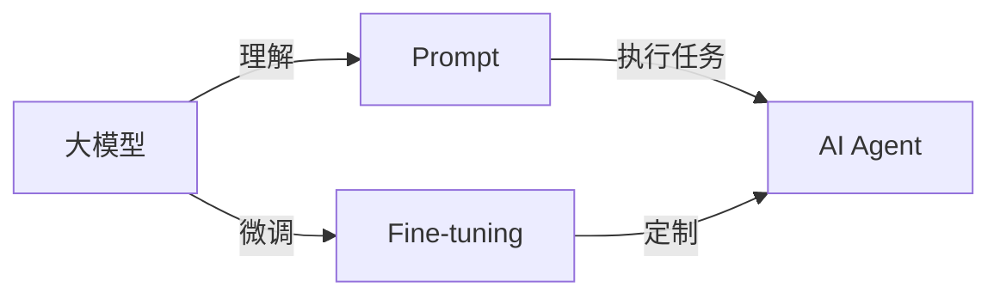

# 【大模型应用开发 动手做AI Agent】自主创建页面标题

作者：禅与计算机程序设计艺术 / Zen and the Art of Computer Programming

## 1. 背景介绍
### 1.1 问题的由来
近年来,随着人工智能技术的飞速发展,大模型的应用越来越广泛。从ChatGPT到Midjourney,从Stable Diffusion到Claude,大模型正在改变我们的生活和工作方式。然而,对于普通开发者来说,如何利用大模型开发实际应用,仍然是一个巨大的挑战。
### 1.2 研究现状
目前,国内外已经有不少团队在探索大模型的应用开发。微软推出了基于GPT的Copilot,可以辅助程序员编写代码;Anthropic开发了Claude,可以执行任务型对话;国内的智谱AI推出了 ChatExcel,可以用自然语言操作 Excel。这些都是大模型应用的优秀案例。
### 1.3 研究意义
大模型蕴含着巨大的应用潜力,它可以极大地提高生产力,改善用户体验。对开发者而言,掌握大模型应用开发技术,意味着抓住新一轮技术革命的机遇。通过动手实践,开发者可以深入理解大模型的工作原理,积累宝贵的开发经验,为未来的职业发展奠定基础。
### 1.4 本文结构
本文将分为以下几个部分:
- 介绍大模型应用开发的核心概念
- 剖析AI Agent的核心算法原理和操作步骤
- 讲解相关的数学模型和公式
- 通过代码实例,演示如何开发一个AI Agent
- 探讨AI Agent的实际应用场景
- 推荐相关的学习资源和开发工具
- 总结大模型应用的未来趋势和挑战
- 回答常见问题

## 2. 核心概念与联系
在开始动手开发AI Agent之前,我们需要先了解几个核心概念:
- 大模型:指的是基于海量数据训练的大规模语言模型,如GPT、BERT等,它们能够理解和生成自然语言,具有强大的语义理解和生成能力。
- AI Agent:指的是能够自主执行任务,与用户进行交互的智能代理程序,它基于大模型实现了对用户意图的理解和任务的执行。
- Prompt:指的是用于指示大模型执行特定任务的输入文本,通过精心设计Prompt,可以引导大模型生成我们期望的输出。
- Fine-tuning:指的是在特定领域数据上,对预训练好的大模型进行微调,使其更好地适应特定任务。

这些概念之间的联系如下:


## 3. 核心算法原理 & 具体操作步骤
### 3.1 算法原理概述
开发AI Agent的核心是基于大模型实现自然语言理解和任务执行。具体来说,主要涉及以下几个步骤:
1. 将用户输入的自然语言转化为Prompt
2. 将Prompt输入预训练的大模型
3. 大模型根据Prompt生成对应的输出
4. 对输出结果进行后处理,提取关键信息,执行相应任务
5. 将执行结果反馈给用户

### 3.2 算法步骤详解
1. 自然语言转Prompt
   
这一步的关键是要设计出优质的Prompt模板,可以采用如下方法:
- 设计必要的关键词,引导模型执行任务,如"请帮我","接下来请你"等
- 设计必要的格式规范,如JSON、Markdown等,让模型输出结构化信息
- 设计必要的上下文,提供任务背景信息,如当前时间、地点、用户属性等

例如,我们可以设计如下Prompt模板:
```
现在是 {{当前时间}},我是一名 {{用户职业}},请帮我 {{用户需求}},并以 {{输出格式}} 的格式提供结果。
```

2. 输入Prompt到大模型

这一步需要根据具体使用的大模型,调用相应的API接口,传入Prompt文本。例如,使用 OpenAI 的 GPT-3 模型时,可以使用以下代码:

```python
import openai

openai.api_key = "your_api_key"

prompt = "现在是2023年6月27日,我是一名软件工程师,请帮我生成一份项目计划书,并以Markdown的格式提供结果。"

response = openai.Completion.create(
    engine="text-davinci-003",
    prompt=prompt,
    max_tokens=2048,
    n=1,
    stop=None,
    temperature=0.5,
)
```

3. 大模型生成输出

这一步是大模型根据Prompt生成自然语言输出的过程,完全由大模型自主完成,不需要人工干预。生成的结果通常是一段自然语言文本。

4. 输出结果后处理

这一步需要对大模型生成的输出进行解析和提取,以执行实际的任务。常见的后处理方法包括:
- 正则表达式匹配:用于提取输出中的特定格式信息
- 语义解析:用于理解输出文本的语义,提取关键信息
- 语法解析:用于分析输出文本的语法结构,执行相应操作
- 知识图谱查询:用于从输出文本中提取实体和关系,关联到后台知识库

例如,对于上一步生成的项目计划书,我们可以使用正则表达式提取其中的关键信息:
```python
import re

# 提取项目名称
project_name = re.search(r"# (.+?)\n", response.choices[0].text).group(1)

# 提取项目时间
project_time = re.search(r"- 项目时间:(.+?)\n", response.choices[0].text).group(1)

# 提取项目目标
project_goal = re.search(r"- 项目目标:(.+?)\n", response.choices[0].text).group(1)

print(f"项目名称:{project_name}")
print(f"项目时间:{project_time}") 
print(f"项目目标:{project_goal}")
```

5. 反馈结果给用户

这一步是将执行任务的结果反馈给用户,可以采用自然语言、图表、链接等多种形式。同时,还可以收集用户反馈,用于优化Prompt和后处理逻辑。

### 3.3 算法优缺点
以上算法的优点在于:
- 利用了大模型强大的自然语言处理能力,使得AI Agent具备一定的语义理解和推理能力
- 通过Prompt引导大模型执行特定任务,可以实现AI Agent的多样化功能
- 通过后处理步骤,可以将大模型的输出转化为可执行的操作,完成实际任务

同时,该算法也存在一些局限性:
- 大模型生成的输出具有不确定性,可能出现幻觉、错误信息
- 对于复杂任务,单纯依靠Prompt引导不够,需要更精细的任务规划和推理链
- 后处理步骤需要大量的规则和知识积累,应用范围受限

### 3.4 算法应用领域
基于大模型的AI Agent算法可以应用于多个领域,例如:
- 智能客服:用于理解用户问题,提供自动回复和解决方案
- 智能助手:用于执行日程管理、信息查询、应用控制等个人助理任务
- 智能文案:用于根据关键词生成文章、广告、脚本等创意内容
- 智能编程:用于根据需求生成代码、文档、测试用例等程序开发任务

## 4. 数学模型和公式 & 详细讲解 & 举例说明
### 4.1 数学模型构建
大模型的核心是Transformer模型,它基于自注意力机制实现了对长文本的建模。Transformer模型的基本结构如下:

$$
\begin{aligned}
Q,K,V &= X W_q, X W_k, X W_v \\
Attention(Q,K,V) &= softmax(\frac{QK^T}{\sqrt{d_k}})V \\
MultiHead(Q,K,V) &= Concat(head_1,...,head_h)W^O \\
head_i &= Attention(QW_i^Q,KW_i^K,VW_i^V) \\
LayerNorm(x) &= \frac{x-E[x]}{\sqrt{Var[x]+\epsilon}} * \gamma + \beta \\
FFN(x) &= max(0,xW_1+b_1)W_2+b_2 \\
Transformer(x) &= LayerNorm(x + MultiHead(x)) \\
&+ LayerNorm(x + FFN(x))
\end{aligned}
$$

其中:
- $Q,K,V$ 分别表示查询、键、值向量
- $W_q,W_k,W_v$ 分别表示 $Q,K,V$ 的权重矩阵
- $d_k$ 表示 $K$ 的维度
- $W_i^Q,W_i^K,W_i^V$ 表示第 $i$ 个注意力头的权重矩阵
- $W^O$ 表示输出层的权重矩阵
- $\gamma,\beta$ 表示LayerNorm的缩放和偏移参数
- $W_1,b_1,W_2,b_2$ 表示前馈网络的权重和偏置

### 4.2 公式推导过程
以下我们详细推导Transformer中的自注意力机制公式。

首先,我们将输入序列 $X$ 通过三个权重矩阵映射到 $Q,K,V$:
$$
Q = XW_q, K = XW_k, V = XW_v
$$
然后,我们计算 $Q$ 和 $K$ 的相似度得分,并除以 $\sqrt{d_k}$ 进行缩放:
$$
score = \frac{QK^T}{\sqrt{d_k}}
$$
接着,我们对相似度得分进行softmax归一化,得到注意力权重:
$$
A = softmax(score) = softmax(\frac{QK^T}{\sqrt{d_k}})
$$
最后,我们用注意力权重对 $V$ 进行加权求和,得到注意力输出:
$$
Attention(Q,K,V) = AV = softmax(\frac{QK^T}{\sqrt{d_k}})V
$$
多头注意力机制将 $Q,K,V$ 分别映射到 $h$ 个不同的子空间,并行计算 $h$ 个注意力头,再将结果拼接起来:
$$
\begin{aligned}
head_i &= Attention(QW_i^Q,KW_i^K,VW_i^V) \\
MultiHead(Q,K,V) &= Concat(head_1,...,head_h)W^O
\end{aligned}
$$
其中 $W_i^Q \in \mathbb{R}^{d_{model} \times d_q}, W_i^K \in \mathbb{R}^{d_{model} \times d_k}, W_i^V \in \mathbb{R}^{d_{model} \times d_v}, W^O \in \mathbb{R}^{hd_v \times d_{model}}$。

最后,Transformer将多头注意力和前馈网络的输出与输入相加,并通过LayerNorm归一化:
$$
\begin{aligned}
Transformer(x) &= LayerNorm(x + MultiHead(x)) \\
&+ LayerNorm(x + FFN(x))
\end{aligned}
$$

### 4.3 案例分析与讲解
下面我们以一个具体的例子来说明Transformer的计算过程。

假设我们有一个输入序列: $X=[[1,2,3],[4,5,6],[7,8,9]]$,其中每个向量的维度为3。

我们设置Transformer的参数如下:
- 隐藏层维度 $d_{model}=6$ 
- 注意力头数 $h=2$
- 前馈网络维度 $d_{ff}=12$

首先,我们将输入 $X$ 映射到 $Q,K,V$:
$$
\begin{aligned}
W_q &= \begin{bmatrix} 
1 & 0 & -1 \\
0 & 1 & -1 \\
1 & 1 & 0 \\
0 & 0 & 1 \\
1 & 0 & 1 \\
0 & 1 & 0
\end{bmatrix}, 
W_k = \begin{bmatrix}
0 & 1 & 0 \\
1 & 1 & 0 \\
0 & 0 & 1 \\
1 & 0 & -1 \\
0 & 1 & -1 \\
1 & 0 & 1
\end{bmatrix},
W_v = \begin{bmatrix}
1 & 0 & 1 \\
0 & 1 & 0 \\
1 &