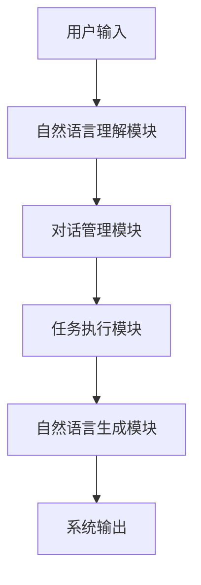

以下是根据您的要求撰写的技术博客文章正文内容：

# 【大模型应用开发 动手做AI Agent】语言交互能力

## 1. 背景介绍

### 1.1 问题的由来

近年来,人工智能领域取得了长足的进步,尤其是大型语言模型的出现,极大推动了自然语言处理技术的发展。传统的规则化或统计化自然语言处理系统在处理复杂任务时存在明显的局限性,而大型语言模型凭借其强大的语义理解和生成能力,为构建高质量的人工智能交互系统提供了新的可能。

随着人工智能技术的不断演进,人们对AI助理的期望也在不断提高。仅仅能够完成简单的问答和检索任务已经无法满足日益增长的需求,人们期望AI助理能够像人类一样进行自然流畅的对话交互,并为用户提供个性化的智能服务。因此,赋予AI助理强大的语言交互能力成为了构建智能化人机交互系统的关键。

### 1.2 研究现状

目前,主流的大型语言模型主要包括GPT(Generative Pre-trained Transformer)系列、BERT(Bidirectional Encoder Representations from Transformers)系列、XLNet等。这些模型通过在大规模语料库上预训练,学习了丰富的语义知识,能够生成流畅自然的文本。

基于大型语言模型的AI助理系统通常采用以下架构:

1. 自然语言理解模块负责将用户的自然语言输入转化为结构化的语义表示。
2. 对话管理模块根据当前对话状态和语义表示,决定系统的下一步行为。
3. 任务执行模块完成具体的任务,如查询知识库、调用API等。
4. 自然语言生成模块将任务结果转化为自然语言的系统输出。

虽然现有的大型语言模型在语言生成方面表现出色,但在构建高质量的对话系统时仍面临诸多挑战,例如缺乏持续的对话理解能力、上下文一致性差、知识库整合不足等。因此,如何充分利用大型语言模型的优势,并解决其在对话交互中的不足,是当前研究的重点方向。

### 1.3 研究意义

赋予AI助理强大的语言交互能力,不仅能够提升人机交互的自然性和流畅度,更重要的是能够极大拓展AI助理的应用场景。具有出色的语言交互能力的AI助理,可以在以下领域发挥重要作用:

1. **智能客服**: 提供7*24小时的高质量客户服务支持,缓解人工客服的压力。
2. **教育辅导**: 作为智能教学助手,为学生提供个性化的学习辅导和答疑解惑。
3. **医疗健康**: 通过对话交互,收集患者症状信息,提供初步诊断建议,降低就医成本。
4. **智能家居**: 作为智能家居控制中心,通过语音指令控制家电设备,提升生活品质。
5. **企业协作**: 辅助企业内部的工作流程,如会议记录、任务分派、信息查询等。

可以预见,拥有出色语言交互能力的AI助理将会深入渗透到我们的生活和工作的方方面面,为人类创造更多价值。

### 1.4 本文结构

本文将全面介绍如何基于大型语言模型开发具有强大语言交互能力的AI助理系统。文章首先阐述核心概念和算法原理,然后详细讲解数学模型和公式推导过程,接着通过代码实例说明具体的开发实践,最后探讨实际应用场景、发展趋势和面临的挑战。

## 2. 核心概念与联系

在构建基于大型语言模型的AI助理系统时,需要理解以下几个核心概念及其内在联系:

1. **语义理解(Semantic Understanding)**: 指将自然语言输入映射为结构化的语义表示,是对话系统理解用户意图的基础。常用的语义理解方法包括意图分类(Intent Classification)和槽填充(Slot Filling)等。

2. **对话管理(Dialogue Management)**: 根据当前对话状态和语义理解的结果,决策系统的下一步行为,是对话系统的"大脑"。主流的对话管理方法有基于规则的有限状态机、基于策略的强化学习等。

3. **任务执行(Task Execution)**: 完成具体的任务,如查询知识库、调用API、控制外部设备等。这是对话系统的"肌肉",决定了系统的实际能力。

4. **响应生成(Response Generation)**: 将任务执行的结果转化为自然语言的系统输出,是对话系统与用户交互的窗口。常用的响应生成方法包括基于模板的生成、基于检索的生成和基于生成式模型(如Seq2Seq)的生成等。

5. **对话策略(Dialogue Policy)**: 指导对话管理模块根据当前状态做出合理的决策,是对话系统的"策略大脑"。对话策略可以基于规则或通过强化学习等方式学习获得。

6. **知识库(Knowledge Base)**: 存储结构化的领域知识,为对话系统提供信息支持。知识库的构建和更新是提升对话系统性能的关键。

上述概念相互关联、环环相扣,共同构成了一个完整的对话系统。其中,语义理解和响应生成是对话系统与用户交互的接口;对话管理是系统的控制中心;任务执行是系统的执行力;对话策略为系统提供决策支持;知识库则为系统提供所需的信息资源。

## 3. 核心算法原理 & 具体操作步骤  

### 3.1 算法原理概述

基于大型语言模型的AI助理系统,其核心算法原理可概括为以下几个方面:

1. **语义理解**: 利用大型语言模型的编码器(Encoder)对输入进行编码,获得其语义表示,再基于该语义表示进行意图分类、槽填充等任务。

2. **对话管理**: 根据当前对话状态(包括语义表示、对话历史等)和预定义的对话策略,决策系统的下一步行为。

3. **任务执行**: 将对话管理模块的决策转化为具体的任务执行操作,如查询知识库、调用API等。

4. **响应生成**: 利用大型语言模型的解码器(Decoder),将任务执行的结果(通常为结构化表示)转化为自然语言的系统输出。

上述流程环环相扣,构成了一个完整的对话交互循环。其中,语义理解和响应生成利用了大型语言模型强大的编码和生成能力;对话管理模块则根据预定义的对话策略做出决策;任务执行模块则负责与外部世界交互,完成具体的任务。

### 3.2 算法步骤详解

1. **语义理解步骤**:
   - 输入: 用户的自然语言输入
   - 输出: 结构化的语义表示(如意图和槽位等)
   - 步骤:
     a) 将用户输入传入大型语言模型的编码器
     b) 获取编码器的输出,作为输入的语义表示
     c) 将语义表示输入分类器(如意图分类器)和序列标注器(如槽填充器)
     d) 获取意图分类和槽填充结果,作为最终的语义表示输出

2. **对话管理步骤**:  
   - 输入: 当前对话状态(包括语义表示、对话历史等)
   - 输出: 系统的下一步行为(如执行任务、回复等)
   - 步骤:
     a) 获取当前对话状态的表示
     b) 根据对话策略(可以是规则或学习得到的策略)做出决策
     c) 将决策转化为具体的系统行为输出

3. **任务执行步骤**:
   - 输入: 对话管理模块的决策(如执行查询任务)
   - 输出: 任务执行结果(通常为结构化表示)
   - 步骤:
     a) 解析对话管理模块的决策
     b) 根据决策,查询知识库、调用API等执行具体任务
     c) 将任务执行结果转化为结构化表示输出

4. **响应生成步骤**:
   - 输入: 任务执行结果的结构化表示
   - 输出: 自然语言的系统响应
   - 步骤:  
     a) 将结构化表示输入大型语言模型的解码器
     b) 利用解码器生成自然语言的系统响应
     c) 对生成的响应进行后处理(如去重、过滤等),得到最终输出

上述算法步骤循环执行,构成了一个完整的对话交互过程。其中,语义理解和响应生成利用了大型语言模型的编码和生成能力;对话管理根据策略做出决策;任务执行则负责与外部世界交互。通过这些环节的协同工作,系统可以理解用户的语义意图,并生成自然流畅的响应,从而实现高质量的语言交互。

### 3.3 算法优缺点

**优点**:

1. **利用大型语言模型的强大能力**: 语义理解和响应生成直接利用了大型语言模型在编码和生成方面的优势,可以产生自然流畅的语言交互。

2. **模块化设计,可扩展性强**: 整个系统被划分为多个模块,各司其职,相对独立。新的模块可以被方便地集成,扩展系统的功能。

3. **可解释性较好**: 对话管理模块的决策过程可解释,有利于理解系统的行为,进行错误分析和优化。

4. **可控性较强**: 对话策略可由人工设计规则,或通过强化学习等方式学习获得,具有较强的可控性。

**缺点**:

1. **缺乏跨模块的端到端学习**: 虽然各个模块都可以单独进行优化,但整个系统缺乏跨模块的端到端联合学习,可能影响整体性能。

2. **对话一致性不足**: 由于模块之间是相对独立的,可能导致对话上下文的一致性不足,影响对话的连贯性。

3. **知识库构建和更新成本高**: 为提供高质量的服务,需要构建和持续更新高质量的知识库,工作量大,成本高。

4. **缺乏主动性和多轮交互能力**: 目前的系统更多是被动响应,缺乏主动发起对话和进行多轮交互的能力。

### 3.4 算法应用领域

基于大型语言模型的AI助理系统,具有出色的语言交互能力,可以应用于多个领域:

1. **智能客服**: 可以作为7*24小时的智能客服系统,为用户提供自助服务支持,解答常见问题,减轻人工客服的压力。

2. **教育辅导**: 可以作为智能教学助理,为学生提供个性化的学习辅导,解答学习中的疑惑,提高教学效率。

3. **医疗健康**: 可以作为智能医疗助理,通过对话收集患者症状信息,给出初步诊断建议,减少就医成本。

4. **智能家居**: 可以作为智能家居控制中心,通过语音指令控制家电设备,提高生活质量。

5. **企业协作**: 可以辅助企业内部的工作流程,如会议记录、任务分派、信息查询等,提高工作效率。

6. **游戏对战**: 可以作为智能游戏助手,通过自然语言交互控制游戏角色,提供策略建议,增强游戏体验。

7. **智能助理机器人**: 可以作为通用的智能助理机器人,为用户提供多种个性化的智能服务。

总的来说,基于大型语言模型的AI助理系统凭借其出色的语言交互能力,在各个领域都有广阔的应用前景。

## 4. 数学模型和公式 & 详细讲解 & 举例说明

在基于大型语言模型的AI助理系统中,语义理解和响应生成是两个核心环节,都需要借助数学模型来实现。下面将详细介绍这