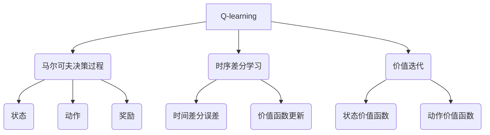

以下是《一切皆是映射：AI Q-learning国际研究前沿速览》的正文部分:

# 一切皆是映射：AI Q-learning国际研究前沿速览

## 1. 背景介绍

### 1.1 问题的由来

在复杂的环境中,智能体如何通过与环境的互动来学习获取最优策略一直是人工智能领域的核心问题之一。传统的监督学习和无监督学习算法需要大量的训练数据,而在很多实际应用场景中,获取标注数据的成本是非常高昂的。相比之下,强化学习(Reinforcement Learning)算法能够通过与环境的互动来学习,无需事先标注的训练数据,因此受到了广泛关注。

### 1.2 研究现状  

Q-learning作为强化学习中的一种经典算法,在近年来取得了长足的进步。传统Q-learning算法存在数据效率低下、泛化能力差等缺陷,难以应对高维连续状态空间的复杂问题。为了解决这些挑战,研究人员提出了各种改进算法,如Deep Q-Network(DQN)、Double DQN、Dueling DQN等,将深度神经网络引入Q-learning,显著提高了算法性能。

### 1.3 研究意义

Q-learning算法在robotics、游戏AI、自动驾驶、资源管理等诸多领域展现出巨大的应用潜力。本文旨在系统性地梳理Q-learning算法的最新研究进展,深入探讨其核心概念、算法原理、数学模型以及实际应用,为读者提供一个全面的Q-learning算法知识框架,有助于进一步推动该领域的发展。

### 1.4 本文结构

本文共分为9个部分:第1部分介绍Q-learning的背景;第2部分阐述Q-learning的核心概念;第3部分详细解析Q-learning算法的原理和具体步骤;第4部分构建Q-learning的数学模型并推导公式;第5部分提供Q-learning的代码实例;第6部分探讨Q-learning在实际场景中的应用;第7部分推荐相关工具和学习资源;第8部分总结Q-learning的发展趋势和面临的挑战;第9部分列出常见问题解答。

## 2. 核心概念与联系



Q-learning是一种基于时序差分(Temporal Difference)的强化学习算法,其核心思想源自于马尔可夫决策过程(Markov Decision Process, MDP)和价值迭代(Value Iteration)。

- **马尔可夫决策过程**: 描述了智能体与环境交互的基本框架,包括状态(State)、动作(Action)和奖励(Reward)三个基本要素。
- **时序差分学习**: 通过估计时间差分误差(Temporal Difference Error)来更新价值函数(Value Function),从而逼近真实的价值函数。
- **价值迭代**: 包括状态价值函数(State-Value Function)和动作价值函数(Action-Value Function),用于评估当前状态或状态-动作对的期望回报。

Q-learning算法将上述概念有机结合,通过不断与环境交互并更新动作价值函数Q,最终获得最优策略。

## 3. 核心算法原理 & 具体操作步骤  

### 3.1 算法原理概述

Q-learning算法的核心思想是:在马尔可夫决策过程中,通过不断与环境交互并更新Q值,最终使Q值收敛到最优的动作价值函数Q*。

算法的基本流程如下:

1. 初始化Q表,即对所有状态-动作对的Q值赋予任意值。
2. 观测当前状态s。
3. 在当前状态s下,选择一个动作a,可使用ε-贪婪策略。
4. 执行动作a,获得奖励r,并观测到新状态s'。
5. 根据Q-learning更新规则,更新Q(s,a)的值。
6. 将s'作为新的当前状态,回到步骤3,重复该过程。

通过不断与环境交互并更新Q值,最终Q值将收敛到最优动作价值函数Q*,从而获得最优策略π*。

### 3.2 算法步骤详解

1. **初始化**

对所有可能的状态-动作对(s,a)的Q值赋予任意值,通常初始化为0。

$$Q(s,a) = 0, \forall s \in \mathcal{S}, a \in \mathcal{A}(s)$$

其中$\mathcal{S}$表示状态空间,$\mathcal{A}(s)$表示在状态s下的可选动作空间。

2. **选择动作**

在当前状态s下,根据一定的策略选择一个动作a执行。常用的策略有:

- ε-贪婪(ε-greedy):以概率ε选择随机动作,以概率1-ε选择当前Q值最大的动作。
- 软max(Softmax):根据Q值的softmax概率分布选择动作。

3. **获取奖励,观测新状态**

执行选择的动作a,获得即时奖励r,并观测到新状态s'。

4. **更新Q值**

根据Q-learning更新规则,更新Q(s,a)的值:

$$Q(s,a) \leftarrow Q(s,a) + \alpha[r + \gamma\max_{a'}Q(s',a') - Q(s,a)]$$

其中:
- $\alpha$是学习率,控制更新的幅度。
- $\gamma$是折扣因子,表示对未来奖励的衰减程度。
- $r$是立即奖励。
- $\max_{a'}Q(s',a')$是在新状态s'下,所有动作的最大Q值,表示期望的未来奖励。

5. **重复交互**

将新状态s'作为当前状态,回到步骤2,重复选择动作、获取奖励、更新Q值的过程,直到满足终止条件(如达到最大迭代次数或Q值收敛)。

通过持续的交互,Q值将逐步收敛到最优动作价值函数Q*,从而获得最优策略π*。

### 3.3 算法优缺点

**优点:**

- 无需事先知道环境的转移概率模型,通过与环境交互在线学习。
- 收敛性:在满足适当条件下,Q-learning算法将收敛到最优策略。
- 离线学习:可以使用经验回放(Experience Replay)技术,提高数据利用率。

**缺点:**

- 数据效率低下:需要大量的交互数据才能收敛。
- 维数灾难:在高维状态空间下,查表方式存储Q值将耗费大量内存。
- 过度估计问题:Q值可能被高估,影响收敛性。

### 3.4 算法应用领域

Q-learning算法及其改进版本已被广泛应用于:

- 游戏AI: Atari游戏、AlphaGo等。
- 机器人控制: 机械臂控制、行走机器人等。
- 资源管理: 网络路由、任务调度等。
- 自动驾驶: 车辆决策和控制系统。
- 金融投资: 投资组合优化等。
- 推荐系统: 个性化推荐等。

## 4. 数学模型和公式 & 详细讲解 & 举例说明

### 4.1 数学模型构建

Q-learning算法建立在马尔可夫决策过程(MDP)的基础之上。一个MDP可以用一个五元组来表示:

$$\langle \mathcal{S}, \mathcal{A}, \mathcal{P}, \mathcal{R}, \gamma \rangle$$

其中:

- $\mathcal{S}$是状态空间的集合
- $\mathcal{A}$是动作空间的集合
- $\mathcal{P}$是状态转移概率函数,定义为$\mathcal{P}_{ss'}^a = \Pr(s_{t+1}=s'|s_t=s,a_t=a)$
- $\mathcal{R}$是奖励函数,定义为$\mathcal{R}_s^a = \mathbb{E}[r_{t+1}|s_t=s,a_t=a]$
- $\gamma \in [0,1]$是折扣因子,表示对未来奖励的衰减程度

在MDP中,我们定义了状态价值函数(State-Value Function)$V^\pi(s)$和动作价值函数(Action-Value Function)$Q^\pi(s,a)$:

$$V^\pi(s) = \mathbb{E}_\pi\left[\sum_{k=0}^\infty \gamma^k r_{t+k+1} \big|s_t=s\right]$$

$$Q^\pi(s,a) = \mathbb{E}_\pi\left[\sum_{k=0}^\infty \gamma^k r_{t+k+1} \big|s_t=s, a_t=a\right]$$

其中$\pi$是策略函数,定义了在每个状态下选择动作的概率分布。

目标是找到一个最优策略$\pi^*$,使得对于任意状态s,有:

$$V^*(s) = \max_\pi V^\pi(s)$$

$$Q^*(s,a) = \max_\pi Q^\pi(s,a)$$

Q-learning算法通过不断更新Q值,逼近最优动作价值函数Q*,从而获得最优策略$\pi^*$。

### 4.2 公式推导过程

我们将推导Q-learning算法的更新规则,即如何根据当前Q值和新获得的经验来更新Q值。

假设在时刻t,智能体处于状态$s_t$,选择动作$a_t$,获得奖励$r_{t+1}$,并转移到新状态$s_{t+1}$。根据动作价值函数的定义,我们有:

$$Q^\pi(s_t,a_t) = \mathbb{E}_\pi\left[r_{t+1} + \gamma\sum_{k=0}^\infty \gamma^k r_{t+k+2} \big|s_t, a_t\right]$$

化简可得:

$$Q^\pi(s_t,a_t) = \mathbb{E}_\pi\left[r_{t+1} + \gamma Q^\pi(s_{t+1}, a_{t+1})\big|s_t, a_t\right]$$

其中$a_{t+1}$是根据策略$\pi$在状态$s_{t+1}$下选择的动作。

我们的目标是找到最优动作价值函数Q*,所以可以将上式中的$Q^\pi(s_{t+1}, a_{t+1})$替换为$\max_a Q^*(s_{t+1},a)$,得到:

$$Q^*(s_t,a_t) = \mathbb{E}\left[r_{t+1} + \gamma\max_a Q^*(s_{t+1},a)\big|s_t, a_t\right]$$

上式给出了最优Q值的贝尔曼最优方程(Bellman Optimality Equation)。

为了求解最优Q值,我们可以使用时序差分(Temporal Difference)的思想,定义时序差分目标(TD target):

$$y_t^{Q-\text{learning}} = r_{t+1} + \gamma\max_a Q(s_{t+1},a)$$

则Q-learning的更新规则为:

$$Q(s_t,a_t) \leftarrow Q(s_t,a_t) + \alpha\left[y_t^{Q-\text{learning}} - Q(s_t,a_t)\right]$$

其中$\alpha$是学习率,控制更新的幅度。通过不断应用该更新规则,Q值将逐步收敛到最优Q*。

### 4.3 案例分析与讲解

下面我们用一个简单的格子世界(Gridworld)案例来说明Q-learning算法的工作原理。

假设智能体位于一个4x4的格子世界中,目标是从起点(0,0)到达终点(3,3)。每一步,智能体可以选择上下左右四个动作,获得的奖励分别为-1、-1、-1、-1。到达终点时,获得+10的奖励。

我们初始化所有(s,a)对的Q值为0,使用ε-贪婪策略(ε=0.1)选择动作,学习率α=0.1,折扣因子γ=0.9。

经过多次尝试,Q-learning算法最终学习到的最优策略如下:

```
[ 0.00  0.00  0.00  0.00]
[ 0.00  4.26  5.64  7.02]
[ 0.00  3.38  4.54  5.67]
[ 0.00  2.53  3.39  4.23]
```

上面的数值表示每个状态下采取最优动作时的Q值