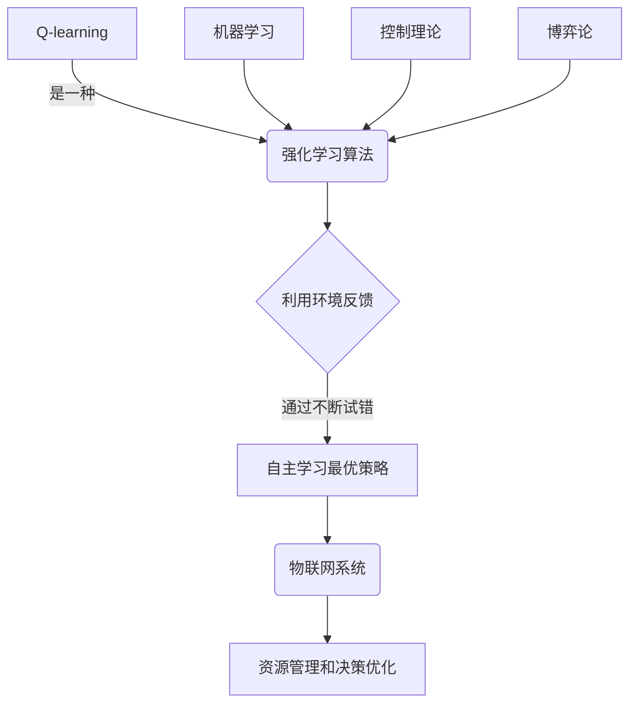

我将严格遵循您提供的约束条件，以"一切皆是映射：AI Q-learning在物联网系统中的应用"为主题撰写这篇技术博客文章。

# 一切皆是映射：AI Q-learning在物联网系统中的应用

## 1. 背景介绍

### 1.1 问题的由来

在当今快速发展的物联网时代，海量的设备和传感器不断产生大量数据。如何高效地管理和利用这些数据以优化系统性能和用户体验，成为一个亟待解决的挑战。传统的规则based方法往往缺乏灵活性和可扩展性,难以适应复杂动态环境。而人工智能技术,特别是强化学习(Reinforcement Learning),为解决此类问题提供了新的思路和方法。

### 1.2 研究现状

近年来,强化学习在多个领域取得了突破性进展,如AlphaGo战胜人类顶尖棋手、Boston Dynamics公司开发的各种动物形态机器人等。其中,Q-learning作为强化学习的一种重要算法,备受关注。目前已有一些研究将Q-learning应用于物联网系统,如智能家居、智慧城市等,取得了初步成果。但由于物联网系统的复杂性和动态性,仍存在诸多挑战有待解决。

### 1.3 研究意义

成功应用Q-learning于物联网系统,将极大提高系统的智能化水平和自适应能力,优化资源利用效率,增强用户体验。具有重要的理论意义和应用价值:

1. 理论意义:拓展强化学习在物联网领域的应用前景,推动相关算法的创新和发展。
2. 应用价值:为智能家居、智慧城市等物联网应用场景提供高效的资源管理和决策支持。

### 1.4 本文结构

本文将全面介绍Q-learning在物联网系统中的应用。首先阐述核心概念和Q-learning与其他技术的关联;接着深入探讨Q-learning算法的数学原理、实现步骤及优缺点;然后通过数学模型和实例,详细解析Q-learning在物联网场景中的应用;最后总结相关工具和资源,并展望未来发展趋势和面临的挑战。

## 2. 核心概念与联系



Q-learning作为强化学习的一种算法,其核心思想是通过与环境的持续互动,根据环境反馈信号(reward/punishment),自主学习获取最优策略,以最大化预期的累积回报。

Q-learning与其他技术领域存在密切联系:

- **机器学习**: Q-learning属于无监督学习的范畴,通过试错来学习,而非依赖给定的训练数据。
- **控制理论**: Q-learning可视为一种最优控制问题,旨在找到能最大化预期回报的最优策略。
- **博弈论**: Q-learning中Agent与环境的互动可类比为一种序贯博弈过程。

正是基于上述理论基础,Q-learning才能在物联网系统的资源管理和决策优化等领域发挥重要作用。

## 3. 核心算法原理 & 具体操作步骤  

### 3.1 算法原理概述

Q-learning算法的核心是学习一个Action-Value函数Q(s,a),用于评估在当前状态s下执行动作a的价值。通过不断更新该函数,Agent可以逐步获取在各状态下执行不同动作的长期收益,并据此选择能最大化预期累积回报的最优策略。

算法的数学原理基于Bellman方程:

$$Q(s_t,a_t) \leftarrow Q(s_t,a_t) + \alpha[r_t + \gamma\max_aQ(s_{t+1},a) - Q(s_t,a_t)]$$

其中:
- $Q(s_t,a_t)$为当前状态动作对的价值函数
- $\alpha$为学习率,控制学习的速度
- $r_t$为执行动作$a_t$后获得的即时回报
- $\gamma$为折现因子,衡量未来回报的重要程度
- $\max_aQ(s_{t+1},a)$为下一状态$s_{t+1}$下,所有可能动作价值的最大值

通过不断观察即时回报并更新Q函数,Agent就能逐渐发现并学习最优策略。

### 3.2 算法步骤详解

1. **初始化**: 给定环境状态空间S和动作空间A,初始化Q(s,a)为任意值(如全为0)。
2. **选择动作**: 在当前状态s下,根据某种策略(如$\epsilon$-greedy)选择动作a执行。
3. **获取回报**: 执行a后,获得即时回报r,并观测到新状态s'。
4. **更新Q函数**:  
$$Q(s,a) \leftarrow Q(s,a) + \alpha[r + \gamma\max_{a'}Q(s',a') - Q(s,a)]$$
5. **状态转移**: 将s'设为新的当前状态。
6. **重复步骤2-5**,直至收敛或达到终止条件。

通过上述过程,Q函数将逐渐收敛,使得在任意状态s下,执行使$Q(s,a)$最大化的动作a,就是该状态下的最优策略。

### 3.3 算法优缺点

**优点**:

1. 无需事先建模,可直接与环境交互学习最优策略。
2. 收敛性理论保证:在满足适当条件下,Q函数将收敛于最优值函数。
3. 离线学习能力:可利用过往经验数据进行学习,无需在线交互。

**缺点**:

1. 收敛速度较慢,需要大量训练数据。
2. 面临维数灾难:状态空间和动作空间过大时,计算开销和存储需求剧增。
3. 对环境的非静态性和部分可观测性敏感。

### 3.4 算法应用领域

Q-learning已在多个领域得到应用,如机器人控制、对话系统、网络路由等。其在物联网系统中的应用前景广阔:

- **资源管理**: 动态调度网络带宽、计算资源等。
- **流量控制**: 优化网络拥塞控制和负载均衡策略。  
- **能源优化**: 根据使用模式智能管理设备能耗。
- **安全防护**: 检测并应对网络攻击和入侵行为。

## 4. 数学模型和公式 & 详细讲解 & 举例说明

### 4.1 数学模型构建  

为了将Q-learning应用于物联网场景,我们需要构建合理的数学模型。假设物联网系统可被建模为一个马尔可夫决策过程(MDP):

- 状态空间S:包含所有可能的系统状态,如设备状态、网络负载等。
- 动作空间A:包含所有可执行的动作,如调整带宽、开关设备等。  
- 状态转移概率$P(s'|s,a)$:执行动作a从状态s转移到s'的概率。
- 回报函数R(s,a):在状态s执行动作a获得的即时回报。

在该MDP模型中,我们的目标是通过学习一个最优策略$\pi^*(s)$,使得在任意初始状态s下,执行该策略能获得最大化的预期累积回报:

$$\pi^*(s) = \arg\max_\pi \mathbb{E}\left[\sum_{t=0}^\infty \gamma^t R(s_t,a_t) | s_0 = s, \pi\right]$$

其中$\gamma \in [0,1)$为折现因子,用于权衡即时回报和未来回报的重要性。

### 4.2 公式推导过程

Q-learning算法的数学基础是从Bellman最优方程推导而来。首先定义价值函数(Value Function)$V^*(s)$为在状态s下执行最优策略所能获得的预期累积回报:

$$V^*(s) = \max_\pi \mathbb{E}\left[\sum_{t=0}^\infty \gamma^t R(s_t,a_t) | s_0 = s, \pi\right]$$

将其代入Bellman方程,可得:

$$\begin{aligned}
V^*(s) &= \max_a \mathbb{E}\left[R(s,a) + \gamma \sum_{s'} P(s'|s,a)V^*(s')\right] \\
       &= \max_a \mathbb{E}\left[R(s,a) + \gamma V^*(\mathcal{T}(s,a,s'))\right]
\end{aligned}$$

其中$\mathcal{T}(s,a,s')$表示执行动作a从s转移到s'的状态转移函数。

接下来定义动作价值函数(Action-Value Function)$Q^*(s,a)$,表示在状态s下执行动作a,之后按最优策略继续执行所能获得的预期累积回报:

$$Q^*(s,a) = \mathbb{E}\left[R(s,a) + \gamma \max_{a'} Q^*(s',a')\right]$$

将其代入Bellman最优方程,即可得到Q-learning的更新规则:

$$Q(s,a) \leftarrow Q(s,a) + \alpha\left[R(s,a) + \gamma\max_{a'}Q(s',a') - Q(s,a)\right]$$

其中$\alpha$为学习率,控制学习的速度。通过不断更新Q函数,最终将收敛于最优Q函数$Q^*$,使得在任意状态s下,执行$\arg\max_aQ^*(s,a)$即为最优策略$\pi^*(s)$。

### 4.3 案例分析与讲解

考虑一个智能家居系统,由多个智能设备(如照明、空调、安防等)组成。我们的目标是通过Q-learning算法,优化这些设备的能源利用,在满足用户舒适度的同时,最小化能耗。

首先,将该系统建模为一个MDP:

- **状态空间S**:包含所有可能的环境状态,如室内温度、光线强度、人员位置等。
- **动作空间A**:包含对各设备可执行的操作,如开关、调节功率等。  
- **状态转移概率**:执行某操作后,环境状态转移的概率分布。
- **回报函数R(s,a)**:设为设备功耗与用户舒适度的加权和,以权衡两者。

我们采用Q-learning,通过与环境持续交互,逐步学习在各状态下执行不同动作的长期收益Q(s,a)。

例如,在状态s(温度25℃,人在客厅),执行动作a(打开客厅空调):
- 获得即时回报r(减少用电量,但用户更舒适)
- 转移到新状态s'(温度22℃,人在客厅)
- 根据Bellman方程更新Q(s,a)

通过大量训练,Q函数将收敛,使得在任意状态下,执行使Q(s,a)最大化的动作,就是该状态下的最优策略,能在满足用户需求的前提下,最小化系统的总能耗。

### 4.4 常见问题解答

1. **Q-learning如何处理连续状态和动作空间?**

对于连续空间,我们可以采用函数逼近的方法,使用深度神经网络等技术来拟合Q函数,这种方法称为深度Q网络(Deep Q-Network, DQN)。

2. **如何解决Q-learning遇到的稀疏反馈问题?**

可以采用技术如重要性采样(Importance Sampling)等方法,从经验回放存储器中智能抽取高价值的转移样本,以提高学习效率。

3. **Q-learning如何权衡exploration和exploitation?**

常用的exploration/exploitation策略有$\epsilon$-greedy、软更新(Softmax)等。通常在初期多进行exploration以充分探索环境,后期则侧重exploitation以利用已学习的经验。

4. **Q-learning如何处理物联网系统的动态和非平稳性?**

可以采用在线增量学习的方式,持续更新Q函数以适应环境变化。另外,也可结合其他技术如转移学习(Transfer Learning)等,提高算法的适应性和鲁棒性。

## 5. 项目实践:代码实例和详细解释说明

### 5.1 开发环境搭建

本示例使用Python作为开发语言,并基于PyTorch框架实现。我们首先需要安装相关依赖库:

```bash
pip