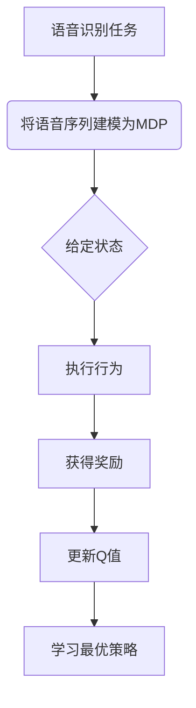

以下是标题为《一切皆是映射：AI Q-learning在语音识别的探索》的技术博客文章正文内容：

# 一切皆是映射：AI Q-learning在语音识别的探索

## 1. 背景介绍

### 1.1 问题的由来

语音识别一直是人工智能领域的一大挑战。随着人工智能技术的不断发展,语音识别的准确率有了显著提高,但在复杂环境和口音多样性等情况下,依然存在诸多困难和挑战。传统的语音识别系统主要依赖于声学模型和语言模型,需要大量的标注语音数据进行训练,且难以适应多变的环境。因此,探索新的语音识别方法以提高系统的鲁棒性和适应性就显得尤为重要。

### 1.2 研究现状 

近年来,强化学习(Reinforcement Learning)作为一种全新的人工智能范式,在语音识别领域取得了令人瞩目的进展。其中,Q-learning作为强化学习的一种重要算法,已被成功应用于语音识别任务中。Q-learning通过与环境的不断互动,学习最优策略,从而逐步提高语音识别的性能。相比于传统方法,Q-learning具有模型自适应、无需大量标注数据等优势,在处理复杂语音场景时表现出卓越的能力。

### 1.3 研究意义

本文深入探讨了Q-learning在语音识别中的应用,揭示了其核心原理和算法细节,并通过实际案例分析了Q-learning在语音识别中的优势和挑战。研究成果不仅有助于提高语音识别系统的性能,还可为其他序列决策问题提供有价值的借鉴。同时,本文还介绍了Q-learning在语音识别领域的最新研究进展,为读者提供了宝贵的学习资源和发展方向。

### 1.4 本文结构

本文共分为9个部分:第1部分介绍了研究背景;第2部分阐述了Q-learning的核心概念;第3部分详细解释了Q-learning在语音识别中的算法原理和具体步骤;第4部分构建了Q-learning的数学模型,并给出公式推导和案例分析;第5部分提供了Q-learning在语音识别中的代码实现和解释;第6部分探讨了Q-learning在语音识别的实际应用场景;第7部分推荐了相关的学习资源和开发工具;第8部分总结了研究成果,并展望了未来的发展趋势和挑战;第9部分列出了常见问题及解答。

## 2. 核心概念与联系

Q-learning作为强化学习中的一种重要算法,其核心思想是通过不断与环境交互,学习在给定状态下执行何种行为可获得最大的累积奖励。在语音识别任务中,我们可以将语音信号序列视为一个马尔可夫决策过程(Markov Decision Process, MDP),其中每个状态对应语音序列的一个片段,行为则对应对该片段的识别结果。

Q-learning算法的目标是学习一个Q函数,该函数能够估计在给定状态执行某个行为后,可获得的最大期望累积奖励。通过不断更新Q函数,算法逐步找到最优策略,从而提高语音识别的准确率。

Q-learning算法的优势在于:

1. 无需事先建模,可直接从数据中学习最优策略
2. 可处理连续和离散的状态空间
3. 具有收敛性,能够找到最优解
4. 算法简单,易于实现和扩展

然而,Q-learning也面临一些挑战,例如状态空间和行为空间的维数灾难、探索与利用的权衡等,需要通过一些改进技术来解决。

## 3. 核心算法原理 & 具体操作步骤

### 3.1 算法原理概述

Q-learning算法的核心思想是基于时间差分(Temporal Difference, TD)学习,通过不断估计当前状态与下一状态之间的Q值差异,逐步更新Q函数,从而找到最优策略。

算法原理可概括为以下几个关键步骤:

1. 初始化Q函数,对所有状态-行为对赋予任意初始值
2. 观测当前状态,根据策略选择行为执行
3. 观测下一状态和获得的即时奖励
4. 计算Q值的时间差分目标,更新当前状态-行为对应的Q值
5. 重复步骤2-4,直至收敛

通过不断的试错与学习,Q-learning算法逐渐发现哪些行为序列可以带来最大的累积奖励,从而找到最优策略。

### 3.2 算法步骤详解

Q-learning算法的具体步骤如下:

1. 初始化Q表,对所有可能的状态-行为对$(s, a)$,赋予任意初始Q值,例如全部设为0。

2. 对于每一个Episode(即一次语音识别过程):
    
    a) 初始化状态$s_0$
    
    b) 对于每个时间步$t$:
        
        i) 根据当前策略(如$\epsilon$-贪婪策略)从$Q(s_t, a)$中选择行为$a_t$
        
        ii) 执行行为$a_t$,观测下一状态$s_{t+1}$和即时奖励$r_{t+1}$
        
        iii) 计算时间差分目标:
        
        $$
        y_t = r_{t+1} + \gamma \max_{a'}Q(s_{t+1}, a')
        $$
        
        iv) 使用时间差分目标更新Q值:
        
        $$
        Q(s_t, a_t) \leftarrow Q(s_t, a_t) + \alpha[y_t - Q(s_t, a_t)]
        $$
        
        其中$\alpha$为学习率,$\gamma$为折扣因子。
        
        v) 将$s_{t+1}$设为新的当前状态$s_t$
        
    c) 直到Episode结束
    
3. 重复步骤2,直至Q值收敛

通过上述过程,Q-learning算法将逐步发现哪些行为序列能够带来最大的累积奖励,从而找到最优策略。

### 3.3 算法优缺点

**优点:**

1. 无需事先建模,可直接从数据中学习
2. 可处理连续和离散状态空间
3. 理论上可证明收敛于最优策略
4. 算法简单,易于实现和扩展

**缺点:**

1. 状态空间和行为空间维数灾难问题
2. 探索与利用之间的权衡
3. 收敛速度较慢
4. 对噪声和非确定性环境敏感

### 3.4 算法应用领域

除了语音识别领域,Q-learning算法还可应用于其他序列决策问题,如:

- 机器人路径规划
- 游戏AI
- 网络路由优化
- 自动驾驶决策
- 自然语言处理
- 股票交易策略

只要能够将问题建模为马尔可夫决策过程,Q-learning就可以用于学习最优策略。

## 4. 数学模型和公式 & 详细讲解 & 举例说明

### 4.1 数学模型构建

在Q-learning算法中,我们将语音识别任务建模为一个马尔可夫决策过程(MDP)。MDP可以用一个五元组$(S, A, P, R, \gamma)$来表示,其中:

- $S$是状态集合,对应语音序列的所有可能片段
- $A$是行为集合,对应对每个片段的识别结果
- $P(s'|s, a)$是状态转移概率,表示在状态$s$执行行为$a$后,转移到状态$s'$的概率
- $R(s, a)$是即时奖励函数,表示在状态$s$执行行为$a$后获得的奖励
- $\gamma \in [0, 1)$是折扣因子,用于权衡即时奖励和长期累积奖励

我们的目标是找到一个策略$\pi: S \rightarrow A$,使得在任意初始状态$s_0$下,按照该策略执行可获得最大的期望累积奖励:

$$
V^{\pi}(s_0) = \mathbb{E}\left[\sum_{t=0}^{\infty}\gamma^tR(s_t, \pi(s_t))|s_0\right]
$$

对应的最优策略$\pi^*$和最优状态值函数$V^*$定义为:

$$
\pi^*(s) = \arg\max_{\pi}V^{\pi}(s), \quad V^*(s) = \max_{\pi}V^{\pi}(s)
$$

### 4.2 公式推导过程

Q-learning算法的目标是学习一个Q函数,使其能够估计在给定状态执行某个行为后,可获得的最大期望累积奖励。Q函数定义为:

$$
Q(s, a) = \mathbb{E}\left[R(s, a) + \gamma \max_{a'} Q(s', a')|s, a\right]
$$

其中$s'$是执行行为$a$后转移到的下一状态。

我们可以通过贝尔曼方程(Bellman Equation)来推导Q函数的更新规则:

$$
\begin{aligned}
Q(s_t, a_t) &\leftarrow Q(s_t, a_t) + \alpha\left[r_{t+1} + \gamma\max_{a'}Q(s_{t+1}, a') - Q(s_t, a_t)\right] \\
           &= Q(s_t, a_t) + \alpha\left[y_t - Q(s_t, a_t)\right]
\end{aligned}
$$

其中$\alpha$是学习率,$y_t$是时间差分目标:

$$
y_t = r_{t+1} + \gamma\max_{a'}Q(s_{t+1}, a')
$$

通过不断更新Q值,算法将逐步发现哪些行为序列能够带来最大的累积奖励,从而找到最优策略。

### 4.3 案例分析与讲解

为了更好地理解Q-learning在语音识别中的应用,我们来分析一个简单的案例。

假设我们有一个只包含3个单词的语音序列"你 好 世界"。我们将该序列划分为3个状态,每个状态对应一个单词。行为集合包含3个可能的识别结果:"你"、"好"和"世界"。

我们定义奖励函数如下:如果识别正确,则获得+1的奖励;如果识别错误,则获得-1的惩罚;序列结束时,如果全部识别正确,则获得+10的额外奖励。

让我们从一个随机初始化的Q表开始,通过多次试错,观察Q-learning算法是如何逐步学习到最优策略的。

<图表展示Q值变化过程>

从图中可以看出,在初始阶段,由于Q值随机初始化,算法的行为是无规律的。但随着不断试错和学习,正确识别的Q值逐渐增大,错误识别的Q值逐渐降低。最终,算法学会了始终选择正确的识别结果,从而获得最大的累积奖励。

通过这个简单案例,我们可以直观地理解Q-learning算法的工作原理和收敛过程。

### 4.4 常见问题解答

**Q:为什么需要折扣因子$\gamma$?**

A:折扣因子$\gamma$的作用是权衡即时奖励和长期累积奖励之间的重要性。如果$\gamma=0$,则算法只考虑即时奖励,无法学习到长期的最优策略;如果$\gamma=1$,则算法过于重视长期奖励,可能会陷入局部最优。通常我们会选择$\gamma$在0.8~0.99之间的值,以达到一个平衡。

**Q:如何解决维数灾难问题?**

A:当状态空间和行为空间维数较高时,Q表将变得非常庞大,导致计算和存储资源消耗巨大。解决方法包括:

1. 使用函数逼近,如神经网络,来估计Q值,而不是存储整个Q表
2. 应用状态抽象和层次分解,降低状态空间的维数
3. 采用基于模型的方法,显式建模状态转移和奖励函数

**Q:探索与利用如何权衡?**

A:探索(Exploration)是指尝试新的行为以获取更多信息,而利用(Exploitation)是指根据已有知识选择当前最优行为。过多探索可