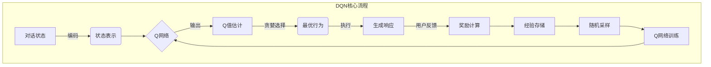

好的,我会遵循您的要求,尽最大努力为您撰写一篇高质量的技术博客文章。以下是正文内容:

# 一切皆是映射:DQN在智能对话系统中的实战与挑战

## 1. 背景介绍

### 1.1 问题的由来

在人工智能领域,对话系统一直是一个具有挑战性的研究课题。传统的基于规则的对话系统存在一些明显的缺陷,例如缺乏上下文理解能力、响应僵硬、扩展性差等。而随着深度学习技术的不断发展,基于数据驱动的端到端神经对话系统逐渐成为研究的新热点。

### 1.2 研究现状  

近年来,序列到序列(Seq2Seq)模型、记忆增强网络、条件变分自动编码器等新型神经网络模型被广泛应用于对话系统的构建。其中,强化学习在对话系统中的应用也取得了令人瞩目的进展。作为强化学习领域的经典算法之一,深度Q网络(Deep Q-Network,DQN)因其在Atari视频游戏中的卓越表现而备受关注。

### 1.3 研究意义

将DQN应用于对话系统,可以使对话代理在与用户的交互过程中,通过不断尝试和学习,优化自身的对话策略,生成更加自然、多样且合乎情境的响应。这不仅可以提高对话系统的性能,还为探索通用人工智能奠定基础。因此,研究DQN在对话系统中的应用具有重要的理论意义和应用价值。

### 1.4 本文结构

本文将全面介绍DQN在智能对话系统中的实战应用。首先阐述DQN的核心概念和算法原理,并详细解析其数学模型。接着通过一个实际项目案例,讲解如何将DQN应用于对话系统的开发实践。最后探讨DQN在对话系统中的挑战与未来发展趋势。

## 2. 核心概念与联系

DQN作为强化学习领域的一种价值迭代算法,其核心思想是使用深度神经网络来估计状态-行为对的长期回报价值函数(Q值),并根据这个Q值来选择最优行为策略。

在对话系统中,我们可以将对话过程建模为一个马尔可夫决策过程(MDP):

- 状态(State)为对话历史上下文
- 行为(Action)为响应的对话语句
- 奖励(Reward)为当前行为对应的奖惩反馈

DQN的目标是学习一个最优的Q函数,使得在任意对话状态下,都能选择一个最佳的响应行为,从而maximizeize期望的累积奖励。

DQN算法的关键在于使用一个深度神经网络(即Q网络)来逼近真实的Q函数,并通过经验回放和目标Q网络的引入来加速训练过程,提高收敛性能。

上图展示了DQN在对话系统中的核心工作流程。我们可以看到,DQN将对话过程建模为一个马尔可夫决策过程,通过深度Q网络来近似最优的Q值函数,并根据这个Q值来选择最佳的响应行为。同时,DQN引入了经验回放和目标Q网络等技术来加速训练过程,提高算法的收敛性能。

## 3. 核心算法原理与具体操作步骤

### 3.1 算法原理概述  

DQN算法的核心思想是使用一个深度神经网络(Q网络)来近似Q函数,并通过Q学习算法不断优化该网络的参数,使得输出的Q值估计越来越准确。具体来说,DQN算法包含以下几个关键组成部分:

1. **Q网络**: 使用深度神经网络作为函数逼近器,输入为状态表示,输出为各个行为对应的Q值估计。
2. **经验回放**: 将探索过程中的经验存储在经验回放池中,并从中随机采样数据用于训练,可以打破经验数据间的相关性,提高数据利用效率。
3. **目标Q网络**: 在一定步数后,使用另一个单独的目标Q网络来生成目标Q值,用于计算损失函数。这种技术可以增加训练的稳定性。
4. **$\epsilon$-贪婪策略**: 在选择行为时,以一定的概率$\epsilon$随机选择行为(探索),否则选择当前Q值最大的行为(利用)。这种策略可以在探索和利用之间达成平衡。

算法的目标是最小化真实Q值与Q网络输出的Q值估计之间的均方误差损失函数:

$$J(\theta) = \mathbb{E}_{(s,a,r,s')\sim D}\left[(y_i - Q(s,a;\theta))^2\right]$$

其中:
- $y_i = r + \gamma \max_{a'}Q(s',a';\theta^-)$为目标Q值
- $\theta$为Q网络的参数
- $\theta^-$为目标Q网络的参数(每隔一定步数复制自$\theta$)
- $D$为经验回放池

通过不断优化该损失函数,Q网络就可以逐步学习到近似真实Q函数的能力。

### 3.2 算法步骤详解

DQN算法的训练过程可以概括为以下几个核心步骤:

1. **初始化**
   - 初始化Q网络和目标Q网络,两个网络的参数相同
   - 初始化经验回放池D为空

2. **探索与存储经验**
   - 根据当前状态s,选择一个行为a(使用$\epsilon$-贪婪策略)
   - 执行选择的行为a,获得奖励r和新状态s'
   - 将(s,a,r,s')的经验存入经验回放池D

3. **采样与学习**
   - 从经验回放池D中随机采样一个批次的经验
   - 计算这一批次经验对应的目标Q值y:
     $y_i = r_i + \gamma \max_{a'}Q(s'_i,a';\theta^-)$
   - 计算Q网络对这一批次经验的Q值估计值Q(s,a;$\theta$)
   - 计算均方误差损失函数:$J(\theta) = \sum_i(y_i - Q(s_i,a_i;\theta))^2$
   - 使用梯度下降法更新Q网络的参数$\theta$,最小化损失函数

4. **目标网络更新**
   - 每隔一定步数,将Q网络的参数$\theta$复制到目标Q网络参数$\theta^-$

5. **循环训练**
   - 重复步骤2~4,直至模型收敛

通过上述过程,DQN算法可以逐步学习到近似真实Q函数的能力,从而指导对话系统选择最优的响应行为。

### 3.3 算法优缺点

**优点**:

1. 端到端学习,无需人工设计特征
2. 通过经验回放打破数据相关性,提高数据利用效率
3. 目标Q网络增强了算法的稳定性
4. 可以处理连续和离散的状态/行为空间

**缺点**:

1. 训练过程复杂,收敛慢,需要大量数据
2. 探索与利用之间需要平衡
3. 奖励函数的设计较为困难
4. 可能会遇到梯度消失/爆炸问题

### 3.4 算法应用领域

除了对话系统外,DQN算法还可以应用于其他一些序列决策问题,如:

- 机器人控制
- 自动驾驶决策
- 智能游戏AI
- 自动化资源调度
- 智能投资决策

只要将问题建模为马尔可夫决策过程,并设计合理的状态、行为和奖励,就可以尝试使用DQN算法来求解。

## 4. 数学模型和公式详细讲解与举例说明

### 4.1 数学模型构建

在对话系统中,我们可以将对话过程建模为一个马尔可夫决策过程(MDP):

- 状态空间$\mathcal{S}$: 对话历史上下文的表示
- 行为空间$\mathcal{A}$: 可选择的响应语句
- 奖励函数$\mathcal{R}(s,a)$: 对当前状态s下选择行为a的奖惩反馈
- 状态转移概率$\mathcal{P}(s'|s,a)$: 从状态s执行行为a后,转移到状态s'的概率

在该MDP中,我们的目标是学习一个最优策略$\pi^*(a|s)$,使得在任意状态s下,选择行为a都可以最大化期望的累积奖励:

$$\pi^* = \arg\max_\pi \mathbb{E}\left[\sum_{t=0}^\infty \gamma^t r_t|s_0=s,\pi\right]$$

其中$\gamma\in[0,1]$是折现因子,用于权衡当前奖励与未来奖励的重要性。

为了学习这个最优策略,我们需要估计每个状态-行为对的长期回报价值Q(s,a),也就是在状态s下选择行为a后,能获得的期望累积奖励:

$$Q^*(s,a) = \mathbb{E}\left[\sum_{t=0}^\infty \gamma^t r_t|s_0=s,a_0=a,\pi^*\right]$$

根据Bellman方程,最优Q函数满足以下等式:

$$Q^*(s,a) = \mathbb{E}_{s'\sim\mathcal{P}}\left[r(s,a) + \gamma \max_{a'} Q^*(s',a')\right]$$

也就是说,最优Q值等于当前奖励加上未来最优状态-行为对的期望Q值。

### 4.2 公式推导过程

DQN算法的目标是使用一个深度神经网络Q(s,a;$\theta$)来近似真实的Q函数Q*(s,a),其中$\theta$为网络参数。为了训练这个Q网络,我们需要最小化Q网络输出的Q值估计与真实Q值之间的均方误差损失函数:

$$J(\theta) = \mathbb{E}_{(s,a,r,s')\sim D}\left[\left(y - Q(s,a;\theta)\right)^2\right]$$

其中,目标Q值y是根据Bellman方程定义的:

$$\begin{aligned}
y &= r + \gamma \max_{a'} Q^*(s',a')\\
  &\approx r + \gamma \max_{a'} Q(s',a';\theta^-)
\end{aligned}$$

这里我们使用另一个目标Q网络Q(s,a;$\theta^-$)来生成目标Q值,其参数$\theta^-$是Q网络参数$\theta$的滞后值,每隔一定步数进行更新。这种技术可以增强训练的稳定性。

通过最小化上述损失函数,我们可以使Q网络的输出Q值估计逐步逼近真实的Q值。具体的优化方法可以使用随机梯度下降等优化算法。

同时,为了提高数据的利用效率,DQN算法引入了经验回放(Experience Replay)技术。我们将探索过程中的经验(s,a,r,s')存储在经验回放池D中,并在训练时从中随机采样一个批次的经验,而不是直接使用连续的在线数据。这种技术可以打破经验数据间的相关性,提高数据的利用效率。

### 4.3 案例分析与讲解

为了更好地理解DQN算法在对话系统中的应用,我们来分析一个具体的案例。假设我们正在构建一个天气查询对话系统,用户可以通过自然语言询问当前或未来某个时间的天气情况,系统需要给出相应的回复。

在这个案例中,我们可以将对话状态s表示为对话历史上下文的序列编码,例如使用BERT等预训练语言模型对上下文进行编码。行为a则为系统可选择的响应语句,如"今天天气晴朗""未来三天将有阵雨"等。

奖励函数R(s,a)的设计是一个比较有挑战的部分。一种可能的方式是根据用户的反馈(如点