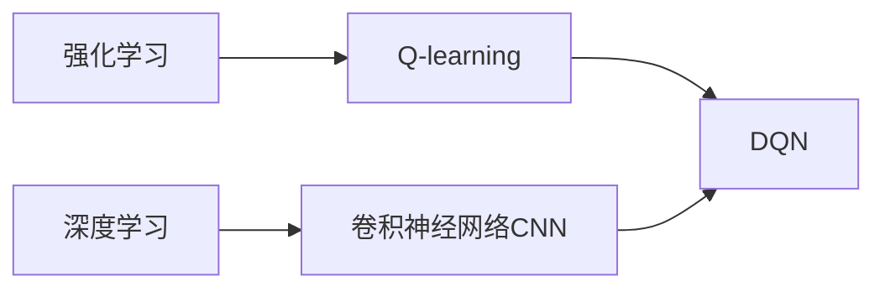

# 一切皆是映射：DQN在自动游戏中的应用：挑战与解决方案

关键词：深度强化学习、DQN、自动游戏、Atari游戏、状态-动作值函数、经验回放、目标网络

## 1. 背景介绍
### 1.1 问题的由来
在人工智能的发展历程中，让计算机自主学习如何玩游戏一直是一个具有挑战性和吸引力的课题。传统的游戏AI通常依赖于预定义的规则和启发式策略，难以适应复杂多变的游戏环境。近年来，随着深度学习和强化学习的蓬勃发展，利用深度强化学习算法实现自动游戏智能体成为了一个热门研究方向。其中，Deep Q-Network (DQN)算法在Atari游戏中取得了里程碑式的突破，展示了深度强化学习在自动游戏领域的巨大潜力。

### 1.2 研究现状
DQN算法由DeepMind公司于2013年提出，它将深度学习与强化学习相结合，通过卷积神经网络（CNN）直接从原始像素中学习游戏策略，在多个Atari 2600游戏中达到或超越人类玩家的表现。此后，DQN及其变体在各类游戏环境中得到了广泛应用，如Doom、StarCraft等。研究者们不断改进DQN算法，提出了Double DQN、Dueling DQN、Rainbow等增强版本，进一步提升了算法的性能和稳定性。同时，DQN也被应用于其他领域，如机器人控制、自动驾驶等，展现出强大的泛化能力。

### 1.3 研究意义
研究DQN在自动游戏中的应用具有重要意义。首先，它推动了人工智能在游戏领域的发展，为开发更加智能化的游戏AI提供了新的思路和方法。其次，通过研究DQN在游戏中的表现，我们可以更好地理解深度强化学习算法的工作原理和特性，为算法的改进和优化提供启示。此外，游戏环境也为深度强化学习算法提供了理想的测试平台，有助于评估算法的性能和鲁棒性。最后，DQN在游戏中的成功应用也为其在其他领域的应用奠定了基础，推动了人工智能技术的发展和应用。

### 1.4 本文结构
本文将全面探讨DQN在自动游戏中的应用，重点关注其面临的挑战和解决方案。首先，我们将介绍DQN的核心概念和原理，包括Q-learning、深度神经网络、经验回放等。然后，我们将详细阐述DQN算法的具体操作步骤和数学模型，并通过代码实例进行说明。接下来，我们将讨论DQN在实际应用中面临的挑战，如样本效率、探索与利用平衡等，并介绍相应的解决方案。最后，我们将总结DQN在自动游戏领域的研究现状和未来发展趋势，并提供相关的学习资源和工具推荐。

## 2. 核心概念与联系
在深入探讨DQN算法之前，我们需要了解其背后的核心概念和它们之间的联系。

**强化学习**：强化学习是一种机器学习范式，旨在让智能体通过与环境的交互来学习最优策略，以最大化累积奖励。智能体根据当前状态采取动作，环境根据动作给予奖励并转移到下一个状态，智能体不断调整策略以适应环境的反馈。

**Q-learning**：Q-learning是一种经典的强化学习算法，用于学习最优状态-动作值函数（Q函数）。Q函数表示在给定状态下采取特定动作的长期期望回报。通过不断更新Q值，智能体可以学习到最优策略。

**深度学习**：深度学习是一种基于人工神经网络的机器学习方法，通过多层非线性变换对数据进行表示和学习。卷积神经网络（CNN）和循环神经网络（RNN）是两种常用的深度学习模型，分别用于处理图像和序列数据。

**DQN**：DQN将深度学习与Q-learning相结合，使用深度神经网络来逼近Q函数。网络以状态（如游戏画面）作为输入，输出每个可能动作的Q值。通过最小化预测Q值与目标Q值之间的均方误差，网络可以学习到最优的Q函数。

下图展示了DQN的核心概念与联系：

## 3. 核心算法原理 & 具体操作步骤
### 3.1 算法原理概述
DQN算法的核心思想是使用深度神经网络来逼近最优状态-动作值函数（Q函数）。网络以当前状态（如游戏画面）作为输入，输出每个可能动作的Q值。通过最小化预测Q值与目标Q值之间的均方误差，网络可以学习到最优的Q函数，从而得到最优策略。

DQN引入了两个关键技术来解决传统Q-learning在高维状态空间下的困难：

1. **经验回放**（Experience Replay）：将智能体与环境交互得到的转移样本（状态、动作、奖励、下一状态）存储在回放缓冲区中，并从中随机抽取小批量样本进行训练。这样可以打破样本之间的相关性，提高样本利用效率。

2. **目标网络**（Target Network）：使用两个结构相同但参数不同的神经网络，一个用于预测Q值（评估网络），另一个用于生成目标Q值（目标网络）。目标网络的参数定期从评估网络复制，以保持训练的稳定性。

### 3.2 算法步骤详解
DQN算法的具体操作步骤如下：

1. 初始化评估网络和目标网络，回放缓冲区，以及其他超参数（如探索率、学习率等）。

2. 对于每个episode：
   - 初始化环境，获得初始状态$s_0$。
   - 对于每个时间步$t$：
     - 根据当前探索率$\epsilon$，以$\epsilon$的概率随机选择动作$a_t$，否则选择$a_t=\arg\max_a Q(s_t,a)$。
     - 执行动作$a_t$，获得奖励$r_t$和下一状态$s_{t+1}$。
     - 将转移样本$(s_t,a_t,r_t,s_{t+1})$存储到回放缓冲区中。
     - 从回放缓冲区中随机抽取小批量样本$(s_i,a_i,r_i,s_{i+1})$。
     - 计算目标Q值：$y_i=r_i+\gamma\max_{a'}Q'(s_{i+1},a')$，其中$Q'$为目标网络，$\gamma$为折扣因子。
     - 最小化预测Q值与目标Q值之间的均方误差：$L=\frac{1}{N}\sum_i(y_i-Q(s_i,a_i))^2$，其中$N$为批量大小。
     - 根据梯度下降法更新评估网络的参数。
     - 每隔一定步数将评估网络的参数复制给目标网络。
   - 降低探索率$\epsilon$。

3. 重复步骤2，直到达到最大episode数或满足其他终止条件。

### 3.3 算法优缺点
DQN算法的优点包括：

- 可以直接从原始像素中学习策略，无需手工提取特征。
- 通过经验回放和目标网络提高了训练的稳定性和样本效率。
- 在多个Atari游戏中达到或超越人类玩家的表现，展示了强大的泛化能力。

DQN算法的缺点包括：

- 样本效率较低，需要大量的训练数据和计算资源。
- 对超参数敏感，需要仔细调节以获得良好性能。
- 难以处理连续动作空间和部分可观察环境。

### 3.4 算法应用领域
DQN算法在自动游戏领域取得了巨大成功，不仅在Atari游戏中表现出色，还被应用于其他类型的游戏，如Doom、StarCraft等。除了游戏领域，DQN也被应用于机器人控制、自动驾驶、推荐系统等领域，展现出广泛的应用前景。

## 4. 数学模型和公式 & 详细讲解 & 举例说明
### 4.1 数学模型构建
DQN算法的数学模型基于马尔可夫决策过程（MDP）和Q-learning。MDP由一个五元组$(S,A,P,R,\gamma)$定义：

- $S$：状态空间，表示智能体所处的环境状态集合。
- $A$：动作空间，表示智能体可以采取的动作集合。
- $P$：状态转移概率，$P(s'|s,a)$表示在状态$s$下采取动作$a$后转移到状态$s'$的概率。
- $R$：奖励函数，$R(s,a)$表示在状态$s$下采取动作$a$获得的即时奖励。
- $\gamma$：折扣因子，$\gamma\in[0,1]$，表示未来奖励的折扣程度。

Q-learning的目标是学习最优状态-动作值函数（Q函数），定义为：

$$Q^*(s,a)=\mathbb{E}\left[\sum_{t=0}^{\infty}\gamma^tr_t|s_0=s,a_0=a,\pi^*\right]$$

其中，$\pi^*$为最优策略，$r_t$为第$t$步获得的奖励。Q函数满足贝尔曼最优方程：

$$Q^*(s,a)=\mathbb{E}_{s'\sim P(\cdot|s,a)}\left[R(s,a)+\gamma\max_{a'}Q^*(s',a')\right]$$

DQN使用深度神经网络$Q_{\theta}(s,a)$来逼近Q函数，其中$\theta$为网络参数。网络的输入为状态$s$，输出为每个动作$a$对应的Q值。

### 4.2 公式推导过程
DQN的训练目标是最小化预测Q值与目标Q值之间的均方误差：

$$L(\theta)=\mathbb{E}_{(s,a,r,s')\sim D}\left[\left(r+\gamma\max_{a'}Q_{\theta^-}(s',a')-Q_{\theta}(s,a)\right)^2\right]$$

其中，$D$为回放缓冲区，$\theta^-$为目标网络的参数。

根据梯度下降法，参数$\theta$的更新公式为：

$$\theta\leftarrow\theta-\alpha\nabla_{\theta}L(\theta)$$

其中，$\alpha$为学习率。

### 4.3 案例分析与讲解
以经典的Atari游戏Breakout为例，说明DQN算法的应用。在Breakout中，智能体控制一个挡板，目标是击打并消除屏幕上方的砖块，同时防止球落地。游戏状态为游戏画面的原始像素，动作空间包括左移、右移和不动。

DQN网络以连续4帧游戏画面作为输入，通过卷积层提取特征，再经过全连接层输出每个动作的Q值。网络的训练过程如下：

1. 智能体与游戏环境交互，获得转移样本$(s_t,a_t,r_t,s_{t+1})$并存储到回放缓冲区中。

2. 从回放缓冲区中随机抽取小批量样本$(s_i,a_i,r_i,s_{i+1})$。

3. 计算目标Q值：$y_i=r_i+\gamma\max_{a'}Q_{\theta^-}(s_{i+1},a')$。

4. 最小化预测Q值与目标Q值之间的均方误差：$L(\theta)=\frac{1}{N}\sum_i(y_i-Q_{\theta}(s_i,a_i))^2$。

5. 根据梯度下降法更新网络参数$\theta$。

6. 每隔一定步数将评估网络的参数复制给目标网络。

通过不断训练，DQN网络可以学习到最优的Q函数，从而得到最优策略。在Breakout游戏中，DQN智能体的得分远远超过人类玩家，展示了深度强化学习在自动游戏领域的巨大潜力。

### 4.4 常见问题解答
1. Q：DQN算法中的探索率$\epsilon$有