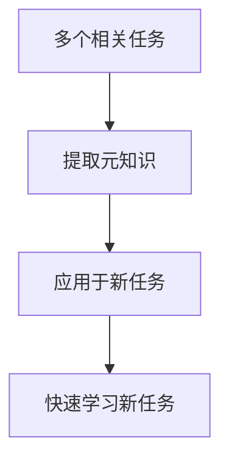

# 一切皆是映射：从零基础到掌握元学习算法

## 1. 背景介绍

### 1.1 问题的由来

在当今时代，数据的爆炸式增长已成为不争的事实。无论是个人还是企业,都面临着如何高效利用这些海量数据的挑战。传统的机器学习算法需要大量的标注数据进行训练,这不仅耗时耗力,而且难以适应不断变化的数据分布。因此,如何设计一种能够快速适应新环境、新任务的智能系统,成为了人工智能领域的一个重要课题。

元学习(Meta-Learning)作为一种新兴的学习范式,旨在解决这一难题。它通过从已有的任务和数据中学习元知识,从而加快新任务的学习过程。这种"学会学习"的思想,使得智能系统能够更好地理解和推广知识,从而提高了数据利用效率和适应性。

### 1.2 研究现状

近年来,元学习在计算机视觉、自然语言处理、强化学习等多个领域取得了令人瞩目的成就。例如,在Few-Shot图像分类任务中,元学习模型能够仅从少量示例图像中快速学习新类别;在对话系统领域,元学习可以帮助机器人更好地理解人类的语境,提供更加自然流畅的对话体验。

然而,尽管取得了一定进展,元学习仍面临诸多挑战。例如,如何设计通用的元学习框架以适应不同的任务?如何提高元学习的稳定性和可解释性?如何将元学习应用到更广泛的领域?这些问题都有待进一步探索和研究。

### 1.3 研究意义

元学习的研究对于推动人工智能的发展具有重要意义。它不仅能够提高智能系统的学习效率和适应能力,还有助于揭示人类认知和学习的本质规律。通过研究元学习,我们可以更好地理解人类如何从有限的经验中获取知识,并将其应用到新的环境中。这种认知能力的模拟和提升,将为构建通用人工智能系统奠定基础。

此外,元学习在实际应用中也大有可为。它可以用于快速构建定制化的智能系统,满足不同领域的特定需求;也可以应用于数据量有限的小样本学习场景,提高数据利用效率。随着元学习技术的不断发展,它必将为各行各业带来全新的发展机遇。

### 1.4 本文结构

本文将全面介绍元学习的基本概念、核心算法原理、数学模型及实际应用。文章首先阐述元学习的核心思想和发展历程,然后详细解析主流元学习算法的工作原理和实现步骤。接下来,我们将构建元学习的数学模型,并通过案例分析加深理解。在此基础上,文章将展示元学习在计算机视觉、自然语言处理等领域的实际应用,并介绍开发环境的搭建和代码实现细节。最后,我们将总结元学习的发展趋势和面临的挑战,为读者提供进一步学习和研究的方向。

## 2. 核心概念与联系

元学习(Meta-Learning)是机器学习中一种新兴的范式,其核心思想是"学会学习"(Learn to Learn)。与传统的机器学习方法不同,元学习不是直接从数据中学习任务相关的知识,而是试图从多个相关任务中捕获元知识(Meta-Knowledge),以加快新任务的学习过程。

元学习的基本工作流程如下所示:

具体来说,元学习首先从一系列支持任务(Support Tasks)中学习元知识,这些元知识包括了任务之间的共性和规律。然后,当面临新的目标任务(Target Task)时,元学习算法能够利用这些元知识作为先验,快速适应并学习新任务,从而大大减少了所需的训练数据和时间。

元学习的核心思想与人类的学习方式有着惊人的相似之处。就像人类可以从已有的经验中总结出一般性的规律,并将其应用于新的环境中一样,元学习也是通过捕获任务之间的共性知识,来加速对新任务的学习和适应。

元学习与其他一些相关的机器学习概念也有着密切的联系,例如:

- **迁移学习(Transfer Learning)**: 迁移学习旨在将从一个领域或任务中学习到的知识应用到另一个相关但不同的领域或任务上。元学习可以看作是一种更加通用和自动化的迁移学习方法。

- **多任务学习(Multi-Task Learning)**: 多任务学习同时学习多个相关任务,以提高每个任务的性能。元学习则是从多任务中捕获更高层次的元知识,用于加速新任务的学习。

- **少样本学习(Few-Shot Learning)**: 少样本学习旨在使用很少的标注数据来训练模型,以解决数据稀缺的问题。元学习为少样本学习提供了一种有效的解决方案,通过利用元知识来补充有限的训练数据。

- **在线学习(Online Learning)**: 在线学习能够持续地从新数据中学习和更新模型。元学习则关注如何利用已有的任务经验来加速对新任务的适应,两者可以很好地结合以提高学习效率。

总的来说,元学习为机器学习领域带来了全新的思路和视角。它不仅有助于提高智能系统的学习效率和适应能力,还为探索人类认知和学习的本质规律提供了新的途径。

## 3. 核心算法原理与具体操作步骤

### 3.1 算法原理概述

元学习算法的核心思想是从一系列支持任务(Support Tasks)中学习一个高效的学习策略,然后将这个策略应用于新的目标任务(Target Task),以加快对新任务的学习过程。这个学习策略通常被称为"元学习器"(Meta-Learner)。

元学习算法的一般流程如下:

1. **支持任务采样**: 从任务分布中采样一批支持任务,每个支持任务包含一个支持集(Support Set)和一个查询集(Query Set)。支持集用于模拟新任务的训练数据,而查询集用于评估模型在该任务上的性能。

2. **元学习器更新**: 使用支持集对元学习器进行训练,目标是最小化查询集上的损失函数。这个过程通过一种优化算法(如梯度下降)来实现,以学习一个高效的学习策略。

3. **应用于目标任务**: 在学习到有效的元学习器后,将其应用于新的目标任务。具体来说,使用目标任务的支持集对元学习器进行少量的fine-tuning,然后在目标任务的查询集上评估其性能。

这种"通过多任务学习来学习学习策略"的思路,使得元学习器能够捕获任务之间的共性知识,从而加快对新任务的适应和学习。

根据元学习器的具体形式,元学习算法可以分为多种类型,如基于优化的方法(Optimization-Based Methods)、基于度量的方法(Metric-Based Methods)、基于模型的方法(Model-Based Methods)等。下面我们将重点介绍两种广为人知的元学习算法:MAML(Model-Agnostic Meta-Learning)和Prototypical Networks。

### 3.2 算法步骤详解

#### 3.2.1 MAML算法

MAML(Model-Agnostic Meta-Learning)是一种基于优化的元学习算法,其核心思想是通过多任务训练,学习一个可以快速适应新任务的初始化模型参数。

MAML算法的具体步骤如下:

1. **任务采样**: 从任务分布中采样一批支持任务,每个支持任务包含一个支持集和一个查询集。

2. **内循环**: 对于每个支持任务,使用支持集对模型参数进行一次或多次梯度更新,得到任务特定的适应性参数:

   $$\theta'_i = \theta - \alpha \nabla_\theta \mathcal{L}_{\mathcal{T}_i}(f_\theta)$$

   其中$\theta$是模型的初始参数,$\alpha$是内循环的学习率,$\mathcal{L}_{\mathcal{T}_i}$是第$i$个支持任务的损失函数,而$f_\theta$表示使用参数$\theta$的模型。

3. **外循环**: 使用适应性参数$\theta'_i$在查询集上计算损失,并对初始参数$\theta$进行元更新:

   $$\theta \leftarrow \theta - \beta \nabla_\theta \sum_{i} \mathcal{L}_{\mathcal{T}_i}(f_{\theta'_i})$$

   其中$\beta$是外循环的元学习率。

4. **重复训练**: 重复步骤1-3,直到模型收敛。

通过这种两层优化的方式,MAML算法能够学习到一个可以快速适应新任务的初始化模型参数。在面临新的目标任务时,只需要使用该初始化参数进行少量的fine-tuning,即可获得良好的性能。

MAML算法的优点是可以与任何可微分的模型相结合,因此具有很强的通用性。然而,它也存在一些缺陷,如计算开销较大、对任务分布的敏感性较高等。

#### 3.2.2 Prototypical Networks

Prototypical Networks是一种基于度量的元学习算法,其核心思想是通过学习一个好的嵌入空间,使得同一类别的样本在该空间中聚集在一起,而不同类别的样本则相距较远。

Prototypical Networks算法的具体步骤如下:

1. **任务采样**: 从任务分布中采样一批支持任务,每个支持任务包含一个支持集和一个查询集。

2. **嵌入计算**: 使用编码器网络(如卷积神经网络)将支持集和查询集中的样本映射到一个嵌入空间。

3. **原型计算**: 对于每个类别,计算该类别在支持集中样本的均值向量,作为该类别的原型向量。

4. **分类**: 对于查询集中的每个样本,计算它与每个原型向量的距离,并将其分配到距离最近的原型所对应的类别。

5. **损失计算**: 计算查询集上的分类损失,并通过梯度下降对编码器网络进行更新。

6. **重复训练**: 重复步骤1-5,直到模型收敛。

通过这种方式,Prototypical Networks算法能够学习到一个好的嵌入空间,使得相似的样本在该空间中聚集在一起。在面临新的目标任务时,只需要计算新样本与已知原型的距离,即可进行快速分类。

Prototypical Networks算法的优点是计算简单、易于理解,并且对任务分布的敏感性较低。但它也存在一些局限性,如对异常值敏感、难以处理复杂的任务等。

### 3.3 算法优缺点

#### 3.3.1 优点

1. **高效学习**: 元学习算法能够从已有的任务经验中提取元知识,从而加快对新任务的学习过程,大大提高了学习效率。

2. **数据高效利用**: 元学习算法通常只需要少量的示例数据就能快速适应新任务,因此能够有效解决数据稀缺的问题。

3. **泛化能力强**: 由于元学习算法捕获了任务之间的共性知识,因此具有较强的泛化能力,能够更好地推广到未见过的新任务。

4. **可解释性**: 一些元学习算法(如基于原型的方法)具有较好的可解释性,能够直观地解释模型的决策过程。

5. **通用性**: 元学习算法可以应用于各种不同的任务和领域,如计算机视觉、自然语言处理、强化学习等。

#### 3.3.2 缺点

1. **任务分布敏感**: 元学习算法的性能在很大程度上依赖于支持任务的分布,如果支持任务与目标任务存在较大差异,则可能导致性能下降。

2. **计算开销大**: 一些元学习算法(如基于优化的方法)需要进行双循环优化,计算开销较大,难以应用于大规模场景。

3. **理论基础薄弱**: 元学习作为一个新兴领域,其