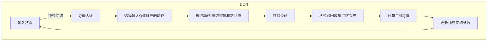

# 一切皆是映射：使用DQN处理高维输入：视觉信息在强化学习的运用

## 1. 背景介绍

### 1.1 问题的由来

在过去几年中,强化学习(Reinforcement Learning, RL)取得了令人瞩目的进展,在诸如游戏、机器人控制和自动驾驶等领域展现出了巨大的潜力。然而,传统的RL算法主要关注低维状态空间的问题,例如棋盘游戏和简单的控制任务。当面临高维输入(如视觉信息)时,这些算法往往会遇到维数灾难(Curse of Dimensionality)的挑战,导致学习效率低下。

### 1.2 研究现状

为了解决这一问题,研究人员提出了多种处理高维输入的方法,例如使用自编码器(Autoencoder)或卷积神经网络(Convolutional Neural Network, CNN)对原始输入进行编码。然而,这些方法通常需要大量的标注数据,并且编码过程可能会丢失对于决策至关重要的信息。

### 1.3 研究意义

本文探讨了一种新颖的方法,即直接将高维视觉输入馈送到深度Q网络(Deep Q-Network, DQN)中,并通过端到端的训练来学习最优策略。这种方法不需要手工特征提取或数据标注,可以自动发现对于决策最有价值的视觉特征。同时,由于DQN的稳定性训练方式,该方法也能够有效避免训练过程中的不稳定性。

### 1.4 本文结构

本文首先介绍DQN及其处理高维输入的基本思路,然后详细阐述算法的核心原理和数学模型。接下来,我们将通过一个具体的项目实践,展示如何使用DQN解决基于视觉信息的强化学习问题。最后,我们将讨论该方法在实际应用中的潜力和挑战,并给出未来的发展方向。

## 2. 核心概念与联系

在传统的强化学习中,智能体(Agent)通过与环境(Environment)交互来学习一个最优策略(Policy),目标是最大化未来的累积奖励(Cumulative Reward)。这个过程可以用马尔可夫决策过程(Markov Decision Process, MDP)来建模,其中状态(State)是环境的表示,动作(Action)是智能体可以执行的操作,奖励(Reward)是环境对智能体行为的反馈。

深度Q网络(DQN)是一种结合深度学习(Deep Learning)和Q-Learning的强化学习算法,它使用神经网络来近似Q函数(Q-Function),从而可以处理高维甚至连续的状态空间。在传统的Q-Learning中,Q函数是一个查找表,存储了每个状态-动作对(State-Action Pair)的Q值(Q-Value),表示在该状态下执行该动作所能获得的预期累积奖励。然而,对于高维状态空间,查找表的方式就变得不再实用。

DQN的核心思想是使用一个深度神经网络来近似Q函数,其输入是当前状态,输出是所有可能动作对应的Q值。在训练过程中,DQN会不断更新神经网络的参数,使得输出的Q值越来越接近真实的Q值。这种端到端的学习方式,使得DQN可以直接从原始的高维输入(如像素级的视觉信息)中学习最优策略,而无需手工特征提取或数据标注。

上图展示了DQN算法的基本流程。首先,DQN会从当前状态开始,通过神经网络估计每个可能动作对应的Q值。然后,它会选择Q值最大的动作执行,获得相应的奖励和新的状态。这个过程中的经验(状态、动作、奖励、新状态)会被存储在经验回放缓冲区(Experience Replay Buffer)中。在训练时,DQN会从缓冲区中随机采样一批经验,计算目标Q值(Target Q-Value),并使用这些目标Q值来更新神经网络的参数,使得预测的Q值逐渐逼近真实的Q值。

通过这种方式,DQN可以有效地处理高维输入,同时避免了传统Q-Learning中的不稳定性问题。经验回放缓冲区的引入,打破了数据之间的相关性,使得训练过程更加稳定。而目标Q值的计算方式,也能够减少训练过程中的振荡和发散。

## 3. 核心算法原理 & 具体操作步骤

### 3.1 算法原理概述

DQN算法的核心原理可以概括为以下几个方面:

1. **神经网络近似Q函数**: DQN使用一个深度神经网络来近似Q函数,输入是当前状态,输出是所有可能动作对应的Q值。通过不断更新神经网络的参数,DQN可以学习到越来越准确的Q值估计。

2. **经验回放(Experience Replay)**: DQN将智能体与环境交互过程中获得的经验(状态、动作、奖励、新状态)存储在经验回放缓冲区中。在训练时,DQN会从缓冲区中随机采样一批经验进行训练,这种方式可以打破数据之间的相关性,提高训练的稳定性。

3. **目标网络(Target Network)**: DQN使用两个神经网络,一个是在线网络(Online Network),用于预测Q值;另一个是目标网络(Target Network),用于计算目标Q值。目标网络的参数是在线网络参数的复制,但会保持一段时间不变,这种方式可以减少训练过程中的振荡和发散。

4. **双重Q学习(Double Q-Learning)**: DQN采用了双重Q学习的技术,使用两个独立的Q网络来分别选择动作和评估Q值,这种方式可以减少过估计的影响,提高训练的稳定性和收敛性。

### 3.2 算法步骤详解

DQN算法的具体步骤如下:

1. **初始化**: 初始化在线网络和目标网络,将目标网络的参数设置为与在线网络相同。同时,初始化经验回放缓冲区。

2. **观测初始状态**: 从环境中获取初始状态$s_0$。

3. **选择动作**: 将当前状态$s_t$输入到在线网络中,获得所有可能动作对应的Q值$Q(s_t, a; \theta)$,其中$\theta$是在线网络的参数。根据一定的策略(如$\epsilon$-贪婪策略)选择动作$a_t$。

4. **执行动作并观测新状态**: 在环境中执行选择的动作$a_t$,获得奖励$r_{t+1}$和新的状态$s_{t+1}$。

5. **存储经验**: 将经验$(s_t, a_t, r_{t+1}, s_{t+1})$存储到经验回放缓冲区中。

6. **采样经验批次**: 从经验回放缓冲区中随机采样一批经验$(s_j, a_j, r_j, s_{j+1})$,其中$j$是经验在缓冲区中的索引。

7. **计算目标Q值**: 对于每个经验$(s_j, a_j, r_j, s_{j+1})$,计算目标Q值:

$$
y_j = r_j + \gamma \max_{a'} Q'(s_{j+1}, a'; \theta^-)
$$

其中$\gamma$是折扣因子,用于权衡即时奖励和未来奖励的重要性;$Q'$是目标网络,参数为$\theta^-$;$\max_{a'} Q'(s_{j+1}, a'; \theta^-)$表示在新状态$s_{j+1}$下,所有可能动作对应的Q值中的最大值。

8. **更新在线网络参数**: 使用均方误差(Mean Squared Error, MSE)损失函数,计算在线网络预测的Q值与目标Q值之间的差异:

$$
L(\theta) = \mathbb{E}_{(s_j, a_j, r_j, s_{j+1}) \sim D}\left[(y_j - Q(s_j, a_j; \theta))^2\right]
$$

其中$D$是经验回放缓冲区。然后,使用优化算法(如随机梯度下降)更新在线网络的参数$\theta$,使得损失函数$L(\theta)$最小化。

9. **更新目标网络参数**: 每隔一定步数,将目标网络的参数$\theta^-$更新为在线网络的参数$\theta$。

10. **重复步骤3-9**: 重复执行步骤3-9,直到达到终止条件(如最大训练步数或收敛)。

### 3.3 算法优缺点

DQN算法具有以下优点:

- **处理高维输入**: 通过使用深度神经网络近似Q函数,DQN可以直接从高维原始输入(如像素级视觉信息)中学习最优策略,无需手工特征提取或数据标注。

- **稳定性训练**: 经验回放缓冲区和目标网络的引入,使得DQN的训练过程更加稳定,避免了传统Q-Learning中的不稳定性问题。

- **通用性强**: DQN是一种通用的强化学习算法,可以应用于各种不同的任务和环境,只需要调整神经网络的结构和超参数。

然而,DQN算法也存在一些缺点和局限性:

- **训练效率低下**: 由于需要大量的环境交互数据来训练神经网络,DQN的训练效率往往较低,尤其是在复杂的环境中。

- **过度探索问题**: DQN在训练初期容易陷入过度探索的状态,导致学习效率低下。一些改进算法(如优先经验回放)可以缓解这一问题。

- **离散动作空间**: 原始DQN算法只适用于离散动作空间,对于连续动作空间需要进行一定的改进和扩展。

### 3.4 算法应用领域

DQN算法及其改进版本已经在多个领域取得了成功的应用,包括但不限于:

- **视频游戏**: DQN最初是在Atari视频游戏环境中取得突破性进展的,展现出了超越人类水平的游戏能力。

- **机器人控制**: DQN可以应用于机器人的运动控制和路径规划等任务,通过视觉信息直接学习最优控制策略。

- **自动驾驶**: DQN可以用于自动驾驶系统中的决策和控制,根据车载摄像头和传感器信息做出合理的驾驶决策。

- **推荐系统**: DQN也可以应用于推荐系统中,根据用户的历史行为和偏好,学习最优的推荐策略。

- **自然语言处理**: DQN可以用于对话系统和机器翻译等自然语言处理任务,将语言序列作为输入,学习最优的生成策略。

总的来说,DQN算法为处理高维输入的强化学习问题提供了一种有效的解决方案,在多个领域展现出了广阔的应用前景。

## 4. 数学模型和公式 & 详细讲解 & 举例说明

### 4.1 数学模型构建

在介绍DQN算法的数学模型之前,我们首先需要回顾一下强化学习的基本概念和符号表示。

强化学习问题可以用马尔可夫决策过程(Markov Decision Process, MDP)来建模,它由一个五元组$(S, A, P, R, \gamma)$组成:

- $S$是状态空间(State Space),表示环境的所有可能状态。
- $A$是动作空间(Action Space),表示智能体在每个状态下可以执行的所有可能动作。
- $P(s' | s, a)$是状态转移概率(State Transition Probability),表示在状态$s$下执行动作$a$后,转移到状态$s'$的概率。
- $R(s, a, s')$是奖励函数(Reward Function),表示在状态$s$下执行动作$a$并转移到状态$s'$时,获得的即时奖励。
- $\gamma \in [0, 1)$是折扣因子(Discount Factor),用于权衡即时奖励和未来奖励的重要性。

在强化学习中,我们希望找