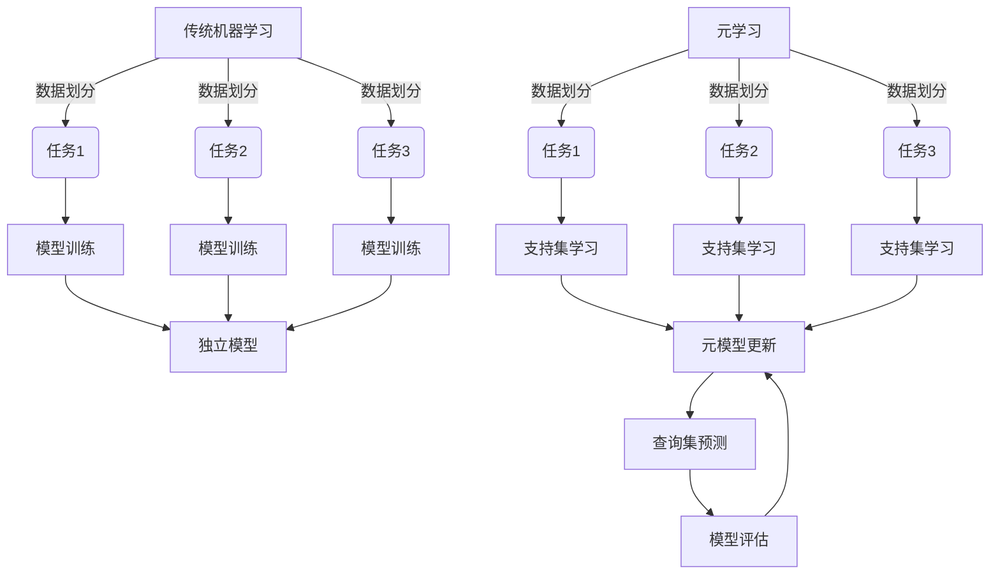
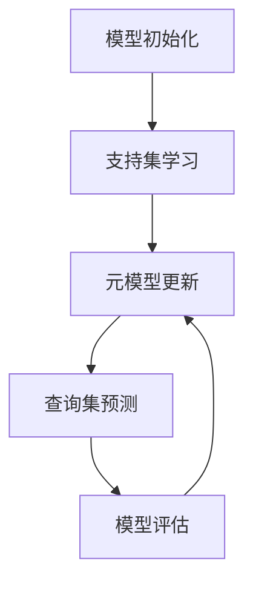

好的,我会按照要求以专业的技术语言撰写这篇题为《一切皆是映射：元学习在医疗图像分析中的突破》的博客文章。

# 一切皆是映射：元学习在医疗图像分析中的突破

## 1. 背景介绍

### 1.1 问题的由来

在医疗保健领域,准确诊断疾病对于患者的治疗至关重要。医疗图像分析作为一种无创检测技术,已广泛应用于疾病诊断、治疗规划和疗效评估等方面。然而,由于医疗图像数据的多样性和复杂性,传统的机器学习方法往往需要大量标注数据进行训练,且难以有效地泛化到新的任务和数据上。

### 1.2 研究现状  

为了解决上述问题,元学习(Meta-Learning)作为一种新兴的机器学习范式应运而生。元学习旨在从多个相关任务中学习元知识,从而快速适应新的任务,减少对大量标注数据的依赖。近年来,元学习在计算机视觉、自然语言处理等领域取得了令人瞩目的成就,但在医疗图像分析领域的应用仍处于起步阶段。

### 1.3 研究意义

将元学习引入医疗图像分析具有重要意义:

1. 提高数据利用效率,减少对大量标注数据的依赖
2. 增强模型的泛化能力,快速适应新的医疗任务
3. 促进不同医疗机构之间的知识共享和协作
4. 为个性化医疗提供技术支持

### 1.4 本文结构

本文将全面介绍元学习在医疗图像分析中的应用。首先阐述元学习的核心概念和与传统机器学习的联系。接着深入探讨元学习在医疗图像分析中的核心算法原理、数学模型及公式推导。然后通过实际案例分析和代码实现,展示元学习在医疗图像分割、疾病检测等任务中的应用。最后总结元学习在医疗领域的发展趋势和面临的挑战。

## 2. 核心概念与联系

元学习(Meta-Learning)是一种将学习过程作为研究对象的学习范式。与传统机器学习专注于单一任务不同,元学习旨在从多个相关任务中提取出通用的知识,并将这些知识迁移到新的任务上,从而加快新任务的学习过程。

元学习可以看作是一种"学习如何学习"的过程,其核心思想是利用先验知识和经验,指导模型在新环境中快速习得新技能。这种思路与人类学习认知过程非常相似,人类往往能够基于已有知识,快速掌握新的概念和技能。

传统机器学习方法通常将所有数据视为独立同分布的样本,并在整个数据集上进行统一的模型训练。而元学习则将数据划分为多个任务(Task),每个任务包含支持集(Support Set)和查询集(Query Set)。模型首先在支持集上进行学习,获取任务相关的知识,然后将这些知识迁移到查询集上,对新的数据进行预测。通过在多个任务上的迭代训练,模型可以逐步提取出通用的知识表示,并将其应用于新的任务中。

元学习与传统机器学习的关系可以用下图来形象地表示:

可以看出,传统机器学习方法将数据划分为不同的任务,然后在每个任务上独立训练模型,得到多个独立的模型。而元学习则将多个任务的支持集用于元模型的学习和更新,然后将更新后的元模型应用于每个任务的查询集进行预测,实现了知识在不同任务间的迁移。

## 3. 核心算法原理 & 具体操作步骤

### 3.1 算法原理概述

元学习在医疗图像分析中的核心算法主要包括模型初始化、支持集学习、元模型更新和查询集预测四个阶段,如下图所示:

1. **模型初始化**: 首先初始化一个基于深度神经网络的元模型,作为后续学习和更新的基础。

2. **支持集学习**: 对于每个任务,从支持集中采样一批数据,通过梯度下降等优化算法在支持集上对元模型进行学习,获得针对该任务的模型参数。

3. **元模型更新**: 将不同任务学习到的模型参数进行聚合,根据元模型的目标函数(如准确率、损失等)更新元模型的参数。

4. **查询集预测**: 使用更新后的元模型在每个任务的查询集上进行预测,得到最终的预测结果。

5. **模型评估**: 根据查询集上的预测结果计算评估指标(如准确率、F1分数等),并将评估结果反馈到元模型,指导后续的模型更新。

上述过程在多个任务上不断迭代,使元模型逐步学习到可迁移的知识表示,从而提高在新任务上的预测性能。

### 3.2 算法步骤详解

下面将详细介绍元学习在医疗图像分析中的具体算法步骤:

1. **任务构建**

   将医疗图像数据划分为多个任务,每个任务包含支持集和查询集两部分。支持集用于模型的学习,查询集用于模型的评估和预测。

   对于分类任务,支持集包含少量带标签的图像样本,查询集包含无标签的图像样本。对于分割任务,支持集包含少量带像素级标注的图像,查询集包含无标注的图像。

2. **模型初始化**

   初始化一个基于深度神经网络的元模型,通常采用卷积神经网络(CNN)或其变体。元模型的网络结构需要根据具体任务进行设计,例如分类任务可以使用分类头,分割任务可以使用解码器等。

3. **支持集学习**

   对于每个任务,从支持集中采样一批数据,通过梯度下降等优化算法对元模型在该支持集上进行学习,获得针对该任务的模型参数 $\theta_i$:

   $$\theta_i = \theta - \alpha \nabla_\theta \mathcal{L}_\mathcal{D_i}(f_\theta)$$

   其中 $\theta$ 为元模型的初始参数, $\alpha$ 为学习率, $\mathcal{L}_\mathcal{D_i}$ 为任务 $i$ 的损失函数, $f_\theta$ 为以 $\theta$ 为参数的元模型。

4. **元模型更新**

   将所有任务学习到的模型参数 $\{\theta_i\}$ 进行聚合,根据元模型的目标函数 $\mathcal{L}_\text{meta}$ 更新元模型参数 $\theta$:

   $$\theta \leftarrow \theta - \beta \nabla_\theta \sum_{i} \mathcal{L}_\text{meta}(f_{\theta_i})$$

   其中 $\beta$ 为元学习率, $\mathcal{L}_\text{meta}$ 为元模型的目标函数,通常采用查询集上的损失或其他评估指标。

5. **查询集预测**

   使用更新后的元模型参数 $\theta$ 在每个任务的查询集上进行预测,得到最终的预测结果 $\hat{y}_i$:

   $$\hat{y}_i = f_\theta(\mathcal{D}_i^\text{query})$$

6. **模型评估**

   根据查询集上的预测结果 $\{\hat{y}_i\}$ 计算评估指标,如准确率、F1分数、IoU(交并比)等,并将评估结果反馈到元模型,指导后续的模型更新。

7. **迭代训练**

   重复上述步骤,在多个任务上不断迭代训练,使元模型逐步学习到可迁移的知识表示,提高在新任务上的预测性能。

需要注意的是,上述算法步骤是一种通用的元学习框架,不同的元学习算法可能在具体实现上有所差异,如优化目标函数的设计、参数更新策略等。

### 3.3 算法优缺点

**优点**:

1. **数据效率高**:元学习能够从少量标注数据中学习到可迁移的知识表示,减少了对大量标注数据的依赖,提高了数据利用效率。
2. **泛化能力强**:通过在多个相关任务上的学习,元学习可以提取出通用的知识表示,从而增强了模型在新任务上的泛化能力。
3. **知识共享**:元学习为不同医疗机构之间的知识共享和协作提供了技术支持,有助于促进医疗资源的优化配置。
4. **个性化医疗**:元学习可以根据患者的个体特征快速适应新的诊断任务,为个性化医疗提供技术支持。

**缺点**:

1. **任务相关性**:元学习的性能在很大程度上依赖于训练任务与目标任务之间的相关性。如果训练任务与目标任务差异较大,元学习的效果可能会受到影响。
2. **计算复杂度**:元学习需要在多个任务上进行迭代训练,计算复杂度较高,对硬件资源要求较高。
3. **超参数敏感**:元学习算法涉及多个超参数,如学习率、元学习率等,对超参数的选择较为敏感,需要进行大量的调参工作。
4. **理论缺失**:元学习的理论基础仍然薄弱,缺乏统一的理论框架,导致算法设计和性能分析存在一定的困难。

### 3.4 算法应用领域

元学习在医疗图像分析领域有广泛的应用前景,主要包括以下几个方面:

1. **医疗图像分类**:通过元学习,可以从有限的标注图像中学习到可迁移的特征表示,快速适应新的疾病分类任务,提高分类精度。
2. **医疗图像分割**:元学习能够从少量标注数据中学习到可迁移的分割模型,快速适应新的器官或病灶分割任务,减少了手动标注的工作量。
3. **异常检测**:利用元学习从正常图像中学习到健康模式,然后将其应用于新的图像数据,检测异常病灶或疾病迹象。
4. **多模态融合**:将不同模态的医疗图像(如CT、MRI、PET等)作为不同的任务,通过元学习实现多模态信息的融合,提高诊断精度。
5. **个性化医疗**:根据患者的个体特征(如年龄、性别、病史等)快速适应新的诊断任务,为个性化医疗提供技术支持。
6. **小数据场景**:在数据量有限的情况下,元学习可以有效地利用少量标注数据,学习到可迁移的知识表示,提高模型的性能。

总的来说,元学习为医疗图像分析领域带来了新的机遇和挑战,有望推动该领域的持续发展和创新。

## 4. 数学模型和公式 & 详细讲解 & 举例说明

### 4.1 数学模型构建

在介绍元学习在医疗图像分析中的具体数学模型之前,我们先formu lize一下元学习的基本问题。

假设我们有一个任务分布 $p(\mathcal{T})$,每个任务 $\mathcal{T}_i \sim p(\mathcal{T})$ 都是从相同的分布中采样得到的。对于每个任务 $\math