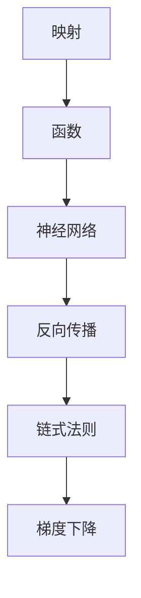

以下是对《一切皆是映射：反向传播算法的数学原理》这个主题的深入探讨和分析。

# 一切皆是映射：反向传播算法的数学原理

## 1. 背景介绍

### 1.1 问题的由来

在深度学习领域中,神经网络已经取得了令人瞩目的成就,但它们是如何工作的呢?反向传播算法是训练神经网络的核心算法,它使网络能够从数据中学习,并对新的输入做出预测。然而,对于许多人来说,反向传播算法的数学原理仍然是一个黑箱操作。

### 1.2 研究现状  

目前,已有大量文献对反向传播算法的原理进行了解释,但大多数解释过于数学化,难以被非数学背景的读者理解。另一方面,一些通俗的解释又过于简单,无法揭示算法的本质。因此,需要一种既深入又通俗的解释方式,帮助读者真正理解这一算法。

### 1.3 研究意义

透彻理解反向传播算法的数学原理,对于以下几个方面具有重要意义:

1. 加深对神经网络内在工作机制的理解
2. 优化神经网络的训练过程
3. 设计新的神经网络架构和训练算法
4. 应用神经网络解决实际问题

### 1.4 本文结构

本文将从映射的角度来解释反向传播算法的数学原理。我们将首先介绍核心概念和联系,然后深入探讨算法的原理、数学模型、代码实现、应用场景等方面。最后,我们将总结算法的发展趋势和面临的挑战。

## 2. 核心概念与联系

反向传播算法的核心思想可以归结为一个词:"映射"。在这个过程中,涉及了以下几个关键概念:

1. **映射(Map)**: 将一个集合中的元素关联到另一个集合中的元素。在神经网络中,我们将输入映射到输出。

2. **函数(Function)**: 一种特殊的映射,它将输入映射到唯一的输出。神经网络中的每一层都是一个函数,将前一层的输出作为输入。

3. **神经网络(Neural Network)**: 由多个函数组成的复合函数,用于近似任意复杂的映射关系。

4. **反向传播(Backpropagation)**: 一种计算每个函数(网络层)对最终输出的影响的算法,用于训练神经网络。

5. **链式法则(Chain Rule)**: 微积分中的一条基本法则,用于计算复合函数的导数。反向传播算法利用了这条法则。

6. **梯度下降(Gradient Descent)**: 一种优化算法,通过沿着梯度的反方向移动,最小化一个函数。在神经网络中,它用于最小化损失函数。

## 3. 核心算法原理 & 具体操作步骤  

### 3.1 算法原理概述

反向传播算法的核心思想是:通过计算网络输出对每个权重的梯度,并沿着梯度的反方向调整权重,从而最小化损失函数。这个过程可以分为两个阶段:

1. **前向传播(Forward Propagation)**: 输入数据在神经网络中前向传播,计算出最终的输出。

2. **反向传播(Backpropagation)**: 计算输出对每个权重的梯度,并沿着梯度的反方向调整权重。

### 3.2 算法步骤详解

1. **前向传播阶段**:
   - 输入数据 $x$ 通过网络的第一层,得到第一层的输出 $h_1 = f_1(x)$。
   - 第一层的输出作为第二层的输入,得到第二层的输出 $h_2 = f_2(h_1)$。
   - 重复这个过程,直到得到最终的输出 $y = f_n(h_{n-1})$。

2. **计算损失函数**:
   - 将网络的输出 $y$ 与期望输出 $\hat{y}$ 进行比较,计算损失函数 $L(y, \hat{y})$。

3. **反向传播阶段**:
   - 计算输出层对权重的梯度 $\frac{\partial L}{\partial w_n}$。
   - 利用链式法则,计算倒数第二层对权重的梯度 $\frac{\partial L}{\partial w_{n-1}}$。
   - 重复这个过程,直到计算出第一层对权重的梯度 $\frac{\partial L}{\partial w_1}$。

4. **调整权重**:
   - 利用梯度下降算法,沿着梯度的反方向调整每一层的权重:
     $$w_i \leftarrow w_i - \eta \frac{\partial L}{\partial w_i}$$
     其中 $\eta$ 是学习率,控制调整的步长。

5. **重复训练**:
   - 重复上述过程,直到损失函数收敛或达到停止条件。

### 3.3 算法优缺点

**优点**:

- 能够有效地训练神经网络,使其学习复杂的映射关系。
- 通过梯度下降优化,可以最小化损失函数。
- 适用于各种类型的神经网络和任务。

**缺点**:

- 计算量大,尤其是对于深层网络和大型数据集。
- 容易陷入局部最小值,无法找到全局最优解。
- 需要仔细调整超参数(如学习率),以确保收敛。

### 3.4 算法应用领域

反向传播算法广泛应用于以下领域:

- 计算机视觉: 图像分类、目标检测、语义分割等。
- 自然语言处理: 机器翻译、文本生成、情感分析等。
- 语音识别: 自动语音识别、语音合成等。
- 推荐系统: 个性化推荐、广告投放等。
- 游戏AI: 下棋AI、游戏策略等。
- 金融: 股票预测、欺诈检测等。

## 4. 数学模型和公式 & 详细讲解 & 举例说明

### 4.1 数学模型构建

为了更好地理解反向传播算法,我们需要建立一个数学模型。假设我们有一个单隐层神经网络,其中:

- 输入层有 $n$ 个神经元,表示为向量 $\mathbf{x} = (x_1, x_2, \ldots, x_n)^T$。
- 隐层有 $m$ 个神经元,表示为向量 $\mathbf{h} = (h_1, h_2, \ldots, h_m)^T$。
- 输出层有 $k$ 个神经元,表示为向量 $\mathbf{y} = (y_1, y_2, \ldots, y_k)^T$。

我们定义以下符号:

- $\mathbf{W}^{(1)}$: 输入层到隐层的权重矩阵,大小为 $m \times n$。
- $\mathbf{b}^{(1)}$: 隐层的偏置向量,大小为 $m \times 1$。
- $\mathbf{W}^{(2)}$: 隐层到输出层的权重矩阵,大小为 $k \times m$。
- $\mathbf{b}^{(2)}$: 输出层的偏置向量,大小为 $k \times 1$。
- $f$: 激活函数,如 ReLU、Sigmoid 等。

则前向传播过程可以表示为:

$$
\begin{aligned}
\mathbf{h} &= f(\mathbf{W}^{(1)}\mathbf{x} + \mathbf{b}^{(1)}) \\
\mathbf{y} &= f(\mathbf{W}^{(2)}\mathbf{h} + \mathbf{b}^{(2)})
\end{aligned}
$$

我们定义损失函数 $L(\mathbf{y}, \hat{\mathbf{y}})$,用于衡量网络输出 $\mathbf{y}$ 与期望输出 $\hat{\mathbf{y}}$ 之间的差异。常用的损失函数包括均方误差、交叉熵等。

### 4.2 公式推导过程

在反向传播阶段,我们需要计算每一层权重对损失函数的梯度。根据链式法则,我们有:

$$
\frac{\partial L}{\partial \mathbf{W}^{(2)}} = \frac{\partial L}{\partial \mathbf{y}} \frac{\partial \mathbf{y}}{\partial \mathbf{W}^{(2)}}
$$

其中:

$$
\frac{\partial \mathbf{y}}{\partial \mathbf{W}^{(2)}} = \text{diag}(f'(\mathbf{W}^{(2)}\mathbf{h} + \mathbf{b}^{(2)}))\mathbf{h}^T
$$

同理,我们可以计算隐层权重的梯度:

$$
\frac{\partial L}{\partial \mathbf{W}^{(1)}} = \frac{\partial L}{\partial \mathbf{h}} \frac{\partial \mathbf{h}}{\partial \mathbf{W}^{(1)}}
$$

其中:

$$
\frac{\partial L}{\partial \mathbf{h}} = (\mathbf{W}^{(2)})^T \frac{\partial L}{\partial \mathbf{y}} \odot f'(\mathbf{W}^{(2)}\mathbf{h} + \mathbf{b}^{(2)})
$$

$$
\frac{\partial \mathbf{h}}{\partial \mathbf{W}^{(1)}} = \text{diag}(f'(\mathbf{W}^{(1)}\mathbf{x} + \mathbf{b}^{(1)}))\mathbf{x}^T
$$

上述公式给出了如何计算每一层权重对损失函数的梯度。在梯度下降过程中,我们沿着梯度的反方向更新权重:

$$
\mathbf{W}^{(2)} \leftarrow \mathbf{W}^{(2)} - \eta \frac{\partial L}{\partial \mathbf{W}^{(2)}}
$$

$$
\mathbf{W}^{(1)} \leftarrow \mathbf{W}^{(1)} - \eta \frac{\partial L}{\partial \mathbf{W}^{(1)}}
$$

其中 $\eta$ 是学习率,控制更新的步长。

### 4.3 案例分析与讲解

为了更好地理解反向传播算法,我们来看一个具体的例子。假设我们有一个二分类问题,输入是一个二维向量 $\mathbf{x} = (x_1, x_2)^T$,期望输出是 0 或 1。我们使用一个单隐层神经网络,隐层有 3 个神经元。

1. **前向传播**:

   假设输入为 $\mathbf{x} = (0.5, 1.0)^T$,权重和偏置如下:

   $$
   \mathbf{W}^{(1)} = \begin{pmatrix}
   0.1 & 0.2 \\
   0.3 & 0.4 \\
   0.5 & 0.6
   \end{pmatrix}, \quad
   \mathbf{b}^{(1)} = \begin{pmatrix}
   0.1 \\
   0.2 \\
   0.3
   \end{pmatrix}
   $$

   $$
   \mathbf{W}^{(2)} = \begin{pmatrix}
   0.4 & 0.5 & 0.6
   \end{pmatrix}, \quad
   \mathbf{b}^{(2)} = 0.1
   $$

   我们使用 ReLU 作为激活函数。则隐层输出为:

   $$
   \begin{aligned}
   \mathbf{h} &= \text{ReLU}(\mathbf{W}^{(1)}\mathbf{x} + \mathbf{b}^{(1)}) \\
              &= \text{ReLU}\begin{pmatrix}
              0.1 \times 0.5 + 0.2 \times 1.0 + 0.1 \\
              0.3 \times 0.5 + 0.4 \times 1.0 + 0.2 \\
              0.5 \times 0.5 + 0.6 \times 1.0 + 0.3
              \end{pmatrix} \\
              &= \begin{pmatrix}
              0.4 \\
              0.9 \\
              1.4
              \end{pmatrix}
   \end{