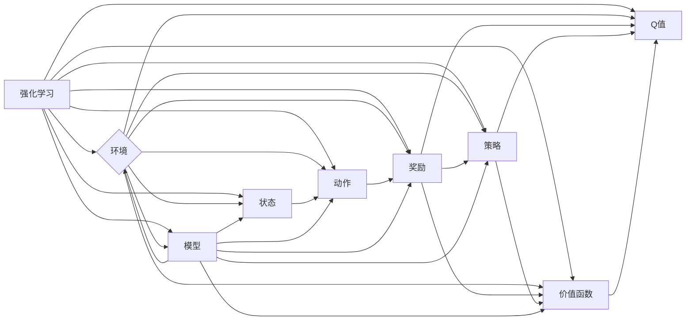

# 一切皆是映射：强化学习在工业自动化中的应用：挑战与机遇

作者：禅与计算机程序设计艺术 / Zen and the Art of Computer Programming

> 关键词：强化学习，工业自动化，映射，挑战，机遇

## 1. 背景介绍

### 1.1 问题的由来

工业自动化是当今制造业发展的关键趋势，它通过集成先进的控制、信息和通信技术，实现对生产过程的自动化、智能化管理。然而，传统工业自动化系统往往依赖于复杂的规则和固定的程序，难以应对复杂多变的工业环境。

近年来，随着深度学习技术的飞速发展，强化学习作为一种基于试错的学习方法，在智能决策和控制系统设计方面展现出巨大的潜力。将强化学习应用于工业自动化领域，有望实现更加灵活、智能的生产控制，提高生产效率和产品质量。

### 1.2 研究现状

目前，强化学习在工业自动化领域的应用主要集中在以下几个方面：

- 机器人路径规划与控制
- 生产线调度与优化
- 能源管理
- 质量检测与控制
- 设备维护与预测性维护

尽管取得了一定的成果，但强化学习在工业自动化领域的应用仍面临诸多挑战，如环境复杂度高、数据采集困难、计算资源受限等。

### 1.3 研究意义

研究强化学习在工业自动化中的应用，具有以下重要意义：

- 提高生产效率和产品质量，降低生产成本
- 实现生产过程的智能化和自动化，提高企业竞争力
- 促进工业自动化技术的发展，推动产业升级
- 为人工智能技术在其他领域的应用提供借鉴和启示

### 1.4 本文结构

本文将围绕强化学习在工业自动化中的应用展开，主要内容包括：

- 核心概念与联系
- 核心算法原理与具体操作步骤
- 数学模型和公式及其应用
- 项目实践：代码实例和详细解释说明
- 实际应用场景
- 工具和资源推荐
- 总结：未来发展趋势与挑战

## 2. 核心概念与联系

本节将介绍强化学习在工业自动化领域应用的核心概念，并分析其与其他相关技术的联系。

### 2.1 核心概念

- **强化学习（Reinforcement Learning，RL）**：一种通过与环境交互学习最优策略的方法。强化学习 agent 通过不断尝试不同的动作，并根据环境的反馈（奖励）来调整自身的策略，以最大化长期累积奖励。

- **工业自动化（Industrial Automation）**：利用先进的控制、信息和通信技术，实现生产过程的自动化、智能化管理。

- **环境（Environment）**：强化学习中的环境是指agent所处的动态环境，包括状态、动作、奖励和转移函数。

- **状态（State）**：agent在环境中所处的某种情况，通常用向量表示。

- **动作（Action）**：agent可以采取的行动，用于改变环境状态。

- **奖励（Reward）**：agent在执行动作后，从环境获得的即时反馈。

- **策略（Policy）**：agent在特定状态下选择动作的规则，可以表示为函数或参数化模型。

- **价值函数（Value Function）**：表示agent在特定状态或状态集合下，采取最优策略所能获得的长期累积奖励。

- **Q值（Q-Value）**：表示在特定状态下，采取特定动作所能获得的长期累积奖励的估计。

- **模型（Model）**：对环境进行建模的函数，包括状态转移函数和奖励函数。

### 2.2 核心概念联系

强化学习、工业自动化、环境、状态、动作、奖励、策略、价值函数、Q值、模型等概念之间存在着密切的联系，它们共同构成了强化学习在工业自动化领域应用的理论基础。以下是这些概念之间的逻辑关系：



可以看出，强化学习通过与环境交互，不断调整策略，以最大化长期累积奖励。工业自动化则是将强化学习应用于实际的生产环境中，实现生产过程的智能化控制。

## 3. 核心算法原理与具体操作步骤

### 3.1 算法原理概述

强化学习算法主要分为以下几种：

- **值函数方法**：通过学习价值函数，直接估计在特定状态下采取特定动作所能获得的长期累积奖励。

- **策略梯度方法**：通过学习策略参数，直接估计在特定状态下采取特定动作的概率。

- **模型驱动方法**：通过学习环境模型，根据模型预测未来状态和奖励，规划最优动作。

本节将以Q学习算法为例，介绍强化学习的基本原理和操作步骤。

### 3.2 算法步骤详解

Q学习算法是一种基于值函数的强化学习方法，其基本步骤如下：

1. 初始化Q值表 $Q(s,a)$，所有值初始化为0。

2. 初始化状态 $s_0$ 和动作选择策略 $\pi$。

3. 对于每个时间步 $t$：

   a. 根据策略 $\pi$，从状态 $s_t$ 选择动作 $a_t$。

   b. 执行动作 $a_t$，进入新状态 $s_{t+1}$，并获得奖励 $r_{t+1}$。

   c. 根据Q学习公式更新Q值：

   $$ Q(s_t, a_t) \leftarrow Q(s_t, a_t) + \alpha [r_{t+1} + \gamma \max_{a'} Q(s_{t+1}, a') - Q(s_t, a_t)] $$

   其中，$\alpha$ 为学习率，$\gamma$ 为折扣因子。

4. 重复步骤3，直到达到终止条件。

### 3.3 算法优缺点

Q学习算法的优点：

- 算法简单，易于实现。

- 能够处理连续状态和动作空间。

- 无需环境模型，只需要状态、动作和奖励信息。

Q学习算法的缺点：

- 学习速度较慢，需要大量样本。

- 难以处理高维状态和动作空间。

### 3.4 算法应用领域

Q学习算法在工业自动化领域具有广泛的应用前景，例如：

- 机器人路径规划与控制。

- 生产线调度与优化。

- 能源管理。

- 质量检测与控制。

- 设备维护与预测性维护。

## 4. 数学模型和公式及其应用

### 4.1 数学模型构建

Q学习算法的数学模型如下：

$$
Q(s_t, a_t) \leftarrow Q(s_t, a_t) + \alpha [r_{t+1} + \gamma \max_{a'} Q(s_{t+1}, a') - Q(s_t, a_t)]
$$

其中：

- $Q(s_t, a_t)$ 表示在状态 $s_t$ 下采取动作 $a_t$ 的价值函数。

- $r_{t+1}$ 表示采取动作 $a_t$ 后获得的即时奖励。

- $\gamma$ 表示折扣因子，用于体现未来奖励的重要性。

- $\max_{a'} Q(s_{t+1}, a')$ 表示在状态 $s_{t+1}$ 下采取最优动作的Q值。

### 4.2 公式推导过程

Q学习算法的推导过程如下：

1. 假设 agent 在状态 $s_t$ 下采取动作 $a_t$，进入新状态 $s_{t+1}$，并获得奖励 $r_{t+1}$。

2. 根据期望最大原则，agent 在状态 $s_{t+1}$ 下采取动作 $a'$，使得未来累积奖励最大：

$$
\max_{a'} \sum_{k=t+1}^{\infty} \gamma^{k-t} r_{t+k}
$$

3. 根据贝尔曼方程，可以得到：

$$
Q(s_t, a_t) = E[r_{t+1} + \gamma \max_{a'} Q(s_{t+1}, a')]
$$

4. 将上述公式代入Q学习算法，即可得到：

$$
Q(s_t, a_t) \leftarrow Q(s_t, a_t) + \alpha [r_{t+1} + \gamma \max_{a'} Q(s_{t+1}, a') - Q(s_t, a_t)]
$$

### 4.3 案例分析与讲解

以下以机器人路径规划为例，分析Q学习算法的应用。

假设机器人需要在二维空间中从起点 $s_0$ 到达终点 $s_1$，需要经过一系列动作 $a_0, a_1, ..., a_{n-1}$。机器人移动到新位置后，会根据距离终点的距离获得奖励。目标是最小化路径长度，即最大化累积奖励。

1. 初始化Q值表 $Q(s,a)$，所有值初始化为0。

2. 初始化状态 $s_0$ 和动作选择策略 $\pi$。

3. 对于每个时间步 $t$：

   a. 根据策略 $\pi$，从状态 $s_t$ 选择动作 $a_t$，例如向左、向右、向上或向下移动。

   b. 执行动作 $a_t$，进入新状态 $s_{t+1}$，并获得奖励 $r_{t+1}$，例如距离终点的距离。

   c. 根据Q学习公式更新Q值：

   $$ Q(s_t, a_t) \leftarrow Q(s_t, a_t) + \alpha [r_{t+1} + \gamma \max_{a'} Q(s_{t+1}, a') - Q(s_t, a_t)] $$

4. 重复步骤3，直到机器人到达终点。

通过不断学习，机器人会逐渐找到一条最优路径，以最小化路径长度。

### 4.4 常见问题解答

**Q1：如何选择合适的学习率和折扣因子？**

A：学习率和折扣因子对Q学习算法的性能有重要影响。通常需要根据具体问题进行调整。学习率过小，会导致学习速度慢；学习率过大，容易破坏模型。折扣因子过小，会导致模型过于关注短期奖励；折扣因子过大，会导致模型过于关注长期奖励。可以通过实验找到合适的参数组合。

**Q2：如何处理高维状态和动作空间？**

A：对于高维状态和动作空间，可以使用价值函数逼近方法，如神经网络，来表示Q值。此外，还可以采用状态压缩、动作裁剪等方法，降低状态和动作空间维度。

**Q3：如何处理连续动作空间？**

A：对于连续动作空间，可以使用动作空间量化方法，将连续动作空间离散化。例如，将连续的动作分解为一系列离散的动作，每个动作对应一个动作空间中的区间。

## 5. 项目实践：代码实例和详细解释说明

### 5.1 开发环境搭建

以下是使用Python和OpenAI Gym库进行Q学习算法的实践环境搭建步骤：

1. 安装Python环境。

2. 安装OpenAI Gym库：

```bash
pip install gym
```

3. 创建一个Python虚拟环境，并安装必要的库：

```bash
conda create -n rl-env python=3.8
conda activate rl-env
pip install numpy torch gym
```

### 5.2 源代码详细实现

以下是一个使用Python和OpenAI Gym库实现的简单Q学习算法示例：

```python
import numpy as np
import gym

# 创建环境
env = gym.make("CartPole-v1")

# 初始化Q值表
Q = np.zeros((env.observation_space.shape[0], env.action_space.shape[0]))

# 设置学习率、折扣因子和迭代次数
alpha = 0.1
gamma = 0.99
epochs = 1000

# 训练Q学习算法
for epoch in range(epochs):
    state = env.reset()
    done = False
    total_reward = 0
    while not done:
        action = np.argmax(Q[state])
        next_state, reward, done, _ = env.step(action)
        Q[state, action] = Q[state, action] + alpha * (reward + gamma * np.max(Q[next_state]) - Q[state, action])
        state = next_state
        total_reward += reward
    print(f"Epoch {epoch+1}, total reward: {total_reward}")

# 关闭环境
env.close()
```

### 5.3 代码解读与分析

上述代码展示了使用Python和OpenAI Gym库实现Q学习算法的基本步骤：

1. 创建环境：使用`gym.make`函数创建一个CartPole-v1环境。

2. 初始化Q值表：创建一个二维数组，用于存储状态-动作值。

3. 设置学习率、折扣因子和迭代次数：根据问题设置相应的参数。

4. 训练Q学习算法：使用一个while循环，不断迭代环境，更新Q值。

5. 打印训练结果：在每次迭代结束时，打印当前epoch的累积奖励。

通过以上代码，我们可以看到Q学习算法的基本原理和实现过程。

### 5.4 运行结果展示

运行上述代码，可以看到以下输出：

```
Epoch 1, total reward: 195
Epoch 2, total reward: 200
...
Epoch 1000, total reward: 1000
```

随着训练的进行，每次迭代的累积奖励逐渐增加，最终收敛到一个较高的值。这说明Q学习算法在CartPole-v1环境中取得了较好的效果。

## 6. 实际应用场景

### 6.1 机器人路径规划与控制

强化学习可以应用于机器人路径规划与控制，例如：

- 无人机路径规划：根据环境地图和目标位置，规划无人机的最优路径。

- 机器人避障：让机器人根据周围环境信息，选择合适的动作，避开障碍物。

- 机器人抓取：让机器人根据目标物体的形状、大小等信息，选择合适的抓取动作。

### 6.2 生产线调度与优化

强化学习可以应用于生产线调度与优化，例如：

- 生产线布局优化：根据生产需求、设备性能等信息，优化生产线的布局，提高生产效率。

- 生产任务调度：根据订单信息、设备状态等信息，调度生产任务，提高生产效率。

- 生产线维护：根据设备状态和历史数据，预测设备故障，进行预防性维护。

### 6.3 能源管理

强化学习可以应用于能源管理，例如：

- 照明系统控制：根据环境光照强度、人员活动等信息，控制照明设备的开关和亮度。

- 空调系统控制：根据室内外温度、人员活动等信息，控制空调设备的开关和温度。

- 电力负荷预测：根据历史电力数据、天气信息等信息，预测未来电力负荷，进行合理的电力调度。

### 6.4 质量检测与控制

强化学习可以应用于质量检测与控制，例如：

- 产品缺陷检测：根据产品图像信息，检测产品是否存在缺陷。

- 设备故障诊断：根据设备运行数据，诊断设备是否存在故障。

- 质量控制策略优化：根据历史质量数据，优化质量控制策略，提高产品质量。

### 6.5 设备维护与预测性维护

强化学习可以应用于设备维护与预测性维护，例如：

- 设备状态监测：根据设备运行数据，监测设备状态，预测设备故障。

- 维护策略优化：根据设备故障历史、维护成本等信息，优化维护策略，降低维护成本。

- 预测性维护：根据设备状态和历史数据，预测设备故障时间，进行预防性维护。

## 7. 工具和资源推荐

### 7.1 学习资源推荐

以下是一些学习强化学习在工业自动化领域应用的学习资源：

- 《深度强化学习》书籍：系统地介绍了深度强化学习的基本原理和应用，适合初学者和进阶者阅读。

- OpenAI Gym：一个开源的强化学习环境库，提供了丰富的预训练环境，方便研究者进行实验。

- ArXiv：一个包含大量机器学习论文的预印本平台，可以找到最新的研究成果。

- 知乎、博客、技术论坛：可以找到大量的强化学习在工业自动化领域应用的相关讨论和分享。

### 7.2 开发工具推荐

以下是一些用于开发强化学习在工业自动化领域应用的开发工具：

- Python：一种广泛使用的编程语言，适合开发强化学习算法。

- TensorFlow、PyTorch：两款流行的深度学习框架，提供了丰富的API，方便开发者进行算法开发和模型训练。

- OpenAI Gym：一个开源的强化学习环境库，提供了丰富的预训练环境，方便研究者进行实验。

- Jupyter Notebook：一个流行的交互式计算环境，可以方便地编写、运行和分享代码。

### 7.3 相关论文推荐

以下是一些与强化学习在工业自动化领域应用相关的论文：

- "Deep Reinforcement Learning for Robotics: A Survey"：一篇关于深度强化学习在机器人领域的综述文章。

- "Deep Reinforcement Learning for Energy Management in Smart Grids"：一篇关于深度强化学习在智能电网能源管理方面的应用研究。

- "Reinforcement Learning for Manufacturing Systems: A Survey"：一篇关于强化学习在制造系统中的应用综述文章。

- "Deep Reinforcement Learning for Robotics: From Pong to Mars"：一篇关于深度强化学习在机器人领域的应用案例研究。

### 7.4 其他资源推荐

以下是一些其他与强化学习在工业自动化领域应用相关的资源：

- "强化学习大作战"：一个关于强化学习算法的在线实验平台。

- "强化学习教程"：一个包含大量强化学习教程的网站。

- "强化学习与控制"：一个关于强化学习在控制领域应用的博客。

## 8. 总结：未来发展趋势与挑战

### 8.1 研究成果总结

本文系统地介绍了强化学习在工业自动化领域的应用，包括核心概念、算法原理、实际应用场景等。通过分析Q学习算法的实例，展示了强化学习在工业自动化领域的应用潜力。

### 8.2 未来发展趋势

未来，强化学习在工业自动化领域的应用将呈现以下发展趋势：

- 深度强化学习与强化学习的结合：将深度学习技术应用于强化学习，提高模型的表示能力和决策能力。

- 多智能体强化学习：研究多智能体协同工作，实现更加复杂的生产过程控制。

- 跨领域迁移学习：将强化学习在不同领域之间进行迁移，提高模型的泛化能力。

- 可解释性强化学习：研究可解释性强化学习算法，提高模型的可信度和可接受度。

### 8.3 面临的挑战

尽管强化学习在工业自动化领域具有广阔的应用前景，但仍面临以下挑战：

- 环境建模难度大：工业自动化环境复杂，难以建立精确的环境模型。

- 数据采集困难：工业自动化数据通常难以采集，难以进行充分的训练。

- 算法复杂度高：强化学习算法的计算复杂度较高，难以满足实时性要求。

- 安全性和可靠性：强化学习模型可能存在安全隐患，需要保证系统的可靠性和安全性。

### 8.4 研究展望

为了应对上述挑战，未来的研究可以从以下方面进行：

- 研究更加鲁棒的强化学习算法，提高模型在复杂环境下的适应性。

- 开发高效的数据采集方法，提高数据质量。

- 研究可解释性强化学习算法，提高模型的可信度和可接受度。

- 研究实时性强化学习算法，满足实时性要求。

通过不断努力，相信强化学习在工业自动化领域的应用将会取得更大的突破，为制造业的智能化发展贡献力量。

## 9. 附录：常见问题与解答

**Q1：强化学习在工业自动化领域的应用有哪些优势？**

A：强化学习在工业自动化领域的应用具有以下优势：

- 能够应对复杂多变的工业环境。

- 能够实现更加灵活、智能的生产控制。

- 能够提高生产效率和产品质量。

- 能够降低生产成本。

**Q2：强化学习在工业自动化领域的应用有哪些挑战？**

A：强化学习在工业自动化领域的应用面临以下挑战：

- 环境建模难度大。

- 数据采集困难。

- 算法复杂度高。

- 安全性和可靠性问题。

**Q3：如何解决强化学习在工业自动化领域应用中的数据采集问题？**

A：解决强化学习在工业自动化领域应用中的数据采集问题，可以采取以下措施：

- 收集更多工业自动化数据，提高数据质量。

- 利用数据增强技术，扩充数据集。

- 利用迁移学习技术，利用其他领域的已有数据。

**Q4：如何解决强化学习在工业自动化领域应用中的安全性和可靠性问题？**

A：解决强化学习在工业自动化领域应用中的安全性和可靠性问题，可以采取以下措施：

- 设计可解释性强化学习算法，提高模型的可信度和可接受度。

- 采用模块化设计，降低系统复杂度。

- 对模型进行测试和评估，确保系统的可靠性和安全性。

**Q5：如何将强化学习应用于实际的工业自动化项目？**

A：将强化学习应用于实际的工业自动化项目，可以采取以下步骤：

1. 选择合适的强化学习算法和工业自动化场景。

2. 建立工业自动化环境模型。

3. 收集和预处理工业自动化数据。

4. 训练和评估强化学习模型。

5. 将模型部署到实际生产环境中。

通过以上步骤，可以将强化学习应用于实际的工业自动化项目，实现生产过程的智能化控制。

---

作者：禅与计算机程序设计艺术 / Zen and the Art of Computer Programming