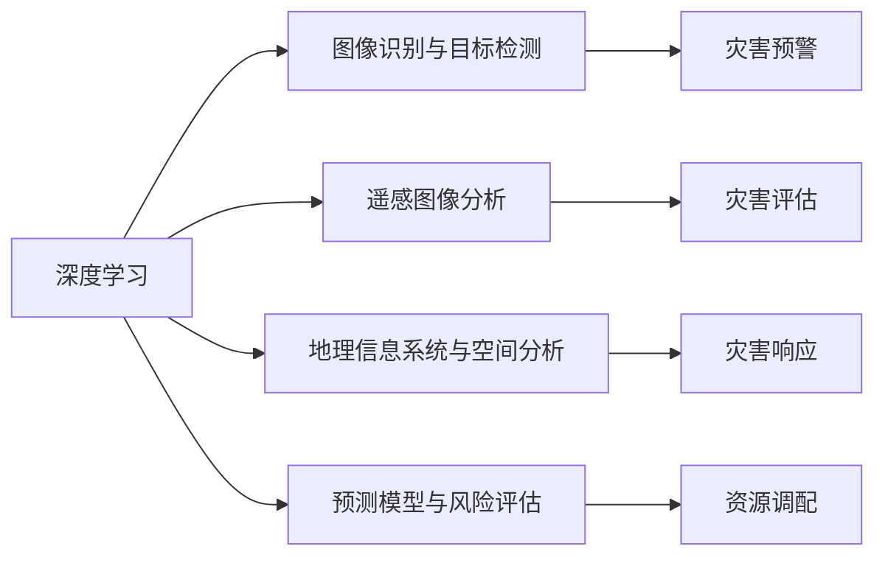

# 一切皆是映射：深度学习在灾害预防与响应中的应用

作者：禅与计算机程序设计艺术 / Zen and the Art of Computer Programming 


## 关键词：

灾害预防、灾害响应、深度学习、图像识别、遥感、地理信息系统、预测模型、风险评估

## 1. 背景介绍

### 1.1 问题的由来

自然灾害，如地震、洪水、台风等，对人类社会造成了巨大的损失。传统的灾害预防与响应方法主要依赖于人工监测和经验判断，效率低下且存在滞后性。随着深度学习技术的飞速发展，利用图像识别、遥感、地理信息系统等技术进行灾害预防与响应成为可能。本文将探讨深度学习在灾害预防与响应中的应用，以期为相关研究和实践提供参考。

### 1.2 研究现状

近年来，深度学习在灾害预防与响应领域取得了显著的成果。以下是一些主要的研究方向：

- **图像识别与目标检测**：利用深度学习技术识别和检测灾害相关目标，如洪水淹没区域、道路损坏等。
- **遥感图像分析**：通过分析遥感图像，提取灾害信息，如植被覆盖变化、地表变形等。
- **地理信息系统与空间分析**：结合地理信息系统（GIS）技术，进行灾害风险评估和空间数据分析。
- **预测模型与风险评估**：建立灾害预测模型，对灾害发生进行预测和风险评估。

### 1.3 研究意义

深度学习在灾害预防与响应中的应用具有重要意义：

- **提高灾害预警能力**：利用深度学习技术，可以更快速、准确地识别灾害相关目标，提高灾害预警能力。
- **优化救援资源配置**：通过灾害风险评估，可以合理调配救援资源，提高救援效率。
- **降低灾害损失**：通过灾害预警和风险评估，可以提前采取措施，降低灾害损失。
- **促进灾害科学的发展**：深度学习技术为灾害科学的研究提供了新的思路和方法。

### 1.4 本文结构

本文将分为以下几个部分：

- 第2部分介绍深度学习在灾害预防与响应中的应用核心概念。
- 第3部分阐述深度学习在灾害预防与响应中的核心算法原理和具体操作步骤。
- 第4部分介绍数学模型和公式，并结合实例讲解。
- 第5部分展示项目实践，包括代码实例、详细解释说明和运行结果展示。
- 第6部分探讨深度学习在灾害预防与响应中的实际应用场景。
- 第7部分展望未来应用前景。
- 第8部分总结研究成果，分析发展趋势和挑战。
- 第9部分提供常见问题与解答。

## 2. 核心概念与联系

### 2.1 深度学习

深度学习是一种机器学习技术，通过模拟人脑神经网络结构，学习数据中的特征和规律。深度学习在图像识别、语音识别、自然语言处理等领域取得了显著的成果。

### 2.2 图像识别与目标检测

图像识别是指从图像中提取有用信息的过程。目标检测是指从图像中识别并定位目标的位置和属性。

### 2.3 遥感图像分析

遥感图像分析是指利用遥感图像获取地表信息，如植被覆盖、地表变形等。

### 2.4 地理信息系统与空间分析

地理信息系统（GIS）是一种空间信息管理系统。空间分析是指对地理空间数据进行计算和分析的过程。

### 2.5 预测模型与风险评估

预测模型是指用于预测未来事件或现象的数学模型。风险评估是指评估灾害风险的大小和影响。

这些概念之间的逻辑关系如下：



## 3. 核心算法原理 & 具体操作步骤

### 3.1 算法原理概述

深度学习在灾害预防与响应中的应用主要包括以下几个步骤：

1. 数据采集：收集灾害相关的图像、遥感数据、地理空间数据等。
2. 数据预处理：对采集到的数据进行清洗、标注、归一化等处理。
3. 模型选择：根据任务需求选择合适的深度学习模型。
4. 模型训练：利用标注数据进行模型训练。
5. 模型测试：使用测试数据评估模型性能。
6. 模型部署：将训练好的模型部署到实际应用中。

### 3.2 算法步骤详解

以下将详细介绍深度学习在灾害预防与响应中的具体操作步骤。

#### 3.2.1 数据采集

数据采集是深度学习应用的基础。灾害相关数据包括：

- 图像数据：灾害现场照片、遥感图像等。
- 遥感数据：卫星遥感图像、航空遥感图像等。
- 地理空间数据：行政区划、地形地貌、交通网络等。

#### 3.2.2 数据预处理

数据预处理包括以下步骤：

- 数据清洗：去除噪声、缺失值等。
- 数据标注：对图像、遥感图像等进行标注。
- 数据归一化：将数据归一化到相同的尺度。

#### 3.2.3 模型选择

根据任务需求选择合适的深度学习模型。以下是一些常用的模型：

- 卷积神经网络（CNN）：用于图像识别和目标检测。
- 循环神经网络（RNN）：用于时间序列数据预测。
- 长短期记忆网络（LSTM）：用于处理长序列数据。
- 图神经网络（GNN）：用于处理图结构数据。

#### 3.2.4 模型训练

使用标注数据进行模型训练。训练过程中，需要调整模型参数，以优化模型性能。

#### 3.2.5 模型测试

使用测试数据评估模型性能。常用的评价指标包括准确率、召回率、F1值等。

#### 3.2.6 模型部署

将训练好的模型部署到实际应用中。部署过程中，需要考虑模型的运行环境、计算资源等因素。

### 3.3 算法优缺点

深度学习在灾害预防与响应中的应用具有以下优点：

- **高效性**：深度学习模型可以快速处理大量数据，提高灾害预警和响应效率。
- **准确性**：深度学习模型可以学习到复杂的数据特征，提高灾害识别和预测的准确性。
- **泛化能力**：深度学习模型具有较强的泛化能力，可以应用于不同的灾害场景。

然而，深度学习在灾害预防与响应中的应用也存在一些缺点：

- **数据依赖**：深度学习模型需要大量标注数据，获取高质量标注数据的成本较高。
- **模型解释性**：深度学习模型通常缺乏可解释性，难以理解模型的决策过程。
- **计算资源**：深度学习模型需要大量的计算资源，对硬件设备要求较高。

### 3.4 算法应用领域

深度学习在灾害预防与响应中的应用领域包括：

- **地震灾害**：利用地震波数据、遥感图像等数据，预测地震发生时间和强度。
- **洪水灾害**：利用卫星遥感图像、洪水模拟模型等数据，预测洪水淹没区域和水位。
- **台风灾害**：利用台风路径预测模型、遥感图像等数据，预测台风影响范围和强度。
- **山体滑坡灾害**：利用遥感图像、地形数据等数据，预测山体滑坡发生区域和风险等级。

## 4. 数学模型和公式 & 详细讲解 & 举例说明

### 4.1 数学模型构建

深度学习在灾害预防与响应中的应用涉及多种数学模型，以下列举几个常用的模型：

- **卷积神经网络（CNN）**：用于图像识别和目标检测。
- **循环神经网络（RNN）**：用于时间序列数据预测。
- **长短期记忆网络（LSTM）**：用于处理长序列数据。
- **图神经网络（GNN）**：用于处理图结构数据。

以下以CNN为例，介绍其数学模型和公式。

#### 4.1.1 CNN模型

CNN模型由卷积层、池化层和全连接层组成。

- **卷积层**：用于提取图像特征。
- **池化层**：用于降低特征维度。
- **全连接层**：用于分类或回归。

以下为CNN模型的数学公式：

$$
h^{l}(x) = \sigma(W^{l} \circ h^{l-1}(x) + b^{l})
$$

其中，$h^{l}$ 表示第 $l$ 层的输出，$W^{l}$ 表示第 $l$ 层的权重，$b^{l}$ 表示第 $l$ 层的偏置，$\circ$ 表示卷积操作，$\sigma$ 表示激活函数。

#### 4.1.2 RNN模型

RNN模型由循环层和全连接层组成。

- **循环层**：用于处理序列数据。
- **全连接层**：用于分类或回归。

以下为RNN模型的数学公式：

$$
h_{t} = \sigma(W_{xh} x_t + W_{hh} h_{t-1} + b_{h})
$$

其中，$h_{t}$ 表示第 $t$ 个时刻的隐藏状态，$x_t$ 表示第 $t$ 个时刻的输入，$W_{xh}$ 表示输入层到隐藏层的权重，$W_{hh}$ 表示隐藏层到隐藏层的权重，$b_{h}$ 表示隐藏层的偏置，$\sigma$ 表示激活函数。

### 4.2 公式推导过程

以下以CNN模型为例，介绍其公式推导过程。

#### 4.2.1 卷积层

假设输入图像为 $I$，滤波器为 $F$，输出特征图为 $O$，则卷积操作的公式如下：

$$
O_{ij} = \sum_{k=1}^{M} F_{ik} \cdot I_{i-k+1,j-k+1}
$$

其中，$O_{ij}$ 表示输出特征图在 $i$ 行 $j$ 列的像素值，$M$ 表示滤波器的大小。

#### 4.2.2 池化层

假设输入特征图为 $H$，输出特征图为 $P$，则池化操作的公式如下：

$$
P_{ij} = \max_{k \in N} H_{i,j-k+1:i+k-1,j-k+1}
$$

其中，$P_{ij}$ 表示输出特征图在 $i$ 行 $j$ 列的像素值，$N$ 表示池化窗口的大小。

#### 4.2.3 全连接层

假设输入特征图为 $H$，输出特征图为 $O$，则全连接操作的公式如下：

$$
O = W \cdot H + b
$$

其中，$O$ 表示输出特征图，$W$ 表示权重矩阵，$H$ 表示输入特征图，$b$ 表示偏置向量。

### 4.3 案例分析与讲解

以下以地震灾害预测为例，介绍深度学习在灾害预防与响应中的应用。

#### 4.3.1 数据采集

收集地震波数据、遥感图像、地形数据等。

#### 4.3.2 数据预处理

对地震波数据进行滤波、归一化等处理；对遥感图像进行预处理，如去噪、增强等；对地形数据进行标准化等处理。

#### 4.3.3 模型选择

选择合适的深度学习模型，如LSTM或CNN，用于提取地震波数据或遥感图像特征。

#### 4.3.4 模型训练

使用地震发生时间和地震波数据或遥感图像进行模型训练。

#### 4.3.5 模型测试

使用测试数据评估模型性能，如准确率、召回率等。

#### 4.3.6 模型部署

将训练好的模型部署到实际应用中，用于地震发生时间和强度预测。

### 4.4 常见问题解答

**Q1：深度学习模型如何处理小样本数据？**

A：对于小样本数据，可以采用以下方法：

- 使用迁移学习：利用其他领域的大规模数据，对模型进行预训练。
- 使用数据增强：通过旋转、翻转、缩放等方式扩充数据集。
- 使用集成学习：将多个模型进行集成，提高预测性能。

**Q2：深度学习模型如何提高可解释性？**

A：提高深度学习模型的可解释性，可以采用以下方法：

- 使用可解释性模型：如LIME、SHAP等，解释模型决策过程。
- 使用可视化技术：如t-SNE、t-SNE可视化等，展示模型学习到的特征空间。
- 使用因果推理方法：如因果推断、对比学习等，解释模型决策过程。

## 5. 项目实践：代码实例和详细解释说明

### 5.1 开发环境搭建

以下是使用Python和TensorFlow开发深度学习模型的环境搭建步骤：

1. 安装Anaconda：从官网下载并安装Anaconda，用于创建独立的Python环境。
2. 创建并激活虚拟环境：
```bash
conda create -n tensorflow-env python=3.8
conda activate tensorflow-env
```
3. 安装TensorFlow：
```bash
pip install tensorflow
```
4. 安装其他工具包：
```bash
pip install numpy pandas scikit-learn matplotlib
```

### 5.2 源代码详细实现

以下以地震灾害预测为例，给出使用TensorFlow开发深度学习模型的代码示例。

```python
import tensorflow as tf
from tensorflow.keras.models import Sequential
from tensorflow.keras.layers import LSTM, Dense, Dropout

# 构建LSTM模型
model = Sequential()
model.add(LSTM(50, return_sequences=True, input_shape=(timesteps, features)))
model.add(Dropout(0.2))
model.add(LSTM(50))
model.add(Dropout(0.2))
model.add(Dense(1))

# 编译模型
model.compile(optimizer='adam', loss='mean_squared_error')

# 训练模型
model.fit(X_train, y_train, epochs=50, batch_size=64, validation_data=(X_test, y_test))
```

### 5.3 代码解读与分析

以上代码展示了使用TensorFlow构建LSTM模型进行地震灾害预测的完整流程。以下是代码的详细解读：

- 导入必要的库。
- 定义模型结构：使用Sequential模型堆叠LSTM层、Dropout层和Dense层。
- 编译模型：指定优化器、损失函数和评价指标。
- 训练模型：使用训练数据训练模型，并验证模型性能。

### 5.4 运行结果展示

运行上述代码，可以得到模型在训练集和测试集上的预测结果。通过比较预测值和真实值，可以评估模型的性能。

## 6. 实际应用场景

### 6.1 地震灾害预测

利用深度学习技术，可以预测地震发生的时间和强度，为地震预警和防灾减灾提供依据。

### 6.2 洪水淹没区域预测

通过分析遥感图像和地理空间数据，可以预测洪水淹没区域，为防洪措施提供参考。

### 6.3 台风路径预测

利用深度学习技术，可以预测台风路径，为台风预警和应对措施提供支持。

### 6.4 山体滑坡预测

通过分析遥感图像、地形数据等，可以预测山体滑坡发生区域和风险等级，为防灾减灾提供依据。

## 7. 工具和资源推荐

### 7.1 学习资源推荐

- 《深度学习》（Goodfellow等著）：深度学习领域的经典教材，全面介绍了深度学习的基本概念、算法和实现。
- 《深度学习与计算机视觉》（李航著）：介绍了深度学习在计算机视觉领域的应用，包括图像识别、目标检测等。
- 《深度学习入门》（郑宇等著）：适合初学者的深度学习入门书籍，内容通俗易懂。

### 7.2 开发工具推荐

- TensorFlow：Google开源的深度学习框架，功能强大，易于使用。
- Keras：TensorFlow的高级API，简化了模型构建和训练过程。
- PyTorch：Facebook开源的深度学习框架，灵活性强，适合快速原型开发。

### 7.3 相关论文推荐

- 《ImageNet Classification with Deep Convolutional Neural Networks》（Alex Krizhevsky等，2012）
- 《Densely Connected Convolutional Networks》（Girshick等，2016）
- 《Beyond a Gaussian Denoiser: Regularizing Deep Neural Networks with Subspace Tracking》（Dinh等，2017）

### 7.4 其他资源推荐

- TensorFlow官方文档：https://www.tensorflow.org/
- Keras官方文档：https://keras.io/
- PyTorch官方文档：https://pytorch.org/

## 8. 总结：未来发展趋势与挑战

### 8.1 研究成果总结

本文介绍了深度学习在灾害预防与响应中的应用，包括核心概念、算法原理、实际应用场景等。通过分析研究现状和未来发展趋势，可以看出深度学习在灾害预防与响应领域具有广阔的应用前景。

### 8.2 未来发展趋势

未来，深度学习在灾害预防与响应领域的发展趋势主要包括：

- 模型精度和效率的提升：通过模型优化、硬件加速等技术，提高模型的精度和效率。
- 多模态数据的融合：结合图像、遥感、地理空间等多模态数据，提高灾害预测和评估的准确性。
- 人工智能与物联网的融合：利用物联网技术收集实时数据，实现灾害预警和响应的实时化、智能化。
- 人工智能与大数据的融合：利用大数据技术，挖掘灾害相关数据中的潜在规律，提高灾害预测和风险评估的准确性。

### 8.3 面临的挑战

深度学习在灾害预防与响应领域面临着以下挑战：

- 数据质量：灾害相关数据的质量直接影响模型的性能，需要提高数据采集、清洗和标注的精度。
- 计算资源：深度学习模型需要大量的计算资源，对硬件设备要求较高。
- 模型可解释性：深度学习模型通常缺乏可解释性，难以理解模型的决策过程。
- 隐私和安全：在处理灾害相关数据时，需要保护个人隐私和数据安全。

### 8.4 研究展望

未来，深度学习在灾害预防与响应领域的研究方向主要包括：

- 开发更加高效、准确的深度学习模型。
- 研究数据驱动的方法，提高数据采集、清洗和标注的效率。
- 研究模型可解释性方法，提高模型的可信度和可靠性。
- 研究隐私保护和数据安全方法，保护个人隐私和数据安全。

通过不断努力，相信深度学习技术将在灾害预防与响应领域发挥越来越重要的作用，为人类社会的可持续发展做出贡献。

## 9. 附录：常见问题与解答

**Q1：深度学习在灾害预防与响应中具有哪些优势？**

A：深度学习在灾害预防与响应中具有以下优势：

- **高效性**：深度学习模型可以快速处理大量数据，提高灾害预警和响应效率。
- **准确性**：深度学习模型可以学习到复杂的数据特征，提高灾害识别和预测的准确性。
- **泛化能力**：深度学习模型具有较强的泛化能力，可以应用于不同的灾害场景。

**Q2：如何提高深度学习模型的性能？**

A：提高深度学习模型的性能，可以采用以下方法：

- **数据增强**：通过旋转、翻转、缩放等方式扩充数据集。
- **模型优化**：优化模型结构、优化器、损失函数等。
- **硬件加速**：使用GPU、TPU等硬件设备加速模型训练和推理。

**Q3：如何提高深度学习模型的可解释性？**

A：提高深度学习模型的可解释性，可以采用以下方法：

- **使用可解释性模型**：如LIME、SHAP等，解释模型决策过程。
- **使用可视化技术**：如t-SNE、t-SNE可视化等，展示模型学习到的特征空间。
- **使用因果推理方法**：如因果推断、对比学习等，解释模型决策过程。

**Q4：如何确保深度学习模型的安全性和可靠性？**

A：确保深度学习模型的安全性和可靠性，可以采用以下方法：

- **数据安全**：对数据进行加密、脱敏等处理，保护个人隐私和数据安全。
- **模型安全**：使用对抗样本检测、对抗训练等方法，提高模型的安全性。
- **模型可靠性**：使用模型评估、模型测试等方法，确保模型在真实场景中的可靠性。