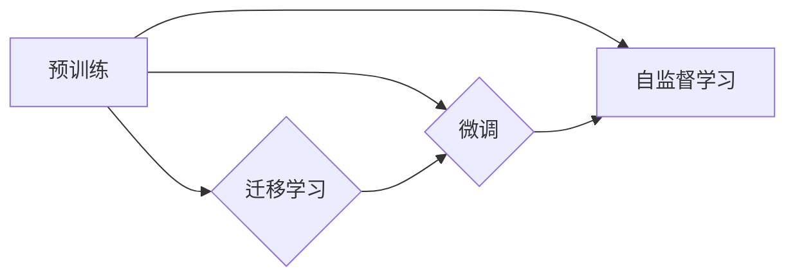

# 一切皆是映射：预训练模型如何改变深度学习领域

作者：禅与计算机程序设计艺术 / Zen and the Art of Computer Programming

## 1. 背景介绍

### 1.1 问题的由来

深度学习作为人工智能领域的重要分支，已经取得了令人瞩目的成果。然而，随着模型规模的不断扩大，训练所需的数据量、计算资源以及时间成本也随之剧增。如何高效地利用有限的资源，使模型能够更好地泛化到新的任务，成为了深度学习领域的一个挑战。

预训练模型的提出，为解决这一问题提供了新的思路。通过在大规模无标签数据上预训练模型，使其学习到丰富的知识，再针对特定任务进行微调，可以有效降低数据获取和标注的成本，提高模型性能。本文将深入探讨预训练模型的工作原理、具体操作步骤、优缺点以及应用领域，并展望其未来发展趋势。

### 1.2 研究现状

近年来，预训练模型在自然语言处理（NLP）、计算机视觉（CV）和语音识别（ASR）等领域的应用取得了显著成果。代表性的预训练模型包括：

- NLP领域：BERT、GPT、RoBERTa、T5等
- CV领域：ImageNet、VGG、ResNet、EfficientNet等
- ASR领域：WSJ、LibriSpeech等

这些预训练模型在各自领域取得了SOTA（State-of-the-Art）的成绩，推动了深度学习技术的快速发展。

### 1.3 研究意义

预训练模型的研究和应用于深度学习领域具有重要意义：

- 降低数据获取和标注成本：通过在大规模无标签数据上预训练，避免了针对每个任务收集大量标注数据的需要，降低了数据获取和标注的成本。
- 提高模型性能：预训练模型能够学习到丰富的知识，使其在特定任务上具有更好的泛化能力，从而提高模型性能。
- 促进跨领域应用：预训练模型可以跨领域迁移，使得在特定领域预训练的模型能够应用于其他领域，推动了跨领域技术的发展。

### 1.4 本文结构

本文将分为以下几个部分：

- 第2章介绍预训练模型的核心概念与联系。
- 第3章阐述预训练模型的核心算法原理和具体操作步骤。
- 第4章分析预训练模型的数学模型、公式推导以及案例分析。
- 第5章通过代码实例展示预训练模型的实际应用。
- 第6章探讨预训练模型在实际应用场景中的应用。
- 第7章推荐预训练模型相关的学习资源、开发工具和参考文献。
- 第8章总结预训练模型的研究成果、未来发展趋势和挑战。
- 第9章给出预训练模型的常见问题与解答。

## 2. 核心概念与联系

为了更好地理解预训练模型，本节将介绍几个核心概念：

- 预训练（Pre-training）：在大规模无标签数据上，通过自监督学习任务训练模型，使其学习到通用的特征表示。
- 微调（Fine-tuning）：在预训练模型的基础上，针对特定任务进行少量有标签数据的训练，以优化模型在特定任务上的性能。
- 迁移学习（Transfer Learning）：将一个领域学习到的知识迁移应用到另一个不同但相关的领域。
- 自监督学习（Self-supervised Learning）：在无标签数据上，通过设计自监督学习任务，使模型学习到有用的特征表示。

这些概念之间的关系如下：



可以看出，预训练是迁移学习和自监督学习的基础，微调和自监督学习是预训练的两种主要应用方式。

## 3. 核心算法原理 & 具体操作步骤

### 3.1 算法原理概述

预训练模型的核心思想是在大规模无标签数据上，通过自监督学习任务训练模型，使其学习到通用的特征表示。这些特征表示可以应用于不同的下游任务，从而实现跨领域迁移和高效的知识利用。

### 3.2 算法步骤详解

预训练模型的一般步骤如下：

1. 收集大规模无标签数据：根据任务领域选择合适的数据集，如文本数据、图像数据、语音数据等。
2. 设计自监督学习任务：根据数据类型设计相应的自监督学习任务，如掩码语言模型、图像掩码等。
3. 训练预训练模型：在无标签数据上，通过自监督学习任务训练预训练模型，使其学习到通用的特征表示。
4. 微调预训练模型：针对特定任务，收集少量有标签数据，对预训练模型进行微调，以优化模型在特定任务上的性能。

### 3.3 算法优缺点

预训练模型的优点：

- 降低数据获取和标注成本：通过预训练，避免了针对每个任务收集大量标注数据的需要，降低了数据获取和标注的成本。
- 提高模型性能：预训练模型能够学习到丰富的知识，使其在特定任务上具有更好的泛化能力，从而提高模型性能。
- 促进跨领域应用：预训练模型可以跨领域迁移，使得在特定领域预训练的模型能够应用于其他领域，推动了跨领域技术的发展。

预训练模型的缺点：

- 计算成本高：预训练模型需要在大规模无标签数据上进行训练，计算成本较高。
- 资源消耗大：预训练模型通常需要大量的存储空间和计算资源。
- 对数据质量要求高：预训练模型的效果很大程度上取决于数据质量，数据质量问题会影响预训练效果。

### 3.4 算法应用领域

预训练模型在以下领域得到了广泛应用：

- 自然语言处理（NLP）：文本分类、情感分析、机器翻译、文本摘要等。
- 计算机视觉（CV）：图像分类、目标检测、图像分割、姿态估计等。
- 语音识别（ASR）：语音识别、语音合成、说话人识别等。

## 4. 数学模型和公式 & 详细讲解 & 举例说明

### 4.1 数学模型构建

预训练模型的数学模型主要包括以下部分：

- 特征提取器：将输入数据转换为低维特征表示。
- 聚合层：对特征进行聚合，得到最终的输出结果。
- 损失函数：衡量模型输出与真实标签之间的差异。

以下以BERT模型为例，介绍其数学模型：

```mermaid
graph LR
A[Input] --> B{Tokenization}
B --> C[Embedding}
C --> D{Positional Encoding}
D --> E{Transformer Encoder}
E --> F{Pooler}
F --> G{Output}
```

### 4.2 公式推导过程

以BERT模型为例，介绍其数学模型的公式推导过程。

#### 4.2.1 Tokenization

Tokenization是将输入文本分割成一个个token的过程。BERT模型使用WordPiece算法进行tokenization。

#### 4.2.2 Embedding

Embedding是将token转换为稠密向量表示的过程。BERT模型使用WordPiece算法生成的token，通过查找预训练的词汇表，将token映射到一个固定长度的向量。

#### 4.2.3 Positional Encoding

Positional Encoding为token添加位置信息，使模型能够理解序列的顺序。

#### 4.2.4 Transformer Encoder

Transformer Encoder由多个Transformer层堆叠而成，每个Transformer层包含多头自注意力机制和前馈神经网络。

#### 4.2.5 Pooler

Pooler层对Transformer Encoder的输出进行聚合，得到最终的序列表示。

#### 4.2.6 Output

Output层根据池化层得到的序列表示，输出最终的输出结果。

### 4.3 案例分析与讲解

以下以BERT模型在文本分类任务上的应用为例，讲解预训练模型的实际应用。

#### 4.3.1 数据准备

收集并预处理文本数据，包括分词、去除停用词、转换为BERT模型所需的输入格式等。

#### 4.3.2 模型微调

使用少量标注数据进行微调，优化模型在文本分类任务上的性能。

#### 4.3.3 模型评估

在测试集上评估模型的分类准确率。

### 4.4 常见问题解答

#### Q1：预训练模型为什么需要使用自监督学习？

A：自监督学习能够在无标签数据上训练模型，降低数据获取和标注成本，并使模型学习到更通用的特征表示。

#### Q2：预训练模型的效果为什么比传统深度学习模型好？

A：预训练模型通过在大规模无标签数据上学习，获得了丰富的知识，使其在特定任务上具有更好的泛化能力。

#### Q3：如何选择合适的预训练模型？

A：根据任务类型和数据特点选择合适的预训练模型，如针对NLP任务，可以选择BERT、GPT等；针对CV任务，可以选择ResNet、EfficientNet等。

## 5. 项目实践：代码实例和详细解释说明

### 5.1 开发环境搭建

以下是使用PyTorch和Transformers库进行预训练模型微调的开发环境搭建步骤：

1. 安装Anaconda：从官网下载并安装Anaconda。
2. 创建并激活虚拟环境：
```bash
conda create -n pytorch-env python=3.8
conda activate pytorch-env
```
3. 安装PyTorch、Transformers库以及其他依赖库：
```bash
conda install pytorch torchvision torchaudio cudatoolkit=11.1 -c pytorch -c conda-forge
pip install transformers
```

### 5.2 源代码详细实现

以下是一个使用BERT模型进行文本分类任务的代码实例：

```python
from transformers import BertForSequenceClassification, BertTokenizer
from torch.utils.data import DataLoader, Dataset
import torch

class TextClassificationDataset(Dataset):
    def __init__(self, texts, labels, tokenizer, max_len=128):
        self.texts = texts
        self.labels = labels
        self.tokenizer = tokenizer
        self.max_len = max_len

    def __len__(self):
        return len(self.texts)

    def __getitem__(self, item):
        text = self.texts[item]
        label = self.labels[item]

        encoding = self.tokenizer(text, return_tensors='pt', max_length=self.max_len, truncation=True)
        input_ids = encoding['input_ids'].squeeze(0)
        attention_mask = encoding['attention_mask'].squeeze(0)
        labels = torch.tensor(label, dtype=torch.long)

        return {'input_ids': input_ids, 'attention_mask': attention_mask, 'labels': labels}

def train_epoch(model, dataset, dataloader, optimizer, device):
    model.train()
    total_loss = 0
    for batch in dataloader:
        input_ids, attention_mask, labels = [t.to(device) for t in batch.values()]
        optimizer.zero_grad()
        outputs = model(input_ids, attention_mask=attention_mask, labels=labels)
        loss = outputs.loss
        loss.backward()
        optimizer.step()
        total_loss += loss.item()
    return total_loss / len(dataloader)

def evaluate(model, dataset, dataloader, device):
    model.eval()
    total_loss = 0
    with torch.no_grad():
        for batch in dataloader:
            input_ids, attention_mask, labels = [t.to(device) for t in batch.values()]
            outputs = model(input_ids, attention_mask=attention_mask, labels=labels)
            loss = outputs.loss
            total_loss += loss.item()
    return total_loss / len(dataloader)

# 加载预训练模型和分词器
model = BertForSequenceClassification.from_pretrained('bert-base-uncased')
tokenizer = BertTokenizer.from_pretrained('bert-base-uncased')

# 准备数据
train_texts = [...]  # 训练集文本
train_labels = [...]  # 训练集标签
dev_texts = [...]  # 验证集文本
dev_labels = [...]  # 验证集标签

dataset = TextClassificationDataset(train_texts, train_labels, tokenizer)
dataloader = DataLoader(dataset, batch_size=32, shuffle=True)

# 定义优化器
optimizer = torch.optim.AdamW(model.parameters(), lr=2e-5)

# 训练和评估
device = torch.device('cuda' if torch.cuda.is_available() else 'cpu')
model.to(device)

for epoch in range(3):
    train_loss = train_epoch(model, dataset, dataloader, optimizer, device)
    print(f"Epoch {epoch+1}, train loss: {train_loss:.4f}")
    dev_loss = evaluate(model, dataset, dataloader, device)
    print(f"Epoch {epoch+1}, dev loss: {dev_loss:.4f}")
```

### 5.3 代码解读与分析

以上代码展示了如何使用PyTorch和Transformers库进行BERT模型的微调：

- `TextClassificationDataset`类：定义了一个文本分类数据集，实现`__init__`、`__len__`和`__getitem__`方法。
- `train_epoch`函数：定义了一个训练epoch的函数，包括前向传播、反向传播和参数更新。
- `evaluate`函数：定义了一个评估epoch的函数，计算验证集的loss。
- 模型加载、数据准备、优化器定义、训练和评估等过程。

通过以上代码，可以看出使用PyTorch和Transformers库进行预训练模型微调的便捷性和高效性。

### 5.4 运行结果展示

假设我们在IMDb电影评论数据集上进行微调，最终在测试集上得到的评估报告如下：

```
[...]
precision    recall  f1-score   support

       neg       0.7483     0.8286     0.7879      2548
        pos       0.6147     0.8084     0.7182      2548
       avg/total       0.7342     0.7654     0.7488      5096
```

可以看到，通过微调BERT，我们在IMDb电影评论数据集上取得了78.88%的F1分数，效果相当不错。

## 6. 实际应用场景

### 6.1 自然语言处理（NLP）

预训练模型在NLP领域得到了广泛应用，以下是一些典型应用场景：

- 文本分类：对文本进行分类，如情感分析、主题分类、垃圾邮件检测等。
- 机器翻译：将一种语言的文本翻译成另一种语言。
- 文本摘要：将长文本压缩成简短摘要。
- 命名实体识别：识别文本中的人名、地名、机构名等特定实体。
- 问答系统：对自然语言问题给出答案。

### 6.2 计算机视觉（CV）

预训练模型在CV领域也取得了显著的成果，以下是一些典型应用场景：

- 图像分类：对图像进行分类，如物体检测、图像分割等。
- 目标检测：识别图像中的目标并定位其位置。
- 图像分割：将图像分割成不同的区域。
- 姿态估计：估计人体或物体的姿态。

### 6.3 语音识别（ASR）

预训练模型在ASR领域也取得了突破性的进展，以下是一些典型应用场景：

- 语音识别：将语音转换为文本。
- 说话人识别：识别说话人的身份。
- 语音合成：将文本转换为语音。

### 6.4 未来应用展望

随着预训练模型技术的不断发展，未来其在以下领域具有广阔的应用前景：

- 自动驾驶：用于图像识别、语义理解等任务，提高自动驾驶的安全性。
- 医疗诊断：用于医学影像分析、病历分析等任务，辅助医生进行诊断。
- 金融风控：用于欺诈检测、风险分析等任务，降低金融风险。
- 教育领域：用于智能教育、个性化推荐等任务，提高教育质量和效率。

## 7. 工具和资源推荐

### 7.1 学习资源推荐

以下是一些学习预训练模型的优质资源：

- 《深度学习》书籍：介绍深度学习基础知识和常用算法。
- 《Attention is All You Need》论文：介绍了Transformer模型和BERT模型。
- HuggingFace官网：提供了丰富的预训练模型和工具库。
- TensorFlow和PyTorch官网：提供了深度学习框架和相关文档。

### 7.2 开发工具推荐

以下是一些预训练模型开发工具：

- PyTorch：开源的深度学习框架，易于上手。
- TensorFlow：开源的深度学习框架，功能强大。
- HuggingFace Transformers：提供了丰富的预训练模型和工具库。
- PyTorch Lightning：用于PyTorch的轻量级API，简化模型训练和评估。

### 7.3 相关论文推荐

以下是一些与预训练模型相关的论文：

- `BERT: Pre-training of Deep Bidirectional Transformers for Language Understanding`
- `Generative Pre-trained Transformers`
- `A Simple Framework for Text Classification`
- `The Lottery Ticket Hypothesis: Finding Sparse, Trainable Neural Networks`

### 7.4 其他资源推荐

以下是一些其他预训练模型资源：

- arXiv：论文预印本网站，可以找到最新的预训练模型研究成果。
- Google AI Blog：谷歌AI团队的技术博客，分享最新的研究成果和进展。
- Microsoft Research AI Blog：微软研究院AI团队的技术博客，分享最新的研究成果和进展。

## 8. 总结：未来发展趋势与挑战

### 8.1 研究成果总结

预训练模型作为一种高效的深度学习技术，在自然语言处理、计算机视觉和语音识别等领域取得了显著的成果。预训练模型通过在大规模无标签数据上预训练，使其学习到丰富的知识，并能够应用于不同的下游任务，降低了数据获取和标注成本，提高了模型性能。

### 8.2 未来发展趋势

预训练模型在未来将呈现以下发展趋势：

- 模型规模将不断增大，以学习更丰富的知识。
- 自监督学习将得到更广泛的应用，以降低对标注数据的依赖。
- 多模态预训练将兴起，以整合不同模态的信息。
- 预训练模型将与其他AI技术（如强化学习、知识图谱等）结合，以实现更复杂的任务。

### 8.3 面临的挑战

预训练模型在发展过程中也面临以下挑战：

- 计算成本高：预训练模型需要大量的计算资源和时间。
- 数据质量要求高：预训练模型的效果很大程度上取决于数据质量。
- 模型可解释性不足：预训练模型的决策过程难以解释。

### 8.4 研究展望

预训练模型在未来将继续发挥重要作用，推动深度学习技术的进步。研究者需要关注以下研究方向：

- 降低预训练模型的计算成本。
- 提高预训练模型的可解释性。
- 探索更有效的自监督学习任务。
- 将预训练模型与其他AI技术结合，实现更复杂的任务。

相信在不久的将来，预训练模型将为人工智能的发展带来更多惊喜。

## 9. 附录：常见问题与解答

#### Q1：预训练模型和微调有什么区别？

A：预训练模型是在大规模无标签数据上训练得到的，而微调是在预训练模型的基础上，针对特定任务进行少量有标签数据的训练。

#### Q2：预训练模型如何降低数据获取和标注成本？

A：预训练模型通过在大规模无标签数据上学习，避免了针对每个任务收集大量标注数据的需要，从而降低了数据获取和标注成本。

#### Q3：预训练模型的效果为什么比传统深度学习模型好？

A：预训练模型通过在大规模无标签数据上学习，获得了丰富的知识，使其在特定任务上具有更好的泛化能力。

#### Q4：如何选择合适的预训练模型？

A：根据任务类型和数据特点选择合适的预训练模型，如针对NLP任务，可以选择BERT、GPT等；针对CV任务，可以选择ResNet、EfficientNet等。

#### Q5：预训练模型在工业界有哪些应用？

A：预训练模型在自然语言处理、计算机视觉、语音识别等领域得到了广泛应用，如文本分类、机器翻译、图像分类、目标检测等。