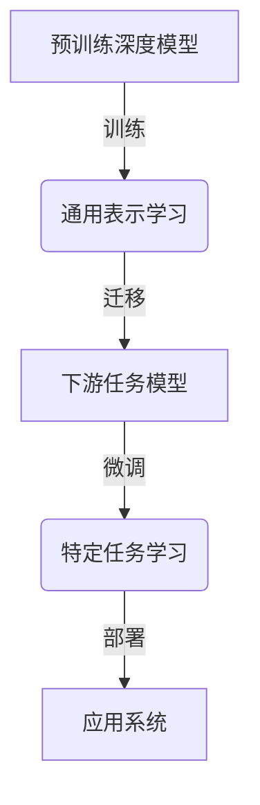

# 一切皆是映射：预训练深度模型与迁移学习

## 1. 背景介绍

### 1.1 问题的由来

在过去的几年中，深度学习在各个领域取得了令人瞩目的成就。从计算机视觉到自然语言处理,再到语音识别和生成式模型,深度神经网络已经成为解决各种复杂任务的首选方法。然而,训练这些深度模型通常需要大量的标注数据和巨大的计算资源,这对于许多应用场景来说是一个巨大的挑战。

为了解决这个问题,研究人员提出了迁移学习(Transfer Learning)的概念。迁移学习的基本思想是:首先在一个大规模的数据集上训练一个通用的深度模型,然后将这个预训练模型(Pre-trained Model)迁移到目标任务上进行微调(Fine-tuning),从而利用预训练模型中学习到的丰富知识来加速目标任务的训练过程。

### 1.2 研究现状

近年来,预训练深度模型和迁移学习在自然语言处理(NLP)、计算机视觉(CV)等领域取得了巨大成功。在NLP领域,BERT、GPT、T5等预训练语言模型极大地提高了下游任务的性能;在CV领域,预训练的卷积神经网络(CNN)和视觉转换器(ViT)也被广泛应用于图像分类、目标检测和语义分割等任务。

然而,现有的预训练模型和迁移学习方法仍然存在一些局限性和挑战:

1. **任务差异性**:不同的任务之间存在着巨大的差异,如何有效地将预训练模型迁移到新的任务上仍然是一个挑战。
2. **数据分布偏移**:预训练数据集和目标任务数据集之间可能存在分布偏移,这会影响迁移学习的效果。
3. **计算资源需求**:微调大型预训练模型通常需要大量的计算资源,这对于一些资源受限的应用场景来说是一个障碍。

### 1.3 研究意义

深入研究预训练深度模型和迁移学习具有重要的理论和实际意义:

1. **理论意义**:探索深度神经网络在不同任务之间知识迁移的机理,有助于我们更好地理解深度学习模型的泛化能力和知识表示方式。
2. **实际意义**:提高迁移学习的效率和性能,可以减少大量的数据标注和计算资源需求,从而推动深度学习在更多领域的应用。

### 1.4 本文结构

本文将全面介绍预训练深度模型和迁移学习的核心概念、算法原理、数学模型、实践案例和应用场景。具体内容安排如下:

- 第2部分介绍预训练深度模型和迁移学习的核心概念及其相互联系。
- 第3部分详细阐述迁移学习算法的原理和具体操作步骤。
- 第4部分构建迁移学习的数学模型,并推导相关公式。
- 第5部分提供一个完整的代码实例,并对关键部分进行解释说明。
- 第6部分探讨迁移学习在不同领域的实际应用场景。
- 第7部分推荐相关的学习资源、开发工具和论文。
- 第8部分总结研究成果,并展望未来的发展趋势和挑战。
- 第9部分列出常见问题并给出解答。

## 2. 核心概念与联系

预训练深度模型(Pre-trained Deep Model)和迁移学习(Transfer Learning)是密切相关的两个核心概念:

1. **预训练深度模型**:指在大规模通用数据集上训练的深度神经网络模型,旨在学习通用的数据表示和特征。常见的预训练模型包括BERT(NLP)、ResNet(CV)等。

2. **迁移学习**:指将预训练模型中学习到的知识迁移到新的下游任务中,通过在目标任务数据上进行微调(Fine-tuning),使模型快速适应新任务。这种方法可以显著减少训练时间和数据需求。

预训练深度模型和迁移学习的关系如下:

1. 首先,在大规模通用数据集上训练一个预训练深度模型,让模型学习通用的数据表示和特征。
2. 然后,将预训练模型作为初始化权重,迁移到目标下游任务中。
3. 在目标任务数据上对预训练模型进行微调,使其适应特定任务的分布和需求。
4. 最终得到一个在目标任务上表现良好的模型,并将其部署到应用系统中。

通过这种方式,预训练模型中学习到的通用知识可以被有效地迁移和利用,从而加速下游任务的训练过程,提高模型的性能和泛化能力。

## 3. 核心算法原理 & 具体操作步骤

### 3.1 算法原理概述

迁移学习算法的核心思想是:利用在源域(Source Domain)上学习到的知识,加速目标域(Target Domain)上的模型训练过程。具体来说,算法分为以下几个关键步骤:

1. **预训练阶段**:在源域的大规模数据集上训练一个深度神经网络模型,获得通用的特征表示和模型参数。
2. **模型迁移**:将预训练模型的部分或全部参数作为初始化权重,迁移到目标任务模型中。
3. **微调阶段**:在目标域的数据集上,对迁移后的模型进行进一步的训练(Fine-tuning),使其适应目标任务的数据分布和需求。
4. **模型评估**:在目标域的测试集上评估微调后模型的性能,根据需要进行参数调整和迭代训练。

通过这种方式,预训练模型中学习到的丰富知识可以被有效地迁移和利用,从而减少目标任务模型的训练时间和数据需求,提高模型的泛化能力。

### 3.2 算法步骤详解

1. **预训练阶段**

   - 选择合适的预训练任务和数据集,如自然语言建模(NLM)、蒙特卡罗树搜索(MCTS)等。
   - 设计和训练一个深度神经网络模型,学习通用的数据表示和特征。
   - 对预训练模型进行评估,确保其在预训练任务上达到足够好的性能。

2. **模型迁移**

   - 确定目标下游任务,分析其与预训练任务的相似性和差异。
   - 根据任务的相似程度,决定是完全迁移预训练模型,还是只迁移部分层(如卷积层或Transformer编码器)。
   - 初始化目标任务模型的参数,使用预训练模型的参数作为初始化值。

3. **微调阶段**

   - 准备目标任务的训练数据集,对数据进行必要的预处理和增强。
   - 设置合适的微调策略,如学习率调度、正则化等,以防止过拟合。
   - 在目标任务数据上对模型进行微调训练,更新模型参数以适应新任务。
   - 根据验证集上的性能,决定是否继续微调或提前停止训练。

4. **模型评估**

   - 在目标任务的测试集上评估微调后模型的性能指标,如准确率、F1分数等。
   - 与从头训练的基线模型进行比较,验证迁移学习的效果。
   - 根据需要,对模型进行进一步的调整和迭代训练。

需要注意的是,不同任务之间的差异会影响迁移学习的效果。如果源域和目标域之间存在较大差异,可能需要进行领域适应(Domain Adaptation)或多任务学习(Multi-Task Learning)等技术,以提高迁移效率。

### 3.3 算法优缺点

**优点**:

1. **减少训练时间和数据需求**:由于利用了预训练模型中学习到的知识,迁移学习可以显著减少目标任务模型的训练时间和数据需求。
2. **提高模型泛化能力**:预训练模型在大规模数据上学习到的通用特征,有助于提高目标任务模型的泛化能力。
3. **知识迁移和共享**:不同任务之间可以共享预训练模型中学习到的知识,实现跨任务的知识迁移。

**缺点**:

1. **任务差异性**:如果源域和目标域之间存在较大差异,直接迁移可能会导致性能下降,需要进行领域适应等技术。
2. **计算资源需求**:微调大型预训练模型通常需要大量的计算资源,这对于一些资源受限的应用场景来说是一个障碍。
3. **模型复杂性**:迁移学习涉及预训练、迁移和微调等多个步骤,增加了模型的复杂性和调参难度。

### 3.4 算法应用领域

迁移学习算法已被广泛应用于多个领域,包括但不限于:

1. **自然语言处理(NLP)**:BERT、GPT等预训练语言模型在文本分类、机器翻译、问答系统等任务上取得了卓越成绩。
2. **计算机视觉(CV)**:预训练的卷积神经网络(CNN)和视觉转换器(ViT)被应用于图像分类、目标检测、语义分割等视觉任务。
3. **语音识别**:预训练的语音模型可以迁移到语音识别、语音合成等任务中。
4. **推荐系统**:通过迁移学习,可以在有限的用户数据上训练个性化推荐模型。
5. **医疗健康**:迁移学习被应用于医学图像分析、疾病诊断等任务。
6. **金融**:可以利用迁移学习在有限的金融数据上训练风险评估、欺诈检测等模型。

总的来说,无论是在自然语言处理、计算机视觉,还是其他领域,迁移学习都展现出了巨大的潜力和应用前景。

## 4. 数学模型和公式 & 详细讲解 & 举例说明

### 4.1 数学模型构建

为了形式化描述迁移学习的过程,我们可以构建如下数学模型:

设源域的数据分布为 $P(X_S, Y_S)$,目标域的数据分布为 $P(X_T, Y_T)$。我们的目标是学习一个目标域上的预测函数 $f_T: X_T \rightarrow Y_T$,使其在目标域上的期望风险 $R_T(f_T) = \mathbb{E}_{(x_T, y_T) \sim P(X_T, Y_T)}[L(f_T(x_T), y_T)]$ 最小化,其中 $L$ 是损失函数。

在迁移学习中,我们首先在源域上训练一个预训练模型 $f_S: X_S \rightarrow Y_S$,使其在源域上的期望风险 $R_S(f_S) = \mathbb{E}_{(x_S, y_S) \sim P(X_S, Y_S)}[L(f_S(x_S), y_S)]$ 最小化。然后,我们将预训练模型 $f_S$ 作为初始化,在目标域数据上进行微调,得到目标域模型 $f_T$。

在微调过程中,我们希望找到一个参数 $\theta_T$,使得目标域上的期望风险 $R_T(f_T^{\theta_T})$ 最小化,即:

$$
\theta_T^* = \arg\min_{\theta_T} R_T(f_T^{\theta_T}) = \arg\min_{\theta_T} \mathbb{E}_{(x_T, y_T) \sim P(X_T, Y_T)}[L(f_T^{\theta_T}(x_T), y_T)]
$$

其中 $f_T^{\theta_T}$ 表示目标域模型的参数化形式,初始化参数为预训练模型 $f_S$ 的参数。

在实践中,由于无法直接优化期望风险,我们通常使用经验风险最小化(Empirical Risk Minimization, ERM)方法,在目标域的训练数据集 $\mathcal{D}_T = \{(x_T^{(i)}, y_T^{(i)})\}_{i=1}^N$ 上最小化