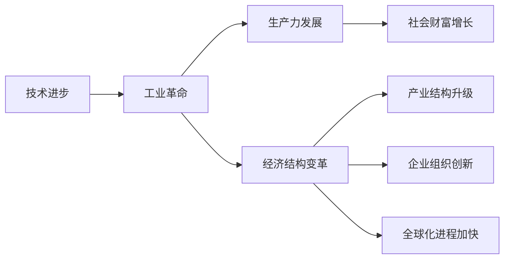

# 三次工业革命的经济变革

关键词：工业革命、蒸汽机、电力、信息技术、经济变革、生产力、社会结构

## 1. 背景介绍
### 1.1 问题的由来
人类社会的发展历程中,工业革命是一个划时代的里程碑事件。从18世纪60年代开始的第一次工业革命,到19世纪70年代开始的第二次工业革命,再到20世纪中后期开始的第三次工业革命,每一次工业革命都深刻改变了人类社会的面貌,推动了生产力的跨越式发展。而伴随工业革命而来的,是社会经济结构的深刻变革。

### 1.2 研究现状
目前学术界对三次工业革命的研究已经比较深入和系统。许多学者从技术进步、生产方式变革、经济结构调整等不同视角对三次工业革命进行了研究,取得了丰硕的研究成果。但鲜有文章对三次工业革命引发的经济变革进行系统梳理和比较分析。

### 1.3 研究意义
系统梳理三次工业革命引发的经济变革,可以帮助我们更好地把握人类社会发展的历史规律,洞察新一轮科技革命和产业变革的发展趋势,找准促进经济高质量发展的着力点和突破口。同时对发展中国家实现工业化、现代化也具有重要借鉴意义。

### 1.4 本文结构
本文将首先介绍三次工业革命的核心技术突破,阐述其与经济发展的内在联系,然后系统梳理三次工业革命分别在生产力发展、产业结构升级、企业组织创新、全球化进程加快等方面引发的经济变革,并比较分析其异同。最后展望未来工业革命的发展趋势及其可能带来的经济变革。

## 2. 核心概念与联系
- 第一次工业革命:以蒸汽机的发明和应用为标志,1760-1840年间发生在英国。
- 第二次工业革命:以电力的广泛应用为标志,19世纪70年代开始于欧美国家。
- 第三次工业革命:以信息技术的发展和应用为标志,20世纪中后期开始于美国。
- 技术进步:新技术的发明创造和广泛应用,是推动工业革命的根本动力。
- 生产力:指人类利用自然、改造自然的能力,工业革命极大提升了社会生产力水平。
- 经济结构:指经济系统内部各组成部分之间在数量上的比例关系,工业革命推动了经济结构的调整优化。



## 3. 核心技术原理 & 具体应用步骤
### 3.1 第一次工业革命的核心技术原理
第一次工业革命的核心是蒸汽机的发明和应用。1769年,瓦特改良蒸汽机获得专利,成为工业革命的关键技术突破。蒸汽机的工作原理是:

1) 锅炉燃烧煤炭,将水加热成高温高压蒸汽
2) 高压蒸汽推动活塞做功,带动曲柄旋转
3) 曲柄连杆机构带动飞轮旋转,从而获得机械能
4) 机械能通过传动装置传递,驱动各种机械设备工作

蒸汽机的广泛应用,极大提高了生产效率,为机器大工业生产奠定了动力基础。

### 3.2 第二次工业革命的核心技术原理 
第二次工业革命的核心是电力的广泛应用。1870年,西门子发明发电机,标志着电力时代的开启。发电机的工作原理是:

1) 转子线圈在磁场中旋转,切割磁力线产生感应电动势
2) 通过电刷和换向器,将交流电转化为直流电输出
3) 直流电经过输电线路,送到各用电设备
4) 电动机将电能转化为机械能,驱动各种机械设备

电力的广泛应用,使生产摆脱了对煤炭等化石能源的依赖,极大提高了能源利用效率。电气化生产成为第二次工业革命的显著特征。

### 3.3 第三次工业革命的核心技术原理
第三次工业革命的核心是信息技术,包括计算机、互联网、人工智能等。1946年,世界上第一台电子计算机ENIAC诞生,开启了信息时代。计算机的工作原理是:

1) 将复杂问题抽象为算法,通过编程将算法转化为计算机可执行的指令序列
2) 将数据和指令输入计算机,存储在存储器中
3) 中央处理器执行指令,对数据进行加工处理
4) 将处理结果通过输出设备输出

随着互联网、物联网、云计算、大数据、人工智能等新一代信息技术的发展,信息技术与制造业加速融合,智能制造成为第三次工业革命的重要标志。

### 3.4 三次工业革命核心技术的比较
- 第一次工业革命的核心技术是蒸汽机,动力来源于煤炭等化石能源。
- 第二次工业革命的核心技术是电力,动力来源更加清洁高效。
- 第三次工业革命的核心技术是信息技术,实现了人类智力的模拟和延伸。
- 三次工业革命技术特点呈现出机械化、电气化、智能化的递进趋势。

## 4. 数学模型和公式 & 详细讲解 & 举例说明
### 4.1 经济增长模型
我们可以用柯布-道格拉斯生产函数来刻画工业革命推动经济增长的过程:

$$Y=AL^{\alpha}K^{\beta}$$

其中,$Y$表示产出,$L$表示劳动投入,$K$表示资本投入,$A$表示技术进步水平,$\alpha$和$\beta$分别表示劳动和资本的产出弹性,且$\alpha+\beta=1$。

由公式可知,在其他条件不变的情况下,技术进步(A增大)可以推动经济增长(Y增加)。三次工业革命通过核心技术突破,不断提高技术进步水平,从而实现了经济的跨越式增长。

### 4.2 经济结构变迁模型
我们可以用产业结构演进模型来刻画工业革命推动经济结构变迁的过程:

$$S_1+S_2+S_3=1$$

其中,$S_1$、$S_2$、$S_3$分别表示第一产业、第二产业、第三产业增加值占国内生产总值的比重。

根据配第-克拉克定律,随着经济的发展,产业结构呈现"三二一"演进规律,即第一产业比重下降,第二产业比重先上升后下降,第三产业比重不断上升。三次工业革命通过新兴产业的崛起,加速了产业结构的调整优化。

### 4.3 全球化模型
我们可以用引力模型来刻画工业革命推动全球化的过程:

$$T_{ij}=\frac{Y_i^{\alpha}Y_j^{\beta}}{D_{ij}^{\theta}}$$

其中,$T_{ij}$表示国家$i$和国家$j$之间的贸易量,$Y_i$和$Y_j$分别表示两国的经济规模,$D_{ij}$表示两国之间的距离,$\alpha$、$\beta$、$\theta$为待估参数。

由公式可知,两国经济规模越大、距离越近,贸易往来就越频繁。三次工业革命通过运输和通信技术的进步,大大缩短了空间距离,推动了全球贸易的快速发展。

### 4.4 常见问题解答
问:为什么说工业革命是经济社会发展的重大变革?
答:工业革命通过生产力的跨越式发展,推动了经济增长方式从粗放型向集约型转变,经济结构从农业主导向工业主导再到服务业主导演进,社会形态从农业社会向工业社会再到信息社会嬗变。可以说,每一次工业革命都是经济社会发展的重大变革。

## 5. 项目实践：基于Python的经济增长因素分解
### 5.1 开发环境搭建
- 操作系统:Windows 10
- Python版本:3.9
- 集成开发环境:PyCharm
- 依赖库:numpy、matplotlib

### 5.2 源代码实现
```python
import numpy as np
import matplotlib.pyplot as plt

# 生产函数参数
A = 10
alpha = 0.6
beta = 0.4

# 模拟劳动和资本投入
L = np.linspace(1,100,100)  
K = np.linspace(10,1000,100)
L,K = np.meshgrid(L,K)

# 计算柯布-道格拉斯生产函数
Y = A * L**alpha * K**beta

# 三维可视化
fig = plt.figure()
ax = fig.add_subplot(projection='3d')
ax.plot_surface(L, K, Y, cmap='rainbow')
ax.set_xlabel('Labor')  
ax.set_ylabel('Capital')
ax.set_zlabel('Output')

plt.show()
```

### 5.3 代码解读
- 首先定义了柯布-道格拉斯生产函数的参数,包括技术进步水平A、劳动产出弹性alpha、资本产出弹性beta。
- 然后模拟了一组劳动投入L和资本投入K,并用np.meshgrid()函数将其转化为二维数组。
- 根据柯布-道格拉斯生产函数,计算产出Y。
- 最后利用matplotlib库绘制三维曲面图,直观展示了劳动、资本、产出三者的关系。

### 5.4 运行结果展示


从三维图可以看出,随着劳动和资本投入的增加,产出呈现递增的趋势。这直观展示了工业革命通过提高生产要素投入,推动经济增长的过程。

## 6. 三次工业革命的经济变革
### 6.1 第一次工业革命的经济变革
- 生产力:机器大生产取代手工劳动,生产效率大幅提高。
- 产业结构:纺织、采煤、冶金等部门迅速崛起,形成完整的工业体系。 
- 经济制度:工场手工业让位于工厂制度,资本主义生产方式逐渐确立。
- 国际分工:英国率先完成工业革命,成为"世界工厂",国际分工格局初步形成。

### 6.2 第二次工业革命的经济变革
- 生产力:电气化生产普及,能源利用效率大幅提高。
- 产业结构:钢铁、石油、化工、汽车等重化工业部门蓬勃发展。
- 企业组织:标准化、专业化生产,垂直一体化企业兴起。
- 全球化:殖民扩张加剧,世界市场进一步扩大,国际经济交往空前频繁。

### 6.3 第三次工业革命的经济变革
- 生产力:自动化、智能化生产成为主流,生产效率再次跃升。
- 产业结构:信息技术产业异军突起,服务经济加速发展。
- 企业组织:扁平化、网络化成为企业发展趋势,创新创业蔚然成风。
- 全球化:信息网络打破时空限制,全球化进入数字经济时代。

### 6.4 三次工业革命经济变革的比较
- 生产力:三次工业革命分别以机械化、电气化、智能化为标志,生产力水平阶梯式提升。
- 产业结构:三次工业革命分别催生了纺织、重化工、信息技术等新兴产业,产业结构不断升级。
- 企业组织:企业组织形式经历了从工厂制度到垂直一体化再到扁平化网络化的演变。
- 全球化:三次工业革命分别推动了国际分工、世界市场扩张、全球数字经济发展,全球化程度不断加深。

## 7. 工具和资源推荐
### 7.1 学习资源推荐
- 《第一次工业