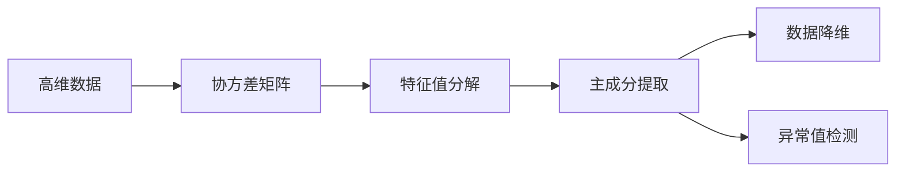

# 主成分分析与数据异常值分析

关键词：主成分分析、PCA、数据降维、异常值检测、数据预处理

## 1. 背景介绍
### 1.1 问题的由来
在大数据时代,我们面临着海量高维数据的处理和分析挑战。高维数据不仅增加了存储和计算的复杂度,还可能存在数据冗余和噪声等问题,影响后续的数据挖掘和机器学习任务。如何有效地对高维数据进行降维和异常值检测,成为数据分析领域的重要课题。
### 1.2 研究现状
主成分分析(Principal Component Analysis, PCA)作为一种经典的线性降维方法,已被广泛应用于数据压缩、噪声去除、特征提取等任务中。近年来,研究者们不断改进PCA算法,提出了稀疏PCA、核PCA、增量PCA等变体,以适应不同场景下的数据分析需求。此外,PCA在异常值检测中也展现出良好的性能,通过对数据进行投影变换,可以有效地识别出数据中的异常点。
### 1.3 研究意义
深入研究主成分分析与数据异常值分析,对于提升数据处理效率、改善数据质量具有重要意义。通过PCA降维,可以消除数据中的冗余信息,减少存储和计算开销;通过异常值检测,可以发现数据中的噪声和异常点,提高数据的可靠性。这些技术在金融风控、工业故障诊断、医疗异常检测等领域有着广阔的应用前景。
### 1.4 本文结构 
本文将全面探讨主成分分析与数据异常值分析的理论基础和实践应用。第2部分介绍PCA的核心概念和数学原理;第3部分详细阐述PCA算法的具体步骤和优化技巧;第4部分建立PCA的数学模型,并给出公式推导过程;第5部分通过代码实例演示PCA的实现细节;第6部分讨论PCA在异常值检测中的应用场景;第7部分推荐相关的工具和学习资源;第8部分总结全文,展望PCA技术的未来发展方向。

## 2. 核心概念与联系
主成分分析的核心思想是通过线性变换将高维数据映射到低维空间,从而实现数据降维和特征提取。在PCA中,我们需要找到数据的主成分(Principal Component),即数据变化最大的方向。通过保留前k个主成分,就可以用k维向量来近似表示原始d维数据,达到降维的目的。

PCA与特征值分解(Eigenvalue Decomposition)密切相关。对数据的协方差矩阵进行特征值分解,特征值的大小反映了对应主成分的重要性,特征向量的方向即为主成分的方向。通过选取前k个最大特征值对应的特征向量,就得到了数据的前k个主成分。

在异常值检测任务中,PCA可以用于构建数据的正常模型。将数据映射到主成分空间后,异常数据与正常数据在主成分上的投影通常有显著差异,据此可以实现异常点的识别和定位。

下图展示了PCA的核心概念和内在联系:



## 3. 核心算法原理 & 具体操作步骤
### 3.1 算法原理概述
PCA的核心是通过线性变换将原始数据映射到一组新的正交基上,使得数据在新基上的投影方差最大化。这组新的正交基向量即为主成分。从几何角度看,PCA就是将数据点投影到方差最大的k个正交方向上,实现降维的同时最大程度地保留了数据的原始信息。
### 3.2 算法步骤详解
PCA的具体步骤如下:
1. 数据中心化:将原始数据的每个特征都减去其均值,使得数据均值为0。
2. 计算协方差矩阵:
$$C = \frac{1}{m}XX^T$$
其中$X$为中心化后的数据矩阵,$m$为样本数。  
3. 对协方差矩阵$C$进行特征值分解:
$$C = U\Lambda U^T$$
其中$U$为特征向量矩阵,$\Lambda$为特征值构成的对角矩阵。
4. 选取前k个最大特征值对应的特征向量$u_1,\dots,u_k$,构成主成分矩阵$U_k$。
5. 将原始数据$X$映射到主成分空间:
$$Z = XU_k$$
$Z$即为降维后的k维数据。
### 3.3 算法优缺点
PCA的优点包括:
- 可有效去除数据中的噪声和冗余信息,提高数据质量。
- 通过降维简化了后续的数据分析和建模任务。
- 计算简单,易于实现和并行化。

PCA的局限性在于:
- 仅考虑线性关系,对非线性数据的降维效果有限。
- 对数据的尺度敏感,需要进行数据标准化预处理。
- 降维过程可能损失一些重要信息,需权衡降维率和信息保留率。
### 3.4 算法应用领域
PCA在众多领域得到广泛应用,如:
- 计算机视觉:人脸识别、目标检测等
- 自然语言处理:文本特征提取、主题模型等  
- 生物信息学:基因表达数据分析、药物发现等
- 金融工程:股票市场分析、风险管理等

## 4. 数学模型和公式 & 详细讲解 & 举例说明  
### 4.1 数学模型构建
设有$m$个$d$维数据样本$x_1,\dots,x_m$,组成数据矩阵$X=[x_1,\dots,x_m]^T \in \mathbb{R}^{m \times d}$。PCA的目标是找到一个线性变换矩阵$U_k \in \mathbb{R}^{d \times k} (k<d)$,将原始数据映射到一个$k$维子空间:
$$z_i = U_k^T x_i, i=1,\dots,m$$

如何求解变换矩阵$U_k$呢?我们希望降维后的数据尽可能保留原始信息,即最大化投影后数据的方差:
$$\max_{U_k} \sum_{i=1}^m \lVert z_i \rVert^2 = \max_{U_k} \text{tr}(U_k^T X^T X U_k)$$
$$\text{s.t.} \quad U_k^T U_k = I_k$$

其中$\text{tr}(\cdot)$表示矩阵的迹,$I_k$为$k$阶单位矩阵。上述优化问题可以通过拉格朗日乘子法求解,最优解$U_k$由数据协方差矩阵$C=\frac{1}{m}X^TX$的前$k$个最大特征值对应的特征向量构成。

### 4.2 公式推导过程
利用拉格朗日乘子法,引入乘子矩阵$\Lambda=\text{diag}(\lambda_1,\dots,\lambda_k)$,构造拉格朗日函数:
$$L(U_k, \Lambda) = \text{tr}(U_k^T C U_k) - \text{tr}(\Lambda(U_k^T U_k - I_k))$$

对$U_k$求导并令导数为0:
$$\frac{\partial L}{\partial U_k} = 2CU_k - 2U_k\Lambda = 0$$
$$\Rightarrow CU_k = U_k\Lambda$$

上式表明$U_k$的列向量是矩阵$C$的特征向量,$\Lambda$的对角元素是对应的特征值。将约束条件$U_k^T U_k = I_k$代入拉格朗日函数:
$$L(U_k, \Lambda) = \text{tr}(U_k^T C U_k) - \text{tr}(\Lambda) = \sum_{i=1}^k \lambda_i$$

要最大化$L(U_k, \Lambda)$,等价于选取$C$的前$k$个最大特征值对应的特征向量作为$U_k$的列向量。

### 4.3 案例分析与讲解
下面以一个简单的二维数据集为例,直观展示PCA的降维效果。假设有10个数据点,它们在两个特征维度上的取值如下:

```
X = [[1, 2], [2, 3], [3, 4], [4, 5], [5, 6], 
     [6, 7], [7, 8], [8, 9], [9, 10], [10, 11]]
```

对数据进行中心化后,计算协方差矩阵:

```python
X_centered = X - np.mean(X, axis=0)
C = np.cov(X_centered, rowvar=False)
```

对协方差矩阵进行特征值分解:

```python
eigenvalues, eigenvectors = np.linalg.eig(C)
```

取最大特征值对应的特征向量作为主成分方向,将数据投影到该方向上:

```python
principal_component = eigenvectors[:, np.argmax(eigenvalues)]
X_pca = X_centered.dot(principal_component)
```

下图展示了原始数据点和PCA降维后的数据点:


可以看出,PCA有效地将二维数据降到了一维,且保留了数据的主要变化趋势。这个简化的例子直观地展示了PCA的降维原理。

### 4.4 常见问题解答
**Q:** PCA对数据的尺度敏感吗?需要对数据进行标准化处理吗?  
**A:** PCA对数据尺度确实敏感。如果不同特征的量纲差异较大,特征值的大小主要由量纲大的特征主导,降维结果可能会有偏差。因此,在进行PCA之前,通常需要对数据进行标准化,使得每个特征的均值为0、方差为1。标准化处理可以消除特征量纲的影响,使PCA更加稳定可靠。

**Q:** 如何选取PCA的降维维数k?  
**A:** 选取降维维数需要在降维率和信息保留率之间权衡。通常可以通过以下几种方法确定k值:

1. 根据累积贡献率(Cumulative Explained Variance)。计算前k个主成分的方差贡献率之和,当累积贡献率达到阈值(如90%)时,就可以确定k值。
2. 利用Kaiser准则。将特征值大于1的主成分保留,其余的舍弃。
3. 绘制Scree Plot(碎石图)。把特征值从大到小绘制成曲线,观察曲线的拐点,拐点之后的主成分可以舍弃。

在实际应用中,可以结合多种方法,并根据具体任务需求选取合适的k值。

## 5. 项目实践：代码实例和详细解释说明
下面以Python为例,演示PCA的代码实现。我们使用scikit-learn库提供的`PCA`类,它封装了PCA的核心算法,使用简单方便。

### 5.1 开发环境搭建
首先,安装必要的Python库:
```shell
pip install numpy pandas matplotlib scikit-learn
```

### 5.2 源代码详细实现
```python
import numpy as np
import pandas as pd
import matplotlib.pyplot as plt
from sklearn.decomposition import PCA
from sklearn.preprocessing import StandardScaler

# 读取数据
data = pd.read_csv('data.csv')
X = data.iloc[:, :-1].values
y = data.iloc[:, -1].values

# 数据标准化
scaler = StandardScaler()
X_std = scaler.fit_transform(X)

# 创建PCA对象,指定降维维数
pca = PCA(n_components=2)

# 进行PCA降维
X_pca = pca.fit_transform(X_std)

# 可视化降维结果
plt.figure(figsize=(8, 6))
plt.scatter(X_pca[:, 0], X_pca[:, 1], c=y, cmap='viridis')
plt.xlabel('PC1')
plt.ylabel('PC2')
plt.colorbar()
plt.show()
```

### 5.3 代码解读与分析
1. 首先读取数据集,将特征和标签分别存储在`X`和`y`中。
2. 对数据进行标准化处理,使每个特征的均值为0、方差为1。这里使用了`StandardScaler`类。
3. 创建`PCA`对象,指定降维后的维数`n_components`。
4. 调用`fit_transform`方法,对标准化后的数据`X_std`进行PCA降维。降维后的数