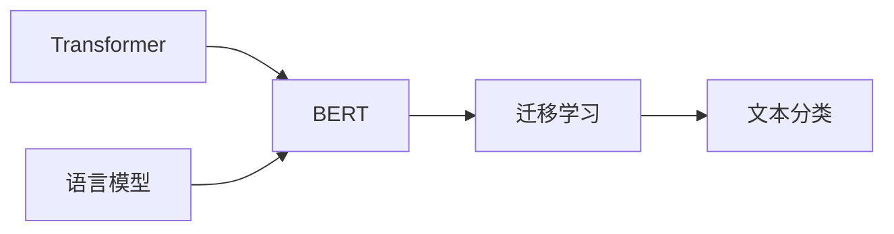

# 从零开始大模型开发与微调：BERT实战文本分类

关键词：BERT、大模型、微调、文本分类、Transformer、迁移学习、预训练模型

## 1. 背景介绍
### 1.1  问题的由来
随着人工智能技术的飞速发展,自然语言处理(NLP)领域取得了长足的进步。文本分类作为NLP的一个基础任务,在情感分析、垃圾邮件检测、新闻分类等诸多场景中有着广泛的应用。传统的文本分类方法主要基于词袋模型,利用SVM、朴素贝叶斯等机器学习算法进行建模。然而,这类方法难以捕捉文本的语义信息,分类效果有限。近年来,随着深度学习的兴起,尤其是Transformer[1]等预训练语言模型的出现,NLP领域迎来了新的突破。其中,BERT(Bidirectional Encoder Representation from Transformers)[2]作为当前最为强大的通用语言表示模型之一,在多项NLP任务上取得了state-of-the-art的表现。

### 1.2  研究现状
BERT自2018年由Google提出以来,迅速成为NLP领域的研究热点。国内外学者纷纷开展对BERT的研究和应用,取得了丰硕的成果。Devlin等人[2]在BERT的原始论文中,通过在大规模无标注语料上进行预训练,再在下游任务上微调,在包括文本分类在内的11项任务上刷新了当时最好成绩。此后,BERT被广泛应用于各类NLP任务中,如命名实体识别[3]、问答系统[4]、情感分析[5]等,均取得了显著的效果提升。同时,研究者们也在BERT的基础上进行了诸多改进和扩展,如RoBERTa[6]、ALBERT[7]、ELECTRA[8]等,进一步提升了模型性能。国内的科研机构和企业也积极开展BERT相关研究,如哈工大讯飞联合实验室发布的RoBERTa-wwm-ext[9],将全词Mask和更大规模数据应用于中文预训练,在多个中文任务上取得了最优效果。

### 1.3  研究意义
尽管当前基于BERT的文本分类研究已经较为成熟,但对于工业界特别是中小企业和个人开发者而言,要将BERT应用于实际项目中仍面临不少挑战,如缺乏计算资源训练大模型、对BERT内部原理缺乏深入理解、fine-tune调优经验不足等。因此,本文旨在提供一个从零开始利用BERT进行文本分类的完整教程,手把手讲解BERT的原理和实现细节,并通过实战案例演示端到端的开发流程。本文的意义在于:
1. 帮助读者深入理解BERT的核心概念和内部机制,夯实NLP知识基础。 
2. 详细讲解BERT在文本分类任务中的应用流程,积累fine-tune实践经验。
3. 提供从环境搭建到模型开发、训练、评估的全流程指南,便于快速应用。
4. 总结当前BERT在文本分类领域的研究进展,展望未来发展方向。

### 1.4  本文结构
本文后续章节安排如下:第2节介绍BERT涉及的核心概念;第3节重点讲解BERT的原理和算法细节;第4节给出BERT相关的数学模型和公式推导;第5节以文本分类任务为例,演示基于BERT的项目实践流程;第6节总结BERT在文本分类中的典型应用场景;第7节推荐BERT相关的学习资源和开发工具;第8节总结全文,并展望BERT未来的发展趋势和面临的挑战;第9节列举BERT常见问题解答。

## 2. 核心概念与联系
在讨论BERT之前,我们有必要先了解其背后的一些核心概念。

**Transformer**:这是一种主要用于处理序列数据的神经网络架构,通过self-attention机制实现了并行计算,极大提升了训练效率。Transformer最早由Vaswani等人[1]在机器翻译任务中提出,此后迅速成为NLP领域的主流模型。BERT正是基于Transformer中的encoder部分构建的。

**语言模型**:它是一种对语言进行建模的方法,旨在学习单词的概率分布。给定一段文本,语言模型可以预测下一个最可能出现的单词。传统的语言模型如N-gram通过计数词频来估计概率,而神经语言模型则使用神经网络学习单词的低维稠密向量表示,从而刻画单词间的语义关系。BERT通过Masked Language Model和Next Sentence Prediction两个预训练任务来学习强大的语言表示。

**迁移学习**:这是一种将已训练好的模型参数迁移到新任务中,从而减少新任务所需标注数据的方法。迁移学习已成为NLP的重要范式,BERT采用的pre-train + fine-tune范式就是典型的两阶段迁移学习。在大规模无标注语料上预训练得到通用语言表示,再在小规模标注数据上微调即可适应下游任务。

**文本分类**:它是NLP的一项基础任务,旨在将文本按照预定义的类别进行归类。传统方法主要基于词袋模型+机器学习分类器,难以建模语义信息。近年来,CNN、RNN、Attention等深度学习模型被引入文本分类,并结合BERT等预训练模型取得了显著效果提升。

下图展示了以上核心概念间的关系:

## 3. 核心算法原理 & 具体操作步骤
### 3.1  算法原理概述
BERT的核心是基于Transformer的双向语言表示模型。与传统的单向语言模型(如GPT)不同,BERT采用掩码语言模型(MLM),通过随机掩盖部分输入token,预测这些被掩盖位置的单词,从而学习到上下文相关的语言表示。同时,BERT还引入了下一句预测(NSP)任务,通过预测两个句子是否前后相邻,来学习句间关系。在预训练阶段,BERT在大规模无标注语料上通过MLM和NSP联合训练,得到强大的通用语言表示模型。在fine-tune阶段,将预训练好的BERT模型应用到下游任务如文本分类中,在任务特定的小规模标注数据上进一步训练,即可显著提升任务性能。

### 3.2  算法步骤详解
1. **输入表示**: BERT的输入是token级别的,将输入文本转换为token序列。对于每个token,BERT使用三种嵌入的和作为输入表示:token embedding、segment embedding和position embedding。其中token embedding可以随机初始化,也可以使用预训练好的词向量如Word2Vec初始化;segment embedding用于区分句子对中两个句子;position embedding用于表示token的位置信息。

2. **预训练**: BERT采用MLM和NSP两个预训练任务。对于MLM,随机掩码15%的token,通过周围token的编码向量来预测掩码token。对于NSP,将语料中连续两句话构造为正样本,随机采样两句话构造为负样本,通过分类任务来预测两句话是否相邻。预训练在大规模无标注语料上进行,使用Adam优化器,batch size设为256,训练1M steps。

3. **Fine-tune**: 在下游任务如文本分类上fine-tune时,将任务转化为序列标注问题。对于单句分类,直接将句子输入BERT编码;对于句子对分类,将两个句子拼接后输入编码。取[CLS]位置的编码向量接一个全连接层作为分类器,使用交叉熵损失函数,Adam优化器训练。batch size设为32,学习率为2e-5,训练3-4个epoch即可。

4. **推理**: fine-tune后的模型可直接用于文本分类推理。对新文本,转换为BERT输入格式,送入fine-tune后的模型,取[CLS]位置向量经过分类器即可得到预测标签。

### 3.3  算法优缺点
BERT相比传统文本分类方法的优势在于:
1. 通过预训练学习到语义丰富的文本表示,有效缓解了标注数据不足问题。
2. 采用双向语言模型,可以融合上下文信息,获得更好的语义理解能力。
3. 统一的两阶段学习范式,简化了下游任务的开发流程,降低了应用门槛。

但BERT也存在一定局限:
1. 模型参数量大(Base版110M,Large版340M),训练和推理成本高。
2. 句长限制为512个token,难以处理长文档。
3. 仅编码token级别的语言表示,缺乏面向知识的显式建模。

### 3.4  算法应用领域
凭借其强大的语义表示能力,BERT已在NLP诸多领域得到广泛应用,如:
- 文本分类:情感分析、新闻分类、意图识别等
- 序列标注:命名实体识别、词性标注、语义角色标注等 
- 句子关系判断:语义相似度、自然语言推理、语义匹配搜索等
- 阅读理解:基于span抽取的问答、多选题问答、完形填空等
- 文本生成:摘要生成、对话生成、机器翻译等

此外,BERT在垂直领域如金融、医疗、法律等的适配研究也取得了积极进展。

## 4. 数学模型和公式 & 详细讲解 & 举例说明
### 4.1  数学模型构建
BERT的核心是基于Transformer的编码器,使用自注意力机制建模文本序列。形式化地,给定token序列$\mathbf{x}=(x_1,\dots,x_n)$,BERT将其编码为上下文相关的向量序列$\mathbf{h}=(h_1,\dots,h_n)$。

具体地,BERT首先将每个token $x_i$ 映射为三种嵌入向量的和:

$$e_i=\mathrm{TokenEmbed}(x_i)+\mathrm{SegmentEmbed}(x_i)+\mathrm{PositionEmbed}(i)$$

然后,将嵌入向量序列$\mathbf{e}=(e_1,\dots,e_n)$输入L层Transformer编码器,迭代计算各层隐状态$\mathbf{h}^l$:

$$\mathbf{h}^0=\mathbf{e}$$

$$\mathbf{h}^l=\mathrm{TransformerEncoder}(\mathbf{h}^{l-1}),l=1,\dots,L$$

其中,Transformer编码器可表示为:

$$\mathrm{TransformerEncoder}(\mathbf{h})=\mathrm{LayerNorm}(\mathbf{z}+\mathrm{FeedForward}(\mathbf{z}))$$

$$\mathbf{z}=\mathrm{LayerNorm}(\mathbf{h}+\mathrm{MultiHeadAttention}(\mathbf{h}))$$

$\mathrm{MultiHeadAttention}$是Transformer的核心,通过计算$\mathbf{h}$内部token间的注意力分数,实现token的交互更新。假设有$H$个注意力头,每个头的维度为$d_k$,则第$i$个头的注意力分数计算为:

$$\mathrm{head}_i=\mathrm{softmax}(\frac{(\mathbf{h}W_i^Q)(\mathbf{h}W_i^K)^T}{\sqrt{d_k}})(\mathbf{h}W_i^V)$$

其中$W_i^Q,W_i^K,W_i^V\in\mathbb{R}^{d\times d_k}$是可学习的投影矩阵。最后,将各头的输出拼接并经过线性变换得到:

$$\mathrm{MultiHeadAttention}(\mathbf{h})=\mathrm{Concat}(\mathrm{head}_1,\dots,\mathrm{head}_H)W^O$$

### 4.2  公式推导过程
以上是BERT前向计算的主要公式,下面我们推导BERT在预训练阶段的目标函数。

对于MLM任务,记$\mathbf{m}\in\{0,1\}^n$为掩码向量,$m_i=1$表示第$i$个token被掩码。记$\hat{\mathbf{x}}$为掩码token的预测概率分布,则MLM的损失为:

$$\mathcal{L}_{\mathrm{MLM}}=-\sum_{i=1}^n m_i\log P(\hat{x}_i=x_