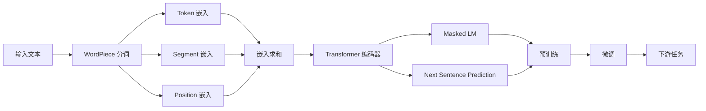

# 从零开始大模型开发与微调：BERT的基本架构与应用

关键词：BERT, Transformer, 预训练, 微调, 自然语言处理, 大模型, 迁移学习

## 1. 背景介绍
### 1.1 问题的由来
随着深度学习的蓬勃发展,自然语言处理(NLP)领域取得了长足的进步。传统的NLP方法主要依赖于人工设计的特征和规则,难以应对语言的复杂性和多样性。近年来,预训练语言模型(Pre-trained Language Models, PLMs)的出现为NLP领域带来了革命性的变化。其中,BERT(Bidirectional Encoder Representations from Transformers)作为一种强大的预训练语言模型,在各种NLP任务上取得了显著的性能提升。

### 1.2 研究现状 
BERT由Google AI Language团队于2018年提出,通过在大规模无标注文本语料上进行预训练,学习到了丰富的语言知识和上下文表示。与此前的ELMo、GPT等模型不同,BERT采用了Transformer编码器结构,并引入了Masked Language Model(MLM)和Next Sentence Prediction(NSP)两个预训练任务,使其能够同时捕捉单词和句子级别的语义信息。在多个NLP基准测试中,BERT刷新了当时最好的结果。

此后,大量的研究工作围绕BERT展开,包括模型结构的改进、预训练方法的优化、下游任务的应用等。例如,RoBERTa通过去除NSP任务、增加训练数据等策略进一步提升了BERT的性能;ALBERT通过参数共享和嵌入矩阵分解减小了模型规模;ELECTRA引入了生成式-判别式预训练范式,加速了训练过程。同时,BERT在问答、情感分析、命名实体识别、文本分类等诸多NLP任务中得到了广泛应用。

### 1.3 研究意义
尽管BERT在学术界和工业界得到了广泛关注,但对于初学者和非专业人士而言,理解和应用BERT仍然存在一定门槛。本文旨在从零开始,深入浅出地介绍BERT的基本原理、架构细节和实践应用。通过阐述BERT的核心思想,梳理其技术脉络,并提供详尽的代码实例,帮助读者全面掌握BERT的开发与微调流程。本文的贡献在于:

1. 系统性地介绍BERT的背景知识、核心概念和关键技术,为读者提供全面的理论基础。
2. 详细讲解BERT的模型架构、预训练方法和微调策略,深入剖析其内部机制和工作原理。 
3. 提供完整的代码实现和注释说明,演示如何利用BERT进行下游任务的微调和应用。
4. 总结BERT的研究现状和发展趋势,探讨其面临的机遇与挑战,为后续研究提供思路。

### 1.4 本文结构
本文共分为9个章节,主要内容安排如下:

第1章介绍研究背景,包括问题的由来、研究现状、研究意义和文章结构。  
第2章阐述BERT相关的核心概念,梳理其与传统方法和其他模型的联系。  
第3章详细讲解BERT的核心算法原理,并给出具体的操作步骤。  
第4章介绍BERT所基于的数学模型和公式,并通过案例进行详细说明。  
第5章提供基于BERT的项目实践,包括环境搭建、代码实现、结果分析等。  
第6章讨论BERT在实际场景中的应用,展望其未来的发展方向。  
第7章推荐BERT相关的学习资源、开发工具和研究论文。  
第8章总结全文,评述BERT的研究现状、未来趋势和面临的挑战。  
第9章列举BERT的常见问题,并给出详细的解答。

## 2. 核心概念与联系
在深入探讨BERT之前,我们有必要了解其所涉及的一些核心概念。

**Transformer**: Transformer是一种基于自注意力机制(Self-Attention)的神经网络模型,最初由Vaswani等人于2017年提出,用于机器翻译任务。与传统的RNN、CNN等模型不同,Transformer完全依靠注意力机制来建模序列数据,通过计算序列中不同位置之间的关联性,捕捉全局的上下文信息。Transformer的核心组件包括多头自注意力(Multi-Head Self-Attention)、前馈神经网络(Feed-Forward Network)和残差连接(Residual Connection)等。

**预训练**: 预训练是一种迁移学习的范式,旨在通过在大规模无标注数据上训练通用的语言表示,再将其应用于特定的下游任务。预训练分为两个阶段:无监督的预训练阶段和有监督的微调阶段。在预训练阶段,模型学习捕捉语言的一般性规律和知识;在微调阶段,模型利用预训练得到的语言表示,针对特定任务进行参数调整,从而获得更好的性能。预训练的优势在于可以利用海量的无标注数据,减少对标注数据的依赖,同时提高模型的泛化能力。

**语言模型**: 语言模型是一种估计语言中词序列概率分布的统计模型。给定一个词序列 $w_1,w_2,...,w_n$,语言模型的目标是计算该序列出现的概率 $P(w_1,w_2,...,w_n)$。传统的语言模型如N-gram,利用马尔可夫假设对序列概率进行分解,但难以捕捉长距离依赖。神经语言模型如NNLM、RNNLM等利用神经网络来建模序列概率,克服了N-gram的局限性。预训练语言模型如BERT,则在语言模型的基础上引入了新的预训练任务,如MLM和NSP,进一步增强了语言表示的能力。

**微调**: 微调是将预训练模型应用于下游任务的关键步骤。与从头训练不同,微调在预训练模型的基础上,利用任务特定的标注数据对模型进行二次训练,使其适应具体任务的需求。微调通常只需要较小的学习率和较少的训练轮数,即可在目标任务上取得不错的效果。微调的优势在于可以显著减少训练时间和计算资源,同时利用预训练模型学习到的通用语言知识,提高模型的性能和泛化能力。

BERT正是基于Transformer结构,通过在大规模语料上进行预训练,再利用微调策略应用于下游任务,实现了NLP领域的重大突破。它继承了Transformer的优秀特性,同时引入了创新的预训练任务,极大地提升了语言表示的质量。BERT与传统的词袋模型、词嵌入模型的区别在于,它能够动态地建模单词的上下文信息,生成多粒度、上下文相关的语义表示。与此前的ELMo、GPT等预训练模型相比,BERT采用了更加强大的双向编码器结构,能够同时利用上下文的左右信息,获得更加准确和全面的语义理解。

下图展示了BERT的总体架构和关键组件之间的联系:

## 3. 核心算法原理 & 具体操作步骤
### 3.1 算法原理概述
BERT的核心算法可以分为两个部分:预训练和微调。在预训练阶段,BERT利用Masked Language Model(MLM)和Next Sentence Prediction(NSP)两个任务来学习通用的语言表示。MLM任务随机地掩码(mask)输入序列中的一部分token,并训练模型来预测这些被掩码的token。这使得模型能够学习到单词之间的上下文关系和语义信息。NSP任务则通过判断两个句子是否相邻,来学习句子级别的语义连贯性。在微调阶段,BERT将预训练得到的参数作为初始化,在下游任务的标注数据上进行二次训练,从而适应特定任务的需求。

### 3.2 算法步骤详解
1. **预训练阶段**

输入表示:
- 将输入文本进行 WordPiece 分词,将每个 token 映射为词典中的 ID。
- 在序列开始添加特殊的分类 token [CLS],在序列末尾添加特殊的分隔 token [SEP]。
- 对于 NSP 任务,将两个句子拼接为一个序列,并在它们之间插入 [SEP] token。
- 将 token ID 序列转换为 token 嵌入向量。
- 添加 segment 嵌入,用于区分两个句子。对于单句任务,所有 token 的 segment ID 均为0。
- 添加 position 嵌入,表示每个 token 在序列中的位置信息。
- 对 token 嵌入、segment 嵌入和 position 嵌入进行求和,得到最终的输入嵌入表示。

模型结构:
- BERT 采用多层 Transformer 编码器结构,每一层包括两个子层:多头自注意力层和前馈神经网络层。
- 多头自注意力层利用 self-attention 机制,计算序列中每个 token 与其他 token 之间的注意力权重,捕捉 token 之间的依赖关系。
- 前馈神经网络层由两个全连接层组成,用于对自注意力层的输出进行非线性变换。
- 在每个子层之后,都应用残差连接和 Layer Normalization,以加速训练并提高模型的泛化能力。

预训练任务:
- MLM 任务:随机地选择 15% 的 token 进行掩码。对于每个被掩码的 token,有 80% 的概率替换为特殊的 [MASK] token,有 10% 的概率替换为一个随机的 token,有 10% 的概率保持不变。模型的目标是预测这些被掩码的 token 的真实 ID。
- NSP 任务:从语料库中随机选择两个句子 A 和 B,其中 50% 的概率 B 是 A 的下一个句子,50% 的概率 B 是语料库中的一个随机句子。模型的目标是判断 B 是否为 A 的下一个句子。

损失函数:
- MLM 任务的损失函数为被掩码 token 的交叉熵损失。
- NSP 任务的损失函数为二分类交叉熵损失。
- 总的损失函数为 MLM 损失和 NSP 损失的加权和。

2. **微调阶段**

任务特定的输入表示:
- 对于大多数下游任务,输入表示与预训练阶段类似,只需根据任务的特点对输入进行相应的修改。
- 对于序列标注任务如命名实体识别,需要对每个 token 进行标注。
- 对于句子对任务如语义相似度,需要将两个句子拼接为一个序列。
- 对于文本分类任务,可以在序列开始添加 [CLS] token,并将其最终的隐向量作为整个序列的表示,用于分类。

任务特定的输出层:
- 在 BERT 模型之上,根据具体任务的需求设计相应的输出层。
- 对于 token 级别的任务,输出层通常是一个线性层,将每个 token 的隐向量映射为标签概率分布。
- 对于句子级别的任务,输出层可以是一个线性层或多层感知机,将 [CLS] token 的隐向量映射为标签概率分布。

微调策略:
- 利用预训练阶段得到的参数初始化 BERT 模型,再在下游任务的标注数据上进行二次训练。
- 通常选择较小的学习率(如 2e-5)和较少的训练轮数(如 3~4 个 epoch),以避免过拟合。
- 可以对 BERT 的所有参数进行微调,也可以固定 BERT 的底层参数,只微调顶层的参数。
- 根据任务的特点,可以对输入表示和输出层进行适当的修改和设计。

### 3.3 算法优缺点
优点