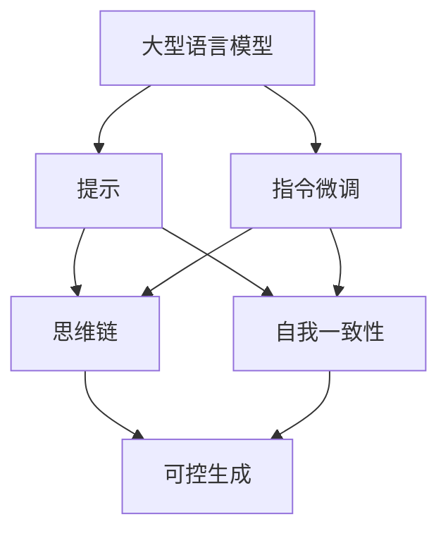

# 以提示/指令模式直接使用大模型

作者：禅与计算机程序设计艺术 / Zen and the Art of Computer Programming

## 1. 背景介绍
### 1.1 问题的由来
随着人工智能技术的飞速发展,大型语言模型(Large Language Models, LLMs)已经展现出了令人惊叹的能力。它们可以生成连贯的文本、回答问题、总结文章,甚至编写代码。然而,与传统的软件开发和部署方式不同,如何高效便捷地使用这些大模型来解决实际问题,仍然是一个值得探索的课题。

### 1.2 研究现状
目前,主流的大模型使用方式主要有两种:API调用和微调(Fine-tuning)。API调用方便快捷,但缺乏灵活性和可控性;微调能够针对特定任务优化模型,但需要大量的训练数据和计算资源,且对技术要求较高。近期,以提示/指令的方式直接使用大模型引起了广泛关注,这种方法无需对模型进行二次训练,通过精心设计的提示即可实现特定功能,为大模型的应用提供了新的思路。

### 1.3 研究意义
探索以提示/指令模式直接使用大模型,有助于降低大模型应用门槛,提高开发效率,推动人工智能技术在各领域的普及。同时,这种方式也为大模型的可解释性和可控性研究提供了新的视角,有利于构建更加安全、透明、可信的人工智能系统。

### 1.4 本文结构
本文将围绕以提示/指令模式直接使用大模型展开讨论。首先,我们将介绍相关的核心概念,并分析其内在联系。然后,重点阐述该方法的核心原理和操作步骤。接下来,我们将建立数学模型,推导相关公式,并给出具体的案例分析。在项目实践部分,我们将提供详细的代码实现和解读。此外,我们还将讨论该方法的实际应用场景,推荐相关的工具和资源。最后,我们将总结全文,展望未来的发展趋势与挑战,并附上常见问题解答,以供读者参考。

## 2. 核心概念与联系

在以提示/指令模式直接使用大模型的过程中,涉及到以下几个核心概念:

- 大型语言模型(Large Language Models, LLMs):指经过海量文本数据训练的大规模神经网络模型,如GPT系列、BERT系列等。它们能够学习到丰富的语言知识和世界知识,具备强大的自然语言处理能力。

- 提示(Prompt):指在使用大模型时,输入给模型的上下文信息或指令,用于引导模型生成所需的输出。提示的设计对于模型的表现至关重要。

- 指令微调(Instruction Tuning):一种新兴的大模型微调范式,通过构建指令-响应对的形式微调模型,使其能够根据指令生成符合要求的输出,提高了模型的可控性。

- 思维链(Chain-of-Thought, CoT):一种提示工程技术,通过在提示中引入中间推理步骤,引导模型进行逐步推理,从而提高复杂任务的解决能力。

- 自我一致性(Self-Consistency):一种利用模型自身知识进行推理和决策的方法。通过对同一问题生成多个可能的答案,然后对这些答案进行评估和选择,以提高输出的准确性和稳定性。

这些概念之间紧密相关,共同构成了以提示/指令模式直接使用大模型的基础。大型语言模型是这一方法的核心,提示和指令微调是实现可控生成的关键,而思维链和自我一致性则是进一步提升模型性能的重要技术。它们相互配合,协同工作,最终实现了灵活、高效、可控地使用大模型的目标。



## 3. 核心算法原理 & 具体操作步骤
### 3.1 算法原理概述
以提示/指令模式直接使用大模型的核心原理,是通过精心设计提示,引导模型生成符合要求的输出。这一过程可以分为以下几个关键步骤:

1. 任务分析:明确任务目标,分析输入和输出的特点,确定所需信息。
2. 提示设计:根据任务需求,设计合适的提示,包括上下文信息、指令、格式要求等。
3. 模型推理:将设计好的提示输入给大模型,利用模型强大的语言理解和生成能力,产生高质量的输出。
4. 结果评估:对模型生成的输出进行评估,判断是否满足任务要求,如果不满足,则需要迭代优化提示。

### 3.2 算法步骤详解
下面我们对每个步骤进行详细说明:

#### 3.2.1 任务分析
首先需要明确任务的输入和输出,确定任务的类型和目标。常见的任务类型包括:

- 文本生成:如写作、对话、翻译等。
- 问答:回答给定问题,提供所需信息。
- 文本分类:判断文本所属类别,如情感分析、主题分类等。
- 信息抽取:从文本中提取关键信息,如实体识别、关系抽取等。

根据任务类型,分析输入和输出的特点,确定任务完成所需的关键信息。

#### 3.2.2 提示设计
提示设计是以提示/指令模式直接使用大模型的关键。一个好的提示应该包含以下几个要素:

- 上下文信息:为模型提供必要的背景知识,帮助其理解任务。
- 指令:明确告知模型需要执行的操作,如"写一篇文章"、"回答问题"等。
- 格式要求:规定输出的格式,如字数、段落结构、要点等。
- 示例:给出一个或多个示例,让模型理解任务要求。

以下是一个提示设计的示例:

```
背景:你是一名产品经理,需要为一款新的健身App撰写一份产品方案。
指令:请根据以下要求,写一份产品方案:
1. 方案应包括产品定位、目标用户、核心功能、竞品分析等内容。
2. 字数在1000字左右,要求条理清晰,言之有物。
3. 需要突出产品的创新点和优势,吸引投资人的兴趣。
格式:
1. 背景介绍
2. 产品定位
3. 目标用户
4. 核心功能
5. 竞品分析
6. 创新点和优势
7. 结语
```

#### 3.2.3 模型推理
将设计好的提示输入给大模型,模型会根据提示中的信息,利用其强大的语言理解和生成能力,产生符合要求的输出。这一过程可以使用API接口或者开源的大模型实现。

#### 3.2.4 结果评估
对模型生成的输出进行评估,判断是否满足任务要求。评估的标准包括:

- 相关性:输出内容是否与任务相关,是否包含所需信息。
- 准确性:输出内容是否准确,是否存在事实性错误。
- 流畅性:输出文本是否通顺、连贯,是否符合语言习惯。
- 完整性:输出是否完整,是否涵盖了所有要点。

如果输出不满足要求,则需要分析原因,调整提示,重新生成,直到获得满意的结果。

### 3.3 算法优缺点
以提示/指令模式直接使用大模型,相比传统的微调方法,具有以下优点:

- 简单高效:无需二次训练,只需设计提示即可实现特定功能,大大降低了开发成本和门槛。
- 灵活多变:通过修改提示,可以快速实现不同的任务,适应各种应用场景。
- 可解释性:提示本身就是一种对模型行为的解释,有助于理解模型的工作原理。

同时,这一方法也存在一些局限性:

- 对提示质量要求高:提示设计的好坏直接影响模型的表现,需要一定的经验和技巧。
- 泛化能力有限:模型的能力主要来自于预训练阶段学习到的知识,对于完全未见过的任务,表现可能不够理想。
- 数据隐私风险:模型生成的内容可能包含训练数据中的敏感信息,需要谨慎处理。

### 3.4 算法应用领域
以提示/指令模式直接使用大模型,可以应用于多个领域,包括但不限于:

- 智能写作:自动生成文章、新闻、评论等。
- 智能客服:回答用户问题,提供个性化服务。
- 代码生成:根据需求描述,自动生成代码片段。
- 数据分析:从非结构化文本中提取关键信息,辅助决策。
- 创意灵感:根据主题和要求,生成创意点子和灵感。

随着大模型能力的不断提升,这一方法的应用领域也将不断扩展。

## 4. 数学模型和公式 & 详细讲解 & 举例说明
### 4.1 数学模型构建
为了更好地理解以提示/指令模式直接使用大模型的原理,我们可以建立一个简化的数学模型。假设我们有一个预训练的大型语言模型 $M$,其参数为 $\theta$。给定一个提示 $p$,模型的目标是生成一个输出 $o$,使得 $o$ 符合提示 $p$ 的要求。

我们可以将这一过程表示为:

$$
o = \arg\max_{o} P(o|p,\theta)
$$

其中,$P(o|p,\theta)$ 表示在给定提示 $p$ 和模型参数 $\theta$ 的条件下,生成输出 $o$ 的概率。模型的目标是找到概率最大的输出 $o$。

### 4.2 公式推导过程
根据贝叶斯公式,我们可以将 $P(o|p,\theta)$ 分解为:

$$
P(o|p,\theta) = \frac{P(p|o,\theta)P(o|\theta)}{P(p|\theta)}
$$

其中:
- $P(p|o,\theta)$ 表示在给定输出 $o$ 和模型参数 $\theta$ 的条件下,生成提示 $p$ 的概率,反映了输出 $o$ 与提示 $p$ 的匹配程度。
- $P(o|\theta)$ 表示在给定模型参数 $\theta$ 的条件下,生成输出 $o$ 的先验概率,反映了输出 $o$ 本身的质量。
- $P(p|\theta)$ 表示在给定模型参数 $\theta$ 的条件下,生成提示 $p$ 的概率,是一个归一化常数。

由于 $P(p|\theta)$ 与输出 $o$ 无关,因此我们可以将优化目标简化为:

$$
o = \arg\max_{o} P(p|o,\theta)P(o|\theta)
$$

这意味着,我们需要找到一个输出 $o$,使得它与提示 $p$ 的匹配程度最高,同时本身的质量也要好。

### 4.3 案例分析与讲解
下面我们以一个具体的案例来说明这一过程。假设我们要用大模型来生成一篇关于"人工智能的未来"的文章,提示 $p$ 如下:

```
请写一篇800字左右的文章,探讨人工智能技术的未来发展趋势和可能带来的影响。文章要求:
1. 介绍人工智能的概念和发展历程。
2. 分析人工智能在各个领域的应用前景,如医疗、教育、金融等。
3. 讨论人工智能可能带来的社会影响,包括就业、隐私、安全等方面。
4. 提出你对人工智能未来发展的看法和建议。
```

模型根据这个提示,生成了以下输出 $o$:

```
人工智能(Artificial Intelligence,AI)是一门研究、开发用于模拟、延伸和扩展人的智能的理论、方法、技术及应用系统的新技术科学。自1956年达特茅斯会议首次提出"人工智能